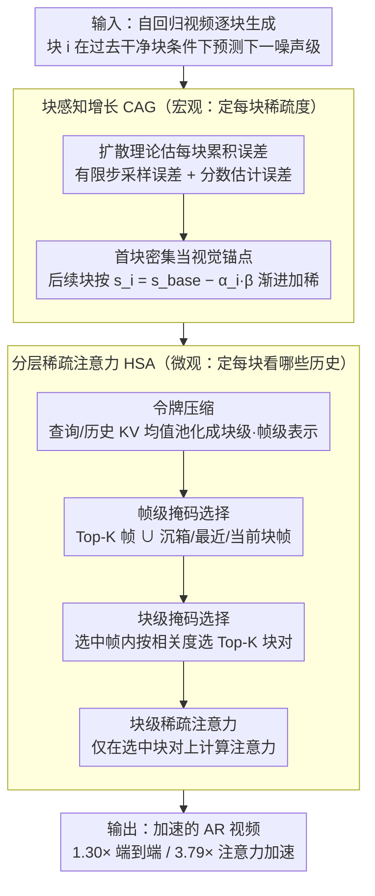

# Light Forcing: Accelerating Autoregressive Video Diffusion via Sparse Attention

**会议**: ICML 2026  
**arXiv**: [2602.04789](https://arxiv.org/abs/2602.04789)  
**代码**: 待确认  
**领域**: 视频生成 / 扩散模型 / 模型加速  
**关键词**: 自回归视频生成, 稀疏注意力, 块感知增长, 分层稀疏

## 一句话总结
Light Forcing 是首个为自回归（AR）视频扩散模型定制的稀疏注意力方案——块感知增长（CAG）量化每个生成块的累积误差贡献来动态分配稀疏度，分层稀疏注意力（HSA）通过帧级 → 块级二级掩码选择灵活捕捉历史依赖，在 Self Forcing 上实现 1.30× 端到端 / 3.79× 注意力加速且 VBench 总分 84.5 > 密集基线 84.1。

## 研究背景与动机

**领域现状**：自回归视频生成结合逐帧生成 + 少步扩散，相比双向视频扩散更适合实时和交互场景。但与所有 Transformer 模型一样，注意力的二次方复杂度是部署瓶颈——Self Forcing 生成 480p 视频最后块时注意力占总延迟约 75%。

**现有痛点**：直接把为双向模型设计的稀疏注意力（STA / VMoBA / SLA 等）应用到 AR 会严重质量下降：
- AR 中误差沿生成链累积，稀疏注意力加剧累积但之前方案忽视了**不同块对全局误差的异构贡献**；
- 历史关键信息未被充分利用——不同层 / 头 / 时步对历史帧的需求差异大，滑动窗口无法覆盖所有关键信息。

**核心矛盾**：AR 中当前块是在过去干净块条件下预测下一噪声级别。后续块易继承前面块的质量问题，但同时需要灵活访问复杂多样的历史上下文模式（对角线、注意力池等），与固定稀疏化策略矛盾。

**本文目标**：设计 AR 视频专用的稀疏注意力框架，既减计算又保长期一致性和丰富运动。

**切入角度**：通过块级差异化稀疏度分配（早期密集、后期稀疏）降低累积误差；用分层掩码选择在固定预算下灵活捕捉多样化历史依赖。

**核心 idea**：用理论框架量化每块累积误差并据此分配稀疏度（CAG），配合粗到细的二级掩码选择（HSA）保留全局和局部感知。

## 方法详解

### 整体框架
Light Forcing 要解决一个具体矛盾：自回归视频扩散里误差会沿生成链累积，直接套用为双向模型设计的稀疏注意力会让累积雪上加霜、质量崩盘。它的破法是把"宏观分配"和"微观选择"拆成两个互补模块——块感知增长 CAG 在块这一级决定每个块该用多稀疏（早期密、后期稀），分层稀疏注意力 HSA 在每个查询块内部决定到底该关注历史里的哪些块（粗到细的两级掩码）。一个控总量、一个挑细节，配合起来既减计算又保住长期一致性和运动丰富度。

### 关键设计

**1. 块感知增长（CAG）：早期块当"视觉锚点"，后期块才敢稀疏**

AR 里后续块会继承前面块的质量问题，但既有稀疏方案都对每个块一视同仁，忽略了不同块对全局误差的异构贡献——这正是直接套稀疏会崩的根因。本文先从扩散理论给出第 $i$ 块的误差距离上界 $\text{TV}(q_t, p) \leq C_1 \frac{d^2 \log^3 T}{\sqrt{T}} + C_2 \sqrt{d} \varepsilon_{\text{score}} \log^2 T$，据此让早期块保留密集注意力充当"视觉锚点"，其余块按 $s_i = s_{\text{base}} - \alpha_i \beta$ 渐进加稀（$\alpha_i$ 是第 $i$ 块到达的噪声级别），$\beta$ 由总 FLOPs 约束 $\sum_{i=2}^n (1 - s_{\text{base}} + \alpha_i \beta) l_i^q l_i^k d = (1 - s_{\text{target}}) \sum_{i=2}^n l_i^q l_i^k d$ 解出。实验印证了这个分配的必要性：早期块一旦稀疏就出现不可逆的过饱和损伤，后期块稀疏却几乎无损——把预算花在最经不起折腾的早期块上，正是控制误差链式传播的要害。

**2. 分层稀疏注意力（HSA）：在固定预算内灵活捞回多样的历史依赖**

不同层、头、时步对历史帧的需求差别很大（对角线、注意力池等模式各异），固定滑窗只能覆盖一种、必然丢关键信息。HSA 用粗到细两级把这件事做活：先做令牌压缩，对查询和历史 KV 用均值池化得到块级、帧级的压缩表示 $\tilde{q}^{(i)}, \tilde{k}^{:i}, \hat{k}^\mathcal{M}$；再做帧级掩码选择，对第 $r$ 个查询块算帧级相关度 $p_r^{(i)} = \langle \tilde{q}_r^{(i)}, \hat{k}^\mathcal{M} \rangle$ 选出 Top-K 帧，并强制并入一组始终保留的关键帧 $\mathcal{T}_r = \text{TopK}_{\text{idx}}(p_r^{(i)}) \cup \mathcal{F}^{(i)}$（$\mathcal{F}^{(i)}$ 含初始沉箱、最近帧、当前块内帧）；最后在选中帧里做块级掩码选择，按块级相关度 $o_r^{(i)}(\tau, j) = \langle \tilde{q}_r^{(i)}, \tilde{k}_j^{(\tau)} \rangle$ 选 Top-K 块对，得到最终块掩码 $B_r^{(i)}(\tau, j) = \mathbb{1}[\tau \in \mathcal{T}_r, j \in \mathcal{J}_r(\tau)]$。先粗筛帧、再细挑块，既把全局感知和局部精度都留住，帧级检索的额外开销也只有约 2%。HSA 和 CAG 正好互补——CAG 宏观定每块稀疏度，HSA 微观定每块看哪些历史，缺了 HSA 单用 CAG 会因过度依赖前块先验而损失动态。

## 实验关键数据

### 主实验（Self Forcing 1.3B, VBench, 5 秒视频）

| 方法 | 延迟 (s) | 加速 | 美感质量 | 成像质量 | 运动平滑 | 动态程度 | 主体一致 | 背景一致 | 总分 |
|------|---------|------|--------|--------|--------|--------|--------|--------|------|
| FlashAttention2 | 9.61 | 1.00× | 67.4 | 70.0 | 98.3 | 63.1 | 95.3 | 96.5 | 84.1 |
| STA | 8.27 | 1.16× | 64.5 | 71.7 | 98.5 | 48.9 | 96.3 | 96.9 | 83.6 |
| Radial | 7.39 | 1.30× | 45.8 | 66.1 | 96.0 | 88.6 | 90.2 | 93.6 | 73.7 |
| VMoBA | 7.42 | 1.29× | 65.2 | 69.9 | 97.3 | 84.2 | 92.8 | 95.5 | 83.6 |
| SLA | 7.71 | 1.25× | 66.7 | 69.8 | 98.3 | 44.2 | 95.6 | 96.7 | 83.2 |
| **Light Forcing** | **7.39** | **1.30×** | **67.2** | **71.0** | **98.3** | **66.7** | **96.2** | **96.5** | **84.5** |

总分 84.5 超密集基线 84.1，同时 1.30× 端到端 / 3.79× 注意力加速。

### 消融实验

| 配置 | 主体一致 | 美感 | 成像 | 动态 | 总分 | 说明 |
|------|--------|------|------|------|------|------|
| FlashAttention2 | 95.3 | 67.4 | 70.0 | 63.1 | 84.1 | 完整密集 |
| +1D 稀疏注意 | 86.9 | 51.4 | 66.0 | 52.8 | 73.0 | 直接套用稀疏崩溃 |
| +微调 | 94.9 | 65.1 | 69.8 | 46.4 | 82.8 | 微调恢复部分但不足 |
| +CAG | 96.1 | 67.7 | 71.0 | 37.5 | 83.2 | CAG 改美感成像但动态下降 |
| **+CAG &HSA** | **96.2** | **67.2** | **71.0** | **66.7** | **84.5** | HSA 改善动态，整体超基线 |

### 关键发现
- 直接应用稀疏到 AR 严重崩溃（73.0 vs 84.1），微调只能部分恢复。
- CAG 单独使用改善美感成像但损害动态——过度稀疏导致过度依赖前块先验；HSA 通过灵活历史访问改善动态。
- 长视频（Infinite-Forcing 15 秒）：84.1 vs 83.6 密集基线，动态程度提升（64.7 vs 54.7）。
- HSA 的 Top-K 超参鲁棒：Top-K = {6, 9, 12} 总分均 84.3-84.5。
- 高效部署：结合 FP8 + RoPE / RMSNorm 融合，RTX 5090 上 27.4 FPS（3.08× 端到端加速），H100 上 33.9 FPS——首次在消费级 GPU 实现实时 AR 视频生成。

## 亮点与洞察
- **块级差异化策略的巧妙性**：从现象（早期稀疏不可逆 vs 后期稀疏可忍）→ 理论（AR 累积误差）→ 方案（量化分配）的推导链条非常有说服力。
- **分层掩码选择的灵活性**：与固定滑窗不同，二级选择（帧 → 块）既保留全局感知又保持局部精度；图 4 的注意力模式可视化（对角线、沉箱）充分证实必要性。
- **超越基线的质量**：不仅加速，生成质量（84.5）还超密集（84.1），说明标准密集注意有大量冗余，恰当稀疏化反而提升泛化。
- **可迁移方法论**：CAG / HSA 思路可推广到其他顺序生成（自回归文本、音视频同步）；块感知累积误差分析框架对理解 AR 模型误差传播有参考价值。

## 局限与展望
- 重点在 Self Forcing 等少步（T = 4）AR 模型，更多步数泛化性未明。
- HSA 的帧级检索开销 2%，仍有优化空间。
- 实验以 VBench 为主，跨任务评估（特定语义一致性、多物体跟踪）会更有说服力。
- CAG 理论推导基于对称假设（各块 $T$ 相同），实际可能异构。

## 相关工作与启发
- **vs 双向稀疏注意（STA / VMoBA / SLA）**：为双向模型设计，以块聚合识别关键块；本文发现这些对 AR 严重质量下降，根因是忽视 AR 块间异构误差贡献和复杂历史依赖模式。
- **vs 滑窗注意（LongFormer）**：固定窗口导致历史遗忘和长期不一致；HSA 通过动态帧检索灵活扩展感受野，同时保持线性复杂度。
- **vs 其他 AR 加速（Self Forcing / LongLive 优化）**：主要通过改进去噪过程或 KV 缓存策略；Light Forcing 正交可叠加（已验证 2-3× 组合加速）。

## 评分
- 新颖性: ⭐⭐⭐⭐⭐  首次系统分析 AR 稀疏注意力失败原因并设计专用方案，块感知 + 分层选择都原创。
- 实验充分度: ⭐⭐⭐⭐  覆盖多模型、多长度、多基准、完整消融、超参敏感性；缺点是质量评价仍主要依赖自动指标。
- 写作质量: ⭐⭐⭐⭐  动机清晰、推导严谨、组织合理；某些数学符号略复杂但整体顺畅。
- 价值: ⭐⭐⭐⭐⭐  直接解决 AR 视频生成实用瓶颈，首次在消费级 GPU 实时生成（27.4 FPS），开源代码；理论框架对 AR 误差分析有学术价值。

<!-- RELATED:START -->

## 相关论文

- [\[ICML 2026\] VEDA: Scalable Video Diffusion via Distilled Sparse Attention](veda_scalable_video_diffusion_via_distilled_sparse_attention.md)
- [\[ICML 2026\] DFSAttn: Dynamic Fine-Grained Sparse Attention for Efficient Video Generation](dfsattn_dynamic_fine-grained_sparse_attention_for_efficient_video_generation.md)
- [\[ICML 2026\] Attention Sparsity is Input-Stable: Training-Free Sparse Attention for Video Generation via Offline Sparsity Profiling and Online QK Co-Clustering](attention_sparsity_is_input-stable_training-free_sparse_attention_for_video_gene.md)
- [\[ICML 2026\] Lightning Unified Video Editing via In-Context Sparse Attention](lightning_unified_video_editing_via_in-context_sparse_attention.md)
- [\[NeurIPS 2025\] Self Forcing: Bridging the Train-Test Gap in Autoregressive Video Diffusion](../../NeurIPS2025/video_generation/self_forcing_bridging_the_train-test_gap_in_autoregressive_video_diffusion.md)

<!-- RELATED:END -->
