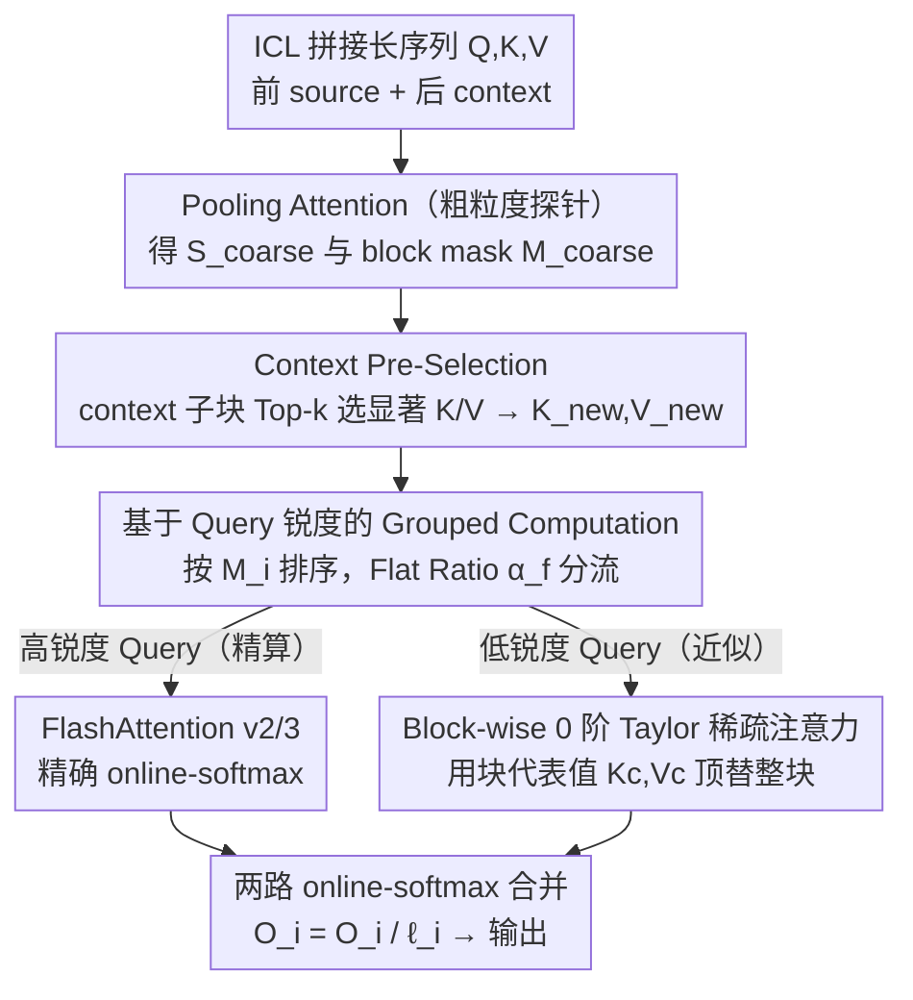

# Lightning Unified Video Editing via In-Context Sparse Attention

**会议**: ICML 2026  
**arXiv**: [2605.04569](https://arxiv.org/abs/2605.04569)  
**代码**: 暂未公开  
**领域**: 视频生成 / 稀疏注意力 / 视频编辑  
**关键词**: In-Context Learning、Sparse Attention、Video Editing、Taylor 近似、Query Sharpness

## 一句话总结
针对 In-Context Learning 范式下视频编辑的二次注意力瓶颈，作者基于"context token 显著性低于 source token"以及"Query 锐度正比于 Taylor 近似误差"两条洞察设计了 In-context Sparse Attention（ISA），并训练出 LIVEditor，在多个 benchmark 上既加速 ~60% 又超越 SOTA 全注意力模型。

## 研究背景与动机

**领域现状**：视频编辑正在从针对单一任务的专家模型，迁移到 In-Context Learning（ICL）范式——把 context（参考帧/编辑指令）和 source（待编辑视频）token 拼起来送入一个统一的 DiT，让 full attention 在长序列上自由交互。这种方式简单且可扩展，已经成为 EditVerse、Ditto 等近期工作的主流。

**现有痛点**：视频本来就是长序列，5K~50K token 让 attention 的 $\mathcal{O}(N^2)$ 复杂度成为推理瓶颈；ICL 又把 source 和 context 等长拼接，进一步把计算量翻了 4 倍。现有的稀疏注意力（Radial、Sparge、STA、SWA、VSA 等）都是为通用视频生成设计，不区分 source 和 context，因而无法利用 ICL 特有的结构。

**核心矛盾**：context token 数量大但实际对最终输出贡献小，可一刀切剪枝又会丢掉少数真正关键的 context；不同 Query 对近似误差的容忍度差异极大，但现有方法用同一种近似处理所有 Query，"高误差 Query 用近似"就成了整体精度下降的元凶。

**本文目标**：(i) 在 ICL 视频编辑场景下构造一个"几乎无损"的稀疏注意力；(ii) 同时支持训练时端到端学习和推理时直接替换 full attention；(iii) 在此基础上训练一个真正可用的统一视频编辑模型。

**切入角度**：作者画出 ICL 下 attention score 矩阵的分布，发现 source-source 区块的得分远大于 source-context；又从理论上证明 0 阶 Taylor 近似的误差上界由 Query 的"锐度"$M_i = \mathrm{Var}(\mathrm{softmax}(Q^c_i (K^c)^\top))$ 决定，于是把"哪些 token 该保留、哪些 Query 该精算"全部转化为可计算的代理量。

**核心 idea**：用 pre-selection 剪掉冗余的 context K/V，再用 Query 锐度把 Query 分流到 full attention 或 0 阶 Taylor block-sparse attention，做到"该精算的精算、能近似的尽量近似"。

## 方法详解

### 整体框架
输入是 ICL 拼接后的长序列 $Q,K,V \in \mathbb{R}^{B\times H\times N\times D}$，其中前 $L_{src}$ 个 token 来自 source、后 $L_{ctx}$ 个来自 context。ISA 的 forward 分四步：(1) 用 pooling attention 得到粗粒度 score $S_\text{coarse}$ 与 block mask $M_\text{coarse}$，这一步是后面所有选择/分流的"廉价探针"，本身不算一个独立设计；(2) 在 $S_\text{coarse}$ 的 context 子块上做 Top-k 选择，把 context K/V 压缩成 $\alpha_s L_{ctx}$ 长（**Context Pre-Selection**）；(3) 用粗粒度方差 $M_i$ 评估每个 Query block 的锐度，按 Flat Ratio $\alpha_f$ 把 Query 分流（**基于 Query 锐度的 Grouped Computation**）；(4) 高锐度 Query 走 FlashAttention v2/3 精算，低锐度 Query 走 **Block-wise 0 阶 Taylor 稀疏注意力**，最后把两路 online-softmax 合并。整个 forward/backward 都用 Triton/TileLang 写成可训练 kernel。下图把这条数据流画出来——其中 pooling attention、FlashAttention 精算路、合并输出是脚手架，三个加粗模块才是关键设计：

### 关键设计

**1. Context Pre-Selection：按显著性把陪跑的 context K/V 剪掉**

ICL 把 source 和 context 等长拼接，attention 计算直接翻了 4 倍，但作者把 attention 分布画出来发现：$Q^{src}(K^{src})^\top$ 远大于 $Q^{src}(K^{ctx})^\top$，而且层越深越显著——大部分 context token 其实是陪跑。于是先做一遍 pooling attention 得到粗粒度分数 $S_\text{coarse}\in\mathbb{R}^{B\times H\times N_Q\times N_K}$，切出 source-Query 对 context-Key 的子块 $S^\text{ctx}_\text{coarse}$，沿 Query 轴求均值后用 TopK 选出 $\alpha_s\lceil L_{ctx}/b\rceil$ 个最显著的 context block，再 gather + concat 重组出新的 $K_\text{new}, V_\text{new}$，把 K/V 长度从 $N$ 压回 $L_{src} + \alpha_s L_{ctx}$、复杂度从 $\mathcal{O}(NSD)$ 降到 $\mathcal{O}(N(L_{src}+\alpha_s L_{ctx})D)$。剪掉这些 token 不只省算力——它还顺手去掉了 synthetic context 带来的噪声，这正是 ISA 在 training-free 下反而比 full attention 还好的原因。

**2. Block-wise 0 阶 Taylor 稀疏注意力：能近似的块用代表值顶替**

对每个 Query block $Q_i$ 与 Key/Value block 对 $(K_j, V_j)$，按 block mask $M_{ij}$ 决定走精确还是近似路径。$M_{ij}=1$ 时走标准 online-softmax：$S_{ij}=Q_i K_j^\top/\sqrt{D}$、$P_{ij}=\exp(S_{ij})$、$\ell_i \mathrel{+}= \mathrm{rowsum}(P_{ij})$、$O_i \mathrel{+}= P_{ij} V_j$；$M_{ij}=0$ 时改用预先 pool 出的 $K_j^c, V_j^c$ 当整块的"代表值"，$S_{ij}^c=Q_i (K_j^c)^\top/\sqrt{D}$、$P_{ij}^c = \exp(S_{ij}^c)$，并按块长放大 $\ell_i \mathrel{+}= P_{ij}^c \cdot L_K$、$O_i \mathrel{+}= P_{ij}^c V_j^c \cdot L_K$，最后 $O_i = O_i/\ell_i$ 归一化。作者试过 1 阶、2 阶 Taylor 展开，但它们在 GPU 上难 kernel 化、额外计算太重；0 阶展开既能塞进 FlashAttention 的 online-softmax 同一框架，又能做 contiguous block 访问，是工程上的甜点。

**3. 基于 Query 锐度的 Grouped Computation：让少数"尖锐" Query 走精算、其余走近似**

以前的稀疏方法对所有 Query 一视同仁，结果被个别"锐度极高"的 Query 带崩。ISA 给每个 Query 算一个可几乎免费拿到的代理量。Theorem 3.1 证明 0 阶 Taylor 的误差上界由 $M_i = \mathrm{Var}(\mathrm{softmax}(Q^c_i(K^c)^\top))$ 和 $\|Q(K-K^c)^\top\|_\infty^2$ 共同决定，而后者计算昂贵、实验里也不是好代理，于是只用 $M_i$——它能直接从 pooling score 读出。把 $M_i$ 从大到小排，前 $\alpha_f$ 比例（Flat Ratio）的高锐度 Query 走 FlashAttention v2/3 保精度，其余走 0 阶 Taylor 稀疏、再用 $\alpha_{ns}$ 控制 block 内不稀疏比例，整体稀疏度能推到 93.75%。这种"用 cheap statistic 路由 expensive computation"的动态分流，把关键 Query 的精确性保住了，稀疏度才敢压这么狠。

### 损失函数 / 训练策略
LIVEditor 在 Wan 2.2 高噪声分支上做两阶段后训练：第一阶段用 1.7M mix-quality 样本、$\eta = 1\mathrm{e}{-5}$、batch 16 学习广义编辑语义；第二阶段用 0.089M 高质量子集、$\eta = 1\mathrm{e}{-6}$ 精修美学与指令对齐，均使用 DeepSpeed ZeRO-3 Offload。此外为缓解 source/context 长度不一致带来的位置偏置，作者引入解耦 RoPE：source 和 context 各自从 0 重新编号。默认超参 $\alpha_s = 0.125, \alpha_{ns} = 0.0625, \alpha_f = 0.5$。

## 实验关键数据

### 主实验

| 数据集 | 方法 | Quality | Text Align | Temporal Cons. | Editing Quality | Pick(Frame) | Pick(Video) |
|--------|------|---------|------------|----------------|-----------------|-------------|-------------|
| EditVerseBench | EditVerse (前 SOTA) | 7.65 | 20.07 | 26.73 | 23.93 | 98.56 | 98.42 |
| EditVerseBench | LIVEditor (full-attn) | 7.62 | 19.98 | 27.13 | 23.80 | 99.24 | 99.19 |
| EditVerseBench | **LIVEditor (ISA)** | **7.89** | **20.09** | **27.19** | **24.55** | **99.32** | **99.22** |

ISA 在几乎所有指标上都超过了 full-attention 的同源模型——这反过来说明 pre-selection 起到了"去噪"作用，把那些拖后腿的 context token 直接剪掉了。

### 消融实验

| 配置 | Quality | Text Align | Temporal Cons. | Editing Quality | SpeedUp vs FA3 |
|------|---------|-----------|-----------------|------------------|----------------|
| Radial Attention | 7.09 | 19.68 | 26.86 | 24.13 | 1.28× |
| Sparge Attention | 7.44 | 19.69 | 26.75 | 23.76 | 1.40× |
| STA | 4.45 | 15.76 | 13.02 | 4.82 | 2.09× |
| SWA | 5.95 | 18.48 | 20.06 | 16.74 | 1.37× |
| VSA | 3.60 | 16.85 | 17.30 | 9.88 | 1.38× |
| LIVEditor (full-attn) | 7.62 | 19.98 | 27.13 | 23.80 | 1.00× |
| **LIVEditor (ISA, training-free)** | **7.78** | **20.07** | **27.15** | 24.15 | **1.47×** |

| 阶段消融 | Quality | Text Align | Temporal Cons. | Editing Quality |
|----------|---------|-----------|-----------------|------------------|
| Stage I（1.7M mix）| 6.46 | 19.50 | 25.27 | 22.63 |
| Stage II（+0.089M HQ）| 7.89 | 20.09 | 27.19 | 24.55 |

### 关键发现
- **ISA training-free 即超越 full attention**：未做任何微调就把质量推到 7.78，超过原 full-attn 的 7.62，说明 pre-selection 实际上是一种隐式的"context 去噪"。
- **Flat Ratio 是最敏感的超参**：$\alpha_f$ 一旦下降所有指标都明显跌，所以训练时固定 0.5；而 $\alpha_{ns}, \alpha_s$ 可以推到 0.0625、0.125 而几乎无损，正是这种"精度敏感 vs 算力敏感"的非对称让 ISA 能拿到 ~94% 稀疏度。
- **可训练 kernel 带来额外增益**：Fig. 7 显示训练后 ISA 与 full attention 输出的差距在几乎所有 block 上都被压缩——可训练性使得 ISA 不只是"近似"而是"主动适配"。

## 亮点与洞察
- **ICL 注意力的结构化稀疏**：作者把"source vs context"作为一阶结构信息显式建模，相当于先验告诉模型"context 是参考、source 才是主角"，这种 task-aware 的稀疏比通用稀疏（局部窗、放射窗）更对症下药。
- **Query 锐度 = Taylor 误差代理**：Theorem 3.1 把"该不该用 Taylor 近似"这种工程直觉变成可用 pooling score 几乎免费计算的指标 $M_i$，是这篇论文最优雅的部分；这种"用 cheap statistic 路由 expensive computation"的思路也可以迁移到其他混合精度推理场景。
- **可训练稀疏 + 数据驱动**：把 ISA 的 backward 写成 Triton kernel 让 sparse attention 也能参与端到端训练，这是它能"近似 + 还能涨点"的关键工程基础。
- **synthetic-as-context, real-as-source**：训练数据 pipeline 的设计经验值得借鉴——把 Gemini 合成的图像放在 context 侧，真实视频放在 source 侧，从输入设计上规避合成 artifact 污染主输出。

## 局限与展望
- 论文核心是 attention 加速，但 latency 提升只解决了 ICL 视频编辑的一个瓶颈，VAE 解码、文本编码、CFG 等其余环节没有触及，端到端推理加速可能不及 attention 模块的 60%。
- $\alpha_f, \alpha_{ns}, \alpha_s$ 三个超参靠人工 sweep，缺少自动调度，迁移到更长序列或不同分辨率时可能需要重新搜索。
- 0 阶 Taylor 近似在严重 OOD（如非自然合成内容、极端长视频）上的精度还没充分验证；理论 bound 也只保证"误差有限"而非"误差可忽略"。
- ISA 只在 ICL 场景下区分 source/context，对真正多源（multi-context）输入还没有给出推广方案。

## 相关工作与启发
- **vs Radial / Sparge / STA / SWA / VSA**：这些方法都是 task-agnostic 的稀疏（基于距离、动量或固定 mask），不区分 source 和 context；ISA 的 task-aware pre-selection 是它们和 LIVEditor 的关键差异。
- **vs EditVerse / Ditto / InsV2V / Lucy Edit**：它们用 full attention 做 ICL 视频编辑，本文相当于"换底层 attention + 复用类似训练范式"，证明 ISA 是"drop-in"的；同时通过新的 1.7M 数据 pipeline + 两阶段训练把整体 SOTA 又往前推了一截。
- **vs FlashAttention v2/v3**：FlashAttention 优化的是 IO 与精确 softmax，ISA 不与之竞争而是叠加——高锐度 Query 仍由 FA3 处理，低锐度 Query 走自定义 sparse kernel，是一种"分流而非替换"的关系。

## 评分
- 新颖性: ⭐⭐⭐⭐ 把 ICL 结构性先验和 Taylor 近似理论结合，给出可训练的 sparse attention，思路清晰、理论与工程都到位。
- 实验充分度: ⭐⭐⭐⭐ 多 benchmark（EditVerse/VIE/IVE/FiVE）+ 大量 sparse attention baseline + 超参 sensitivity + 训练 free/trainable 两种模式都覆盖。
- 写作质量: ⭐⭐⭐⭐ Theorem 与算法陈述清楚，图 4-5 的可视化把"为什么剪 context"讲得很直观；个别公式排版稍乱但不影响理解。
- 价值: ⭐⭐⭐⭐ 给出"ICL 视频编辑专用稀疏注意力"的第一个系统性方案，无损加速 ~60%，对长序列视频生成社区有直接可用的工程价值。

<!-- RELATED:START -->

## 相关论文

- [\[CVPR 2026\] Efficient Long-Context Modeling in Diffusion Language Models via Block Approximate Sparse Attention](../../CVPR2026/video_generation/efficient_long-context_modeling_in_diffusion_language_models_via_block_approxima.md)
- [\[ICML 2026\] VEDA: Scalable Video Diffusion via Distilled Sparse Attention](veda_scalable_video_diffusion_via_distilled_sparse_attention.md)
- [\[ICML 2026\] Light Forcing: Accelerating Autoregressive Video Diffusion via Sparse Attention](light_forcing_accelerating_autoregressive_video_diffusion_via_sparse_attention.md)
- [\[ICML 2026\] DFSAttn: Dynamic Fine-Grained Sparse Attention for Efficient Video Generation](dfsattn_dynamic_fine-grained_sparse_attention_for_efficient_video_generation.md)
- [\[ICML 2026\] Attention Sparsity is Input-Stable: Training-Free Sparse Attention for Video Generation via Offline Sparsity Profiling and Online QK Co-Clustering](attention_sparsity_is_input-stable_training-free_sparse_attention_for_video_gene.md)

<!-- RELATED:END -->
