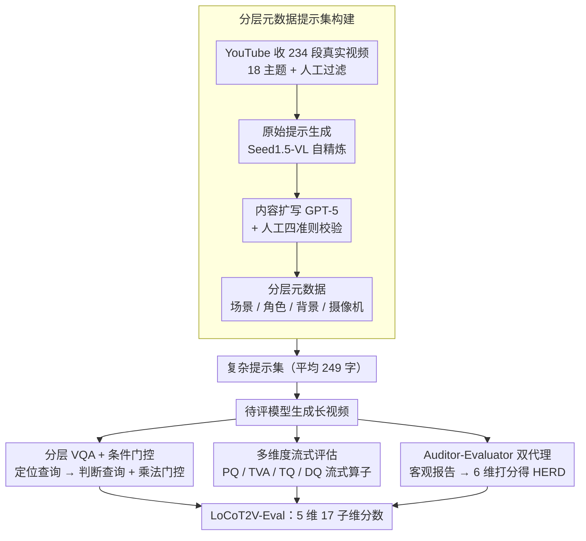

# LocoT2V-Bench: Benchmarking Long-form and Complex Text-to-Video Generation

**会议**: ICML 2026  
**arXiv**: [2510.26412](https://arxiv.org/abs/2510.26412)  
**代码**: 待确认  
**领域**: 视频生成 / 多模态 VLM / 评估基准  
**关键词**: 长视频生成基准, 复杂文本对齐, 分层元数据, 角色一致性

## 一句话总结
LocoT2V-Bench 是面向**长视频 + 复杂场景**生成的专业基准——234 段真实视频 × 18 主题 × 平均 249 字提示词，配套 LoCoT2V-Eval 5 维度 17 子维度评估框架（含分层 VQA + 条件门控 + Auditor-Evaluator 双代理 HERD），系统评估 17 个长视频生成模型，揭示了"感知质量强、细粒度对齐弱、角色一致性差"的普遍瓶颈。

## 研究背景与动机

**领域现状**：T2V 在短视频已显著进展，但长视频（> 10 秒、多场景、复杂时空动态）仍是开放问题。现有基准（VBench / EvalCrafter）面向短视频，采用简化提示，难以评估复杂场景生成。

**现有痛点**：
- 主要聚焦帧级视觉质量和整体提示一致性，忽视细粒度对齐（角色属性、动作）。
- CLIP-Score / FID 不适配长视频和复杂多场景提示。
- 对角色一致性、长期时间连贯性、高层叙事表达评估不足。

**核心矛盾**：长视频生成的专业级控制需求（精确角色设定 / 摄像机动作 / 多场景连贯性）与当前简化评估框架之间的鸿沟。

**本文目标**：
- 构建面向专业级生产流程的长视频基准（234 段真实视频、18 主题、多场景结构化提示）。
- 设计全面多维度评估框架——感知质量 / 文本对齐 / 时间连贯 / 动态质量 / 人类期望达成。

**切入角度**：从真实视频出发、采用分层元数据（场景 / 角色 / 背景 / 摄像机）和多轮条件式 VQA，更精确评测长视频生成。

**核心 idea**：**分层 VQA + 条件门控** + **Auditor-Evaluator 双代理 HERD**——系统评估长视频生成模型在细粒度对齐和高层期望达成上的能力。

## 方法详解

### 整体框架
LocoT2V-Bench 针对的是"长视频 + 复杂提示"这个被现有基准漏掉的盲区：旧基准面向短视频、提示又简，自然评不出角色属性、动作、长程一致性这些细节。它分两块——数据侧从 YouTube 收 234 段真实视频，经 MLLM + LLM 抽取再加人工校验，反向构造出多场景、带分层元数据（场景/角色/背景/摄像机）的复杂提示集；评估侧的 LoCoT2V-Eval 沿 5 大维度、17 个子维度给生成视频打分。整套设计可拆成四个支点：数据侧先从真实视频反向构造带分层元数据的复杂提示集，评估侧再用条件门控的分层 VQA 把对齐做细、用流式的多维框架把超长视频评全、用双代理协议把主观的"人类期望"评稳。

### 关键设计

**1. 分层元数据提示集构建：从真实视频反向造出场景/角色/背景/摄像机四维提示**

这是整个基准的地基，也直接决定了后面能不能做细粒度评估。以往基准要么提示太简（VBench-Long 平均 7.6 字、连角色都说不全），要么让 LLM 凭空编长描述、内容易幻觉又缺结构，根本支撑不起"逐角色逐属性查"。本文反其道而行，从真实视频出发倒推提示：先用 yt-dlp 按 18 个主题关键词从 YouTube 抓数千段 30-60 秒短视频，人工剔掉被字幕/水印遮挡、画质差、跑题的样本，留下 234 段并按主题均分；再走多阶段提示构造管线——Seed1.5-VL 以 self-refine 范式生成"原始提示"，GPT-5 把它扩写成带详细角色设定的故事化提示，并经人工按合理性、确定性、角色完整性、一致性四条准则校验，最后 GPT-5 自动复查一轮 + 人工复检疑难样本。产出物不是一段长文本，而是结构化的场景/角色/背景/摄像机四维**分层元数据**。真实视频做锚把幻觉压住，分层结构则给评估端提供了明确的查询依据（VQA 正是顺着这棵元数据树逐节点提问），最终得到平均 248.85 字、复杂度 8.70 的提示库——目前最具挑战的一份。

**2. 分层 VQA + 条件门控：把粗粒度的整体对齐拆成逐角色逐属性的细查**

复杂提示里藏着大量细节——谁穿红帽、那人高不高、背景是什么、镜头怎么动，整体一个 CLIP 分数根本覆盖不到。本文搭了一棵树状多轮问答：对每个场景先走场景存在性门控，再做角色定位与属性验证，最后核背景与摄像机。关键在两类查询的配合——先用"定位查询"（"有穿红帽的男人吗？"）把角色锚定下来，再用"判断查询"（"这个男人高吗？"）核属性，避免凭空给出幻觉属性。角色属性聚合为 $f^c_{\text{attr}} = \frac{1}{N_c} \sum_k y_k$，动作分则带一个锚定标志 $a^c_s$：$f^c_{\text{action}} = a^c_s \cdot \frac{1}{M_c} \sum_q A(q \mid H_{N_c})$。这个乘法门控很要害——只要角色没被成功定位，$a^c_s$ 置零，动作分直接归零，杜绝了"人都没找到却给动作打高分"的虚幻评分。多轮对话历史 $H_k = H_{k-1} \cup \{(q^{c, k}, y_k)\}$ 不断累积，保证后面的查询都建立在已验证的上文之上。

**3. 多维度流式评估框架：从像素到叙事，5 大维度全用流式算法兜住超长视频**

长视频评估的两个难点是"维度不全"和"显存爆掉"，本文同时解决。维度上铺了感知质量 PQ、文本视频对齐 TVA（整体 OA + 细粒度 FGA）、时间质量 TQ（CC/BC/WE）、动态质量 DQ、人类期望达成 HERD 五条线。具体到算子：PQ 用 DeQA-Score 做多尺度帧采样 $PQ(v) = \frac{1}{|W|} \sum_w \frac{1}{n_\alpha} \sum_{f \in w} \text{DeQA}(f)$；OA 换掉 CLIP、改用 Qwen3-VL-8B 直接给 0-100 分，能同时读出角色、场景、交互的一致性；角色一致性 CC 走"SAM3 追踪 → MLLM 验证 → FG-CLIP2 嵌入相似度"三段；背景一致 BC 与世界稳定 WE 用相邻帧 FG-CLIP2 加光流；DQ 则把帧级的动作度、平滑度与高层的段级、视频级非周期性和信息流聚合起来。这些算子统一改成流式计算（多尺度采样、流式 CLIP / 光流），不必把整段长视频一次性塞进显存，才让"评几分钟的视频"成为可能。

**4. Auditor-Evaluator 双代理：用职责分离把主观的人类期望评得更客观**

HERD 这种"视频是否达成了提示隐含的人类期望"本就主观，单个 MLLM 容易被第一印象或幻觉带偏。本文把它拆成两个角色：Auditor 在看不到期望参考的情况下独立分析视频、产出一份客观的内容报告；Evaluator 再拿着这份报告和视频，对情感、叙事、角色发展、视觉风格、主题表达、总体印象 6 个维度各打 1-5 分，加权聚合成 $S_{\text{HERD}} = \frac{1}{|D|} \sum_d s_d$。这套"先客观陈述、再据此评价"的分工，模仿的是影视审查里内容分析与质量评分相互独立的流程，既压住了单代理的幻觉与偏好，也让每个分数都能回溯到 Auditor 报告里的具体依据。

### 数据构建对比

| 基准 | 样本 | 平均字数 | 复杂度 | 特色 |
|------|------|---------|--------|------|
| EvalCrafter | 700 | 12.33 | 3.74 | 基础短视频 |
| VBench-Long | 946 | 7.64 | 2.54 | 长视频简化 |
| VBench 2.0 | 90 | 125.46 | 8.13 | 复杂单场景 |
| **LocoT2V-Bench** | **234** | **248.85** | **8.70** | **长视频 + 复杂 + 分层元数据** |

## 实验关键数据

### 主实验（17 个长视频生成模型，节选）

| 方法 | 感知质量 | 整体对齐 | 细粒度对齐 | TVA 均值 | 角色一致 | 背景一致 | TQ 均值 | HERD | 动态质量 | 总体 |
|------|--------|--------|---------|--------|--------|--------|-------|------|--------|------|
| FreeNoise | 73.89 | 18.12 | 10.38 | 14.25 | 15.38 | 98.77 | 69.85 | 53.65 | 50.55 | 52.44 |
| DiTCtrl | 56.55 | 48.25 | 45.54 | 46.90 | 25.72 | 96.86 | 72.50 | 60.75 | 49.37 | 57.21 |
| LongLive | 80.51 | 55.50 | 36.15 | 45.83 | 54.92 | 99.18 | 83.66 | 81.30 | 61.52 | 70.56 |
| LongCat-Video | 77.75 | 65.59 | 51.01 | 58.30 | 42.08 | 98.31 | 78.45 | 84.80 | 59.29 | 71.72 |
| Sora2 | 66.59 | 69.64 | 54.09 | 61.87 | 45.40 | 99.10 | 80.97 | 86.42 | 64.78 | 72.13 |
| Kling 3.0 | 70.26 | 73.08 | 56.94 | 65.01 | 36.97 | 98.96 | 78.55 | 87.47 | 56.16 | 71.49 |

### 关键发现
- **感知质量强，细粒度对齐弱**：PQ 70-84%，但 FGA 仅 10-56%，相差 2-7 倍——模型生成高质量帧但难以精确遵循复杂文本约束。
- **背景稳定优，角色一致性差**：BC 普遍 95-99%，但 CC 多数 < 50%（即便最好的 CausVid 也仅 45.97%）——能保环境稳定但难维持角色身份。
- **整体 vs 细粒度对齐巨大差距**：OA 50-73%，但 FGA 仅 10-56%（平均下跌 40 个百分点）——MLLM 倾向给乐观整体评分忽视细节遗漏。
- **Kling 3.0 / Sora2 领先**：HERD 最高 87.47% / 86.42%，TVA 最高 65.01% / 61.87%——专有模型的人类期望对齐能力更强。
- **多提示 vs 直接输入**：直接输入方法（CausVid / SkyReels-V2）整体 FGA 通常优于多提示分解方法（FreeNoise / MEVG）——端到端方法对复杂文本的处理能力更强。

## 亮点与洞察
- **分层元数据设计**：不同于以往 LLM 直接生成冗长描述，本文从真实视频反向构建场景-角色-背景-摄像机四维分层元数据，为细粒度评估提供明确依据。
- **条件门控 VQA**：多轮对话中"定位查询 → 判断查询"切换 + 乘法门控 $a^c_s$ 防虚幻评分，可迁移到其他需要多轮条件推理的评估任务。
- **Auditor-Evaluator 解耦**：打破单代理评估的幻觉 / 偏差，模仿电影审查流程（内容分析 vs 质量评分），提高 HERD 等主观度量的可靠性。
- **流式评估**：将 EvalCrafter / VBench 的耗显存算法改为流式（多尺度采样、流式 CLIP / 光流），完全支持超长视频。
- **复杂提示库**（248.85 字、8.70 复杂度）是目前最具挑战的基准，真实反映专业级视频生产的文本约束密度。

## 局限与展望
- 样本量 234 相对较小，无法覆盖所有极端场景和边界情况。
- HERD 的 6 维度定义主观性强，GPT-5 生成的期望与真实用户期望可能存在偏差。
- 角色一致性评估基于 SAM3 追踪，对复杂动作 / 部分遮挡 / 长期轨迹可能累积误差。
- 评估工具链依赖多个模型，部署复杂，工具升级影响历史对标可比性。
- 改进：扩大样本量到 500-1000 + 真实用户评估验证 HERD + 改进角色追踪。

## 相关工作与启发
- **vs VBench / EvalCrafter**：为短视频设计的简化提示；本文采用复杂多场景提示 + 分层元数据 + 细粒度对齐评估。
- **vs VBench 2.0**：用 125 字复杂提示但样本仅 90；本文 249 字 × 234 样本 × 18 主题，覆盖更广且提示来自真实视频降低幻觉。
- **vs 多提示输入方法**（Vlogger / StoryAdapter）：用 LLM 分解长提示渐进生成；本文直接输入方法表现更优，提示分解可能丧失上下文。
- **启发**：细粒度评估框架（条件 VQA）可迁移到 3D 生成、图像编辑等多模态任务；分层元数据可用于更系统地构建复杂提示基准。

## 评分
- 新颖性: ⭐⭐⭐⭐⭐  首个系统引入分层元数据 + 条件门控 VQA + HERD 的长视频生成基准。
- 实验充分度: ⭐⭐⭐⭐⭐  覆盖 17 个代表模型（多提示 + 直接输入两类），暴露角色一致性 / 细粒度对齐的普遍瓶颈。
- 写作质量: ⭐⭐⭐⭐⭐  逻辑清晰，方法精确，实验组织完善，结论具体可操作。
- 价值: ⭐⭐⭐⭐⭐  为长视频生成提供目前最全面评估基准；暴露瓶颈指导后续模型改进；分层元数据 + 条件 VQA 设计思路广泛迁移性。

<!-- RELATED:START -->

## 相关论文

- [\[ACL 2026\] OSCBench: Benchmarking Object State Change in Text-to-Video Generation](../../ACL2026/video_generation/oscbench_benchmarking_object_state_change_in_text-to-video_generation.md)
- [\[ICML 2026\] Enhancing Train-Free Infinite-Frame Generation for Consistent Long Videos](enhancing_train-free_infinite-frame_generation_for_consistent_long_videos.md)
- [\[ICML 2026\] Quant VideoGen: Auto-Regressive Long Video Generation via 2-Bit KV-Cache Quantization](quant_videogen_auto-regressive_long_video_generation_via_2-bit_kv-cache_quantiza.md)
- [\[CVPR 2026\] SLVMEval: Synthetic Meta Evaluation Benchmark for Text-to-Long Video Generation](../../CVPR2026/video_generation/slvmeval_synthetic_meta_evaluation_benchmark_for_text-to-long_video_generation.md)
- [\[ICML 2026\] Explainable Forensics of Manipulated Segments in Untrimmed Long Videos](explainable_forensics_of_manipulated_segments_in_untrimmed_long_videos.md)

<!-- RELATED:END -->
