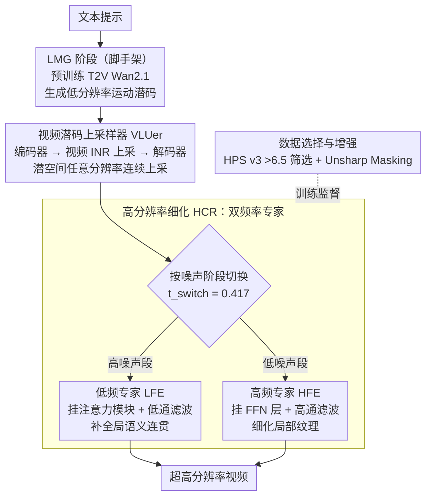

# LuVe: Latent-Cascaded Ultra-High-Resolution Video Generation with Dual Frequency Experts

**会议**: ICML 2026  
**arXiv**: [2602.11564](https://arxiv.org/abs/2602.11564)  
**代码**: 待确认  
**领域**: 视频生成 / 超高分辨率  
**关键词**: 超高分辨率视频生成, 扩散模型, 双频率专家, 潜空间上采样, 级联架构

## 一句话总结
LuVe 把 UHR 视频生成从"被动细节增强"重新定义为"主动内容补全"——通过三阶段级联（低分辨率运动 → 潜空间上采 → 高分辨率细化）+ 频域分析驱动的双频率专家（低频专家增强全局语义一致性、高频专家细化纹理），在 VBench 4K 上达 84.03 总分超过 UltraWan-4K 的 83.75。

## 研究背景与动机

**领域现状**：视频扩散在低分辨率已大有进展，但超高分辨率（UHR）质量严重下降。现有方案分三类——训练无关（修改推理策略不重训）、微调策略（UHR 数据集适配）、视频超分（先低分辨率生成再逐帧上采样）。

**现有痛点**：
- 训练无关方法纹理过度平滑、高频信息缺失——基础 T2V 未见 UHR 数据，内生能力不足。
- VSR 方法虽提升清晰度，但仅做低级纹理增强，无法补全缺失的语义结构和内容。
- 直接训练 UHR 模型面临三重耦合难题：（1）**动作建模困难**——高分辨率放大时序模块局限；（2）**语义规划失误**——空间维度扩展导致全局和局部重复 / 不一致；（3）**细节合成不足**——运动模糊、纹理退化、高频信息缺失。

**核心矛盾**：现有级联范式（FlashVideo / LaVie / Waver）把高分辨率阶段限制为"细节增强器"，只能改善低级视觉属性，无法进行真正的内容和语义补全。

**本文目标**：重新定义 UHR 生成的级联范式——不仅增强细节，更要增强全局语义连贯性和内容保真度。

**切入角度**：通过频域分析（PSD）观察扩散过程的阶段性——高噪声阶段捕捉低频（全局结构）、低噪声阶段合成高频（细节），由此设计分工明确的专家模块。

**核心 idea**：用 LMG → VLU → HCR 三阶段级联替代传统两阶段，通过在不同扩散阶段部署低频与高频专家，对扩散过程进行频域约束，实现动作先验建立 → 潜空间智能上采 → 语义细节联合补全的完整流程。

## 方法详解

### 整体框架
LuVe 想把超高分辨率视频生成从"被动磨细节"改成"主动补内容"——不只是把画面变清楚，还要补全低分辨率阶段缺失的语义结构。它用三阶段级联替代传统两阶段：先用预训练 T2V（Wan2.1-1.3B）在低分辨率生成视频潜码、把可靠的时序运动先验立住（LMG）；再用专门的上采样器在潜空间做任意分辨率的连续上采、避开 VAE 编解码的巨额开销（VLU）；最后在高分辨率阶段同时挂上低频和高频两个专家，一个管全局语义连贯、一个管纹理细节（HCR）。其中 LMG 直接复用预训练 T2V、不算本文贡献，真正的三个关键设计落在后两阶段：潜码上采怎么不偏流形（VLUer）、双频专家怎么分工（HCR）、以及拿什么数据喂它们。

### 关键设计

**1. 视频潜码上采样器 VLUer：在潜空间做连续上采，绕开编解码瓶颈**

传统做法要么在 latent 上插值（会偏离潜流形、出方块伪影），要么转回 RGB 插值（又得反复跑 VAE 编解码，开销巨大）。VLUer 改走隐函数表示：编码器先从低分辨率潜码 $z_0^L$ 提特征 $F$，视频 INR 上采样器以 3D 坐标 $Q(x, y, t)$ 对特征做隐函数映射，解码器在高分辨率潜域学时空表征并重建 $\hat{z}(x, y, t) = \text{Decoder}(U(F, Q(x, y, t)))$。训练分两阶段：先只用潜域 L1 损失 $\mathcal{L}_{\text{latent}} = \mathcal{L}_1(z_{sr}, z_{hr})$，再补上像素监督与帧差损失 $\mathcal{L}_{\text{pixel}} = \mathcal{L}_1(x_{sr}, x_{hr}) + \mathcal{L}_{\text{frame}}$，其中帧差 $\mathcal{L}_{\text{frame}} = \frac{1}{n-1} \sum_{t=2}^n \|\Delta x_{sr}^{(t)} - \Delta x_{hr}^{(t)}\|_1$。像素级损失直接压掉方块伪影，帧差损失则明确约束相邻帧的运动一致性，使任意分辨率上采既清晰又不抖。

**2. 双频率专家：让扩散的不同去噪阶段各管一段频率**

本文用 PSD 频谱分析发现 Wan2.1 的去噪过程天生有频域分工——高噪声阶段主要在搭低频的全局结构，低噪声阶段才合成高频细节。LuVe 顺着这个结构部署两个专化的 LoRA 专家：低频专家 LFE 在高噪声阶段（$t \in [t_{\text{switch}}, 1]$）训练，挂进 DiT 的注意力模块 $y = \text{Attention}(x) + \text{LoRA}(\text{LowPass}(x))$，配合注意力天然的全局感受野去管语义规划；高频专家 HFE 在低噪声阶段（$t \in [0, t_{\text{switch}}]$）训练，挂进 FFN 层 $y = \text{FFN}(x) + \text{LoRA}(\text{HighPass}(x))$，专攻局部纹理，切换点取 $t_{\text{switch}} = 0.417$。这套设计三处自洽：模块上注意力对全局、FFN 对局部；时间上高噪声对低频、低噪声对高频；并且用低通/高通滤波强制每个专家只看自己负责的频段，不串味。LoRA 也让总可训练参数远少于全量微调。

**3. 数据选择与增强策略：给两个专家配不同口味的训练数据**

两个专家要学的东西不一样，喂同一份数据是浪费。LFE 需要语义干净、全局一致的样本，于是用 HPS v3 给 UltraVideo 打分、只留 > 6.5 的高质量片段；HFE 需要纹理边界丰富的样本，于是在 LFE 筛后的子集上再做 Unsharp Masking，刻意放大高频成分和边界清晰度。任务专化的数据分布让每个专家都在自己擅长的频段上吃到最对口的监督——消融里去掉 Unsharp Masking，FID_patch 就从 41.03 退到 42.96。

## 实验关键数据

### 主实验（VBench）

| 模型 | SC ↑ | BC ↑ | TF ↑ | IQ ↑ | AQ ↑ | 平均 ↑ |
|------|------|------|------|------|------|--------|
| Wan2.1-720p | 95.70 | 96.05 | 98.45 | 68.28 | 56.46 | 82.98 |
| UltraWan-1K | 95.40 | 96.45 | 98.98 | 58.26 | 49.89 | 79.79 |
| UltraWan-4K | 95.81 | 96.11 | 97.71 | 71.44 | 57.69 | 83.75 |
| CineScale-4K | 95.16 | 95.95 | 97.80 | 67.74 | 57.82 | 82.89 |
| **本文-2K** | **95.83** | **96.76** | **98.18** | **71.15** | **59.78** | **84.34** |
| **本文-4K** | **95.36** | **96.46** | **98.09** | **71.33** | **58.91** | **84.03** |

4K 综合 84.03，超 UltraWan-4K 的 83.75 和 CineScale-4K 的 82.89。

### 消融实验

| 配置 | 模式 | FID_patch ↓ | 真实感 ↑ | AQ ↑ |
|------|------|------------|--------|------|
| UHR scaling only | 端到端 | 54.10 | 6.72 | 57.04 |
| LoRA Experts | 级联 | 47.03 | 7.28 | 58.65 |
| w/o 专家 | 级联 | 46.48 | 7.00 | 58.57 |
| w/o LF 专家 | 级联 | 43.86 | 7.08 | 59.10 |
| w/o HF 专家 | 级联 | 44.44 | 7.36 | 59.34 |
| w/o 数据选择 | 级联 | 43.77 | 7.40 | 58.80 |
| w/o Unsharp Masking | 级联 | 42.96 | 7.52 | 59.53 |
| **完整模型** | 级联 | **41.03** | **7.64** | **59.78** |

### 与 VSR 方法对比（VBench 生成基础上应用 VSR）

| 方法 | MUSIQ ↑ | MANIQA ↑ | NIQE ↓ | DOVER ↑ |
|------|---------|---------|--------|---------|
| RealBasicVSR | 55.90 | 0.401 | 4.15 | 0.712 |
| FlashVSR | 56.54 | 0.402 | 3.20 | 0.755 |
| **本文** | **58.01** | **0.410** | **3.16** | **0.784** |

### 关键发现
- **LFE 关键性**：去掉 LF 专家后 FID_patch 从 41.03 上升到 43.86（+6.9%）；定性分析显示注意力图分散、语义规划失误、内容产生伪影。
- **HFE 贡献**：去掉 HF 专家后 FID_patch 上升到 44.44（+8.3%）；视觉上纹理模糊和细节丧失。
- **数据策略**：去掉 Unsharp Masking 增强 FID_patch 42.96 vs 41.03（-4.7%），高频专家的数据增强不可或缺。
- **人类评估**：60 视频 × 20 评审员，本文在所有维度大幅领先（> 60% 偏好率）——总体质量 63.5% / 细节 60.3% / 时间一致 62.3% / 文本对齐 61.1%。

## 亮点与洞察
- **范式转变的战略价值**：从被动"细节增强"转向主动"内容补全"，重新定义高分辨率生成阶段的角色；改变了对 UHR 问题的认识——从"怎样更清晰"升级为"怎样更真实更丰富"。
- **频域分解的优雅洞察**：通过 PSD 分析发现并利用扩散过程的内生频域结构；低/高通滤波 + 分工明确的 LoRA 专家精准对应——体现对扩散模型内部机制的深刻理解。
- **三层次设计的自洽性**：模块选择自洽（注意力→全局→LFE，FFN→局部→HFE）+ 时间划分自洽（高噪声→低频→LFE，低噪声→高频→HFE）+ 数据策略自洽（HPS 筛选 + Unsharp Masking）。
- **参数效率**：LoRA 实现，总可训练参数远少于全量微调。
- **可迁移的设计**：频域分解 + 阶段性专家的思路可推广到其他多阶段生成任务（文本到图像超分、多模态生成）。

## 局限与展望
- VLUer 推理延迟 0.922s/帧 vs 潜插值 0.004s 仍有数百倍差距，产业级实时应用仍需进一步加速。
- 方法依赖高质量 UHR 视频数据（UltraVideo 数据集），对数据分布敏感。
- 改进：探索更高效潜空间上采样算子（蒸馏 / 知识转移）；研究自适应频率切换替代固定 $t_{\text{switch}} = 0.417$；扩展到更多任务和模型架构。

## 相关工作与启发
- **vs 训练无关方法**（Demofusion / LSRNA）：通过修改推理过程扩展预训练模型到高分辨率，计算高效但受基础模型生成能力限制；本文通过频域专家主动增强生成能力。
- **vs 传统 VSR**（RealBasicVSR / VEnhancer）：VSR 模块独立训练，无法补全低分辨率阶段丢失的语义信息；本文紧密级联 + 频域专家协调实现语义-细节联合优化。
- **vs 现有级联方法**（FlashVideo / LaVie / Waver）：现有方案把高分辨率阶段限制为被动增强；本文突破这一范式瓶颈，让高分辨率阶段参与内容补全与语义保真。

## 评分
- 新颖性: ⭐⭐⭐⭐⭐  范式创新（从细节增强到内容补全）+ 频域分解设计兼具理论深度和工程价值。
- 实验充分度: ⭐⭐⭐⭐⭐  多维度全面对比（VBench / FID_patch / 自定义评分 vs T2V / VSR / 人类评估）+ 消融详尽递进。
- 写作质量: ⭐⭐⭐⭐  逻辑严密，PSD 分析深度 motivate 了设计，方法描述清晰可复现。
- 价值: ⭐⭐⭐⭐⭐  解决实际 UHR 生成瓶颈（语义一致性 + 细节保真），学术界和产业应用都有重要价值。

<!-- RELATED:START -->

## 相关论文

- [\[ICCV 2025\] Dual-Expert Consistency Model for Efficient and High-Quality Video Generation](../../ICCV2025/video_generation/dual-expert_consistency_model_for_efficient_and_high-quality_video_generation.md)
- [\[ICLR 2026\] Dual-IPO: Dual-Iterative Preference Optimization for Text-to-Video Generation](../../ICLR2026/video_generation/dual-ipo_dual-iterative_preference_optimization_for_text-to-video_generation.md)
- [\[CVPR 2026\] STCDiT: Spatio-Temporally Consistent Diffusion Transformer for High-Quality Video Super-Resolution](../../CVPR2026/video_generation/stcdit_spatio-temporally_consistent_diffusion_transformer_for_high-quality_video.md)
- [\[ICML 2026\] OLAF-World: Orienting Latent Actions for Video World Modeling](olaf-world_orienting_latent_actions_for_video_world_modeling.md)
- [\[CVPR 2026\] Dual-Granularity Memory for Efficient Video Generation](../../CVPR2026/video_generation/dual-granularity_memory_for_efficient_video_generation.md)

<!-- RELATED:END -->
