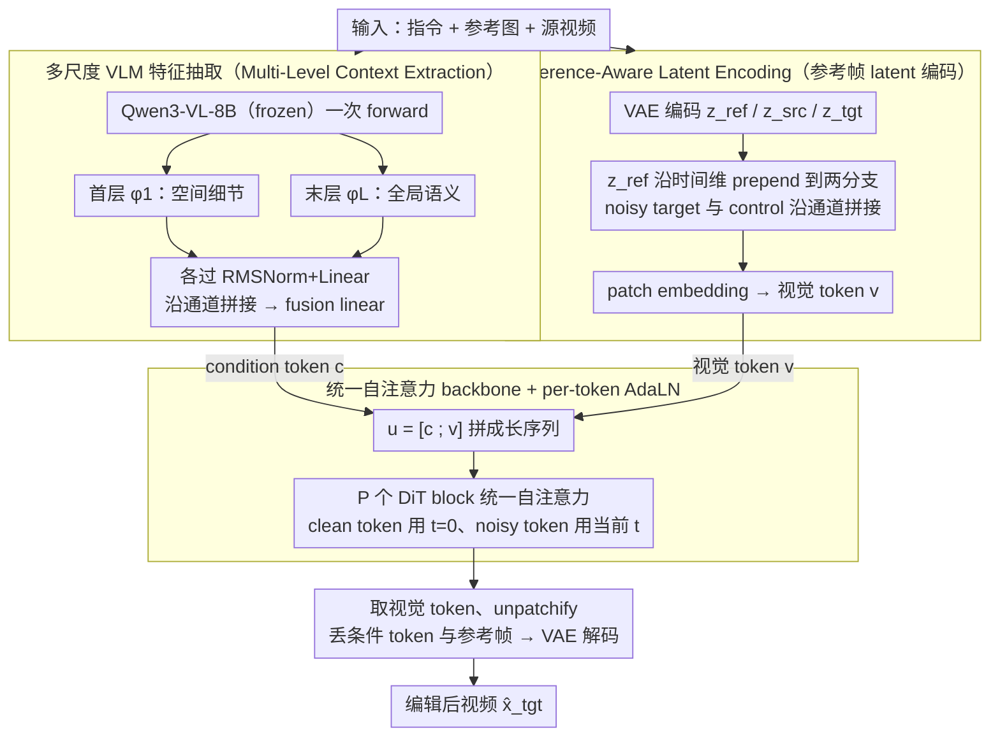

# MiVE: Multiscale Vision-language features for reference-guided video Editing

**会议**: ICML 2026  
**arXiv**: [2605.14664](https://arxiv.org/abs/2605.14664)  
**代码**: https://mivepaper.github.io (项目页, 代码未明确开源)  
**领域**: 视频编辑 / 多模态VLM / 扩散模型  
**关键词**: 参考图引导, 视频编辑, 多尺度VLM特征, 统一自注意力, DiT

## 一句话总结
MiVE 把 Qwen3-VL 的**首层 + 末层**隐状态同时抽出来作为多尺度条件 token, 与 VAE 视觉 latent 拼成一个长序列, 在统一的自注意力 DiT 里做参考图引导的视频编辑, 在 60 段 720P benchmark 上人类偏好和 6 个 VLM 自动评分都拿到第一, 超过开源 Wan-Animate 和商用 Kling O1.

## 研究背景与动机

**领域现状**: 参考图引导的视频编辑任务设定是: 给一段源视频 $x_{src}$ 和一句编辑指令 $x_{text}$, 用外部图像编辑器 (如 FLUX.1 Kontext) 改掉首帧得到参考图 $x_{ref}$, 然后要求模型把这种修改**忠实传播到整段视频**, 同时**保留**原视频的运动和未编辑区域. 当前主流走两条路: 一是 T5 + SigLIP 这种**解耦编码器**, 文本和视觉各编各的, 在 DiT 里用 cross-attention 融合; 二是直接把 Qwen3-VL / MiniCPM-V 这类 VLM 当**统一编码器**用 (Kling O1 就是这条路).

**现有痛点**: 解耦编码器存在天然的"模态 gap" —— 文本特征和视觉特征活在两个不同的语义空间里, 靠最后一层 cross-attention 很难真正桥接, 在需要细粒度跨模态推理的视频编辑里就会出现"指令没看懂"和"参考没对齐"两类错误. 而统一 VLM 编码器虽然解决了模态 gap, 却**只取最后一层的隐状态**, 丢掉了前几层富含的局部空间细节, 导致编辑后的视频在头发丝、光影、纹理这类细节上糊掉.

**核心矛盾**: VLM 内部其实有一个被忽视的层级结构 —— 浅层倾向于编码空间局部细节 (像素级 alignment), 深层倾向于编码全局语义 (指令理解). 现有方法要么完全不用 VLM (失去统一语义空间), 要么只用最后一层 (失去空间细节), 没有谁同时利用这两端的信息. 加上 cross-attention 本身是非对称的 —— 视觉 token 去 query 文本, 但文本 token 对视觉是 agnostic 的, 双向 fine-grained 对应也不够.

**本文目标**: (1) 验证 VLM 浅层确实编码空间细节、深层编码语义这一假设; (2) 设计一种能同时利用 VLM 浅层和深层特征的视频编辑框架; (3) 用真正对称的统一注意力机制代替 cross-attention.

**切入角度**: 作者用一个简单的"跨模态诊断矩阵" $A_{txt \to vis}^{(l)} = E B^{\top}$ 量化每一层文本 token 对视觉 token 的 attention 集中度, 配合 SAM2 生成的人物 mask 算 Attention Mask Ratio. 结果发现 Qwen3-VL 在第 0 层 $R_{mask} \approx 0.37$, 到最后一层降到 $0.23$, 浅层精确定位人物轮廓, 深层 attention 是弥散的全局模式. 这是支撑后续 multi-scale 设计的直接证据.

**核心 idea**: **抽 VLM 的首层 + 末层 → 投影成 condition token → 与视觉 latent 拼成长序列 → 全程统一自注意力**, 用一个共享 attention manifold 同时完成"局部细节传播"和"全局语义理解".

## 方法详解

### 整体框架

MiVE 的输入是源视频 $x_{src}$、文本指令 $x_{text}$、参考图 $x_{ref}$ (外部 image editor 给出的首帧编辑版); 输出是编辑后的视频 $\hat{x}_{tgt}$. Pipeline 分三个阶段:

1. **Multi-Level Context Extraction**: 把 $\{x_{text}, x_{ref}, x_{src}\}$ 一起喂给 Qwen3-VL-8B (frozen), 同时取**第 1 层**和**第 $L$ 层**的隐状态 $\phi_1, \phi_L \in \mathbb{R}^{S \times D_{VLM}}$, 各自经 RMSNorm + Linear 投到 $\mathbb{R}^{S \times D/2}$, 沿特征维拼接再过一个 fusion linear, 得到 condition token $c \in \mathbb{R}^{N_c \times D}$.
2. **Reference-Aware Latent Encoding**: 把 $x_{src}, x_{tgt}, x_{ref}$ 都过 frozen VAE 编码成 latent. 训练时把参考 latent $z_{ref}$ **沿时间维 prepend** 到 noisy target $\tilde z_t$ 和 control $z_{src}$ 两个分支前面, 然后两个分支沿通道维拼起来, 形状是 $(T'+1) \times 2C \times H' \times W'$. 这样从第一帧开始, 模型就一直能"看见"参考图作为 appearance anchor.
3. **Unified Self-Attention Backbone**: 把 condition token $c$ 和 patchify 后的视觉 token $v$ 拼成 $u^{(0)} = [c; v] \in \mathbb{R}^{(N_c + N_v) \times D}$, 整条序列在 DiT block 里走**统一的自注意力**, 没有 cross-attention. 关键的 trick 是 **per-token AdaLN**: clean token (condition + reference frame patches) 用 $t=0$ 的固定时间嵌入, noisy token (target 视频 patches) 用当前 diffusion timestep $t$ 的嵌入. 整个模型从 Wan2.1-T2V-14B 的自注意力 block 初始化, flow matching 训练.

### 关键设计

1. **多尺度 VLM 特征抽取 (Multi-Level Context Extraction)**:

    - 功能: 让条件信号同时携带 VLM 浅层的空间细节和深层的全局语义.
    - 核心思路: 对 Qwen3-VL 同一次 forward 的隐状态, 在第 1 层和第 $L$ 层各取一份, 经独立 adapter 投影后**沿 channel 维拼成 $D$ 维**: $c_{raw} = \text{Concat}_D(\tilde\phi_1, \tilde\phi_L)$, 再过 $\text{Linear}_{fuse}$ 得到最终条件 token. 这里之所以选首末两端而不是均匀采样, 是因为诊断实验显示 $R_{mask}$ 的极值就出现在 layer 0 和 layer $L$ 附近, 中间层是单调过渡, 信息冗余度高.
    - 设计动机: 解决了"统一 VLM 只用最后一层会丢空间细节"的痛点. condition token $c$ 不依赖 diffusion timestep $t$, 在去噪全程都是固定的"语义锚点", 不会被噪声调制掉.

2. **Reference-Aware Latent Encoding (参考帧时间维 prepend + 通道维双分支)**:

    - 功能: 在不引入 mask 的前提下, 同时给模型提供 appearance anchor (从参考图来) 和 motion anchor (从源视频来).
    - 核心思路: 训练时构造 $z_t = \text{Concat}_C([z_{ref}; \tilde z_t], [z_{ref}; z_{src}])$, 即两个分支都被 $z_{ref}$ 在时间维起头. 推理时 noisy target 那一支用 $\tilde z_T \sim \mathcal{N}(0, I)$ 初始化, control 那一支换成实际 source video, 其余相同. 整条 latent 经过 patch embedding 切成 $N_v$ 个时空 patch.
    - 设计动机: 让 $z_{ref}$ 既是 appearance anchor 又是结构 anchor —— 时间 prepend 确保每一层 attention 都能看到它, 通道双分支让 control 信号 (源视频) 和 target 信号 (待生成) 在 latent 层面就被对齐, 避免了 mask-guided 方法在快速运动 / 复杂背景下 mask 不准的硬伤.

3. **统一自注意力 + per-token AdaLN**:

    - 功能: 用一个对称的、长序列自注意力替代非对称的 cross-attention, 让条件 token 和视觉 token 在同一个空间里互相 query / key / value.
    - 核心思路: $u^{(0)} = [c; v]$ 一起进 $P$ 个 DiT block. 每个 token 单独决定自己的 AdaLN modulation —— condition token 和参考帧的 patches 用 $t=0$ 的嵌入 (相当于"始终是干净的"), 其余 target patches 用当前去噪 $t$ 的嵌入. 输出时只取 $u^{(P)}[N_c:]$ 这部分做 unpatchify, 丢掉条件 token, 然后再丢掉参考帧解码出最终视频 $\hat x_{tgt} = \mathcal{D}(\hat z_0[1:])$.
    - 设计动机: cross-attention 里视觉 query 文本但文本不能 query 视觉, fine-grained 双向对应做不出来; 统一自注意力天然对称, 模型可以学到模态对齐而不是被人为分开. per-token AdaLN 解决"clean 信号和 noisy 信号被同样的时间嵌入污染"的工程问题, 让参考帧在整个去噪过程中保持稳定.

### 损失函数 / 训练策略

flow matching 目标 (Lipman et al., 2023), 从 Wan2.1-T2V-14B 自注意力 block 初始化, 在 8 张 H100 上以 720P / 81 帧训练 8000 步 (约 2 epoch, ~65 小时). 优化器 AdamW, lr $3 \times 10^{-5}$, $\beta = (0.9, 0.999)$, 200 步 warmup, 梯度裁剪 1.0. 推理时单张 H100 生成 81 帧 720P 视频约 6.5 分钟 (Qwen3-VL ~3s, DiT 去噪 ~328s, VAE 解码 ~35s), 峰值显存 50 GB. 训练数据 30K 对: 24K 从 OpenVE-3M 用 Qwen3-VL 打分 ≥9.3 过滤而来 (六个编辑类别, 每类最多 4000), 加 6K 通过分割人物前景 + 合成背景视频构造的人像数据 (删除 / 添加 / 背景替换三类).

## 实验关键数据

### 主实验

Benchmark: 60 段 720P 视频, 分简单子集 (30 段, 来自 RoseBench + VPBench, 有近似 mask) 和复杂子集 (30 段, 全是肖像视频, 涉及氛围迁移 / 光照重分布 / 背景替换, 无 mask). 评估用 Gemini-3-Flash 在 6 个维度 (IA / CC / TS / PR / VA / SC) 打 0-10 分, 加 30 人 user study 给 1-5 holistic 分.

| 子集 | 方法 | IA | CC | TS | VA | SC | User |
|------|------|------|------|------|------|------|------|
| Simple | VACE | 7.06 | 7.12 | 6.45 | 6.39 | 7.02 | 2.67 |
| Simple | LucyEdit | 6.14 | 7.56 | 7.55 | 5.96 | 7.13 | 1.58 |
| Simple | VideoCof | 7.53 | 8.04 | 8.62 | 6.41 | 8.28 | 1.46 |
| Simple | Kling O1 | 8.48 | 9.03 | 8.91 | 8.51 | 9.31 | 3.69 |
| Simple | **MiVE** | **9.30** | 8.65 | 8.81 | **8.83** | **9.46** | **4.18** |
| Complex | LucyEdit | 7.22 | 7.02 | 6.36 | 5.57 | 7.05 | 1.78 |
| Complex | Wan-Animate | 8.87 | 7.78 | 7.83 | 7.73 | 8.98 | 3.03 |
| Complex | Kling O1 | 8.68 | 7.71 | 8.11 | 7.74 | 9.14 | 3.61 |
| Complex | **MiVE** | **9.23** | **8.05** | **8.27** | **8.09** | **9.22** | **3.75** |

简单集合上 MiVE 在 IA / VA / SC 拿第一, 在 CC / TS / PR 屈居第二 (输给商用 Kling O1), 但 user study 还是 4.18 vs 3.69 拉开差距; 复杂集合上 6 维 + user 全部第一.

### 消融实验

| 配置 | IA | CC | TS | VA | SC | 说明 |
|------|------|------|------|------|------|------|
| Decoupled Enc. + Dual Cross-Attn | 6.76 | 6.10 | 5.88 | 5.87 | 7.45 | 老式解耦架构 baseline |
| Unified Enc. (only last layer) + Dual Cross-Attn | 8.51 | 8.24 | 7.68 | 7.42 | 8.03 | 仅末层 + cross-attn |
| Unified Enc. + Fused Cross-Attn | 8.53 | 8.22 | 7.87 | 8.08 | 9.00 | 单分支 cross-attn |

从解耦换成统一 VLM 编码器, 几乎所有指标涨 1.5 分以上 —— 这是统一语义空间的功劳; 再从 cross-attn 换成统一自注意力 (即完整 MiVE), IA 从 8.53 进一步涨到 9.23 量级.

### 关键发现

- VLM **首层** Attention Mask Ratio (Qwen3-VL: 0.366, GLM-4.6V: 0.333) 显著高于末层 (0.228, 0.270), 证实"浅空间 / 深语义"假设, 这是 multi-scale 设计的实验依据.
- Qwen3-VL 浅层定位能力比 GLM-4.6V 强 (0.37 vs 0.33), 所以选 Qwen3-VL 作 backbone.
- 在复杂场景 (快速运动 / 强光变化 / 头发颜色变换), MiVE 的身份保持比 Wan-Animate 和 Kling O1 更稳, 这反映 reference latent 时间维 prepend 让 appearance anchor 全程可见的设计在难样本上效果更明显.
- 作者特别说**不报 SSIM / LPIPS**, 因为编辑任务下生成视频和输入视频本就该不一样, 这两个结构相似度指标根本不适用.

## 亮点与洞察

- **诊断式动机推导**: 先用一个简单的 $E B^{\top}$ 矩阵 + SAM2 mask 量化"VLM 哪一层最关注前景", 用 $R_{mask}$ 把直觉变成数字, 这种"先量化、再设计"的写作模式比单纯说"我们观察到..."有说服力得多, 值得借鉴.
- **统一自注意力替代 cross-attention**: 思路上和 Z-Image / FLUX 一脉相承, 但 MiVE 把"clean / noisy per-token AdaLN"显式拎出来作为关键设计, 把"参考帧始终是干净的"这个先验编码到时间嵌入里, 避免了 noise schedule 污染锚点.
- **多尺度只取首末两端**: 工程上比"每隔几层取一次"省一大半投影参数, 而且 $R_{mask}$ 的单调性证明中间层信息可线性插值, 取两端就够.
- **不报 SSIM / LPIPS 的勇气**: 大方写明传统结构相似度指标不适用编辑任务, 改用 VLM judge + user study, 这种对评估方法本身的批判更值得后续 video editing 工作参考.

## 局限与展望

- **30K 训练对偏少 + 都来自 OpenVE-3M / 合成数据**, 真实野生场景下的复杂物理 (流体 / 反射 / 透明物体) 没单独评测, 推广性存疑.
- **6.5 分钟生成 81 帧 / 50 GB 显存**, 仍然吃 H100, 离消费级落地很远; 论文也没讨论怎么加速 (蒸馏 / few-step flow / token pruning).
- **评估闭环可能有 bias**: backbone 是 Qwen3-VL, 主要 evaluator 是 Gemini-3-Flash, 虽然附录补了 InternVL3.5 作交叉验证, 但 VLM judge 整体在指令理解风格上和训练 backbone 难免有共鸣.
- **首层是否真的就是最优选**? 论文只做了 Qwen3-VL 和 GLM-4.6V 两个模型, 不同 VLM 的层级分布可能不一样, "永远取首末两端"未必通用, 缺一个 layer-selection 的 ablation.

## 相关工作与启发

- **vs VACE / VideoPainter (mask-guided)**: 他们靠精确 mask 做空间控制, 在快速运动和复杂背景下 mask 不准导致编辑失败; MiVE 完全 mask-free, 让模型自己从指令 + 参考图里推断编辑区域.
- **vs Lucy Edit / Wan-Animate (mask-free 但 unified encoder 只用末层)**: 他们丢了浅层空间细节, 在细粒度纹理 / 局部物体上糊; MiVE 用多尺度 condition token 补回来.
- **vs Kling O1 (商用 unified VLM)**: 商业系统具体架构不公开, 但实验上 MiVE 在 IA 维度 (指令遵循) 拉开较大差距, 暗示"只取末层 + cross-attn"是 Kling O1 的瓶颈.
- **vs Ditto / ICVE (隐式 prior token + DiT)**: 思路相近, 但都是单尺度的 prior; MiVE 用 multi-scale 比单尺度更适合复杂场景, 这个对比有点像 FPN 之于 single-scale detector.

## 评分
- 新颖性: ⭐⭐⭐⭐ multi-scale VLM + 统一自注意力组合在视频编辑里属于第一次系统化, 但 multi-scale 本身和统一自注意力在图像生成已有先例.
- 实验充分度: ⭐⭐⭐⭐ 60 段 benchmark + 双 evaluator + user study + 4 个架构 ablation, 比较扎实; 但训练数据规模较小, 缺乏 in-the-wild 评估.
- 写作质量: ⭐⭐⭐⭐⭐ 诊断式动机推导 + 公式 / 图表配合得当, "为什么取首末两层"的论证完整且优雅.
- 价值: ⭐⭐⭐⭐ 把"VLM 当 unified encoder"这一思路推进到 multi-scale, 给后续视频编辑 / 视频生成的条件设计立了一个 strong baseline.

<!-- RELATED:START -->

## 相关论文

- [\[CVPR 2026\] MotionEnhancer: Leveraging Video Diffusion for Motion-Enhanced Vision-Language Models](../../CVPR2026/video_generation/motionenhancer_leveraging_video_diffusion_for_motion-enhanced_vision-language_mo.md)
- [\[CVPR 2026\] RecEdit-Drive: 3D Reconstruction-Guided Spatiotemporal Video Editing for Autonomous Driving Scenes](../../CVPR2026/video_generation/recedit-drive_3d_reconstruction-guided_spatiotemporal_video_editing_for_autonomo.md)
- [\[CVPR 2026\] Real-Time Generation of Streamable Talking Portrait Video with Reference-Guided Deep Compression VAEs](../../CVPR2026/video_generation/real-time_generation_of_streamable_talking_portrait_video_with_reference-guided_.md)
- [\[CVPR 2026\] VIVA: VLM-Guided Instruction-Based Video Editing with Reward Optimization](../../CVPR2026/video_generation/viva_vlm-guided_instruction-based_video_editing_with_reward_optimization.md)
- [\[ICLR 2026\] LoRA-Edit: Controllable First-Frame-Guided Video Editing via Mask-Aware LoRA Fine-Tuning](../../ICLR2026/video_generation/lora-edit_controllable_first-frame-guided_video_editing_via_mask-aware_lora_fine.md)

<!-- RELATED:END -->
