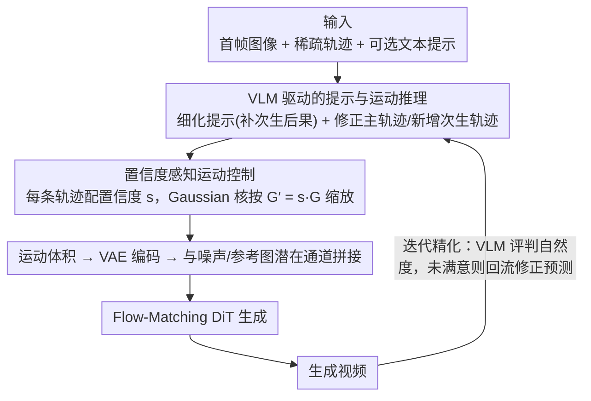

# MotiMotion: Motion-Controlled Video Generation with Visual Reasoning

**会议**: ICML 2026  
**arXiv**: [2605.22818](https://arxiv.org/abs/2605.22818)  
**代码**: 待确认  
**领域**: 视频生成 / 可控生成  
**关键词**: 运动控制, 视觉推理, VLM, 视频生成, 物理约束

## 一句话总结
MotiMotion 通过 VLM 推理把用户稀疏不精确的轨迹和文本提示**转化**为物理可信且因果一致的动作轨迹和文本描述，再用**置信度加权**的控制策略引导扩散模型生成符合世界知识和物理原理的自然视频——在 MotiBench 上物理真实性 0.302 远超 Wan-Move 的 0.218（+38%）。

## 研究背景与动机

**领域现状**：图像到视频生成模型在视觉质量和语义一致性上已有突破。但实际应用中缺乏精确的逻辑可控性——用户可通过轨迹 / 边界框 / 光流指导，但需对运动细节有精确理解。

**现有痛点**：现有运动控制方法（Wan-Move / MagicMotion）**假设用户输入完全捕捉真实运动动力学并严格执行**。然而用户提供的轨迹往往稀疏、粗糙、物理不一致。如提示"举起挡住多米诺骨牌的手"，用户明确手的轨迹，但隐含期望多米诺骨牌在约束移除后会**连锁倒下**——这种因果关系模型无法推理。

**核心矛盾**：运动控制生成在两个极端间平衡——（1）严格执行用户输入导致物理不合理和因果缺失；（2）完全忽视用户意图失去可控性。根本原因是缺乏对视觉上下文的推理能力。

**本文目标**：构建智能运动控制视频生成框架，把用户模糊意图转化为物理和因果一致的动作规划，同时保留用户的空间-时间可控性。

**切入角度**：VLM 具有强大的世界知识和视觉理解能力，可理解用户提供的视觉上下文并推理隐含的物理和因果逻辑。将问题重新定义为"推理-生成"两阶段：先用 VLM 把稀疏输入转化为密集物理可信的控制信号，再用扩散模型渲染视频。

**核心 idea**：通过训练无关的 VLM 推理来细化用户轨迹、幻觉次生运动，并引入**置信度加权**让生成器在低置信区域依赖自身生成先验而非死板执行。

## 方法详解

### 整体框架
MotiMotion 把"运动控制视频生成"重新拆成"推理—生成"两阶段，核心想法是：用户画的轨迹本质是"意图"而非"规范"，常常稀疏、粗糙、物理上还自相矛盾，不该让生成器死板照搬。第一阶段让一个训练无关的 VLM 充当"物理推理器"，读懂输入图像、轨迹可视化和文本提示，把稀疏输入补成密集、因果一致的运动规划——既修正主轨迹，又幻觉出次生运动（碰撞、变形、连锁反应），还产出一段带因果后果的细化提示。第二阶段把这些规划注入 Flow-Matching 视频生成器，但带上置信度——高置信轨迹强约束、低置信轨迹只做粗指导。三个设计分别对应：VLM 怎么推、置信度怎么用、以及怎么靠多轮迭代兜住单轮的不完美。

### 关键设计

**1. VLM 驱动的提示与运动推理：把"举手挡多米诺"补成"手抬起、骨牌连锁倒下"**

现有方法（Wan-Move / MagicMotion）默认用户输入完整刻画了真实动力学并严格执行，可用户其实只标了手的轨迹，隐含期望的"约束移除后骨牌连锁倒下"这种因果，模型根本推不出来。MotiMotion 让 VLM 同时吃三路输入——归一化到 $[0, 1]$ 的坐标序列（文本形式）、叠了轨迹可视化的输入图像、可选文本提示——基于视觉上下文去推因果。它输出两样东西：一段细化提示，补齐主运动的所有次生后果；一组细化轨迹，既修正用户主轨迹（保留空间意图、但调整时间步长来体现摩擦/加速度等物理力），又新增次生轨迹（识别会被波及的反应物或保持静止的锚点）。这等于把物理常识（齿轮耦合、支撑移除后下落）外包给 VLM 的世界知识，生成器不必从数据里硬学这些知识。

**2. 置信度感知运动控制：不是"严格执行 vs 完全忽视"，而是连续过渡**

VLM 和用户给的轨迹都可能不精确，一刀切地强制执行会把错误也照搬进去。本文给每条轨迹配一个置信度 $s \in [0, 1]$（$s = 1$ 为真值级、$s \to 0$ 越不可靠）。训练时对低置信样本主动施加退化来模拟各种不确定（仿射变换模拟空间不准、线性化模拟时间稀疏、Savitzky-Golay 平滑模拟过度平滑），逼模型学会"输入越糙越该靠自己"。推理时则用置信度缩放 Gaussian 核强度 $G' = s \cdot G$——高分产生尖峰、迫使模型盯紧给定坐标，低分削弱信号、鼓励模型回退到预训练生成器本就很强的自然动态先验。于是在多米诺向下弯曲、跷跷板扭曲这类 VLM 预测翻车的地方，调低置信度就能让伪迹被自动纠正。

**3. 迭代精化循环：用户多轮纠正，逼近因果正确的结果**

单轮推理难免有误解（比如把某段轨迹错读成镜头推拉）。VLM 不只能从静态图和轨迹预测运动，还能反过来评判生成视频的自然度，于是把它接成一个循环：用户可以多轮调用，逐步纠正 VLM 的推理错误，直到满意，或由 VLM 自动判定"完全可信"才停。论文里的钟表例子很能说明问题——单轮失败，4 轮迭代后才成功把齿轮的耦合运动建模对。

### 实现细节
基座生成器为 Wan 2.2 I2V-A14B（Flow-Matching）。运动表示为长度 L、分辨率 H × W 视频里的 N 条点轨迹，每条轨迹在对应帧位置放一个 2D Gaussian 热力图，标准差按视频分辨率缩放、峰值归一化为 1；运动潜在经 VAE 编码投影后，与噪声潜在、参考图像潜在在通道维拼接送入 DiT。两阶段训练（OpenVid 上先 5K 步，再对 50% 样本做轨迹退化训 3K 步），运动推理 VLM 用 Gemini 3.1 Pro。

> ⚠️ Gemini 3.1 Pro 等模型名以原文为准。

## 实验关键数据

### 主实验（MotiBench，VLM 自动评估）

| 方法 | 物理真实性 ↑ | 照片真实性 ↑ | 语义一致性 ↑ |
|------|----------|----------|----------|
| MagicMotion | 0.157 | 0.550 | 0.343 |
| Wan-Move | 0.218 | 0.483 | 0.511 |
| **MotiMotion** | **0.302** | 0.520 | **0.665** |

### 双选择强制对比测试

| 对比方案 | 对象属性 | 交互 | 总体 | 人类评估 |
|--------|--------|------|------|--------|
| MotiMotion vs MagicMotion | 72.9% | 80.8% | 78.0% | 97.9% |
| MotiMotion vs Wan-Move | 71.5% | 75.0% | 73.8% | 81.4% |

物理真实性相比 Wan-Move 提升 38%，相比 MagicMotion 提升 92%。人类偏好度高于随机 50% 基线约 50 个百分点。

### 消融实验

| 配置 | 物理真实性 ↑ | 照片真实性 ↑ | 语义一致性 ↑ |
|------|----------|----------|----------|
| 基础运动控制生成器 | 0.166 | 0.389 | 0.337 |
| +提示推理 | 0.237 | 0.475 | 0.544 |
| +运动推理 | 0.285 | 0.493 | 0.641 |
| +置信度感知控制 | 0.302 | 0.520 | 0.665 |

### 关键发现
- 逐步加入组件每个都显著改进；运动推理贡献最大（物理真实性 0.237 → 0.285）。
- **跨方法推理验证**：将推理模块应用到 MagicMotion / Wan-Move，物理真实性和语义一致性一致改进，表明推理模块的泛化性。
- **VLM 推理的关键作用**：即便不提供用户文本，仅基于图像和轨迹的推理也将物理真实性 0.177 → 0.229、语义一致性 0.272 → 0.473。
- **置信度机制纠正预测误差**：多米诺向下弯曲、跷跷板扭曲等 VLM 预测不精确的场景下，置信度降低可自动纠正伪迹。
- **迭代精化可行**：钟表例子展示 4 轮迭代后成功模型化齿轮耦合运动，单轮失败。

## 亮点与洞察
- **推理-生成解耦的妙处**：不在扩散模型内学物理推理，而是用训练无关的 VLM 作"物理推理器"——既保留生成模型灵活性，又利用 VLM 世界知识；避免让视频模型从数据学常识的巨大代价，同时增强可解释性。
- **置信度加权的优雅设计**：不是二元选择"严格执行 vs 完全忽视"而是连续权衡；通过模拟不同置信度下的输入退化训练，让模型学习自动适应输入质量，与视频生成模型本身的强大生成先验天然契合。
- **从稀疏用户输入到密集物理规划的转换**：揭示关键洞察——用户输入本质上是"意图"而非"规范"；用 VLM 理解意图并规划完整因果链是让生成器产生自然结果的关键。

## 局限与展望
- VLM 预测的轨迹可能在空间上抖动或不准确（视觉编码器分辨率限制）。
- 方法限制于图像到视频场景，未探索视频到视频扩展。
- 依赖 VLM 质量；对不在 VLM 训练数据中常见的复杂物理场景（流体模拟、多体系统）推理可能失效。
- MotiBench 仅 62 张预事件图像，规模有限。
- 置信度评分机制训练中固定模拟，推理时由 VLM 给出，两者不匹配可能导致控制不稳定。
- 改进：集成物理仿真器 + VLM 推理；扩展 MotiBench 规模和多样性；探索在线置信度学习。

## 相关工作与启发
- **vs MagicMotion**：都做运动控制，但 MagicMotion 依赖用户密集轨迹严格执行；MotiMotion 用 VLM 从稀疏输入推理密集规划——降低用户负担同时大幅提升物理可信性。
- **vs Wan-Move**：Wan-Move 也基于 Wan 框架轨迹注入，但用完全监督的轨迹追踪；MotiMotion 通过置信度加权在追踪严格性上更灵活，且 VLM 推理提供的因果规划是 Wan-Move 缺失的核心创新。
- **vs 物理感知生成**（通过物理求解器或显式物理约束）：本文用 VLM 隐式编码的物理知识，避免模型显式学物理的开销，但极端物理场景（复杂流体）精度可能不足。

## 评分
- 新颖性: ⭐⭐⭐⭐⭐  把 VLM 推理创新性集成到运动控制流水线；置信度感知控制是对运动条件化的优雅重新思考。
- 实验充分度: ⭐⭐⭐⭐  自动化 VLM 评估 + 人类研究 + 消融 + 跨方法验证 + 迭代分析；MotiBench 规模较小（62 图）泛化性验证待深化。
- 写作质量: ⭐⭐⭐⭐⭐  逻辑清晰，动机充分，示例生动（多米诺 / 钟表）。
- 价值: ⭐⭐⭐⭐⭐  解决运动控制视频生成中的核心问题（稀疏不精确输入 → 自然可控生成），框架在多个现有方法上的泛化证明通用性。

<!-- RELATED:START -->

## 相关论文

- [\[CVPR 2026\] SynMotion: Semantic-Visual Adaptation for Motion Customized Video Generation](../../CVPR2026/video_generation/synmotion_semantic-visual_adaptation_for_motion_customized_video_generation.md)
- [\[CVPR 2026\] Lighting-grounded Video Generation with Renderer-based Agent Reasoning](../../CVPR2026/video_generation/lighting-grounded_video_generation_with_renderer-based_agent_reasoning.md)
- [\[CVPR 2026\] Thinking with Video: Video Generation as a Promising Multimodal Reasoning Paradigm](../../CVPR2026/video_generation/thinking_with_video_video_generation_as_a_promising_multimodal_reasoning_paradig.md)
- [\[CVPR 2026\] P-Flow: Prompting Visual Effects Generation](../../CVPR2026/video_generation/p-flow_prompting_visual_effects_generation.md)
- [\[CVPR 2026\] Unified Camera Positional Encoding for Controlled Video Generation](../../CVPR2026/video_generation/unified_camera_positional_encoding_for_controlled_video_generation.md)

<!-- RELATED:END -->
