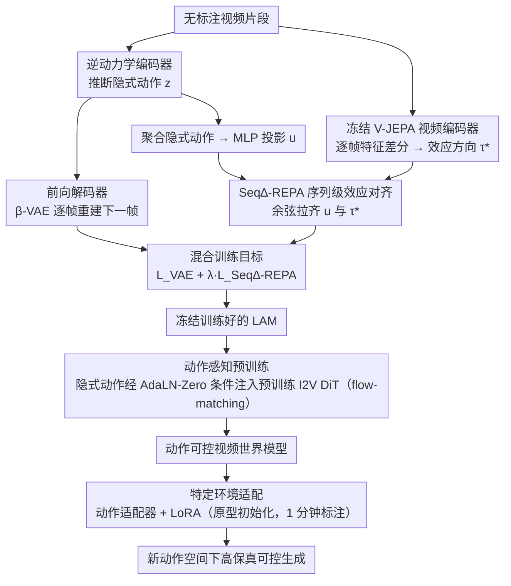

# OLAF-World: Orienting Latent Actions for Video World Modeling

**会议**: ICML 2026  
**arXiv**: [2602.10104](https://arxiv.org/abs/2602.10104)  
**代码**: 待确认  
**领域**: 视频生成 / 世界模型 / 自监督学习  
**关键词**: 隐式动作学习, 视频世界模型, 跨上下文迁移, 控制对齐

## 一句话总结
OLAF-World 通过**序列级控制-效应对齐**（Seq∆-REPA）学习可迁移的隐式动作——把无标注视频转化为动作可控的视频世界模型，实现跨上下文的零样本动作迁移；用 1 分钟的标注数据即可达到 AdaWorld 2 小时数据下的性能（旋转控制精度 0.4680 vs 0.6420）。

## 研究背景与动机

**领域现状**：视频世界模型需要大规模帧级动作标注才能进行动作控制，但这样的标注成本高且通常限制于特定领域。隐式动作学习（Latent Action Model, LAM）承诺从无标注视频中自动发现控制接口——通过逆动力学编码器推断隐式动作，再用前向解码器预测未来帧。

**现有痛点**：尽管隐式动作模型在**单个视频片段内**能良好重建，但学到的隐式动作**无法跨上下文迁移**——在不同场景 / 视角 / 光照下，相同的语义动作（如"向前移动"）映射到隐式空间中完全不同的方向。两类失败模式：
- **捷径学习**：编码器倾向于编码场景相关的视觉线索而非实际可控因素。
- **跨上下文非可识别性**：由于训练目标仅在单个片段内操作，隐式坐标系在不同视频间可自由漂移。

**核心矛盾**：步级重建目标（逐帧预测损失）无法提供跨视频的共享参考系，导致同一动作在不同环境中的表示完全不同，破坏迁移性。

**本文目标**：学习一个结构化、跨上下文一致的隐式动作空间，支持零样本动作序列迁移和低数据量下的快速适配。

**切入角度**：虽然显式动作标注不可得，但**动作的语义效应是可观察的**。相同的底层动作在不同上下文中应该产生相似的视觉-语义变化。利用冻结的自监督视频编码器作为全局参考，把隐式动作序列对齐到其效应方向（特征的净变化）。

**核心 idea**：通过序列级控制-效应对齐把隐式动作与自监督编码器捕捉的视觉-语义变化对齐，从而在不同上下文中建立统一的隐式坐标系。

## 方法详解

### 整体框架
OLAF-World 想从无标注视频里学出一个"跨上下文一致"的隐式动作空间——让"向前移动"这种语义动作在不同场景、视角、光照下都映射到隐空间里同一个方向，而不是各漂各的。它分两阶段：先在无标注视频上用 Seq∆-REPA 训练逆动力学模型，把隐式动作对齐到一个全局参考系；再把学到的隐式动作当作统一控制接口，去条件约束一个预训练的视频扩散 Transformer。核心赌注是：显式动作标注拿不到，但动作的"效应"（画面发生的视觉-语义变化）是可观察的，用它来当锚就行。

### 关键设计

**1. Seq∆-REPA 序列级效应对齐：用"动作产生的变化"当跨视频的统一坐标系**

隐式动作模型的老毛病是只在单个片段内做逐帧重建，于是隐式坐标系可以在不同视频间自由漂移，同一动作换个场景就换个方向，迁移性彻底崩掉；编码器还容易走捷径去编码场景外观而非真正可控的因素。Seq∆-REPA 的做法是引入一个冻结的自监督视频编码器（V-JEPA ViT）当全局参考：对片段 $x_{0:K}$ 逐帧提特征 $s_i \in \mathbb{R}^D$，把**效应方向**定义为全片段特征差分的平均 $\tau^* = \frac{1}{K} \sum_{i=0}^{K-1} (s_{i+1} - s_i)$；同时隐式动作编码器推断出动作序列 $z_{0:K-1}$，聚合后经可训练 MLP 投到特征空间 $\bar{z} = \frac{1}{K} \sum z_i$、$u = h_\psi(\bar{z})$，再用余弦相似度把两者拉齐 $\mathcal{L}^{\text{Seq}\Delta\text{-REPA}}_\psi = 1 - \langle \text{norm}(u), \text{norm}(\tau^*) \rangle$。三个设计点各司其职：用特征差分而非绝对特征，天然滤掉静态外观、对场景变化鲁棒；在整段而非逐步上聚合，绕开逐帧重建带来的非可识别性；冻结编码器保证所有视频对齐到同一个语义空间。

**2. 混合训练目标：既要重建得动，又要对齐得齐**

光有对齐目标可能丢掉动力学细节，光有重建目标又会走捷径。本文把 $\beta$-VAE 重建和 Seq∆-REPA 对齐合在一起：$\mathcal{L}_{\text{LAM}} = \mathcal{L}^{\text{VAE}}_{\theta, \phi} + \lambda \mathcal{L}^{\text{Seq}\Delta\text{-REPA}}_\psi$，$\lambda = 0.02$。重建项保证隐式动作真的编码了能预测下一帧的有用动力学，对齐项则逼编码器去学与动作相关的特征而非场景特定线索——两者一起把"有用"和"可迁移"同时钉住。

**3. 动作感知预训练：把隐式动作经 AdaLN-Zero 注入预训练视频 DiT**

隐式动作空间学好后，要把它真正变成一个能驱动世界模型的控制接口。本文拿冻结的 LAM 在大规模无标注视频上抽出逐帧隐式动作 $z_{0:T-1}$，作为统一控制接口去条件约束一个预训练的图生视频扩散 Transformer（I2V DiT）。注入方式是：每帧 $z_t$ 先线性投影、加到扩散的 timestep embedding 上，融合后映射成每个 DiT block 的 AdaLN-Zero 调制参数来逐块条件化；整体用标准 flow-matching 目标训练。由于 backbone 跑在 3D video VAE 压缩后的 latent 上（时间压缩率 $r=4$），把每 $r$ 个连续的逐步动作打包成一个 latent-time 条件向量再喂进去。这样世界模型就被一个跨环境一致的隐式动作接口控制，而不绑死任何一套原始动作约定——这正是 Seq∆-REPA 的全局对齐能向下游兑现的关键一步。

**4. 特定环境适配策略：1 分钟标注就接管全局对齐**

到了目标环境拿到少量标注动作后，要快速接上新动作空间，又不能丢掉无标注阶段辛苦学来的全局对齐。本文学一个轻量动作适配器 $A_\eta$，把环境动作 $a_t$ 映射进预训练隐空间 $\hat{z}_t = A_\eta(a_t)$。对离散动作集，用嵌入表 $E \in \mathbb{R}^{|A| \times d_z}$ 初始化——每个动作的嵌入初值取该动作对应的隐式动作原型（从标注数据用冻结 LAM 推断而来），之后只微调适配器加 LoRA 层。因为底座的对齐特性已经具备，哪怕只有 1 分钟标注数据也能做到高保真动作跟踪。

## 实验关键数据

### 主实验：隐式空间结构诊断（线性探针 F1）

| 方法 | 1st→1st | 1st→3rd | 3rd→3rd | 3rd→1st |
|------|---------|---------|---------|---------|
| AdaWorld | 0.6004 | 0.4820 | 0.4827 | 0.4999 |
| **OLAF-World** | **0.8138** | **0.6250** | **0.8256** | **0.5904** |

跨域评估（灰色列）上 1st→3rd +30%、3rd→3rd +71%，说明隐式坐标系真正跨上下文对齐。

### 消融实验：数据高效适配

| 方法 | 适配视频数 | Image Quality ↑ | Trans RPE ↓ | Rot RPE ↓ |
|------|---------|---------------|------------|-----------|
| DirectAct | 0 | 0.7213 | 0.0703 | 1.4311 |
| AdaWorld | 0 | 0.5600 | 0.0470 | 1.0844 |
| Ours | 0 | 0.5400 | 0.0387 | 0.8773 |
| AdaWorld | 1 min | 0.5623 | 0.0318 | 0.6420 |
| **Ours** | 1 min | 0.5726 | 0.0284 | **0.4680** |
| AdaWorld | 2 hours | 0.6177 | 0.0263 | 0.3834 |
| **Ours** | 2 hours | 0.6312 | 0.0230 | **0.3785** |

零、1 分钟、2 小时三个数据量场景中，OLAF-World 的 RPE 指标都最优；1 分钟数据下旋转控制精度比 AdaWorld 高 27%。

### 关键发现
- **跨域线性可分性**：AdaWorld F1 饱和在 ~0.48，本方法保持 ~0.83；跨上下文一致性大幅改善。
- **动作原型相似性**：可视化不同场景间动作原型的余弦相似度矩阵呈现明显对角占优结构——相同动作跨视角表示高度一致，不同动作表示充分分离。
- **零样本迁移质量**：定性对比显示 AdaWorld 在跨上下文动作迁移中常出现"时间漂白"、主体消失、轨迹漂移；本方法能稳定保持场景一致性和动作执行准确性。

## 亮点与洞察
- **"效应"而非"动作标注"作为对齐参考**：虽然显式动作标注不可得，但通过自监督编码器可自动提取动作效应（特征变化方向），绕过人工标注瓶颈；可推广到其他需要学一致性概念表示的场景。
- **序列级聚合破解非可识别性**：通过在整个片段（而非逐步）上对齐隐式动作和效应方向，理论上解决跨上下文非可识别性问题。
- **冻结编码器的双重作用**：作为特征提取器和对齐参考，既稳定训练又通过自监督预训练赋予方法强大的通用性——无需为每种视频内容重新训练参考编码器。

## 局限与展望
- 计算开销：需要在两个编码器（隐式动作 + 冻结视频）上运行，相对传统逆动力学模型增加计算成本。
- 自监督编码器依赖：方法对冻结编码器质量的依赖较大；编码器在某类视频上表现不佳（极端光照、罕见动作）时对齐效果可能下降。
- 离散 vs 连续动作：实验主要在离散动作（8 个方向控制）上验证，连续动作控制场景下的表现待评估。
- 长视频生成：当前世界模型条件在相对较短序列（97 帧）；长视频累积误差下能否保持一致性需探索。

## 相关工作与启发
- **vs AdaWorld 和其他 LAM 方法**：之前用逐步重建或其他基于像素 / 特征的损失，但都在单片段内操作，无法建立跨上下文共享坐标；本文通过序列级对齐 + 冻结参考编码器的全局约束，本质上改进问题可识别性。
- **vs 表示对齐方法**：视频生成领域有特征-特征对齐工作，但本文创新在**控制-效应对齐**的新范式——直接面向下游可控性而非仅改进内部表示。
- **vs 强化学习与模仿学习**：与需要显式奖励或演示序列的方法相比，本工作在无标注视频上自动学习控制接口，泛用性更强。

## 评分
- 新颖性: ⭐⭐⭐⭐⭐  Seq∆-REPA 是对隐式动作学习的根本创新，序列级对齐 + 冻结参考编码器解决了长期存在的跨上下文非可识别性问题。
- 实验充分度: ⭐⭐⭐⭐⭐  涵盖结构诊断 + 零样本迁移 + 适配效率三个层面，对比明确，数据完整。
- 写作质量: ⭐⭐⭐⭐⭐  问题陈述清晰，动机链条紧凑，方法论述简洁有力。
- 价值: ⭐⭐⭐⭐⭐  使无标注视频可转化为可控世界模型，具有重要应用潜力，并为表示学习的跨上下文对齐提供新思路。

<!-- RELATED:START -->

## 相关论文

- [\[CVPR 2026\] DriveLaW: Unifying Planning and Video Generation in a Latent Driving World](../../CVPR2026/video_generation/drivelaw_unifying_planning_and_video_generation_in_a_latent_driving_world.md)
- [\[ICML 2026\] World-R1: Reinforcing 3D Constraints for Text-to-Video Generation](world-r1_reinforcing_3d_constraints_for_text-to-video_generation.md)
- [\[CVPR 2026\] Inference-time Physics Alignment of Video Generative Models with Latent World Models](../../CVPR2026/video_generation/inference-time_physics_alignment_of_video_generative_models_with_latent_world_mo.md)
- [\[ICML 2026\] WorldCache: Accelerating World Models for Free via Heterogeneous Token Caching](worldcache_accelerating_world_models_for_free_via_heterogeneous_token_caching.md)
- [\[CVPR 2025\] World-Consistent Video Diffusion with Explicit 3D Modeling](../../CVPR2025/video_generation/world-consistent_video_diffusion_with_explicit_3d_modeling.md)

<!-- RELATED:END -->
