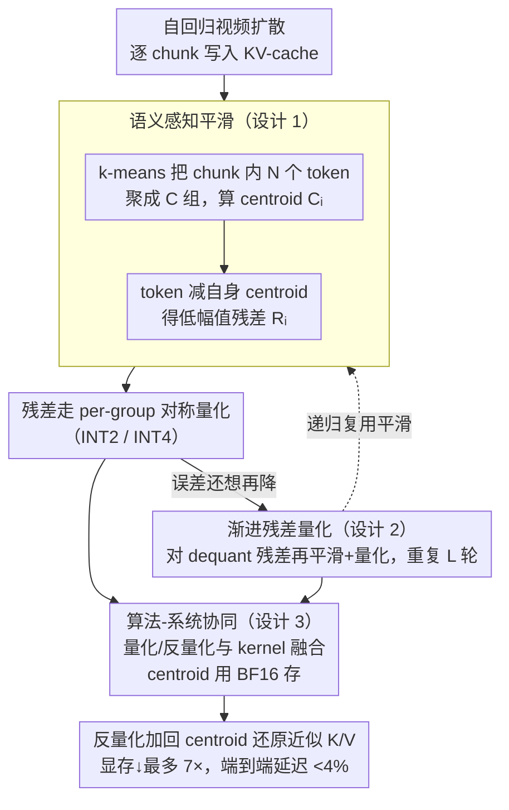

# Quant VideoGen: Auto-Regressive Long Video Generation via 2-Bit KV-Cache Quantization

**会议**: ICML 2026  
**arXiv**: [2602.02958](https://arxiv.org/abs/2602.02958)  
**代码**: 有（论文标注 Website + GitHub）  
**领域**: 视频生成 / KV-Cache 量化 / 模型压缩  
**关键词**: Autoregressive Video Diffusion, KV-Cache, 2-bit Quantization, 时空冗余, Residual Quantization

## 一句话总结
QVG 是面向自回归视频扩散的训练免微调 KV-Cache 量化框架——通过语义感知聚类做 token 平滑、并以渐进残差多阶段压缩残差，在 LongCat-Video/HY-WorldPlay/Self-Forcing 上把 KV 显存压低到原来的 1/7，端到端延迟开销 <4%，2 bit 下质量大幅领先 KIVI/QuaRot 等 LLM 量化基线。

## 研究背景与动机

**领域现状**：视频扩散模型正从"双向注意力 + 短片段去噪"转向**自回归 + 因果注意 + KV-cache** 的 chunk-by-chunk 生成范式（CausVid、Self-Forcing、HY-WorldPlay 等），目的是支持长时程、流式、可交互的视频生成。自回归带来的关键依赖是 KV-cache：早帧的 K/V 必须常驻显存避免重算。

**现有痛点**：KV-cache 显存几乎线性随帧数增长，迅速吃满 GPU。例如 LongCat-Video 生成 5 秒 480p 视频需要约 38K latent token、对应 34 GB KV-cache，已超单卡 RTX 5090；HY-WorldPlay-8B 在 4090 上跑不起来。更糟的是，**短上下文不仅是效率瓶颈也是能力瓶颈**——KV 长度直接决定 identity / layout / motion 的长时程一致性，业界一线长视频系统也只能撑到约 60 秒。

**核心矛盾**：LLM 那一套 KV 量化（KIVI / KVQuant / QuaRot / RotateKV）面对视频时**直接崩**：视频 KV 在 token 维和 channel 维都呈现高度异质数值分布——max|K|~$10^2$、max|V|~$10^3$，并且 outlier channel 因 token 而异；按对称 per-group 量化 $X_\text{INT}=\lfloor X/S\rceil$，scale $S=\max(|X|)/(2^{b-1}-1)$ 直接吃下整个 token 的最大值，量化误差 $\mathbb E[|x-\hat x|]\propto S$ 被推爆。

**本文目标**：(i) 把 KV-cache 量化的能耗从 LLM 那套"通用平滑"升级到能消化视频的异质分布；(ii) 在 2-bit 这种极端低 bit 下仍保持视频质量；(iii) 不需要训练或微调。

**切入角度**：作者注意到视频 KV 有**强时空冗余**——相邻帧同空间 patch、相邻 patch 同帧，潜在 token 余弦相似度都很高；而且视频内容天然支持**渐进编码**（粗到细），就像 SVC 流式编码那样。这两条性质刚好对应两个机会：相似 token 可以共享一个 centroid（量化前减去就把异质分布拉平），残差还可以多阶段进一步细化。

**核心 idea**：用 **k-means 聚相似 token 减去 centroid** 得到低幅值、量化友好的残差（Semantic-Aware Smoothing），再用**渐进残差量化**（Progressive Residual Quantization）从粗到细多阶段压缩，把 LLM-style outlier 处理范式替换为视频-style 冗余利用范式。

## 方法详解

### 整体框架
QVG 训练免微调地接入任何自回归视频扩散模型的 KV-cache 写入路径：chunk-by-chunk 处理 KV，每个 chunk 做（1）k-means 聚类把 $N$ 个 token 分成 $C$ 组，每组算 centroid $C_i$；（2）token 减去自己所属 centroid 得到残差 $R_i$；（3）残差走标准 per-group 对称量化（INT2 或 INT4）；（4）想进一步降误差就把"残差再 smoothing + 再量化"递归做几轮（Pro 版）。dequant 时把 $S_X\cdot X_{\text{INT}}+C_i$ 加回去得到近似的 K/V。所有 centroid 用 BF16 保存（很小），算法与系统在 GPU 上联合优化以保持 <4% 延迟。

### 关键设计

**1. Semantic-Aware Smoothing（语义感知平滑）：先聚类减 centroid，把大幅值分布拉平**

LLM 那套 KV 量化（KIVI 的 per-token、QuaRot 的旋转）假设"channel outlier 在所有 token 上一致"，可视频里这假设直接不成立——视频 token 对应不同空间区域和运动模式，outlier 因 token 而漂，按对称 per-group 量化时 scale $S$ 被整个 token 的最大值吃掉、误差被推爆。QVG 利用视频 KV 的强时空冗余来破这个局：对一个 chunk 的 $N=HWT_c$ 个 token 跑 k-means 分成 $C$ 组、每组算 centroid $C_i\in\mathbb R^d$，token 减去自己所属 centroid 得残差 $\mathbf R_i=\mathbf X_{\mathcal G_i}-C_i$，再让残差进对称 per-group 量化。同组 token 隐表征接近，那些"恰好都是 outlier 的 channel"被 centroid 一并吃掉，残差里的最大值大幅缩小——这种按内容聚类后的局部均匀化，比强行用固定旋转去均化全局分布更贴合数据本质，实测 Key cache 量化误差降约 6.9×、Value 降约 2.6×。

**2. Progressive Residual Quantization（渐进残差量化）：粗到细多阶段把误差摊薄**

单次量化的 rounding 误差有 $S_X/2$ 的硬下界，到 2-bit 这种极端低 bit 就卷不动了。QVG 借视频"粗结构 + 高频残差"的天然层级，把残差再做多阶段细化：第一轮把原 KV 平滑量化得 $\hat X_1$，对 dequant 残差 $\Delta_1=X-\hat X_1$ 再做一次 Semantic-Aware Smoothing 加量化得 $\hat\Delta_1$，重复 $L$ 轮，最终 $\hat X=\hat X_1+\hat\Delta_1+\cdots+\hat\Delta_{L-1}$。每多一阶段就把误差按几何序列衰减一次，活像 SVC 的多分辨率编码，阶段数 $L$ 正好成了"质量 vs 压缩率"的旋钮——QVG-Pro（多阶段）在 INT2 下做到 PSNR 30.4，单阶段的 QVG 也有 28.7，都远超基线。

**3. 算法-系统协同实现：把平滑和残差落到 GPU 上、延迟控在 4% 以内**

KV 量化方案一旦让推理变慢就失去意义。QVG 在工程上把上面两步嵌进自回归推理的 KV 写入路径：k-means 在 chunk 粒度做、centroid 用 BF16 存（很小），量化/反量化与 attention kernel 融合，2-bit 用 packed INT 表示，dequant 时把 $S_X\cdot X_{\text{INT}}+C_i$ 加回得到近似 K/V。保留 chunk 内并行性、最小化 dequant 开销，端到端延迟开销才压到 <4%，这也是它能真正跑在 RTX 4090 / 5090 这类消费级 GPU 上的关键。

### 损失函数 / 训练策略
完全 training-free，没有梯度更新；超参数仅有：聚类数 $C$、残差阶段数 $L$、量化 bit 数 $b$。

## 实验关键数据

### 主实验
在 LongCat-Video-13B、HY-WorldPlay-8B、Self-Forcing 上以 BF16 全精度为参考，对比 RTN/KIVI/QuaRot。

| 模型 | 设置 | 方法 | 压缩率 | PSNR | SSIM | LPIPS |
|---|---|---|---|---|---|---|
| LongCat-Video | INT2 480p | RTN | 6.40× | 20.87 | 0.719 | 0.203 |
| LongCat-Video | INT2 480p | KIVI | 6.40× | 20.32 | 0.719 | 0.208 |
| LongCat-Video | INT2 480p | QuaRot | 6.40× | 21.57 | 0.759 | 0.171 |
| LongCat-Video | INT2 480p | **QVG-Pro** | 4.97× | **30.38** | **0.935** | **0.048** |
| LongCat-Video | INT2 480p | **QVG** | 6.94× | **28.72** | **0.909** | **0.065** |
| LongCat-Video | INT4 480p | QuaRot | 3.55× | 33.74 | 0.960 | 0.033 |
| LongCat-Video | INT4 480p | **QVG-Pro** | 3.05× | **37.10** | **0.977** | **0.024** |
| HY-WorldPlay | INT2 480p | QuaRot | 6.40× | 25.21 | 0.738 | 0.205 |
| HY-WorldPlay | INT2 480p | **QVG-Pro** | < 6.40× | 29+ | 高 | 低 |

INT2 这种极端 bit 下，LLM 基线全部 PSNR ≤ 25，而 QVG 直接干到 28–30；INT4 下 QVG-Pro 还能超过 BF16 在部分指标上的近无损表现（>37 PSNR）。

### 消融实验

| 配置 | 解释 | 效果 |
|---|---|---|
| Full QVG-Pro | k-means smoothing + 多阶段残差 | 最优 |
| 只 Semantic-Aware Smoothing | 单阶段，单次减 centroid | 中等增益 |
| 只 Progressive Residual | 不聚类、直接残差递归 | 不能解决 channel outlier，2-bit 崩 |
| 朴素 per-group 量化（RTN） | 既无 smoothing 也无 residual | 2-bit 崩 |

Key/Value cache 量化误差分别降 ~6.9× / ~2.6×。

### 关键发现
- **2-bit 下视频 KV 量化第一次真正可用**：以前最好的 LLM 量化在 INT2 视频上 PSNR 20-25，QVG 提到 28-30。
- **HY-WorldPlay-8B 首次单卡 RTX 4090 跑起来**：之前因 KV 显存超额根本部署不了。
- **Self-Forcing 在固定显存下用更长上下文**：质量反而超过原 BF16 默认 KV 预算，从"量化省显存"变成"量化换更长 context 进而换更好质量"。

## 亮点与洞察
- **把"视频 KV 的特殊性"具体地诊断到 token-channel 维度**：作者没有满足于"LLM 量化效果差"的笼统结论，而是把 max|K|~$10^2$、max|V|~$10^3$、outlier 因 token 而漂 这些量化的"病根"都点出来，再针对性设计 smoothing —— 这种"先量化诊断再对症下药"的研究范式非常可复用。
- **k-means + centroid 减法 = 数据驱动的局部 outlier 吸收**：相比 QuaRot 用固定 Hadamard 旋转去均化全局分布，按内容聚类后做局部均化天然契合视频的空间-时间冗余，是从"通用方法"到"领域感知方法"的漂亮跃迁。
- **"显存压缩 → 上下文加长 → 质量提升"的飞轮**：量化在 LLM 圈通常只看"压缩-精度 Pareto"，QVG 揭示在视频生成里量化能解锁更长 KV，从而让长时程一致性这种**能力指标**也涨——这是给 long video research 注入显存维度新自由度的关键洞察。

## 局限与展望
- k-means 聚类对 chunk 内 token 数敏感、簇数 $C$ 是手调超参；自适应聚类策略待探索。
- 多阶段残差 $L$ 增大会牺牲压缩率，"quality-memory" Pareto 曲线如何动态选阶段仍需经验调参。
- 论文聚焦 480p 与 chunk-level autoregressive 模型，对像素级 autoregressive 视频生成（如 token-by-token）尚未验证。
- 评估主要用 PSNR/SSIM/LPIPS 等 reference-based 指标，对"生成多样性"的影响讨论不深。

## 相关工作与启发
- **vs KIVI / KVQuant**：对 LLM 有效，但视频上 token-channel 异质性让 outlier 处理失效；QVG 用聚类把异质性"局部化"再消解。
- **vs QuaRot / RotateKV**：旋转变换平滑全局分布，无法应对 token-相关 outlier 漂移；QVG 用数据驱动 centroid 替代固定旋转。
- **vs Vector Quantization（PQCache、CommVQ）**：用 codebook 表示 token；QVG 走"减 centroid + 量化残差"路线，centroid 只是 anchor 而非完整码本，更轻量且无需训练。
- **vs StreamingT2V / WorldMem / FramePack**：从算法侧设计 memory 机制，QVG 从系统侧扩容现有 KV 预算，互补可叠加。

## 评分
- 新颖性: ⭐⭐⭐⭐ 第一次把"语义聚类减 centroid"用于视频 KV 平滑、再叠加渐进残差，组合上有清晰原创性。
- 实验充分度: ⭐⭐⭐⭐⭐ 三个 SOTA 自回归视频模型、INT2/INT4 多 bit、多基线对比、消费级 GPU 部署验证、量化误差与质量曲线齐全。
- 写作质量: ⭐⭐⭐⭐⭐ 从"系统-算法耦合的 KV 瓶颈"切入，问题诊断→机会发现→方法设计→实验验证一条线非常顺畅。
- 价值: ⭐⭐⭐⭐⭐ 解锁长视频生成 + 消费级 GPU 部署 + 上下文扩张三个直接价值，工程影响立竿见影。

<!-- RELATED:START -->

## 相关论文

- [\[ICML 2026\] Quantized Keys Steal Attention: Bias Correction for KV-Cache Compression in Video Generation](quantized_keys_steal_attention_bias_correction_for_kv-cache_compression_in_video.md)
- [\[ICML 2026\] LocoT2V-Bench: Benchmarking Long-form and Complex Text-to-Video Generation](locot2v-bench_benchmarking_long-form_and_complex_text-to-video_generation.md)
- [\[ICML 2026\] Enhancing Train-Free Infinite-Frame Generation for Consistent Long Videos](enhancing_train-free_infinite-frame_generation_for_consistent_long_videos.md)
- [\[ICLR 2026\] QuantSparse: Comprehensively Compressing Video Diffusion Transformer with Model Quantization and Attention Sparsification](../../ICLR2026/video_generation/quantsparse_comprehensively_compressing_video_diffusion_transformer_with_model_q.md)
- [\[ICML 2026\] Explainable Forensics of Manipulated Segments in Untrimmed Long Videos](explainable_forensics_of_manipulated_segments_in_untrimmed_long_videos.md)

<!-- RELATED:END -->
