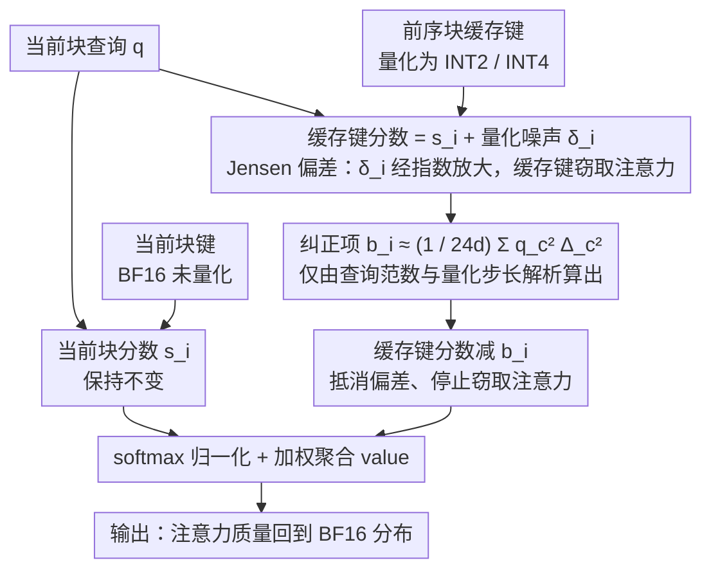

# Quantized Keys Steal Attention: Bias Correction for KV-Cache Compression in Video Generation

**会议**: ICML 2026  
**arXiv**: [2605.26266](https://arxiv.org/abs/2605.26266)  
**代码**: 待确认  
**领域**: 视频生成 / 模型压缩  
**关键词**: KV 缓存量化, 注意力偏差, 扩散模型, Jensen 不等式

## 一句话总结
本文发现分块自回归视频扩散模型中 KV 缓存量化导致**注意力权重发生系统性偏移**（"量化键窃取注意力"），通过推导出基于 Jensen 不等式的逐分数纠正项，在 INT2 激进量化下恢复接近 BF16 的视频质量（VBench 78.02 vs 78.27），节省 50% 内存。

## 研究背景与动机

**领域现状**：分块自回归视频扩散模型（如 MAGI-1、SkyReels-V2）通过为先前生成的视频块维护 KV 缓存来避免冗余计算。为节省内存，业界采用量化技术把缓存键值压缩到低比特宽度（INT2、INT4）。

**现有痛点**：激进的 KV 缓存量化（特别是 INT2）会严重降低视频质量，导致主体和场景结构破坏。现有量化方法（QuaRot、RTN 等）关注如何减少量化噪声本身，但无法完全解决由量化引入的更深层问题。

**核心矛盾**：整数量化在注意力分数层面引入**零均值噪声**，按理不应改变注意力的期望行为。但 softmax 中的指数函数具有**凸性**，这打破了对称性——正偏差被放大的幅度大于负偏差被抑制的幅度，导致量化后缓存键对 partition sum 的贡献被系统性高估。

**本文目标**：
- 识别并量化这种系统性偏差（Jensen 偏差）对注意力权重分配的影响。
- 推导理论上合理的纠正项，在不需要重训练的前提下恢复原始注意力分布。
- 实现极低开销的纠正方案。

**切入角度**：从概率论中的 Jensen 不等式出发——在 softmax 中 $\mathbb{E}[e^{s_i + \delta_i}] = e^{s_i} \cdot \mathbb{E}[e^{\delta_i}] > e^{s_i}$（当 $\delta_i$ 是零均值量化噪声时），这导致缓存键的贡献被系统性膨胀。

**核心 idea**：通过从缓存注意力分数中减去纠正项 $b_i = \log \mathbb{E}[e^{\delta_i}]$ 来抵消 Jensen 偏差，使纠正后的期望分数贡献与未量化情况一致。

## 方法详解

### 整体框架
在分块自回归视频扩散里，当前块的查询要同时关注两组键：当前块的高精度 BF16 键，以及前序块那份被压成低比特的量化缓存键。标准 softmax 会分别给两组键算 partition sum 再归一化。本文发现量化让缓存键侧的 partition sum 被系统性夸大，于是缓存键"偷走"了本该分给当前块的注意力质量。整套方法的逻辑是一条链：先从 Jensen 不等式说清这个偏差为什么必然发生，再解析推导出一个逐令牌的纠正项 $b_i$，在 softmax 之前从缓存键分数里减掉，最后证明它几乎不增加推理开销——全程不需要重训练。

### 关键设计

**1. Jensen 偏差的理论推导：零均值噪声为何还能系统性跑偏**

直觉上，整数量化在注意力分数上引入的是零均值噪声，期望上不该改变注意力行为。但 softmax 里的指数函数是凸的，对称性就被打破了。设缓存键 $i$ 的量化分数为 $\hat{s}_i = s_i + \delta_i$，其中 $\delta_i = \frac{q^\top \epsilon_i}{\sqrt{d}}$ 是量化噪声的投影、$\epsilon_i \sim \mathcal{U}(-\Delta_i/2, +\Delta_i/2)$。缓存侧 partition sum 的期望是 $\mathbb{E}[\hat{Z}_\mathcal{S}] = \sum_{i \in \mathcal{S}} e^{s_i} \cdot \mathbb{E}[e^{\delta_i}]$，而由 Jensen 不等式 $\mathbb{E}[e^{\delta_i}] \geq e^{\mathbb{E}[\delta_i]} = 1$，于是 $\mathbb{E}[\hat{Z}_\mathcal{S}] \geq Z_\mathcal{S}$。正偏差被指数放大的幅度大于负偏差被压低的幅度，这道不等号的缝隙就是 Jensen 偏差——缓存键由此窃取注意力。看清这点后，思路就从"努力减小量化噪声"转向"直接纠正噪声造成的后果"。

**2. 逐分数纠正项推导：要求纠正后的期望贡献回到原值**

既然知道缓存键的贡献被膨胀了 $\mathbb{E}[e^{\delta_i}]$ 倍，就给每个缓存令牌减一个 $b_i$ 把它抵消。约束条件直白：$e^{s_i - b_i} \cdot \mathbb{E}[e^{\delta_i}] = e^{s_i}$，解得 $b_i = \log \mathbb{E}[e^{\delta_i}]$。因为量化噪声在各通道独立，这个期望可按通道分解，对均匀量化噪声有精确形式 $b_i = \sum_{c=1}^d \log\left(\frac{\sinh(q_c \Delta_{i, c} / (2 \sqrt{d}))}{q_c \Delta_{i, c} / (2 \sqrt{d})}\right)$。实践中再用二阶 Taylor 展开 $\log(\sinh(\alpha)/\alpha) \approx \alpha^2/6$，化简成一个干净的近似 $b_i \approx \frac{1}{24 d} \sum_{c=1}^d q_c^2 \Delta_{i, c}^2$。它只依赖查询和量化步长，理论上从无偏性出发、实践中又足够简洁，还能推广到 FP、MXFP 等其它量化格式。

**3. 推理时应用 + 复杂度控制：让纠正几乎白送**

纠正项 $b_i$ 只用到已经存在的量化参数（步长 $\Delta_{i, c}$）和查询范数 $\|q\|$，不需要额外存任何东西。对分组量化（组大小 $g = 32$），它带来的额外计算是 $O(QK \cdot d / g)$，相对标准 $QK^\top$ 的 $O(QK \cdot d)$ 只多了 $1/g$。落到 FlexAttention 实现上，端到端延迟仅增加约 5%。正是这个"几乎免费"让它从一个理论结论变成可直接挂在任何量化方案后面的即插即用纠正。

### 训练策略
本方法是**无需训练的推理阶段纠正**：原模型参数和训练目标都不变，只在 softmax 前对缓存键分数做一次校准。

## 实验关键数据

### 主实验

| 模型 | 量化方案 | 精度 | PSNR ↑ | SSIM ↑ | LPIPS ↓ | VBench ↑ | 说明 |
|------|--------|------|--------|--------|---------|---------|------|
| MAGI-1 | 无 | BF16 | — | — | — | 78.27 | 基准 |
| MAGI-1 | QuaRot+RTN | INT2 ✗ | 17.10 | 0.630 | 0.453 | 70.24 | 无纠正 |
| MAGI-1 | QuaRot+RTN | INT2 ✓ | 22.97 | 0.801 | 0.165 | **78.02** | 有纠正 |
| MAGI-1 | QVG+纠正 | INT2 | 25.29 | 0.856 | 0.107 | 78.23 | 组合最优 |
| SkyReels-V2 | QuaRot+RTN | INT2 ✗ | 19.20 | 0.708 | 0.319 | 71.44 | 无纠正 |
| SkyReels-V2 | QuaRot+RTN | INT2 ✓ | 20.42 | 0.784 | 0.202 | **78.58** | 有纠正 |

纠正后 INT2 几乎完全恢复 BF16 质量；纠正与 QVG 等上游压缩方法正交可组合；相同质量下内存节省 50%。

### 消融实验

| 配置 | 注意力质量偏移 $\Delta P_\mathcal{S}$ | 中位数 | 说明 |
|------|-------------------------------|------|------|
| BF16 基准 | — | 0 | 无偏移 |
| INT2 无纠正 | 显著正偏移 | +0.15 | 缓存键窃取注意力 |
| INT2 有纠正 | 校正后接近 0 | ~0 | 偏差被抵消 |

### 关键发现
- 注意力质量偏移直接对应视频质量降解程度。
- 纠正在所有组大小下都能提升 PSNR，保留内存-质量权衡曲线但向高质量平移。
- 激进量化下表现最佳（INT2 优于 INT4）。
- 跨域适用性：初步 LLM 实验表明同一偏差机制出现在分块 prefill 场景。

## 亮点与洞察
- **理论简洁性**：把复杂的量化问题归结为单一根因（Jensen 偏差），纠正公式仅需查询范数和步长，无需复杂统计或重训练——漂亮的信息论视角。
- **跨域适用性**：虽然论文重点在视频扩散，但同一偏差机制也存在于 LLM 分块 prefill，说明发现具有普遍性。
- **即插即用性**：方法正交于上游任何量化方案（QuaRot、RTN、QVG 等），可无缝组合，工程上极具价值。

## 局限与展望
- 噪声模型假设：推导基于整数量化的均匀零均值噪声，对非均匀或有偏噪声可能失效；FP、MXFP 等浮点格式需要重新推导。
- 期望层面有效性：纠正在期望意义上无偏，但当注意力高度集中在少数缓存令牌时，单次采样的噪声可能主导效果，此时纠正收益降低。
- 单令牌解码局限：方法在多令牌当前块场景表现最优；标准 LLM 单令牌解码中一个查询对多个缓存令牌，缓存令牌间竞争较弱，纠正空间有限。

## 相关工作与启发
- **vs KIVI / KVQuant / QuaRot / QuantVideoGen**：这些方法在量化阶段通过重新分配步长或旋转减少噪声；本文互补地在解码阶段通过 bias 纠正移除残差偏差，两者可组合。
- **vs KVLinC**：KVLinC 使用训练的线性适配器纠正量化误差；本文纠正是解析推导且无需训练，泛化能力更强。
- **vs 扩散模型量化通用研究**：以往关注 softmax 计算本身的量化；本文独特地指出 KV 缓存量化通过 softmax 凸性引入的结构性偏差。

## 评分
- 新颖性: ⭐⭐⭐⭐⭐  从 Jensen 不等式角度揭示 KV 量化的根本问题，理论视角完全新颖。
- 实验充分度: ⭐⭐⭐⭐⭐  三个视频模型 × 两种量化方案 + 详细消融（注意力偏移、存储-质量权衡、跨域 LLM）。
- 写作质量: ⭐⭐⭐⭐⭐  逻辑链条清晰，从现象 → 根因 → 解决方案 → 验证环环相扣。
- 价值: ⭐⭐⭐⭐⭐  即插即用方案，工业级可用性强；对所有使用 KV 缓存量化的模型都有直接帮助。

<!-- RELATED:START -->

## 相关论文

- [\[ICML 2026\] Quant VideoGen: Auto-Regressive Long Video Generation via 2-Bit KV-Cache Quantization](quant_videogen_auto-regressive_long_video_generation_via_2-bit_kv-cache_quantiza.md)
- [\[CVPR 2026\] Accelerating Autoregressive Video Diffusion via History-Guided Cache and Residual Correction](../../CVPR2026/video_generation/accelerating_autoregressive_video_diffusion_via_history-guided_cache_and_residua.md)
- [\[CVPR 2026\] When to Lock Attention: Training-Free KV Control in Video Diffusion](../../CVPR2026/video_generation/when_to_lock_attention_training-free_kv_control_in_video_diffusion.md)
- [\[ICML 2026\] DFSAttn: Dynamic Fine-Grained Sparse Attention for Efficient Video Generation](dfsattn_dynamic_fine-grained_sparse_attention_for_efficient_video_generation.md)
- [\[ICML 2026\] Attention Sparsity is Input-Stable: Training-Free Sparse Attention for Video Generation via Offline Sparsity Profiling and Online QK Co-Clustering](attention_sparsity_is_input-stable_training-free_sparse_attention_for_video_gene.md)

<!-- RELATED:END -->
