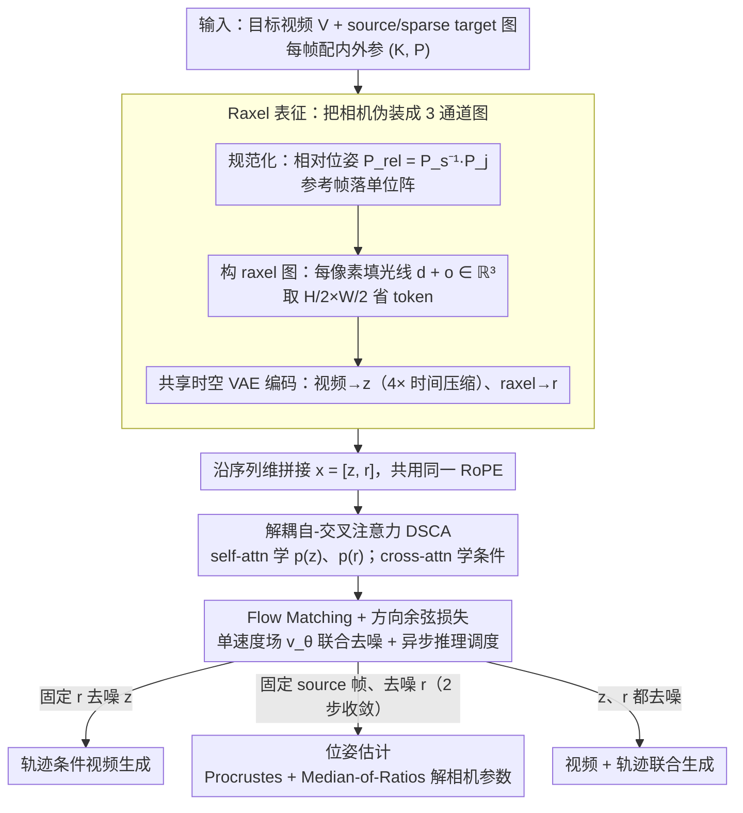

# Rays as Pixels: Learning A Joint Distribution of Videos and Camera Trajectories

**会议**: ICML 2026  
**arXiv**: [2604.09429](https://arxiv.org/abs/2604.09429)  
**代码**: https://wbjang.github.io/raysaspixels/ (项目主页)  
**领域**: 视频生成
**关键词**: 视频扩散, 相机位姿, 联合分布, raxel, 解耦自-交叉注意力

## 一句话总结
把每个相机的 per-pixel 光线"原点+方向"打包成一张与 RGB 同形状的 3 通道 raxel 图，让预训练视频 VAE 直接当相机编码器，再用 Decoupled Self-Cross Attention 把 raxel 和视频帧塞进同一个 Flow Matching DiT 联合去噪，从而第一次用一组权重同时支持位姿估计、相机可控视频生成与"视频+轨迹"联合生成三件事。

## 研究背景与动机
**领域现状**：3D 视觉里"从图像恢复相机参数"（SfM/COLMAP、DUSt3R、VGGT）和"按相机参数渲染新视图"（NeRF、3DGS、相机可控视频扩散 MotionCtrl/VD3D/Wonderland）一直是两条独立流水线——前者是逆问题，后者是正问题，互为对偶但分别训练分别评测。

**现有痛点**：相机可控视频扩散模型把位姿当成"已知输入"，靠外部估计器（COLMAP、DUSt3R）喂位姿；而正是输入稀疏、视角模糊的场景下这些上游估计器最容易崩，导致下游生成模型继承了上游的脆弱。反过来纯估计器（VGGT）只输出几何，不会在遮挡区域"想象"出合理像素。已有的少数联合工作（如 Matrix3D）也要套一层 3DGS 后处理，渲染不是端到端从扩散模型出来的。

**核心矛盾**：预训练视频扩散模型在密集 spatial tensor 上工作（H×W×3 的 RGB latent），而相机参数是低维全局矩阵（K, R, T 一共十几个数）。两者结构对不上，已有工作要么走 adapter 把矩阵投影成 token（结构残疾），要么用 Plücker 嵌入（6 通道，VAE 编码不了，只能 MLP+拼接，绕过预训练先验）。换句话说，相机始终是个"外挂条件"，没机会真正进入视频模型的生成回路。

**本文目标**：让单个预训练视频 DiT 学到视频帧 $z$ 与相机轨迹 $r$ 的**联合分布** $p(z, r)$，从而同一组权重即可采样 $p(r|z)$（位姿估计）、$p(z|r)$（轨迹条件生成）和 $p(z, r)$（联合生成），并能闭环 cycle self-consistency。

**切入角度**：既然视频 VAE 已经把"3 通道密集图"压得很好，那就把相机也"伪装"成一张 3 通道密集图——每个像素填的不是 RGB，而是该像素对应光线在规范坐标系下的 $\mathbf{d} + \mathbf{o}$ 向量和。这样同一个 VAE、同一个 DiT、同一套 RoPE，零结构改动就能编码相机。

**核心 idea**：用"光线即像素"（rays as pixels, raxel）把相机表示成与视频帧同构的 3 通道 latent，再用解耦自-交叉注意力联合去噪视频与光线 latent，把相机当成与视频对偶的"另一种模态"而非外部条件。

## 方法详解

### 整体框架
训练时输入三类帧：长度 $N$ 的目标视频 $V$、$N_s$ 张 source 图（干净，作条件）、$N_t$ 张稀疏 target 图（带噪，被监督），三者之和固定。每一帧 $I_j$ 配一对内外参 $(K_j, P_j)$。

1. **规范化**：随机挑一张 source 帧 $s$ 当原点，把所有外参变成相对位姿 $P_{\text{rel}}^{(j)} = P_s^{-1} P_j$，让 $s$ 落到单位矩阵——这样模型学到的是相对几何，不会去记数据集的绝对世界坐标。
2. **构 raxel 图**：对每个像素 $\mathbf{u}$，把它按 $K_j^{-1}$ 反投影成相机系单位方向，再用 $R_{\text{rel}}^{(j)}$ 转到规范世界系得到 $\mathbf{d}$；原点 $\mathbf{o} = T_{\text{rel}}^{(j)}$。每个 raxel 像素填 $\mathbf{d} + \mathbf{o} \in \mathbb{R}^3$，整张图记作 $R_j \in \mathbb{R}^{H_r \times W_r \times 3}$（取 $H/2 \times W/2$ 省 token）。
3. **共享 VAE 编码**：视频帧用同一个时空 VAE $\mathcal{E}$ 做 4× 时间压缩得 $z_v$，raxel 图不压时间得 $r_v, r_s, r_t$，与视频 latent 空间对齐。
4. **联合去噪**：把 $x = [z, r]$ 沿 sequence 维拼接，Flow Matching 直线插值 $x_t = (1-t)x_0 + t x_1$ 训练单个速度场 $v_\theta$，DiT 每一层用 Decoupled Self-Cross Attention（DSCA）替换原 self-attention。
5. **推理三模式**（asymmetric schedule）：固定 $z = z_s$ 噪声化 $r$ → 位姿估计；固定 $r$ 干净噪声化 $z$ → 轨迹条件生成；两者都噪声化 → 联合生成。

骨干用 Wan 2.1 14B T2V，额外加一条 ray 分支（独立 LN、FFN、linear，6B 参数），总 20B，所有参数微调。

### 关键设计

**1. Raxel 表征：把相机伪装成一张 3 通道图像**

预训练视频 VAE 擅长压"3 通道密集图"，可相机参数是低维全局矩阵（K、R、T 一共十几个数），结构对不上——已有工作要么用 adapter 把矩阵投成 token（结构残疾），要么用 6 通道 Plücker 嵌入（VAE 编码不了，只能 MLP 拼接、绕过预训练先验），相机始终是个外挂条件。Raxel 的破法是把相机也做成一张和视频帧同形状的 3 通道图：每个像素填的不是 RGB，而是该像素对应光线的方向加原点 $\mathbf{d} + \mathbf{o}$，其中 $\mathbf{d} = R_{\text{rel}} K^{-1}\tilde{\mathbf{u}} / \|K^{-1}\tilde{\mathbf{u}}\|_2$ 是世界系单位光线方向、$\mathbf{o} = T_{\text{rel}}$ 是相机原点。和 Plücker（6 通道）、raymap（6 通道）、pointmap（需 depth）相比，raxel 是唯一同时满足"空间对齐 + 3 通道兼容预训练 VAE + 不需要 depth"的方案，于是同一个 VAE、同一个 DiT、同一套 RoPE 零结构改动就能编码相机。位姿恢复时再用 Orthogonal Procrustes 在解码出的 $\hat{R}_k$ 与参考 $\hat{R}_s$ 间拟合 $SE(3)$、焦距用 Median-of-Ratios $\hat{f}_x = \text{median}(u \cdot \hat{z} / \hat{x})$ 鲁棒估计。消融最能说明它的分量：把 raxel 换成 Plücker 嵌入后 FID 从 7.33 暴增到 21.97、FVD 从 68 涨到 333——"共享 latent 空间"比"input-level 6 通道嵌入"高出整整一个量级。

**2. Decoupled Self-Cross Attention（DSCA）：用注意力结构对应概率分解**

如果让视频 latent $z$ 和光线 latent $r$ 在一段拼接序列上做单一全局 self-attention，模型会各拟合各的、跨模态耦合不深。DSCA 把每个 DiT block 内的注意力拆成两步：先对 $z$、$r$ 各做 self-attention，保住视频内部的时间平滑和轨迹自身的几何相干；再做对称 cross-attention，$z \leftarrow r$ 让视频跟随光线、$r \leftarrow z$ 让光线被视觉细化。由于 $z$ 和 $r$ 空间逐位对齐，cross-attn 的 query/key 都套 RoPE，强制"视觉 token 必须关注到对应位置的 raxel token"。这套拆法背后是一行干净的概率分解 $\log p(z, r) = \log p(r) + \log p(z|r) \equiv \log p(z) + \log p(r|z)$——self-attn 学 marginal、cross-attn 学 conditional，把概率图模型的直觉直接落到 transformer 算子上。效果上，cycle consistency 的 FID 从 8.69 降到 7.33、$R_{\text{err}}$ 从 0.048 降到 0.020。

**3. Flow Matching + 方向余弦损失 + 异步推理调度：让一个速度场同时学好两种 latent**

光线 latent 平滑、低频、低秩，视频 latent 高频、信息密集，共享一个速度场 $v_\theta(x_t, t)$ 时，单纯 MSE 容易被视频的幅值主导、把光线的方向漂移淹没。于是在 MSE 之外加一项方向余弦惩罚 $\mathcal{L}(\theta) = \mathbb{E}[\|v_\theta - u_t\|^2 + \lambda (1 - v_\theta^\top u_t / (\|v_\theta\|\|u_t\|))]$（$\lambda = 0.5$），单独盯方向偏差——去掉这项，$R_{\text{err}}$ 从 0.020 涨到 0.058、$T_{\text{err}}$ 翻五倍到 0.094。又因为 $z$ 和 $r$ 占不同 token 位置，推理时可以异步调度：相机可控生成里把 $r$ 固定在 $t=1$ 只去噪 $z$；位姿估计里固定 source 图 latent 只去噪 $r$，而光线 latent 的低频结构让它收敛极快，**2 步**就拿到最佳旋转精度，省掉绝大部分推理算力。

### 损失函数 / 训练策略
- Flow Matching MSE + 余弦方向项，$\lambda = 0.5$。
- 训练集 Re10K + DL3DV，分别用 ORB-SLAM、COLMAP 标的位姿，对齐到统一公制尺度。
- 480×832 分辨率中心裁切，保留原始宽高比。
- Time-reversal augmentation：每条轨迹连同其反向都作为训练样本，鼓励场景-轨迹解耦。
- source/target 帧数比例固定，让模型学会任意时刻的"源帧位置"（首/中/末均可）。

## 实验关键数据

### 主实验：相机可控视频生成（Table 4）

| 数据集 | 方法 | FID ↓ | FVD ↓ | $R_{\text{err}}$ ↓ | $T_{\text{err}}$ ↓ |
|--------|------|-------|-------|------|------|
| Re10K | MotionCtrl | 22.58 | 229.34 | 0.231 | 0.794 |
| Re10K | Wonderland | 16.16 | 153.48 | 0.046 | 0.093 |
| Re10K | Kaleido | 18.04 | 103.03 | 0.049 | 0.181 |
| Re10K | **Ours** | **15.76** | **98.72** | 0.056 | 0.115 |
| DL3DV-140 | Wonderland | 17.74 | 169.34 | 0.061 | 0.130 |
| DL3DV-140 | Kaleido | 41.18 | 458.60 | 0.011 | 0.026 |
| DL3DV-140 | **Ours** | **9.73** | **102.52** | 0.098 | 0.192 |
| T&T | Wonderland | 19.46 | 189.32 | 0.094 | 0.172 |
| T&T | Kaleido | 14.84 | 245.09 | 0.016 | 0.086 |
| T&T | **Ours** | **13.02** | **187.03** | 0.105 | 0.192 |

三个 benchmark 上视觉质量 FID/FVD 全部最优，没有用任何显式 3D 表征或专门的 camera embedding。轨迹贴合度（$R_{\text{err}}$, $T_{\text{err}}$）略逊于 Kaleido，但 Kaleido 在 DL3DV-140 上 FID 暴涨到 41，说明它过拟合到位姿监督、牺牲了视觉质量。

### 消融实验：cycle self-consistency on DL3DV-140 (Table 2)

| 配置 | FID ↓ | FVD ↓ | $R_{\text{err}}$ ↓ | $T_{\text{err}}$ ↓ |
|------|-------|-------|------|------|
| Ours (full) | 7.33 | 68.17 | 0.020 | 0.018 |
| w/o DSCA | 8.69 | 77.08 | 0.048 | 0.052 |
| w/o Cosine Sim. Loss | 9.48 | 97.84 | 0.058 | 0.094 |
| Plücker Embedding | 21.97 | 333.56 | 0.241 | 0.430 |

cycle 流程：先从视频采轨迹 $r' \sim p(r|z)$，再用 $r'$ 重生成视频 $z' \sim p(z|r', I_s)$，要求 $r' \approx r$ 且 $z' \approx z$——这是只学条件分布的模型根本过不了的测试。

### 关键发现
- **raxel 是绝对主因**：换成 Plücker 嵌入后所有指标爆炸（FID×3、$R_{\text{err}}$×12），证明"共享 VAE latent 空间"远比"6 通道 input-level 嵌入"重要——预训练视频先验是被严重低估的资源。
- **光线收敛远快于视频**：位姿估计 mRRA@30 在 2 步达到峰值（Re10K 95.91 / DL3DV-140 88.37 / T&T 93.51），5 步、20 步反而下降。光线 latent 的低频结构让 Flow Matching 几乎一步到位，可以省掉绝大部分推理算力。
- **vs VGGT**：纯估计器 VGGT 在三个数据集旋转精度均高 2-5 个点（DL3DV-140 88.37 vs 91.86），但 VGGT 输出的是 3D pointmap，几何信息显式存在；本文以视频生成为主目标，相机精度作为副产品已经够用，换来的是单模型同时能生成视频。
- **DSCA 与余弦损失是有用 refinement 而非必需**：metric-scale 训练数据本身够干净时 DSCA 的提升相对温和（FID 8.69→7.33），但去掉余弦损失旋转误差几乎翻三倍，说明余弦项对学方向最关键。

## 亮点与洞察
- **"非视觉模态伪装成图像"是个可推广的模板**：作者明示这是个 general pattern——把相机/分割/depth 等非视觉模态重编码成与预训练视觉骨干 latent 空间兼容的张量。这意味着想给视频扩散模型加新模态时，与其设计 adapter，不如先问"能不能造一张同构的图"。
- **概率分解直接落到注意力结构**：$\log p(z, r) = \log p(r) + \log p(z|r)$ 这一行直接对应"self-attn 学边缘 + cross-attn 学条件"，把概率视角和 transformer 算子拼到一起，是把概率图模型直觉迁移到 DiT 设计的好例子。
- **cycle self-consistency 作为新基准**：只有学了联合分布的模型才能闭环回到自身，这是个"single-conditional 模型物理上不可能通过的测试"，未来 unified 3D 生成模型可以把它当作标准 sanity check。
- **异步推理调度**：同一个去噪器对不同模态用不同步数，这种"per-modality scheduler"思路对未来多模态扩散模型推理加速很有借鉴价值。

## 局限性 / 可改进方向
- 训练数据只有静态场景 + 平滑相机轨迹，对快速运动镜头和场景内动态物体（人、车）泛化未知，论文自己也承认。
- 4× 时间压缩让相邻帧落到共享 latent 位置，时间维度信息损失会限制高帧率或快速运动质量。
- 位姿精度仍落后 VGGT 2-5 个点，作为纯 SfM 替代品还不够；本质原因是视频 latent 不显式编码深度，几何只能通过监督隐式学到。
- 总参数 20B、训练于 14B Wan 2.1 之上，门槛较高；raxel + DSCA 这套思路在小模型上是否有同样收益值得验证。
- 评测翻译误差 $T_{\text{err}}$ 用的是 per-scene 归一化的变体模型，是否能恢复绝对公制尺度（依赖 metric-scale 训练数据）在新数据集上的鲁棒性没充分讨论。

## 相关工作与启发
- **vs Matrix3D**（最相近的联合工作）：Matrix3D 用多模态 DiT 联合建模 RGB+pose+depth，但最终渲染要套一层 3DGS 优化。本文从预训练视频 DiT 出发，最小化改动用 raxel 接管相机分支，并直接从扩散模型出视频帧——继承了大规模视频数据的时间先验，没有中间 3D 表征。
- **vs VD3D / MotionCtrl / Wonderland**（相机可控 VDM）：这些方法用 adapter 注入相机矩阵或 Plücker 嵌入，相机始终是"外部条件"。本文把相机变成"可被生成的模态"，因此能反向跑 $p(r|z)$。
- **vs Kaleido**（image-based GNVS）：Kaleido 把相机当 positional embedding 加到 image diffusion 上，DL3DV-140 上轨迹贴合最准但 FID/FVD 爆炸——侧面说明把相机塞进 image-only backbone 牺牲了视频时序一致性，本文用视频 backbone + raxel 在两边都站住脚。
- **vs Marigold / DepthCrafter**（fine-tune 生成模型做新任务）：它们用预训练 SD/VDM 学 depth，是 per-pixel 一一对应任务；本文学的相机轨迹是"全序列相对参考"，需要跨帧联合推理，难度更高，但同样验证了"预训练扩散模型作 prior"的范式。
- **可迁移启发**：raxel + DSCA 模式直接可以套到"音频→视频"（音频频谱伪装成图像）、"激光雷达→视频"（深度图直接当 3 通道）、"自车控制→驾驶视频"（动作向量栅格化）等多模态联合生成场景。

## 评分
- 新颖性: ⭐⭐⭐⭐⭐ 第一个把相机参数当成与视频帧对偶的可生成模态、用同一 VAE 同一 DiT 联合去噪的统一框架；raxel 表征清晰、可推广。
- 实验充分度: ⭐⭐⭐⭐ 三个 benchmark + 三类消融（表征 / 注意力 / 损失）+ cycle self-consistency 测试都覆盖到位，唯独缺动态场景与跨数据集泛化的验证。
- 写作质量: ⭐⭐⭐⭐⭐ 表 1 的四种相机表征对比一目了然，公式 5 用概率分解证明 DSCA 设计合理性，叙事从"对偶问题"切入，技术线条极清晰。
- 价值: ⭐⭐⭐⭐⭐ "用统一生成模型同时做正/逆问题"为 3D-aware video diffusion 立了新范式，cycle self-consistency 提供了未来 unified 模型的标准 sanity check，raxel 模板对多模态扩散具有方法论意义。

<!-- RELATED:START -->

## 相关论文

- [\[ICML 2026\] EPiC: Efficient Video Camera Control Learning with Precise Anchor-Video Guidance](epic_efficient_video_camera_control_learning_with_precise_anchor-video_guidance.md)
- [\[CVPR 2026\] SymphoMotion: Joint Control of Camera Motion and Object Dynamics for Coherent Video Generation](../../CVPR2026/video_generation/symphomotion_joint_control_of_camera_motion_and_object_dynamics_for_coherent_vid.md)
- [\[ICCV 2025\] Disentangled World Models: Learning to Transfer Semantic Knowledge from Distracting Videos for Reinforcement Learning](../../ICCV2025/video_generation/disentangled_world_models_learning_to_transfer_semantic_knowledge_from_distracti.md)
- [\[ICML 2026\] Explainable Forensics of Manipulated Segments in Untrimmed Long Videos](explainable_forensics_of_manipulated_segments_in_untrimmed_long_videos.md)
- [\[ICML 2026\] Enhancing Train-Free Infinite-Frame Generation for Consistent Long Videos](enhancing_train-free_infinite-frame_generation_for_consistent_long_videos.md)

<!-- RELATED:END -->
