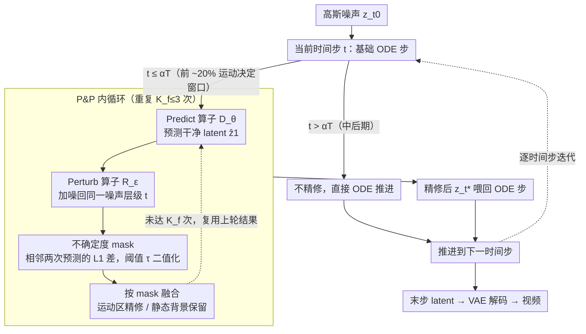

# Self-Refining Video Sampling

**会议**: ICML 2026  
**arXiv**: [2601.18577](https://arxiv.org/abs/2601.18577)  
**代码**: https://agwmon.github.io/self-refine-video/ (项目页)  
**领域**: 视频生成 / 扩散模型 / 推理时采样  
**关键词**: 视频扩散, Flow Matching, 自精炼采样, 去噪自编码器, 物理一致性

## 一句话总结
把预训练 flow matching 视频生成器自身当作"去噪自编码器"，在推理时同一噪声层级内用 Predict-and-Perturb 内循环反复纠偏 latent，再用模型自洽性算出的不确定度 mask 只精修动态区域，从而在不引入任何外部 verifier、不做任何额外训练的前提下显著改善视频的运动连贯性与物理合理性，人评偏好率超 70%。

## 研究背景与动机

**领域现状**：以 Wan2.1/2.2、Cosmos-Predict 为代表的现代视频生成器普遍基于 flow matching，在 VAE latent 空间用学到的向量场把高斯噪声沿 ODE 推到数据分布；它们被视为早期"世界模型"，但物理动力学（多物体交互、复杂人体动作、刚体自由落体）依旧是公认软肋。

**现有痛点**：改进物理真实性的两条主流路径都很重。一是**外部 verifier + 拒绝采样**（Cosmos-Reason1、Bansal 等）——一次生成多个候选再挑分数最高的，接受率低、计算昂贵，verifier 还往往是 domain-specific、对时序与物理评估能力有限；二是**额外训练 / 后训练**（WISA、VideoJAM、CGI 合成数据微调）——需要高质量物理标注数据、训练成本巨大，而且 reward model 难以捕捉细粒度动作。

**核心矛盾**：大规模训练的视频生成器其实已经在权重里编码了"真实运动 + 结构"的先验，但标准 ODE 求解器是一条一次走完的单向轨迹——一旦在早期几步把粗运动确定下来，后面没有任何机制回去自我审视和纠正。LLM 可以把自己输出的 token 重新读进来 critique-and-revise，视频生成器却缺这种显式反馈信号，特别是面对高维、时序耦合的视频 latent。

**本文目标**：找一个 (i) 训练自由、(ii) 不依赖任何外部模型、(iii) 计算开销可控、(iv) 能即插即用接到现有 ODE solver 上的推理时自精炼机制。

**切入角度**：作者注意到 flow matching 的训练目标可以重写成 $\mathcal{L}_{\text{FM}}(\theta)=\mathbb{E}\bigl[\tfrac{1}{(1-t)^2}\lVert\hat z_1^\theta-z_1\rVert_2^2\bigr]$，其中 $\hat z_1^\theta = z_t+(1-t)u_\theta(z_t,t)$ 正是模型对干净样本的预测。这恰好是**广义去噪自编码器**（generalized DAE，Bengio 2013）目标的加权版——意味着一个 flow matching 模型本质上就是一个跨所有噪声层级的时间条件 DAE，已经隐式具备"反复 corrupt-and-reconstruct 收敛到数据流形"的能力。

**核心 idea**：把 flow matching 视频生成器重新解读成 DAE，在采样的每个时间步 $t$ 内启动一个 pseudo-Gibbs 内循环：用模型预测干净 endpoint $\hat z_1$（Predict），再把它加噪回相同噪声层级（Perturb），如此重复 2–3 次再走标准 ODE 一步——这就是 **Predict-and-Perturb (P&P)**；再叠一个基于自洽性的不确定度 mask 只让运动区域参与精修，避免静态区域被过度精修导致的 CFG 累积过饱和。

## 方法详解

### 整体框架
输入仍是高斯噪声 $z_{t_0}\sim\mathcal{N}(0,\mathbf{I})$，沿离散化时间步 $t_0<\cdots<t_T=1$ 走 ODE。区别在于：在早期"运动决定窗口"（$t\le\alpha T$，论文用 $\alpha\approx 0.2$）的每一步上，先做基础 ODE 步得到 $z_{t_{i+1}}^{(0)}$，然后进入一个 $K_f\le 3$ 次的 P&P 内循环——每次内循环里同时算出"细化后的 ODE 步结果"和"不确定度 mask"，最后用 mask 在精修结果和上一轮结果之间逐空间-时间位置融合，作为下一时间步的输入。中后期时间步则不做精修，直接走基础 ODE。整体只增加 $\sim 1.5\times$ 推理时间，无需任何额外训练 / 外部模型。

### 关键设计

**1. Flow Matching 即 DAE 的重新解读：给"反复纠偏"找到合法性**

标准 ODE 求解器是一条一次走完的单向轨迹，早期几步把粗运动锁死后就没有回头审视的机会。本文先把 flow matching 的训练目标改写成 $\mathcal{L}_{\text{FM}}(\theta)=\mathbb{E}\bigl[\tfrac{1}{(1-t)^2}\lVert\hat z_1^\theta-z_1\rVert_2^2\bigr]$，其中 $\hat z_1^\theta = z_t+(1-t)u_\theta(z_t,t)$ 正是模型对干净样本的预测——这恰是广义去噪自编码器目标的加权版。换句话说，训练好的 flow matching 模型在任意固定噪声层级 $t$ 上都是一个合格的 DAE，可以被无限次反复调用而不必重训。由此它把采样过程拆成一对可反复调用的算子：Predict 算子 $D_\theta(z_t,t):=z_t+(1-t)u_\theta(z_t,t)$ 把任意 $z_t$ 一步映到干净预测，Perturb 算子 $R_\epsilon(z,t):=tz+(1-t)\epsilon$ 把干净样本加噪回层级 $t$。这步视角切换是后续一切自精炼的理论基石——没有它，反复 perturb-and-predict 就没有任何正当性。

**2. Predict-and-Perturb（P&P）内循环：在同一噪声层级内把状态拉向高密度区**

既然每个 $t$ 都是一个 DAE，就在它上面做一段 pseudo-Gibbs 采样。定义单次迭代 $z_t^{(k+1)}=\operatorname{P\&P}_{\epsilon_k}(z_t^{(k)},t):=R_{\epsilon_k}(D_\theta(z_t^{(k)},t),t)$，从 $z_t^{(0)}=z_t$ 出发反复 Predict→Perturb，每次用新独立采样的高斯噪声做局部重采样，把状态一步步拉向物理与时序合理的视频流形；之后用细化后的 $z_t^*:=z_t^{(K_f)}$ 替换原 $z_t$ 喂回任意 ODE solver $z_{t_{i+1}}=z_t^*+\Delta t\cdot u_\theta(z_t^*,t)$，与现有 sampler 即插即用。因为运动和物理在前几步就被锁定，P&P 只需在早期 $t<0.2$（$\alpha\approx 0.2$）触发、迭代 $K_f\le 3$ 次就够。在同一噪声层级内局部重采样保留了较大探索半径、缓解早期 lock-in，又不像 Restart 那样跨层级跳跃造成误差累积。

**3. 不确定度感知的选择性精修：只改运动区，背景别碰**

不加约束时 $K_f$ 一大，重复的 CFG 会在不变的背景上反复累积，引起色调偏移、水面反射夸张这类过饱和伪影；而被反复改动的运动区因为每次预测都不同反而不会累积。本文用模型自身相邻两次 P&P 预测的差当"自洽性"信号，算出不确定度图 $\mathbf{U}(z_{t}^{(k-1)},z_{t}^{(k)}):=\tfrac{1}{C}\lVert D_\theta(z_{t}^{(k-1)},t)-D_\theta(z_{t}^{(k)},t)\rVert_1$，再用固定阈值 $\tau=0.25$ 二值化成 mask $M_{t_i}^{(k)}$；融合时直接复用上一轮已经算出的 $z_{t_{i+1}}^{(k-1)}$，按 $z_{t_{i+1}}^{(k)}\leftarrow M_{t_i}^{(k)}\odot z_{t_{i+1}}^{(k)}+(1-M_{t_i}^{(k)})\odot z_{t_{i+1}}^{(k-1)}$ 逐位置融合。可视化显示阈值化后的 1-区域几乎完美贴合移动物体（人手、四肢）、0-区域对应静态背景——用"采样涨落"复用为"模型不确定度"来定位该精修的区域，既不引入额外 NFE，又把过度精修压了下去。

### 损失函数 / 训练策略
本方法**完全 training-free**，沿用预训练 Wan2.1 / Wan2.2 / Cosmos-Predict-2.5 的权重，无任何梯度更新与微调。算法只引入 3 个可调超参：P&P 迭代数 $K_f$（默认 2–3）、不确定度阈值 $\tau$（默认 0.25）、P&P 触发区间率 $\alpha$（默认前 ~20% 时间步）。所有 P&P 操作均在 latent 空间执行。

## 实验关键数据

### 主实验

Dynamic-bench（Wan2.2-A14B T2V，120 个挑战性运动 prompt，VBench 自动评测 + 20 人主观评测）：

| 方法 | 人评 Motion (%) | 人评 Text (%) | VBench Motion ↑ | VBench Const. ↑ | NFE | 时间 |
|------|----------------|--------------|----------------|-----------------|-----|------|
| Wan2.2 T2V (默认 UniPC) | 73.57 | 57.64 | 98.01 | 90.68 | 40 | 1.0× |
| + NFE×2 | 74.05 | 57.55 | 98.03 | 90.66 | 80 | 2.0× |
| + CFG-Zero | 81.53 | 65.71 | 98.27 | 91.16 | 40 | 1.0× |
| + FlowMo (training-free guidance) | 70.57 | 61.71 | 97.68 | 90.95 | 40* | 3.9× |
| + **Ours** | — | — | **98.41** | **91.33** | 60 | **1.5×** |

PAI-Bench 机器人 I2V（Gemini 3 Flash 评 grasp，Qwen2.5-VL-72B 评 Robot-QA）：

| 基模型 + 方法 | Grasp ↑ | Robot-QA ↑ | Quality ↑ | NFE | 时间 |
|--------------|---------|------------|-----------|-----|------|
| Cosmos-Predict-2.5 | 79.2 | 71.7 | 75.1 | 35 | 1.0× |
| + Verifier best-of-4 | 84.4 | 72.3 | 75.3 | 140 | 4.0× |
| + **Ours** | **89.6** | **76.3** | 75.1 | 57 | 1.6× |
| Wan2.2-I2V-A14B | 77.3 | 77.4 | 75.3 | 40 | 1.0× |
| + Verifier best-of-4 | 80.5 | 78.1 | 75.3 | 144 | 4.0× |
| + **Ours** | **85.7** | **80.3** | **75.5** | 60 | 1.5× |

物理对齐（VideoPhy2 + PhyWorldBench，Wan2.2 T2V）：本文方法在 PhyWorldBench 上 PC 从 29.3 拉到 **40.0**（+10.7），在 VideoPhy2 人评中 **84%** 用户偏好本文相对默认 sampler。空间一致性（Tab. 5，相机绕回原视角后帧对相似度）：SSIM 0.401→**0.485**、PSNR 14.96→**17.21 dB**。

### 消融实验

| 配置 | 关键现象 | 说明 |
|------|---------|------|
| Full (P&P + Uncertainty mask) | 运动 / 物理一致性最佳 | 完整方法 |
| P&P, $K_f=5$, 无 mask | 过饱和、色调漂移、水面反射夸张 | 重复 CFG 在静态区累积 |
| P&P, $K_f=2{-}3$, 无 mask | 运动改善但背景偶有简化 | 迭代数有限尚可接受 |
| P&P 只在 $t<0.2$ 触发 vs 全程触发 | 早期触发已够 | 后期触发收益边际、徒增 NFE |
| $\tau$ 0.15 / 0.25 / 0.40 | 0.25 最稳 | 太低背景被改、太高动作没改 |

可视化 mask（Fig. 3）显示阈值化后的 1-区域几乎完美贴合移动物体（人手、四肢），0-区域对应静态背景——证明"模型自洽性差异"确实是定位需要精修区域的有效信号。

### 关键发现
- **早期几步决定一切**：把 P&P 限制在前 20% 时间步就拿到几乎全部收益，说明视频生成的运动 / 物理结构在 early steps 就被锁死，这与 Chefer 2025、Shaulov 2025 的结论独立印证。
- **不确定度 mask 是过饱和的关键解药**：单看 P&P 增益不大且会引入伪影；正是 mask 让方法在 $K_f$ 较大时仍稳定，并避免 CFG 在背景累积，是从"能用"到"显著优于 baseline"的临门一脚。
- **视频比图像鲁棒**：第 6.1 节做了对照——同样一次 P&P 在图像上会触发大幅语义跳变，在视频上只引起温和的运动结构变化。原因是视频的 cross-frame consistency 让相邻帧强相关，P&P 自然变成"局部搜索"而非"全局重采样"。这是该方法在视频上能稳定生效、在图像上反而会塌缩多样性的本质原因。
- **mode-seeking 在视频里表现为时序一致性**：第 6.2 节的 2D 高斯混合 toy 实验证明 iterative P&P 是 mode-seeking 的，会让 image 生成多样性下降；但在视频中表现为去抖动、去 flicker，因为时序不一致视频本身就在低密度区。
- **不是所有视觉推理都能改**：graph traversal 任务成功率从 0.1→0.8 提升巨大；但 maze solving 几乎零提升——说明 P&P 只能修"运动 / 时序连贯性"型错误，对需要离散 / 语义正确性的任务无效，那种场景仍需外部 verifier。

## 亮点与洞察
- **理论亮点：把 flow matching 重新解读为 DAE**。这一步看似平凡（推导只占半页），却是后续一切的合法性来源——只有把 $\mathcal{L}_{\text{FM}}$ 写成 $\tfrac{1}{(1-t)^2}\lVert\hat z_1-z_1\rVert^2$ 形式，才能把每个固定 $t$ 当作一个独立的 DAE 反复调用而不破坏分布。
- **工程亮点：mask 计算零额外 NFE**。把"算下一步 ODE"和"算 mask"绑定到同一个 Predict 调用上，再复用上一轮的 $z_{t_{i+1}}^{(k-1)}$ 做融合，使得不确定度 mask 完全是"免费午餐"——这种"复用已算结果"的工程巧思值得迁移到其他 inference-time sampler。
- **方法学亮点：用模型自身的预测差作为不确定度**。不需要外部 confidence head、不需要 ensemble，仅用同一模型相邻两次 P&P 输出的 L1 差就能定位"需要更多精修"的区域，本质上是把"采样涨落"复用为"模型不确定度"信号。这种思路完全可以迁移到图像编辑、3D 生成等任何 iterative refinement 场景。
- **可迁移 trick**：在任意 flow matching / diffusion 模型上加 2–3 次 P&P 内循环只要十几行代码（论文 Algorithm 2 给了示例），同时只在前 20% 时间步触发，是一个性价比极高的"白嫖式"性能提升手段。

## 局限与展望
- **依赖模型先验的下限**：作者在 5.5 节坦承——若基模型对某任务"几乎完全失败"（如 maze solving），P&P 无法无中生有补出缺失知识，此时仍需外部 verifier。本质上 P&P 是"把高密度模式更稳地找出来"，找不到的模式它没法凭空创造。
- **mode-seeking 在图像上是反作用**：第 6.2 节自己展示 $K_f=8$ 会让图像生成多样性大幅下降、类别塌缩。方法之所以在视频上有效，正是依赖 cross-frame consistency 这一独特性质；不能简单照搬到其他模态。
- **超参 $\alpha$、$\tau$、$K_f$ 虽鲁棒但仍是经验值**：阈值 $\tau=0.25$ 在 Wan2.2 上 work，换到不同 VAE channel 数或 latent 尺度可能需要重新校准；没有自动估计机制。
- **未与最新 reward / verifier 路线做端到端比较**：与 Cosmos-Reason1 best-of-4 比赢了，但没有比 reward-guided diffusion fine-tuning（如 DPO 风格）方法——后者训练昂贵但上限可能更高，组合两者是自然的下一步。
- **改进思路**：(i) 把 $K_f$ 做成自适应——用不确定度 mask 的总能量决定本步要不要继续 P&P，可能进一步省 NFE；(ii) 把 P&P 与 reward-guided fine-tuning 组合，让训练只做"提升先验上限"，推理时让 P&P 把先验充分挖出来；(iii) 探索把 mask 用在文生 3D / video editing 等场景，看 cross-frame / cross-view 一致性是不是同样关键。

## 相关工作与启发
- **vs Restart Sampling (Xu 2023)**：Restart 也是"加噪 + 重去噪"，但它跨噪声层级做 forward-backward macro cycle，主要修复 late-stage 累积误差；本文在**同一噪声层级内**做 micro 局部精修，主要修 early-stage 锁定的运动错误。两者关注的误差类型和注入点完全不同。
- **vs FreeInit (Wu 2024)**：FreeInit 反复精修**初始噪声**并整条 denoising 重跑，单次开销极大；本文精修**中间 latent**且只在前 20% 步触发，计算高效得多，且不必牺牲已经确定的语义内容。
- **vs Zigzag-Diffusion (Bai 2025)**：Zigzag 在图像扩散上交替 guided denoising + inversion；本文则在 flow matching 的 DAE 视角下解释自精炼，且专为视频设计 uncertainty mask 防止 CFG 累积。
- **vs Annealed Langevin Dynamics (Song & Ermon 2019)**：ALD 沿退火噪声序列采样并近似目标分布；本文在固定 $t$ 上做随机 perturb-and-correct，不是严格 MCMC，本质是 mode-seeking——这恰好是视频生成想要的（去 flicker），但在严格分布匹配场景下是局限。
- **vs Verifier-based rejection sampling (Cosmos-Reason1)**：外部 verifier 路线在 PAI-Bench 上花 4.0× 时间只把 grasp 从 79.2 提到 84.4；本文 1.6× 时间提到 89.6，证明"挖掘自身先验"在物理一致性上比"外部打分挑样本"性价比更高。
- **vs VideoJAM / FlowMo (训练 / guidance 风格)**：VideoJAM 联合训练光流去噪、FlowMo 用梯度引导，都需要梯度或额外网络；本文零梯度、零额外网络、即插即用——在工程友好性上是质的跃迁。

## 评分
- 新颖性: ⭐⭐⭐⭐ 把 flow matching 重新解读为 DAE 并用 pseudo-Gibbs 内循环做推理时精炼，理论视角新颖；uncertainty mask 利用预测差则是漂亮的工程创新。Predict-Perturb 模式本身在扩散文献里有相邻工作（Restart、Zigzag、FreeInit），所以是高质量综合而非颠覆性新原理。
- 实验充分度: ⭐⭐⭐⭐⭐ 在 3 个主流视频生成器（Wan2.1 / Wan2.2 / Cosmos-Predict 2.5）× 5 类基准（Dynamic-bench、VideoJAM-bench、PAI-Bench、VideoPhy2、PhyWorldBench、PisaBench、空间一致性、视觉推理）× 自动 + 人评全覆盖，消融到了每个超参，还专门做了 2D toy 实验 + 视频 vs 图像对比，论证链非常完整。
- 写作质量: ⭐⭐⭐⭐⭐ 动机推导严密（DAE 等价性证明、early-step 锁定假设、cross-frame consistency 解释为何方法在视频上稳定），Algorithm 1 给了清晰伪代码，第 6 节 Discussion 主动讨论了 mode-seeking 等微妙现象与图像反例，诚实而深入。
- 价值: ⭐⭐⭐⭐⭐ Training-free + 即插即用 + 仅 1.5× 推理时间 + 在 SOTA 模型上人评偏好 70%+，几乎所有用 flow matching 视频生成器的工作（包括下游机器人、世界模型）都能直接受益，是这类"白嫖式"提升中难得不需要 trade-off 的方案。

<!-- RELATED:START -->

## 相关论文

- [\[CVPR 2025\] Spatiotemporal Skip Guidance for Enhanced Video Diffusion Sampling](../../CVPR2025/video_generation/spatiotemporal_skip_guidance_for_enhanced_video_diffusion_sampling.md)
- [\[ACL 2026\] Self-Correcting Text-to-Video Generation with Misalignment Detection and Localized Refinement](../../ACL2026/video_generation/self-correcting_text-to-video_generation_with_misalignment_detection_and_localiz.md)
- [\[CVPR 2026\] From Static to Dynamic: Exploring Self-supervised Image-to-Video Representation Transfer Learning](../../CVPR2026/video_generation/from_static_to_dynamic_exploring_self-supervised_image-to-video_representation_t.md)
- [\[CVPR 2026\] Infinity-RoPE: Action-Controllable Infinite Video Generation Emerges From Autoregressive Self-Rollout](../../CVPR2026/video_generation/infinity-rope_action-controllable_infinite_video_generation_emerges_from_autoreg.md)
- [\[NeurIPS 2025\] Self Forcing: Bridging the Train-Test Gap in Autoregressive Video Diffusion](../../NeurIPS2025/video_generation/self_forcing_bridging_the_train-test_gap_in_autoregressive_video_diffusion.md)

<!-- RELATED:END -->
