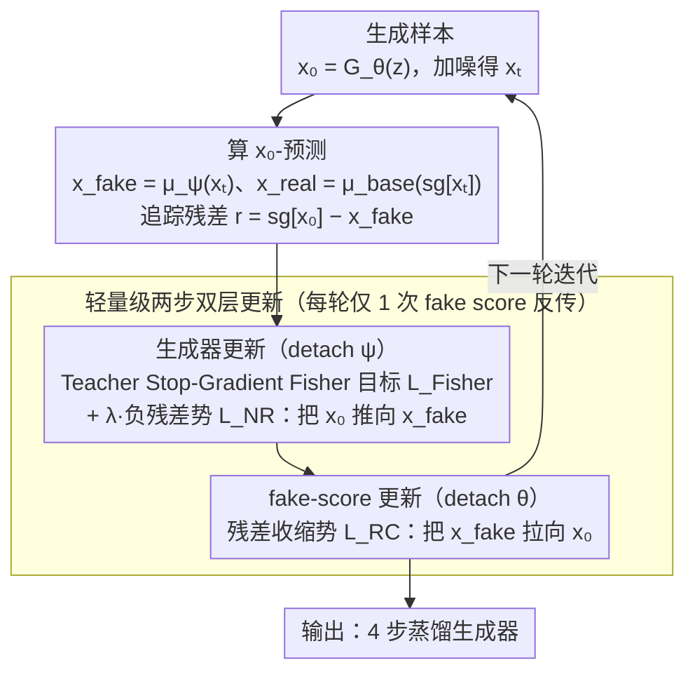

# SGMD: Score Gradient Matching Distillation for Few-Step Video Diffusion

**会议**: ICML 2026  
**arXiv**: [2605.30116](https://arxiv.org/abs/2605.30116)  
**代码**: 待确认  
**领域**: 视频生成 / 扩散模型蒸馏  
**关键词**: 扩散模型蒸馏, 分数匹配, few-step 生成, 运动保持

## 一句话总结
SGMD 通过引入**稳定的 teacher stop-gradient Fisher 目标**和**双重势（NR/RC）机制**——解决 few-step 视频扩散蒸馏中 fake score 追踪代价高（DMD2 每轮 5 次更新）和运动抑制问题，4 步蒸馏下实现 ~3× 训练加速同时运动质量从 0.65 提升到 0.78（VideoAlign）。

## 研究背景与动机

**领域现状**：扩散模型在视频生成中表现优异，但推理成本高（大参数量、高隐空间维度、多步采样）。Distribution Matching Distillation (DMD) 系列是主流的 few-step 加速方案，通过匹配学生生成分布与教师分布压缩采样步数。

**现有痛点**：DMD 风格蒸馏在激进 few-step 场景下面临两个耦合挑战：
- **追踪成本问题**：学生侧的辅助分数网络（fake score）必须追踪不断演变的生成器；维持追踪一致性需要多次 fake score 更新，DMD2 每轮迭代需要 5 次。
- **运动抑制问题**：reverse-KL 风格匹配是**模式寻求且保守**的，倾向避免目标分布中的低密度区域；在 few-step 蒸馏下生成的视频运动不足、细节缺失。

**核心矛盾**：如何在保证分布匹配目标一致性的同时，减少 fake score 追踪开销并防止运动动态被抑制？两个问题看似互相制约。

**本文目标**：
1. 找到在理想追踪条件下与 DMD 一致但更稳定的分布匹配目标。
2. 设计轻量级追踪机制减少 fake score 更新次数。
3. 在 few-step 视频蒸馏中同时保持运动强度和视觉质量。

**切入角度**：从 fake-score 视角重新思考蒸馏——不再把 fake score 看作跟踪工具，而是把它当主优化目标，应该朝教师方向移动；同时让生成器充当追踪器维护分数一致性。这个角色翻转打破了循环依赖。

**核心 idea**：用 teacher stop-gradient Fisher 替代 reverse-KL 作为分布匹配目标获得更平滑的梯度信号；引入双重势对（NR/RC）将追踪问题解耦为外层校正和内层收缩，实现仅需 1 次 fake score 更新的两步双层优化。

## 方法详解

### 整体框架
SGMD 要解决 DMD 风格 few-step 视频蒸馏里两个互相牵制的难题：fake score 追踪不断演变的生成器、追踪一致性要靠多次更新（DMD2 每轮 5 次），代价很高；而 reverse-KL 风格的匹配是模式寻求且保守的，会避开目标分布的低密度区，导致视频运动不足。它的破局点是一次角色翻转——不再把 fake score 当跟踪工具，而把它当主优化目标、应朝教师方向移动，同时让生成器充当追踪器去维护分数一致性，从而打破循环依赖。落到训练上是两阶段交替：生成器更新阶段（detach fake score）优化 $\mathcal{L}_{\text{Fisher}}(\theta) + \lambda \mathcal{L}_{\text{NR}}(\theta)$，fake-score 更新阶段（detach 生成器）优化 $\lambda \mathcal{L}_{\text{RC}}(\psi)$，每轮只需 1 次 fake score 反向传播。

### 关键设计

**1. Teacher Stop-Gradient Fisher 目标：换掉保守的 reverse-KL，给出更平滑的匹配梯度**

标准分数匹配会让教师梯度通过生成样本（往往是 OOD 状态）反传，训练就不稳了；而 reverse-KL 又太保守、躲着低密度区走，把运动细节也躲没了。SGMD 冻结教师输入梯度（stop-gradient），只让 fake score 去追教师的分数差 $\mathcal{L}_{\text{Fisher}}(\theta, \psi) := \frac{1}{2} \|s_{\text{fake}}(x_t, t) - s_{\text{real}}(\text{sg}[x_t], t)\|^2 = \frac{1}{2} c(t) \|\Delta_t\|^2$，其中 $\Delta_t = \mu_\psi(x_t, t) - \mu_{\text{base}}(x_t, t)$、$c(t) = \alpha_t^2 / \sigma_t^4$。Proposition 3.1 保证在理想追踪下这个 Fisher 目标与 reverse-KL 的分布匹配方向一致，但它的梯度信号更平滑、不像 reverse-KL 那样回避低密度区，于是低密度区里的运动细节被保留下来。停梯度则杜绝了 OOD 梯度的无效反传。

**2. 双重势（NR / RC）机制：用一推一拉把耦合的追踪问题解开**

追踪问题之所以贵，是因为生成器和 fake score 互相依赖、纠缠在一起。SGMD 先定义追踪残差 $r(x_0, x_t) := \text{sg}[x_0] - x_{\text{fake}}$ 来量化生成器输出与 fake score 预测的差距，再构造一对符号相反的势：外层负残差 $\mathcal{L}_{\text{NR}}(\theta) := -\frac{1}{2} \|r\|^2$ 和内层残差收缩 $\mathcal{L}_{\text{RC}}(\psi) := +\frac{1}{2} \|r\|^2$。它们在 $x_{\text{fake}}$ 空间诱导相反梯度 $\nabla_{x_{\text{fake}}} \mathcal{L}_{\text{NR}} = r$、$\nabla_{x_{\text{fake}}} \mathcal{L}_{\text{RC}} = -r$：沿依赖链 $x_0 \to x_t \to x_{\text{fake}}$，NR 把生成器输出推向 fake score 预测（保住分数一致），RC 把 fake score 拉向生成器输出（缩小预测差）。相比 SIM 用隐梯度精确处理追踪（计算复杂、强度固定），这套"推-拉"显式势把外层校正和内层收缩分开，几何直观、好实现也好调。

**3. 轻量级两步双层更新：把每轮 fake score 更新从 5 次压到 1 次**

要在两时间尺度优化里既稳又省，SGMD 每次迭代只做两次反向传播：先更新生成器 $\theta \leftarrow \theta - \eta_\theta \nabla_\theta(\mathcal{L}_{\text{Fisher}} + \lambda \mathcal{L}_{\text{NR}})$（其间 $\psi$ detach），再更新 fake score $\psi \leftarrow \psi - \eta_\psi \nabla_\psi(\lambda \mathcal{L}_{\text{RC}})$（其间 $\theta$ detach），构成显式的单步双层迭代，绕开了二阶隐梯度的计算。正因为 fake score 从每轮 5 次降到 1 次、每次反传省下约 80% 梯度计算，32 卡 H100 上实测约 3× 训练加速，$\lambda = 0.1$ 时效果最优。

### 训练策略
追踪权重 $\lambda = 0.1$；优化器 AdamW（$\beta_1 = 0, \beta_2 = 0.999$），学习率 $1 \times 10^{-6}$；4 步蒸馏固定时间步 $\{1000, 960, 889, 727\}$，Euler 求解器。

> ⚠️ 部分超参细节以原文为准。

## 实验关键数据

### 主实验（Wan2.1-T2V-14B 教师上 4 步蒸馏）

| 方法 | NFE | Fake-R | FVD ↓ | OptFlow ↑ | VBench-质量 ↑ | VBench-语义 ↑ | DynDeg ↑ |
|--------|-----|--------|------|---------|-----------|-----------|---------|
| 基础模型（50 步） | 100 | — | 0.0 | 9.41 | 86.67 | 84.44 | 94.26 |
| DMD2 | 4 | 5 | 115.1 | 4.51 | 85.05 | 77.46 | 80.56 |
| TSG-Fisher | 4 | 5 | 126.7 | 8.18 | 82.98 | 71.50 | 94.25 |
| TSG-SIM | 4 | 1 | 193.0 | 3.27 | 82.68 | 73.21 | 59.72 |
| **SGMD** | **4** | **1** | **100.3** | **9.29** | **84.77** | **75.64** | **93.06** |

SGMD 仅 1 次 fake score 更新就达到接近基础模型的运动强度（OptFlow 9.29 vs 9.41）；相比 DMD2 运动指标大幅改善（OptFlow +106%，DynDeg +15.5%）；VBench 质量保持竞争力。

### 消融实验

| $\lambda$ | Total ↑ | 质量 ↑ | 语义 ↑ | DynDeg ↑ |
|----------|---------|-------|-------|---------|
| 0.05 | 81.92 | 83.68 | 74.90 | 93.55 |
| **0.1** | **82.95** | **84.77** | **75.64** | **93.06** |
| 0.2 | 82.01 | 84.06 | 73.81 | 94.23 |
| 0.5 | 79.54 | 81.49 | 71.75 | 76.52 |

### 关键发现
- **运动-质量权衡**：Fisher 倾向保留低密度区域运动细节（更平滑梯度信号），reverse-KL（DMD2）保守集中在高概率区导致运动抑制；SGMD 通过 Fisher 获强运动，通过 NR/RC 追踪稳定恢复视觉质量。
- **训练效率**：fake score 更新从 5 次/迭代降至 1 次，每次反向传播减少 80% 梯度计算；32 卡 H100 实测 ~3× 加速。
- **人工评估偏好**（表 3）：整体偏好 SGMD 65% vs DMD2 13%；运动质量 SGMD 71% 胜率；文本对齐 / 视觉质量大多数评估为平手。
- **VideoAlign 评估**（表 4）：总分 SGMD 19.36 > DMD2 18.86；运动质量 4.99 > 4.15（+20%）；视觉质量 8.19 ≈ DMD2 8.47（-2%）。

## 亮点与洞察
- **稳定的分布匹配目标**：Teacher stop-gradient Fisher 巧妙避免 OOD 梯度，同时在理想条件下与 reverse-KL 等价（Proposition 3.1）；适用于所有扩散蒸馏场景。
- **Fake-score 视角的重塑**：把 fake score 从"跟踪器"重新定义为"优化目标"，生成器变成"追踪器"——角色翻转消除循环依赖，可迁移到其他两时间尺度的对偶优化问题。
- **双重势的几何直观**：NR 和 RC 在 $x_{\text{fake}}$ 空间诱导相反梯度形成"推-拉"机制；比 SIM 的隐梯度更易实现和调试。
- **通往高效蒸馏的路径**：通过减少 fake score 更新（从 5 到 1），在保持或改善性能的同时获 3× 加速。

## 局限与展望
- 追踪权重 $\lambda$ 是手工调参，不同教师或蒸馏目标可能需要重新搜索；可研究自适应 $\lambda$。
- 实验仅评估 4 步蒸馏，更激进的 1-2 步场景下 SGMD 是否仍有效需进一步验证。
- 运动-清晰度权衡：虽然人工评估表明权衡可接受，但对清晰度敏感的应用（产品视频、医学）可能仍需调整。
- 仅基于单一教师 Wan2.1-T2V-14B，与其他视频模型（I2V-Turbo）的适配性需验证。

## 相关工作与启发
- **vs DMD2**：都用分布匹配但 DMD2 用 reverse-KL + 频繁 fake score 更新；SGMD 用 Fisher + 双重势——避免 reverse-KL 的保守性 + 大幅降低更新频率。
- **vs SIM**：都关注追踪滞后的 implicit term，但 SIM 用隐梯度（复杂），SGMD 用显式对偶势（简洁）；SIM 相对强度固定，SGMD 可调参 $\lambda$。
- **vs Flash-DMD**：后者专注时间步感知训练和 RL，是正交的优化方向，可与 SGMD 结合。
- **启发**：Fake-score 视角和双重势机制可迁移到图像扩散蒸馏、其他生成模型的两时间尺度优化。

## 评分
- 新颖性: ⭐⭐⭐⭐⭐  Fake-score 视角创新，双重势设计优雅，理论分析深入。
- 实验充分度: ⭐⭐⭐⭐⭐  大规模 14B 模型 + 多维度评估（VBench + FVD + OptFlow + 人工 + VideoAlign）+ 消融。
- 写作质量: ⭐⭐⭐⭐  思路清晰，梯度分析直观；篇幅可再紧凑。
- 价值: ⭐⭐⭐⭐⭐  3× 训练加速 + 显著运动改善，直接降低视频蒸馏成本；为后续高效大模型蒸馏指明方向。

<!-- RELATED:START -->

## 相关论文

- [\[ICML 2026\] AAD-1: Asymmetric Adversarial Distillation for One-Step Autoregressive Video Generation](aad-1_asymmetric_adversarial_distillation_for_one-step_autoregressive_video_gene.md)
- [\[ICCV 2025\] Adversarial Distribution Matching for Diffusion Distillation Towards Efficient Image and Video Synthesis](../../ICCV2025/video_generation/adversarial_distribution_matching_for_diffusion_distillation_towards_efficient_i.md)
- [\[ICCV 2025\] DOLLAR: Few-Step Video Generation via Distillation and Latent Reward Optimization](../../ICCV2025/video_generation/dollar_fewstep_video_generation_via_distillation_and_latent.md)
- [\[CVPR 2026\] FlashMotion: Few-Step Controllable Video Generation with Trajectory Guidance](../../CVPR2026/video_generation/flashmotion_fewstep_controllable_video_generation.md)
- [\[ECCV 2024\] DreamMotion: Space-Time Self-Similar Score Distillation for Zero-Shot Video Editing](../../ECCV2024/video_generation/dreammotion_space-time_self-similar_score_distillation_for_zero-shot_video_editi.md)

<!-- RELATED:END -->
