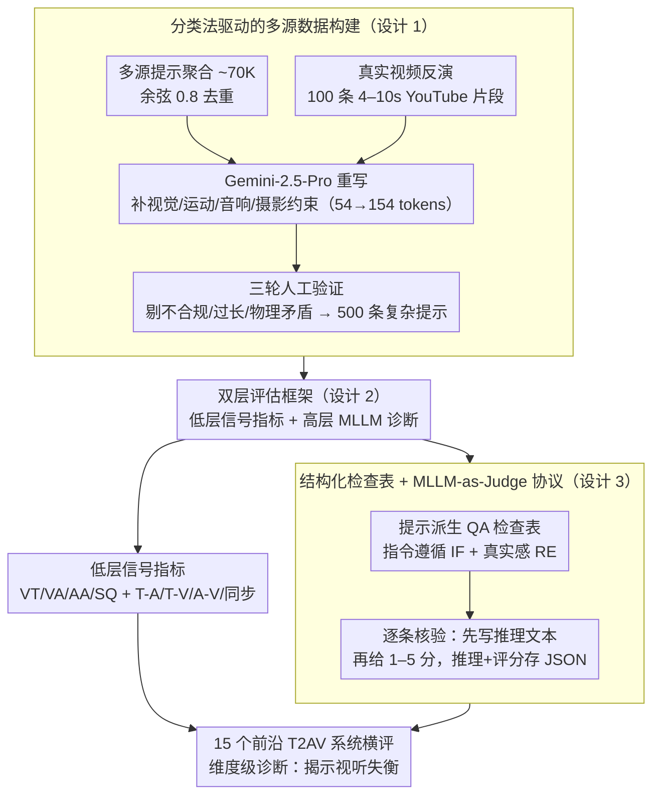

# T2AV-Compass: Towards Unified Evaluation for Text-to-Audio-Video Generation

**会议**: ICML 2026  
**arXiv**: [2512.21094](https://arxiv.org/abs/2512.21094)  
**代码**: 待确认  
**领域**: 多模态 VLM / 基准评估  
**关键词**: 文本到音视频生成, 跨模态对齐, 评估基准, MLLM 评判, 视听失衡

## 一句话总结
T2AV-Compass 是首个针对文本到音视频（T2AV）生成的综合评估基准——500 条复杂提示 + 双层评估框架（低层信号指标 + 高层 MLLM 诊断），系统评估 15 个前沿 T2AV 系统，定量揭示了即便顶级模型也存在的"音频真实感瓶颈"现象（视频维度 85%+ 真实感 vs 音频仅 50%）。

## 研究背景与动机

**领域现状**：T2AV 生成是多模态内容创作前沿，已涌现 Sora / Veo 等突破性系统。但评估体系远未完善，多沿用单模态或弱多模态基准（VBench 只评视频，AudioCaps 只评音频），无法刻画真正的多模态协同特性。

**现有痛点**：
- 跨模态语义对齐与时间同步捕捉严重不足——现有指标无法回答"生成的声音是否对应可见事件"。
- 基准数据集普遍短小简陋，无法压测复杂真实场景。
- 评估维度碎片化——有的侧重视觉、有的侧重音频，几乎没有端到端的多维诊断框架。
- 评估缺可解释性——难以归因具体失败原因。

**核心矛盾**：T2AV 生成要求沿多条轴线同时成功（感知质量、跨模态对齐、时间同步、指令遵循、物理真实感），但评估框架往往顾此失彼。

**本文目标**：构建首个针对 T2AV 生成的专业评估基准，同时满足"全面性"（覆盖多维评估）和"诊断性"（可解释的失败分析）。

**切入角度**：分类法驱动的数据构建 + 双层评估指标体系——既有低层信号级客观指标，也有高层语义的 MLLM 主观诊断。

**核心 idea**：用结构化问卷（QA 清单）把模糊指令转化为可验证约束，再辅以物理 / 知识真实感检查，在单一框架内统一处理技术保真度、语义对齐、指令遵循等维度。

## 方法详解

### 整体框架
T2AV-Compass 要回答一个被现有基准回避的问题：当模型同时生成画面和声音时，到底哪一模态在拖后腿、又是在哪个维度上掉的链子。整套基准分三步落地——先用分类法驱动的混合流水线造出 500 条高复杂度的音视频提示，再用一套"低层信号指标 + 高层 MLLM 诊断"的双层框架去打分，最后把 15 个前沿 T2AV 系统放进同一标尺里横评，给出维度级对比和失败归因。三步里最关键的是数据怎么造、评估怎么分层、以及 MLLM 判分怎么做到可追溯。

### 关键设计

**1. 分类法驱动的多源数据构建：让提示既复杂又物理可信**

短而简陋的提示压不出模型的真实短板，这是旧基准（提示常 50-68 词）的通病。本文的做法是先广撒网再精加工：从 VidProM / Kling / LMArena / Shot2Story 等社区聚合高质量提示，按余弦相似度 0.8 去重得到约 70K 条；接着用 Gemini-2.5-Pro 重写，沿视觉、运动、音响、摄影学几条轴线补约束，把平均长度从 54 拉到 154 tokens、约束点从 5 增到 10。为了避免纯文本生成的"想当然"幻觉，又引入 100 条高保真 YouTube 4-10 秒片段做视频反演，让提示对齐现实里真实存在的动态；最后经三轮人工验证剔掉不合规、过长或物理上讲不通的样本。整个分类法覆盖 8 种隐喻类型、5 个注释维度、4 大复杂度因子，保证语义空间铺得开、复杂度压得住。

**2. 双层评估框架：信号指标管"快而粗"，MLLM 管"细而慢"**

单靠任何一层都不够——信号级指标客观可复现但抓不住语义细节，MLLM 判断能读出细微语义却慢且有偏。本文索性两层都上、让它们互补。低层目标评估覆盖视频质量 VT（DOVER++）与美学 VA（美学预测器 V2.5）、音频质量 AA 与 SQ（NISQA），以及跨模态对齐的一整套：文本-音频 T-A（CLAP）、文本-视频 T-V（VideoCLIP-XL-V2）、音视频 A-V（ImageBind）和时间同步（Synchformer）。高层主观评估则交给 MLLM：指令遵循（IF）由 Gemini-2.5 生成结构化 QA 清单，按 7 个维度 × 17 个子维度逐条核验；真实感（RE）拆成画面侧的 MSS（运动平滑）/ OIS（物体完整）/ TCS（时间连贯）和声音侧的 AAS（音频伪影）/ MTC（质感一致）。这样一条提示打下来，既有可比的硬指标，也有能落到具体维度的软诊断。

**3. 结构化检查表 + MLLM-as-Judge 协议：把"模糊打分"换成"可追溯根因"**

抽象的文本指令直接喂给 MLLM 打一个总分，结果既不可信也无法归因。本文把 500 条提示自动展开成"指令遵循"和"真实感"两类检查表，每条检查都对应一个可验证的约束。判分时强制 MLLM **先写推理文本、再给 1-5 分**，并把推理与评分一起存成 JSON。先推理后评分的好处是双重的：一是约束模型把判断依据摆出来、削弱黑盒打分的随意性，二是事后能顺着推理文本定位到底是哪条约束没满足，把失败分析从"分数低"细化到"哪里错了"。

## 实验关键数据

### 主实验：15 个 T2AV 系统对比

| 方法 | 开源 | 视频保真 VT | 视频美学 VA | 音频美学 AA | A-V 对齐 | 同步 DS ↓ | 平均评分 |
|------|------|-----------|-----------|-----------|---------|----------|---------|
| Veo-3.1 | ✗ | 13.39 | 5.425 | 6.818 | 0.2856 | 0.6776 | 70.29 |
| Sora-2 | ✗ | 7.568 | 4.112 | 5.584 | 0.2419 | 0.8100 | 69.83 |
| Kling-2.6 | ✗ | 11.41 | 5.417 | 6.666 | 0.2495 | 0.7852 | 68.16 |
| Wan-2.6 | ✗ | 11.87 | 4.605 | 6.440 | 0.2149 | 0.8818 | 67.68 |
| LTX-2 | ✓ | 7.160 | 4.661 | 6.742 | 0.1851 | 0.8756 | 63.72 |
| Ovi-1.1 | ✓ | 9.336 | 4.368 | 6.531 | 0.1620 | 0.9624 | 61.23 |

闭源垄断顶端，但无单一模型在所有维度称霸。

### 维度诊断：视听失衡

| 配置 | 指令遵循（视频） | 指令遵循（音频） | 视频真实感 | 音频真实感 | 说明 |
|------|---------------|---------------|---------|---------|------|
| Veo-3.1 | 76.15% | 67.90% | 87.14% | 49.95% | 顶级模型仍音频严重不足 |
| Kling-2.6 | 73.72% | 63.89% | 87.98% | 47.03% | 视频卓越但音频偏弱 |
| Wan-2.2 + Hunyuan-Foley | 74.45% | 58.23% | 89.63% | 62.14% | 级联管道：视频优秀但 A-V 对齐断裂 |
| AudioLDM2 + MTV | 68.30% | 65.80% | 76.45% | 58.92% | 纯音视频合成落后 |

### 关键发现
- **音频真实感瓶颈**：视频维度与音频真实感相差 30-50 分，揭示**视听失衡**——即使顶级模型视频完整性 / 时间稳定性达 85%+，音频仍仅 50%。
- **动态指令遵循最具挑战**：视频指令遵循中"动态"维度最具区分性，前沿模型在复杂运动执行和交互时显著掉分（时序连贯性瓶颈）。
- **音效合成最薄弱**：音频指令遵循中音效（Sound Effects）是最易出错的子类别，模型难把多样化物理声事件与提示和视觉事件关联。
- **级联管道参差**：级联 T2V → V2A 在单模态质量上可与端到端模型竞争（Wan-2.2 + Hunyuan-Foley 视频真实感 89.63），但全局 A-V 对齐严重滞后（"支离破碎的优化"）。

## 亮点与洞察
- **系统性多维诊断体系**：首次在统一框架内整合低层信号指标（DOVER++ / CLAP / Synchformer）与高层语义检验（MLLM 推理型评分），把失败归因从"模糊分数"升级到"可追溯根因"。
- **分类法驱动的数据构建**：从摄影学 / 物理因果 / 声学环境等维度系统设计约束，再用 LLM 重写 + 人工三轮验证；这套管道可复用到其他评估基准。
- **视听失衡的定量揭示**：首次明确刻画"为什么音视频生成还没达到人类水准"——不是所有维度都落后，而是结构性的"木桶短板"（音频）。
- **可解释的先推理后评分**：MLLM 评判前强制文本推理，避免黑盒打分的可信性问题。

## 局限与展望
- 500 条提示虽丰富，仍不覆盖所有可能场景（长视频 > 10 秒、非常规音视频交互）。
- MLLM 评判仍有 MLLM 偏差与不稳定性。
- 对音频评估不够深入——缺少空间音频 / 频谱失真等细粒度指标。
- 评估指标多由闭源 LLM 计算，可重现性受限；跨语言 / 文化的人工验证仍需补充。
- 时间同步指标假设单一音视频事件对齐，对复杂多源声景的能力待商榷。

## 相关工作与启发
- **vs VBench / EvalCrafter**：仅评视频质量与文本对齐，完全忽视音频；T2AV-Compass 把音频升格为一级公民。
- **vs JavisBench / VABench**：虽涉及音视频联合评估，但本文在提示复杂度（154 vs 50-68 tokens）、指标系统性、诊断深度上质的飞跃。
- **vs AudioCaps / TTA-Bench**：纯音频基准，无法刻画多模态协同。
- **启发**：建立专业评估基准的正确路径是"分类法驱动的数据设计 + 混合主客观指标 + 可解释的诊断体系"，对评估其他生成任务（3D 生成、可控文本生成）都有借鉴意义。

## 评分
- 新颖性: ⭐⭐⭐⭐⭐  首个面向 T2AV 生成的综合评估基准；MLLM-as-Judge 的结构化 QA 评判范式 + "视听失衡"定量揭示。
- 实验充分度: ⭐⭐⭐⭐  覆盖 15 个代表性系统、多个维度详细诊断；缺少与人类标注的大规模相关性验证、评估指标稳定性分析。
- 写作质量: ⭐⭐⭐⭐⭐  逻辑清晰、图表精美、细节完善，多个贡献点清晰呈现。
- 价值: ⭐⭐⭐⭐⭐  为后续 T2AV 研究提供首个专业公开评估框架；已发布代码与数据，预期对学界长期推动作用。

<!-- RELATED:START -->

## 相关论文

- [\[ICLR 2026\] JavisDiT++: Unified Modeling and Optimization for Joint Audio-Video Generation](../../ICLR2026/video_generation/javisdit_unified_modeling_and_optimization_for_joint_audio-video_generation.md)
- [\[CVPR 2026\] UniTalking: A Unified Audio-Video Framework for Talking Portrait Generation](../../CVPR2026/video_generation/unitalking_a_unified_audio-video_framework_for_talking_portrait_generation.md)
- [\[CVPR 2026\] UniAVGen: Unified Audio and Video Generation with Asymmetric Cross-Modal Interactions](../../CVPR2026/video_generation/uniavgen_unified_audio_and_video_generation_with_asymmetric_cross-modal_interact.md)
- [\[CVPR 2026\] VGA-Bench: A Unified Benchmark for Video Aesthetics and Generation Quality Evaluation](../../CVPR2026/video_generation/vga_bench_unified_benchmark_for_video_aesthetics_and_generation_quality.md)
- [\[ICCV 2025\] WorldScore: A Unified Evaluation Benchmark for World Generation](../../ICCV2025/video_generation/worldscore_a_unified_evaluation_benchmark_for_world_generation.md)

<!-- RELATED:END -->
