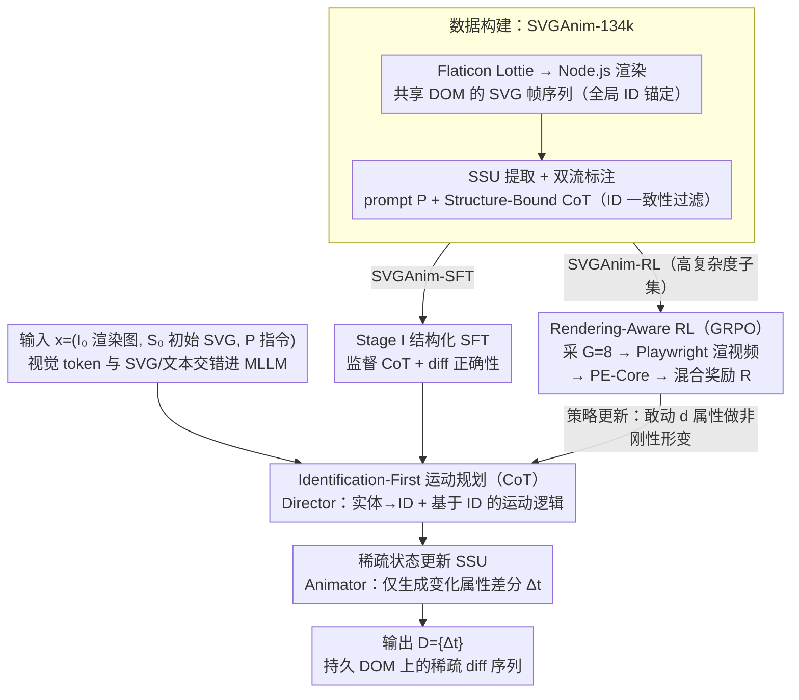

# VAnim: Rendering-Aware Sparse State Modeling for Structure-Preserving Vector Animation

**会议**: ICML 2026  
**arXiv**: [2605.01517](https://arxiv.org/abs/2605.01517)  
**代码**: 无（仅项目主页）  
**领域**: 生成模型 / 矢量动画 / 多模态 LLM  
**关键词**: SVG 动画、稀疏状态更新、Identification-First CoT、GRPO、渲染感知 RL

## 一句话总结
VAnim 把开放域 text-to-SVG 动画建模为「持久 DOM 树上的稀疏状态更新」+「Identification-First 运动规划」+「GRPO 渲染感知强化学习」，序列长度压缩 $9.86\times$ 的同时保持拓扑一致，并显著超越 GPT-5.2、Gemini 3 Pro 与 LiveSketch。

## 研究背景与动机
**领域现状**：SVG 因为可缩放、可编辑、文件小，在 UI/Web/图标设计里是事实标准；矢量动画（loading 指示、micro-interaction）则需要在 SVG 上叠加时间维度。当前路线分两派：基于优化的可微渲染方法（LiveSketch 系列）用 SDS 在像素空间迭代上千步逼近文本-视频先验；基于通用 LLM 的方法（GPT-5.2、Gemini 3 Pro、Keyframer）直接生成 CSS/SMIL 变换代码。

**现有痛点**：可微渲染派 (i) 推理慢到分钟级、无法交互；(ii) 把矢量当独立笔画，缺乏结构感知，闭合形状/遮挡轻易崩坏，只能做稀疏 sketch。LLM 派则陷入仿射偏置：CSS/SMIL 数学上只能表达平移、旋转、缩放，无法做路径级的非刚性形变（如旗帜飘扬、水滴变形），同时帧帧重写整段 SVG 会触发 (a) context 爆炸（24 帧已要 86k token）和 (b) identity drift（静态元素被随机修改导致身份漂移）。

**核心矛盾**：表达力（要做非刚性几何形变就必须改 path 的 `d` 属性）与稳定性（改 path 又最容易破坏 DOM 拓扑/身份一致性）之间的根本张力。任何「自回归地生成整段动画 SVG」的范式都无法同时摆脱两者。

**本文目标**：(i) 把动画序列压缩到 LLM context 能 hold 住的长度；(ii) 在生成时硬约束「未参与动画的元素必须 byte-for-byte 不变」；(iii) 提供路径级非刚性形变的能力；(iv) 把不可微的 SVG 渲染纳入到训练 loop。

**切入角度**：作者观察到相邻帧 85%+ 的 SVG 语法是冗余的，真正在变的只是少数 `d`、`transform`、`opacity` 等属性，因此动画可以重写成「初始 SVG + 一串带 ID 锚定的属性差分」。这把生成对象从「整树 token 序列」缩小到「稀疏 diff」，天然消解 context 爆炸 + identity drift。

**核心 idea**：把动画从「序列生成」重定义为「持久 DOM 树上的稀疏状态更新 (SSU)」，配合「先定位再规划」的 CoT 与渲染感知 GRPO，让 LLM 学会在保持结构的前提下做几何级形变。

## 方法详解
VAnim 在数据、表示、推理、训练四个层面都做了配合 SSU 的重构。

### 整体框架
输入：初始静态 SVG $S_0$、其渲染图 $I_0$、自然语言指令 $P$。输出：稀疏状态更新序列 $\mathcal{D}=\{\Delta_t\mid t=1,\dots,T\}$，每个 $\Delta_t$ 是「(id, attribute, new value)」三元组集合，只列出当前帧相对前一帧变化的属性。

模型基于 Qwen3-VL-8B-Thinking，视觉编码器把 $I_0$ 投影为 token 后与 $S_0$、$P$ 在同一序列中交错，让模型能跨模态把视觉物体和 DOM ID 对齐。整个生成被显式分成两个阶段，对应概率分解 $p_\theta(o\mid x)=p_\theta(C\mid x)\cdot p_\theta(\mathcal{D}\mid C,x)$，其中 $C$ 是 Structure-Bound CoT，$o=(C,\mathcal{D})$。训练分两阶段：阶段 I 在 SVGAnim-SFT (123k) 上做结构化 SFT；阶段 II 在 SVGAnim-RL (10k 高复杂度子集) 上做渲染感知 GRPO。

数据侧，作者从 Flaticon 抓 Lottie 文件，经 Node.js 渲染脚本生成 ID 锚定的 SVG DOM 序列，做坐标规范化、绝对→相对坐标、清洗后得到 SVGAnim-134k；用 Doubao-Seed-1.6 做双流标注：用户中心 prompt $P$ + Structure-Bound CoT $C$（含「Entity Identification: blue circle → ID 05」和「Visual Dynamic Planning: ID 05 scale up/down」两段式），并用严格 ID 一致性过滤保证 CoT 引用的 ID 都真实存在。

### 关键设计

**1. 稀疏状态更新（SSU）表示：把"逐帧重写整树"换成"初始 SVG + 属性差分流"**

相邻帧 85% 的 SVG 语法是重复的，真正在变的只是少数 `d`、`transform`、`opacity` 属性；可一旦让 LLM 帧帧重写整段 SVG，就同时撞上 context 爆炸（24 帧要 86k token）和 identity drift（静态元素被随机改掉、身份漂移）。SSU 干脆把动画定义成 $\Delta_t=\{(id, attr, v_t)\mid v_t\ne v_{t-1}, (id, attr, v_t)\in A(S_t)\}$，整段动画就是 $(S_0,\Delta_1,\dots,\Delta_T)$，序列化时用 `<|time=t|>` 和 `<|ID=id|>` 控制标记把每处变化锚到持久 DOM 节点上。一段 24 帧动画从 86k token 压到 9.2k（压缩 $9.86\times$），且 diff 部分占 61%，意味着模型大部分容量真的花在"学动态"而非"抄静态"。更关键的是，所有没被列进 $\Delta_t$ 的属性"按构造"保持不变——身份漂移在架构层就被根除，而不是靠损失项去约束。

**2. Identification-First Motion Planning（CoT）：先把实体 grounding 到 DOM ID，再写时间逻辑**

如果让模型把"想做什么"和"改哪个节点"混在一起想，很容易改错对象（去旋整个柜子而不是柜门）。VAnim 按概率分解 $p_\theta(o\mid x)=p_\theta(C\mid x)\cdot p_\theta(\mathcal{D}\mid C,x)$ 把推理硬拆成两段：Director 阶段输入 $I_0, S_0, P$，先产结构化 CoT $C$，里面是固定两段——Entity Identification 把视觉物体映射到 ID（"blue circle → ID 05"），Visual Dynamic Planning 描述基于 ID 的时间行为（"ID 05 scale up/down"）；Animator 阶段再据 $C$ 生成 diff 序列 $\mathcal{D}$。训练数据里每条 CoT 都经过 ID 一致性过滤、保证引用的 ID 都真实存在，使 100% 训练样本结构 grounded。消融显示去掉 CoT 后语义对齐从 0.281 掉到 0.255、错改对象变得常见——显式 grounding 是结构完整性的前提。

**3. Rendering-Aware Reinforcement Learning（GRPO + 混合奖励）：用渲染出的视频质量逼模型敢做非刚性形变**

SFT 只监督代码正确性、看不到"实际渲染出来好不好看"，学到的策略就保守地躲在平移/微缩这些仿射变换里，不敢去改 path 的 `d`。VAnim 把不可微的 SVG 渲染拉进训练 loop：对每条输入采 $G=8$ 条候选，各自经 Playwright 无头浏览器在 $500\times 500$ 渲成视频，再喂 PE-Core 视频感知编码器。奖励 $\mathcal{R}=\lambda_{\text{align}}\mathcal{R}_{\text{align}}+\lambda_{\text{fmt}}\mathcal{R}_{\text{fmt}}$，其中 $\mathcal{R}_{\text{align}}=\mathrm{CosineSim}(E_{\text{text}}(P),E_{\text{video}}(V_{\text{pred}}))$ 给密集的语义对齐信号、引导模型直接操作 Bézier 控制点做非刚性形变，$\mathcal{R}_{\text{fmt}}\in\{-1,+1\}$ 则作为硬约束严格判定可渲染、长度匹配、ID 合法，防止 RL 游走到"炫酷但破图"的区域。GRPO 目标 $\mathcal{L}_{\text{GRPO}}=\mathbb{E}\bigl[\tfrac{1}{G}\sum_i\min(\tfrac{\pi_\theta(o_i\mid x)}{\pi_{\theta_{\text{old}}}(o_i\mid x)}\hat A_i,\text{clip}(\cdot)\hat A_i)-\beta D_{\text{KL}}\bigr]$，$\beta=0.01$、温度 $0.9$。

### 损失函数 / 训练策略
Stage I：$\mathcal{L}_{\text{SFT}}(\theta)=-\mathbb{E}_{(I_0,S_0,P)\sim D_{\text{SFT}}}[\log p_\theta(C,\mathcal{D}\mid I_0,S_0,P)]$，最大序列 25k token，全参数微调。Stage II：GRPO 上式，$G=8$、$\beta=0.01$、$\lambda_{\text{align}}=\lambda_{\text{fmt}}=1.0$，硬件 $8\times$ H100。

## 实验关键数据

### 主实验
在自建 SVGAnim-Test (1k held-out) 上以 PE-Core-G14-448 度量语义对齐、再统计可渲染率 (Success Rate)：

| 方法 | Semantic Alignment ↑ | Success Rate ↑ |
|------|---------------------|----------------|
| LiveSketch | 0.158 | 100.0% |
| GPT-5.2 | 0.234 | 88.5% |
| Gemini 3 Pro | 0.243 | 86.2% |
| VAnim (SFT-only) | 0.268 | 95.2% |
| **VAnim (GRPO)** | **0.281** | **100.0%** |

VAnim-GRPO 同时拿到最高语义对齐 + 100% 可执行率；LiveSketch 虽 100% 可渲染但 0.158 的语义分远落后，说明其拓扑常崩；GPT-5.2/Gemini 在长序列里出现 unclosed tag、ID 幻觉，可执行率掉到 86–88%。

### 消融实验

| 配置 | Semantic Alignment ↑ | Success Rate ↑ | 说明 |
|------|---------------------|----------------|------|
| Full VAnim | 0.281 | 100.0% | 完整方法 |
| w/o Rendering-Aware RL | 0.268 (-0.013) | 95.2% (-4.8%) | 退化到 SFT，「motion 懒散」，门只开一缝 |
| w/o Structure-Bound CoT | 0.255 (-0.026) | 98.6% (-1.4%) | 错改对象，旋转柜子而非门 |
| w/o SSU (附录) | — | 62.3% | 朴素逐帧生成，可执行率崩盘 |
| w/o input image (附录) | — | SSIM/时序平滑性显著掉 | 视觉锚缺失，身份保持崩 |

### 关键发现
- 三个核心组件都不可替代：CoT 解决「改对节点」、SSU 解决「不破坏结构」、RL 解决「敢做大幅度形变」。其中 CoT 单点贡献最大（语义掉 0.026），说明显式 grounding 是非刚性动画的根本前提。
- 朴素逐帧生成的 Success Rate 跌到 62.3% 直接验证了 identity drift 假设：没有 SSU 强约束，LLM 会随机改静态属性导致渲染失败。
- GRPO 群大小 $G$ sweep 显示存在「语义对齐 vs identity 保持」的 trade-off，更大 $G$ 探索更广但身份漂移加剧。
- 视觉输入消融表明 $I_0$ 对 SSIM 与时序平滑性都至关重要，纯代码 + prompt 输入不足以让模型把视觉物体对应到 DOM ID。

## 亮点与洞察
- 把「序列生成」重新表述为「持久状态上的稀疏更新」是这个工作最深的思想：等价于在生成模型中加了一个「拓扑不变」的硬约束，且通过控制 token 集合直接落到架构层而非损失层，比任何 regularization 都干净。同样思路可以迁移到 HTML/UI 编辑、3D 场景图、CAD 修改、机器人轨迹编辑等任何「在持久结构上做局部时序变更」的任务。
- Identification-First CoT 是把 ReAct 范式落到「视觉实体 → DOM ID」的具体桥梁，并用「ID 一致性过滤」把 CoT 的可执行性写进数据生产管线，避免 CoT 像许多文章那样只是个 prompting trick。
- 用 PE-Core 这类视频感知编码器做 RL reward 是把不可微的 SVG 渲染纳入梯度链的优雅做法：稀疏 +1/-1 的 format reward + 密集语义 reward 组合，既避免崩坏又能提供丰富信号，可作为其他 code-to-render 任务（HTML/CSS、shader、SQL→图表）的标准模板。

## 局限与展望
- 数据全来自 Flaticon 的 Lottie 风格作品，结构规整且自带 ID/分组；手工 SVG 或工具导出的杂乱 SVG（无 ID、嵌套混乱、滥用 `g` 包装）泛化能力存疑，作者也明确指出这是 open question。
- Rendering-Aware RL 依赖无头浏览器实时渲染 + 视频编码器评分，单步代价远高于普通 RLHF，资源受限场景难以复现。
- 当前 VAnim 只生成视觉动画，缺乏对 JavaScript 触发的交互行为、多场景叙事的支持，限制了真实 UI/Web 工作流的端到端落地。
- 评估主要靠 PE-Core 度量，与训练 reward 同源存在 metric circularity 风险；附录补的 InternVideo2、SSIM、flow 等独立指标缓解了这一点，但仍偏自动评测，缺乏大规模人评。
- SSU 表示假设「相邻帧 DOM 拓扑同构」，对于「新元素出现/消失」「DOM 重构」类动画支持不自然，作者未充分讨论。

## 相关工作与启发
- **vs LiveSketch (Gal et al. 2024)**：LiveSketch 在像素空间用 SDS 优化笔画，结构无感知导致闭合形状/遮挡常崩；VAnim 在 SVG DOM 上直接稀疏编辑，由构造保持拓扑，且推理一次完成而非几百步迭代。
- **vs Keyframer / GPT-5.2 / Gemini 3 Pro**：通用 LLM 在 CSS/SMIL 仿射变换里舒适区里打转，碰到非刚性形变只会近似为平移；VAnim 的 RL 信号把策略推到 `d` 属性的 Bézier 控制点上，是真正路径级形变。
- **vs DeepSVG / SVGformer 等静态矢量生成**：他们关注空间组成、不涉时间；VAnim 是第一个把 LLM 范式迁移到 open-domain 矢量动画的工作，并通过 SSU 把时间维度纳入而不爆 context。
- **启发**：「稀疏状态更新」可作为任何「需要在持久结构上做时序变化」的生成任务通用范式；「Structure-Bound CoT + 一致性过滤」可成为多模态 grounding 数据生产的标准做法；「渲染感知 RL」给 code-to-X 任务提供了一条把不可微 renderer 纳入训练的可行路径。

## 评分
- 新颖性: ⭐⭐⭐⭐⭐ SSU + Identification-First CoT + 渲染感知 GRPO 三件套是 open-domain 矢量动画的第一次系统化方案，并且重新定义了「动画生成 = 持久结构上的稀疏更新」的范式。
- 实验充分度: ⭐⭐⭐⭐ 三类强 baseline（优化派、闭源 LLM、自研 SFT-only）+ 两个核心消融 + 附录里 SSU/输入图像/reward/群大小四组扩展实验 + 用户研究，但缺少跨域（手工 SVG）的泛化评估。
- 写作质量: ⭐⭐⭐⭐⭐ Motivation 部分把仿射偏置、context 爆炸、identity drift 三个痛点写得极其清晰；图 1/2/4 把数据、表示、推理三层都讲透；公式紧凑且配实例，可读性远超同类多模态长文。
- 价值: ⭐⭐⭐⭐ 开源数据 + 范式 + 框架，对设计工具链、UI/Web 自动化、教育动画都有直接落地价值，唯一短板是当前对手工 SVG 与交互逻辑支持有限。

<!-- RELATED:START -->

## 相关论文

- [\[CVPR 2026\] LottieGPT: Tokenizing Vector Animation for Autoregressive Generation](../../CVPR2026/video_generation/lottiegpt_vector_animation_generation.md)
- [\[ICML 2026\] OLAF-World: Orienting Latent Actions for Video World Modeling](olaf-world_orienting_latent_actions_for_video_world_modeling.md)
- [\[ICML 2026\] VEDA: Scalable Video Diffusion via Distilled Sparse Attention](veda_scalable_video_diffusion_via_distilled_sparse_attention.md)
- [\[ICML 2026\] DFSAttn: Dynamic Fine-Grained Sparse Attention for Efficient Video Generation](dfsattn_dynamic_fine-grained_sparse_attention_for_efficient_video_generation.md)
- [\[ICML 2026\] Light Forcing: Accelerating Autoregressive Video Diffusion via Sparse Attention](light_forcing_accelerating_autoregressive_video_diffusion_via_sparse_attention.md)

<!-- RELATED:END -->
