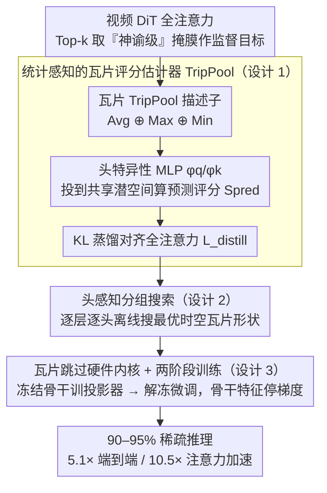

# VEDA: Scalable Video Diffusion via Distilled Sparse Attention

**会议**: ICML 2026  
**arXiv**: [2605.30325](https://arxiv.org/abs/2605.30325)  
**代码**: 待确认  
**领域**: 视频生成 / 扩散模型 / 模型加速  
**关键词**: 稀疏注意力, 视频扩散 Transformer, 蒸馏学习, 硬件优化

## 一句话总结
VEDA 把视频 DiT 的稀疏注意力问题重新表述为"对全注意力结构的显式蒸馏"——通过统计感知的瓦片评分 + 头感知分组搜索 + 硬件高效内核，在 90-95% 极端稀疏度下保持生成质量，给 Waver-12B 720P 10 秒视频带来 5.1× 端到端加速、10.5× 注意力加速。

## 研究背景与动机

**领域现状**：视频扩散 Transformer（DiT）已是高保真视频合成主流，但自注意力 $O(N^2)$ 计算瓶颈在高分辨率长时序生成时极严重。

**现有痛点**：现有稀疏注意力方法在高度剪枝（≥ 90%）下有两个根本问题：
- **静态方法**（SVG、STA）依赖预定义时空掩膜，缺对头部特异性注意力几何的自适应性。
- **动态方法**（VSA、VMOBA）通过隐式学习，缺显式监督；使用均值池化等粗糙统计量会忽略关键的信号峰值。

**核心矛盾**：高度稀疏剪枝导致"水纹畸变 / 空间翘曲 / 时间闪烁"等结构性伪影。但实验发现这**不是稀疏比例本身造成的**，而是稀疏掩膜与全注意力的瓦片级结构对齐度不足导致。

**本文目标**：在保持生成质量前提下实现视频 DiT 的激进稀疏化与实际加速。

**切入角度**：关键观察——"神谕级"掩膜（从全注意力 Top-k 得到）即便在 90% 稀疏度下也能保持高质量。这启发显式监督瓦片选择目标，而非依赖扩散目标的隐式学习。

**核心 idea**：把稀疏瓦片选择重新表述为对全注意力结构的显式蒸馏，加上头感知分组应对头部异质性，结合硬件高效内核实现真实加速。

## 方法详解

### 整体框架
VEDA 的出发点是一个反直觉的观察：在 90% 稀疏度下，从全注意力 Top-k 取出的"神谕级"掩膜照样能保持高质量——说明高度稀疏下的伪影（水纹畸变、空间翘曲、时间闪烁）不是稀疏比例本身造成的，而是稀疏掩膜与全注意力的瓦片级结构对齐得不够好。于是 VEDA 把稀疏瓦片选择直接重新表述成"对全注意力结构的显式蒸馏"，再配两件事保证它真能跑快：用头感知分组应对不同注意力头的几何异质性，用瓦片跳过的硬件内核把理论 FLOPs 削减兑现成端到端加速。

### 关键设计

**1. 统计感知的瓦片评分估计器（TripPool）：用显式蒸馏学出对齐全注意力的掩膜**

动态方法（VSA、VMOBA）靠扩散目标隐式学稀疏结构、还用均值池化这种粗糙统计量，会把关键的信号峰值抹掉，掩膜自然对不齐。VEDA 改成显式监督：对每个查询/键瓦片构造 TripPool 描述子，把均值、最大、最小拼起来 $\text{TripPool}[\cdot] = \text{Avg}[\cdot] \oplus \text{Max}[\cdot] \oplus \text{Min}[\cdot]$，再过头特异性 MLP $\phi_q, \phi_k$ 投到共享潜空间算预测评分 $S_{ij}^{\text{pred}} = \frac{\phi_q(\text{TripPool}[\tilde{Q}_i]) \cdot \phi_k(\text{TripPool}[\tilde{K}_j])^\top}{\sqrt{d'}}$，最后用 KL 散度 $\mathcal{L}_{\text{distill}} = \mathcal{D}_{KL}(A^{\text{tgt}} \| A^{\text{pred}})$ 把预测对齐到全注意力。最大/最小统计专门保住被均值池化漏掉的峰值依赖，显式蒸馏目标又避免了隐式学习的漂移；消融里 TripPool 的近似误差 0.912，明显优于纯平均池化（0.965）和只用最大最小（0.982）。

**2. 头感知分组搜索：每个头配它自己最合适的时空瓦片形状**

不同层不同头在空间和时间依赖上差异很大，统一的瓦片分组在高稀疏度下会让瓦片回忆率掉下去。VEDA 把瓦片配置限制在硬件瓦片大小 $B$ 的因子分解 $\Omega = \{(p_t, p_h, p_w) \in \mathbb{N}^3 \mid p_t p_h p_w = B\}$ 里，对每个候选 $\pi$ 在校准集上最小化稀疏近似与全注意力输出的误差 $\pi^*_{l, h} = \arg\min_{\pi \in \Omega} \mathbb{E}_{x \sim \mathcal{D}_{\text{cal}}} \|O^{\text{fu}}_{l, h}(x) - O^{\text{sp}}_{l, h}(x; \pi)\|_F^2$，逐层逐头离线搜出最优时空分组。给偏空间的头多分空间瓦片、给偏时间的头多分时间瓦片，比静态统一配置在运动质量上多出 7.2%、总体多出 9.6%。

**3. 瓦片跳过硬件内核 + 两阶段训练：把稀疏兑现成真加速，且训练稳**

算法上的稀疏要变成端到端加速，还得有内核配合，且训练不能把预训练流形搞坏。VEDA 用两阶段训练稳住收敛：第一阶段冻结骨干、只训投影器 1000 步对齐稀疏预测，第二阶段再解冻全部参数在目标稀疏度下微调；总目标 $\mathcal{L}_{\text{total}} = \mathcal{L}_{\text{diff}} + \lambda \mathcal{L}_{\text{distill}}$ 里有一个关键的**停梯度**——骨干特征不接收掩膜估计器的梯度反传，实验证明允许反传会显著降质。内核侧借 ThunderKittens DSL 和 Hopper TMA 做瓦片跳过：生产者 warp 从全局内存非连续抓取选中的键/值瓦片到共享内存，消费者 warp 同时跑张量核心运算，达到约 FlashAttention-3 80% 的运算效率，让 92% 的注意力开销降到 50%。

## 实验关键数据

### 主实验（Waver-1B 与 Wan2.1-1.3B 上对比全注意力与 VSA）

| 模型 | 方法 | 稀疏度 | 主体一致性 | 背景一致性 | 运动平滑 | 美学质量 | 端到端时间 |
|------|------|--------|---------|---------|--------|--------|----------|
| Waver-1B | 全注意力 | 0% | 0.938 | 0.955 | 0.979 | 0.693 | 69.3s |
| Waver-1B | VSA | 87.5% | 0.933 | 0.949 | 0.978 | 0.692 | 34.3s |
| Waver-1B | **VEDA** | **90%** | **0.940** | **0.954** | **0.980** | **0.699** | **31.9s** |
| Waver-1B | **VEDA** | **95%** | 0.934 | 0.951 | 0.978 | 0.698 | **30.6s** |
| Wan2.1-1.3B | 全注意力 | 0% | 0.940 | 0.969 | 0.977 | 0.670 | 58.5s |
| Wan2.1-1.3B | **VEDA** | **90%** | 0.887 | 0.941 | 0.972 | 0.663 | **37.6s** |

### 消融实验

| 组件 | 配置 | 指标 ↓ | 说明 |
|------|------|------|------|
| 瓦片统计 | 平均池化 | 0.965 | 忽略峰值 |
| 瓦片统计 | 最大 / 最小 | 0.982 | 遗漏中等重要性 |
| 瓦片统计 | **TripPool** | **0.912** | 保留关键依赖 |
| 分组策略 | 静态 [8, 8, 2] | +3.2% 运动质量损失 | 偏空间 |
| 分组策略 | 静态 [4, 4, 8] | 基准 | 均衡配置 |
| 分组策略 | **头感知动态** | +7.2% 运动 / +9.6% 总体 | 适应头部异质性 |

### 关键发现
- **掩膜精度主导性能**：90% 固定稀疏度下"神谕"掩膜的生成质量远优于平均池化掩膜——问题根源不在稀疏比例而在对齐质量。
- **头部异质性显著**：不同层不同头的空间 / 时间依赖模式差异大，统一分组在高稀疏度下不行。
- **可扩展性**：Waver-12B 720P 10 秒视频生成实现 5.1× 端到端加速 + 10.5× 注意力加速，注意力开销从 92% 降到 50%；序列越长 VEDA 加速越大。

## 亮点与洞察
- **实验性的根本观察**："神谕掩膜"实验精准定位真正瓶颈是结构对齐度而非稀疏比例，推翻既往假设并奠定方法设计基础。
- **显式监督的范式转变**：相比让扩散目标隐式形塑稀疏结构，显式蒸馏直接监督瓦片评分，避免隐式学习的漂移；停梯度操作的设计巧妙保护预训练生成流形。
- **头感知分组的精细化设计**：识别头部异质性并针对性搜索时空分组配置，比同期 VSA 等静态 / 全局动态方法更细粒度，可迁移到其他多头 Transformer 加速任务。
- **硬件-算法协设计**：从 TMA 异步传输到 Warp 特化的完整内核实现，把 FLOPs 理论减少转化为真实端到端加速，工程闭环完整。

## 局限与展望
- 两阶段训练虽稳定但需手工设计学习率 / 步数，通用性待提升。
- 95%+ 稀疏度下仍需更多 kernel 融合以提升 MFU。
- 头感知分组依赖离线校准集，不同数据分布下可能需重新搜索。
- TripPool 对异常分布的鲁棒性未充分讨论（最大 / 最小值易被离群值影响）。

## 相关工作与启发
- **vs SVG / STA**（静态稀疏）：依赖预定义模式缺自适应性；本文通过显式蒸馏实现内容与头部敏感的动态选择。
- **vs VSA / VMOBA**（动态稀疏）：依赖隐式扩散目标 + 粗糙池化；本文显式蒸馏 + 精细统计量更准确捕捉全注意力结构。
- **vs 其他加速**（缓存复用 PAB / TeaCache、蒸馏 CausVid）：VEDA 与它们正交，可叠加使用。

## 评分
- 新颖性: ⭐⭐⭐⭐⭐  在视频 DiT 稀疏化上首次系统引入显式监督 + 头感知分组；"掩膜精度主导" 的实验性发现改变了对稀疏注意力瓶颈的理解。
- 实验充分度: ⭐⭐⭐⭐⭐  多模型规模（1B / 12B）、多分辨率（480P / 720P）、长序列（34K-245K）、人类评估 + VBench、消融细致。
- 写作质量: ⭐⭐⭐⭐⭐  逻辑清晰层层递进，实验驱动的发现说服力强，方法各模块独立贡献明确。
- 价值: ⭐⭐⭐⭐⭐  5.1× 加速对工业应用意义重大；稀疏注意力设计思路对 LLM 加速也有参考价值。

<!-- RELATED:START -->

## 相关论文

- [\[ICML 2026\] Light Forcing: Accelerating Autoregressive Video Diffusion via Sparse Attention](light_forcing_accelerating_autoregressive_video_diffusion_via_sparse_attention.md)
- [\[ICML 2026\] DFSAttn: Dynamic Fine-Grained Sparse Attention for Efficient Video Generation](dfsattn_dynamic_fine-grained_sparse_attention_for_efficient_video_generation.md)
- [\[NeurIPS 2025\] VSA: Faster Video Diffusion with Trainable Sparse Attention](../../NeurIPS2025/video_generation/vsa_faster_video_diffusion_with_trainable_sparse_attention.md)
- [\[ICML 2026\] Attention Sparsity is Input-Stable: Training-Free Sparse Attention for Video Generation via Offline Sparsity Profiling and Online QK Co-Clustering](attention_sparsity_is_input-stable_training-free_sparse_attention_for_video_gene.md)
- [\[ICML 2026\] Lightning Unified Video Editing via In-Context Sparse Attention](lightning_unified_video_editing_via_in-context_sparse_attention.md)

<!-- RELATED:END -->
