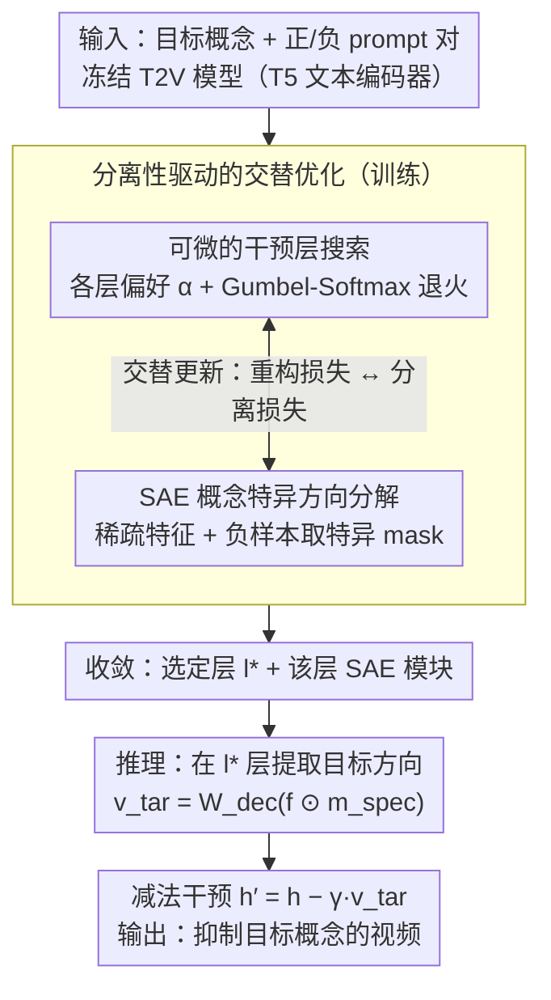

# Where Concept Erasure Should Occur: Concept-Layer Alignment in Text-to-Video Diffusion Models

**会议**: ICML 2026  
**arXiv**: [2605.25941](https://arxiv.org/abs/2605.25941)  
**代码**: 无公开代码  
**领域**: 视频生成 / 扩散模型安全  
**关键词**: 文本到视频扩散, 概念擦除, 层选择, 稀疏自编码器, 安全生成  

## 一句话总结
这篇论文发现文本到视频扩散模型中的目标概念只在特定深度最可分，提出 CLEAR 用 Gumbel-Softmax 学习“在哪一层擦除”、用 SAE 学习“擦除哪个概念方向”，从而在不改动扩散模型权重的情况下更精确地抑制目标概念并保留视频质量。

## 研究背景与动机
**领域现状**：大规模文本到视频模型已经能生成高质量、时序连贯的视频，但也会生成版权风格、名人身份、裸体或其他不希望出现的概念。现有概念擦除方法大致分成两类：推理时负向提示或安全引导，以及训练时微调或闭式权重修改。

**现有痛点**：很多方法默认概念擦除可以在固定层或任意层施加，或者只关心“擦除哪些特征”，很少系统研究“应该在哪个深度擦除”。但扩散 Transformer 的语义表征沿深度并不均匀，不同概念在不同层才变得可分。

**核心矛盾**：擦除太浅，目标概念还没有从背景语义中分离，干预会弱；擦除太深，目标概念可能已经和生成结构混合，干预会造成语义泄漏或质量损伤。安全生成需要精准抑制目标概念，又不能破坏非目标内容和视频质量。

**本文目标**：作者要把概念擦除从固定层启发式改成一个可学习问题：先自动发现目标概念与非目标语义最可分的层，再只在这个层用特征级方向做局部干预。

**切入角度**：论文提出 concept-layer topological alignment，指目标概念在某些模型深度上会形成更线性可分、更容易隔离的子空间。这个观察把“层选择”变成了基于概念-非目标 separability 的优化目标。

**核心 idea**：CLEAR 同时学习干预层和概念方向：用 Gumbel-Softmax 对层索引做可微搜索，用 Sparse Autoencoder 分解激活并构造特异性 mask，推理时只在选中层减去目标概念向量。

## 方法详解
CLEAR 的核心不是重新训练视频扩散模型，而是在冻结模型的 T5 文本编码器中插入一个可学习的概念擦除模块。训练时，系统拿目标概念的 positive prompts 和不含目标概念但语境相似的 negative prompts，比较不同层的激活可分性。推理时，模型选择一个最适合的层，把该层激活投到 SAE 稀疏空间，提取目标概念特异的方向，再从原激活中减去这一方向。

### 整体框架
输入是目标概念、正负 prompt 对和预训练 T2V 扩散模型。训练阶段维护一组深度偏好参数 $\alpha_1,\dots,\alpha_L$，表示每层适合擦除的程度；同时训练一个 SAE，把 dense activation 分解到更稀疏、更语义化的 feature space。优化目标一方面要求 SAE 能重构激活，另一方面要求选中层中目标概念特异能量高、非目标共享能量低。

训练完成后，层分布收敛到 $l^*=\arg\max_l\alpha_l$。推理阶段只在该层挂载 SAE，不更新扩散模型权重。给定 hidden state $h_{l^*}$，CLEAR 编码得到 sparse features，保留与目标概念相关的特异 feature，解码回模型空间形成 $v_{tar}$，然后执行 $h'_{l^*}=h_{l^*}-\gamma v_{tar}$。

### 关键设计

**1. 可微的干预层搜索：把“在哪层擦除”变成可学习变量**

这一步对应框架图里“收敛到选定层 $l^*$”的源头。传统做法把擦除层当固定超参数或靠人工逐层穷举，但论文发现不同概念在不同深度才变得可分，固定层要么擦不干净、要么伤质量。CLEAR 为所有候选层维护偏好参数 $\boldsymbol{\alpha}=(\alpha_1,\dots,\alpha_L)$，用 Gumbel-Softmax 采样近似 one-hot 的层权重 $p_k=\frac{\exp((\log\alpha_k+g_k)/\tau)}{\sum_j\exp((\log\alpha_j+g_j)/\tau)}$（$g_k$ 为 Gumbel 噪声）。训练时温度 $\tau$ 逐步退火，soft distribution 从平滑逐渐收敛到确定的层选择 $l^*=\arg\max_l\alpha_l$。这样层选择不再靠穷举，而是被后面的分离性目标直接反向传播驱动，自动落到目标概念最可分的深度。

**2. SAE 概念特异方向分解：分离目标概念与共享语义**

对应框架图中提取目标方向的 SAE 模块，解决“擦除哪个方向才不伤背景”的问题。直接修改 dense activation 的某些维度容易误伤，因为这些维度往往多义。CLEAR 用稀疏自编码器（SAE）把激活 $h$ 编码成稀疏特征 $f=\text{ReLU}(W_{enc}h+b_{enc})$，再借助正负 prompt 对做区分：用不含目标概念但语境相似的 negative prompts 的特征激活构造 shared mask $m_{shared}$，取反得到特异性 mask $m_{spec}=1-m_{shared}$。那些很少出现在非目标语境中的 feature 被认定为目标概念方向，从而把“目标概念”和“共享视觉语义”在稀疏空间里分开。

**3. 分离性驱动的交替优化与推理时减法干预：让层与方向相互适配、推理保持轻量**

这是把前两个设计粘合起来的训练-推理闭环，对应框架图的交替优化子图与最终的减法节点。训练交替进行两步：固定层偏好时，SAE 最小化加权重构误差和稀疏惩罚；固定 SAE 时，用对比式分离损失 $\mathcal{L}_{con}=\log(1+S_{uni}/(S_{spe}+\epsilon))$ 更新层偏好，惩罚共享/非目标能量 $S_{uni}$ 相对概念特异能量 $S_{spe}$ 过强。若只优化重构，层搜索会偏向稳定但概念纠缠的层；加入分离信号后，它才会偏向目标概念自然分离的位置。推理时不更新任何扩散模型权重，只在选中层把目标方向 $v_{tar}=W_{dec}(f\odot m_{spec})$ 从 hidden state 中减去：$h'_{l^*}=h_{l^*}-\gamma v_{tar}$。因此 CLEAR 介于纯 prompt 引导和权重 fine-tuning 之间——比负向提示更强，比改权重更局部。

### 损失函数 / 训练策略
训练目标包含两部分。第一部分是 SAE 重构与稀疏损失，鼓励当前层偏好加权下的激活能够被稀疏特征重构。第二部分是 CLEAR 的对比式分离损失，惩罚 shared/non-target energy 相对 concept-specific energy 过强。优化时，层偏好和 SAE 参数交替更新，Gumbel-Softmax 温度逐步退火，最终得到每个概念独立的最佳层与 SAE 模块。

一个重要细节是 CLEAR 不更新 T2V 主模型权重，只在推理时局部修改文本编码器的 hidden state。因此它介于纯 prompt 引导和模型 fine-tuning 之间：比负向提示更强，比权重修改更局部，也更容易控制副作用。

## 实验关键数据

### 主实验
论文在 Wan2.2-5B 和 CogVideoX-2B 两个 T2V diffusion transformer 上评估，目标概念包括常见物体、安全敏感概念、名人身份和艺术风格。核心指标是目标概念残留生成率 Generative Rate，越低越好；同时报告 Overall Consistency、Imaging Quality、Aesthetic Quality 和 Motion Smoothness。

| 模型 / 物体概念 | 指标 | CLEAR | 之前强基线 | 提升 |
|--------|------|------|----------|------|
| Wan2.2-5B，10 个物体平均 | Generative Rate ↓ | 12.8% | T2VUnlearning 24.5% / SAFREE 28.1% | 残留率约减半 |
| Wan2.2-5B，French horn | Generative Rate ↓ | 7.8% | T2VUnlearning 26.4% / SAFREE 28.6% | 更彻底擦除 |
| Wan2.2-5B，图像质量 | Imaging Quality ↑ | 0.7025 | Origin 0.6910 / T2VUnlearning 0.6652 | 保真度不降反升 |
| CogVideoX-2B，10 个物体平均 | Generative Rate ↓ | 7.1% | T2VUnlearning 7.4% / SAFREE 14.6% | 最低残留 |
| CogVideoX-2B，图像质量 | Imaging Quality ↑ | 0.4683 | T2VUnlearning 0.3907 | 避免权重修改造成质量崩塌 |

### 消融实验
论文没有只停留在物体概念，还检查了更难的敏感概念、身份概念和风格概念。下表摘取 nudity 与 celebrity erasure 的代表性结果。

| 配置 | 关键指标 | 说明 |
|------|---------|------|
| Wan2.2-5B，裸体概念 Origin | Generative Rate 67.3%，Imaging 0.6913 | 原模型高概率生成敏感概念 |
| Wan2.2-5B，NegPrompt / SAFREE | Generative Rate 55.5% / 48.7% | 纯推理引导难以压制深层敏感概念 |
| Wan2.2-5B，T2VUnlearning | Generative Rate 18.6%，Imaging 0.6737 | 擦除较强但仍弱于 CLEAR |
| Wan2.2-5B，CLEAR | Generative Rate 11.1%，Imaging 0.6928 | 最低残留且质量保持接近原模型 |
| Wan2.2-5B，名人身份平均 | CLEAR 0.0151 vs. T2VUnlearning 0.0215 | 身份相似度更低，说明身份概念也能局部擦除 |
| CogVideoX-2B，裸体概念 | CLEAR 14.63% vs. VideoEraser 19.22% | 在另一架构上仍保持较强安全概念擦除 |

### 关键发现
- 概念擦除确实高度依赖层位置。论文展示了不同概念的 Generative Rate 随干预层呈 V 形变化，偏离最佳层会导致语义残留或质量下降。
- CLEAR 在 Wan2.2-5B 上比 T2VUnlearning 更强，同时图像质量更好；在 CogVideoX-2B 上，T2VUnlearning 虽能降低残留率，但图像质量明显掉到 0.3907，说明权重级修改在小模型上更容易造成副作用。
- 对裸体和名人身份这类高度纠缠概念，负向提示和 SAFREE 残留较高，而 CLEAR 仍能显著压低概念检测率，说明“选对层 + 稀疏方向”比单纯 prompt steering 更可靠。

## 亮点与洞察
- 论文最有价值的观察是“概念在哪层可分”本身就是擦除问题的一部分。许多安全方法把干预位置当超参数，CLEAR 把它提升成主要优化变量。
- 使用 SAE 的方式比较克制：它不是为了生成解释性 feature 可视化，而是服务于可控干预，把 target-specific 和 shared semantic energy 分开。
- 推理时不改主模型权重是一个重要工程优势。对安全过滤、版权风格移除和个性化部署来说，局部 activation intervention 比重新微调整个 T2V 模型成本低，也更容易按概念开关。

## 局限与展望
- CLEAR 需要为每个概念训练独立的 SAE 和层搜索模块。论文也承认不同概念有不同几何纠缠模式，这带来较高的概念级维护成本。
- 实验依赖预训练概念检测器来衡量生成率。检测器本身的漏检、误检或对视频帧的覆盖不足会影响 erasure 指标。
- 当前方法主要干预文本编码器层，对视频扩散主干中的时序语义如何表征和泄漏还没有深入分析。
- 对组合概念、多语言 prompt、隐喻式 prompt 或恶意 prompt jailbreak 的鲁棒性仍需进一步验证。

## 相关工作与启发
- **vs NegPrompt / safety guidance**: 负向提示只在输入层改变条件信号，简单但容易被复杂 prompt 绕过；CLEAR 直接干预内部概念方向，抑制更强。
- **vs T2VUnlearning**: 权重级 unlearning 可以永久改变模型，但可能伤害非目标质量；CLEAR 不改权重，通过局部层对齐减少副作用。
- **vs SAE-based text-to-image erasure**: 既有 SAE 方法多关注“哪些 feature”，本文强调“哪个 layer”的同等重要性，尤其适合深层 Transformer 表征不均匀的 T2V 模型。
- **可迁移启发**: concept-layer alignment 可以用于风格编辑、身份保护、版权内容过滤，也可能迁移到文本到图像、音频生成或多模态大模型安全控制。

## 评分
- 新颖性: ⭐⭐⭐⭐☆ 把概念擦除中的层选择系统化为可微优化，概念-层对齐视角很清楚。
- 实验充分度: ⭐⭐⭐⭐☆ 覆盖两个视频生成架构和多类概念，指标兼顾擦除与质量；但 layer search 的消融细节还可更完整。
- 写作质量: ⭐⭐⭐⭐☆ 动机和方法 pipeline 清晰，图表说明了层位置的重要性；部分公式符号和表格排版略繁。
- 价值: ⭐⭐⭐⭐☆ 对 T2V 安全生成和可控概念编辑很有实用意义，尤其适合不能改主模型权重的部署场景。

<!-- RELATED:START -->

## 相关论文

- [\[CVPR 2026\] Composing Concepts from Images and Videos via Concept-prompt Binding](../../CVPR2026/video_generation/composing_concepts_from_images_and_videos_via_concept-prompt_binding.md)
- [\[ICML 2026\] Exploring Data-Free LoRA Transferability for Video Diffusion Models](exploring_data-free_lora_transferability_for_video_diffusion_models.md)
- [\[CVPR 2026\] Inference-time Physics Alignment of Video Generative Models with Latent World Models](../../CVPR2026/video_generation/inference-time_physics_alignment_of_video_generative_models_with_latent_world_mo.md)
- [\[ICML 2026\] LocoT2V-Bench: Benchmarking Long-form and Complex Text-to-Video Generation](locot2v-bench_benchmarking_long-form_and_complex_text-to-video_generation.md)
- [\[ICML 2026\] World-R1: Reinforcing 3D Constraints for Text-to-Video Generation](world-r1_reinforcing_3d_constraints_for_text-to-video_generation.md)

<!-- RELATED:END -->
