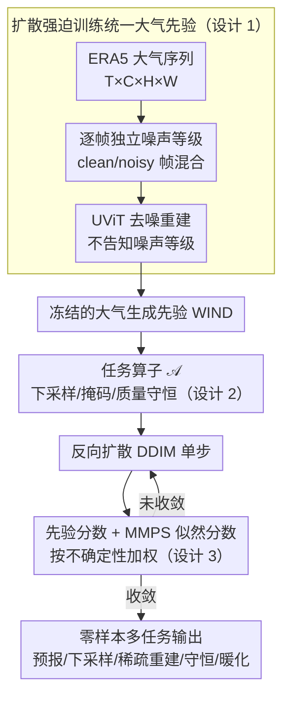

# WIND: Weather Inverse Diffusion for Zero-Shot Atmospheric Modeling

**会议**: ICML2026  
**arXiv**: [2602.03924](https://arxiv.org/abs/2602.03924)  
**代码**: 未见公开代码  
**领域**: 科学计算 / 大气建模 / 扩散模型  
**关键词**: 气象基础模型, 逆问题, diffusion forcing, posterior sampling, 物理约束  

## 一句话总结
WIND 把全球大气序列建模成一个无条件视频扩散先验，并在推理时把预测、下采样、稀疏重建、质量守恒和暖化情景都写成可微逆问题，用同一个冻结模型零样本求解多类天气与气候任务。

## 研究背景与动机
**领域现状**：AI 天气预报已经从传统数值天气预报之外开出一条高效路线，GraphCast、GenCast 等模型能在特定预测任务上给出强结果。与此同时，大气科学里的下游需求远不止中期预报，还包括空间下采样、时间下采样、稀疏观测补全、长期气候情景和物理守恒约束。

**现有痛点**：当前模型生态比较碎片化。一个模型常常只为某个任务训练：预测模型做预报，下采样模型做分辨率增强，重建模型做观测补全。每换一个任务就要重新训练或微调，不仅成本高，也难以保证不同任务之间共享同一套大气物理先验。

**核心矛盾**：大气系统既需要强概率生成能力，又需要可被外部物理或观测约束稳定地引导。纯自回归模型长 rollout 容易积累误差；普通全序列扩散模型又不擅长把上一窗口的 clean frame 和未来 noisy frame 混在一起继续生成；条件扩散如果为每个任务单独训练，又失去了基础模型的统一性。

**本文目标**：作者希望训练一个单一的大气生成先验，让它不通过任务微调，而是在推理阶段仅通过 forward operator 的改变来完成多种天气/气候任务。换句话说，训练阶段学“什么样的大气序列合理”，推理阶段再告诉模型“这次需要满足什么观测或物理条件”。

**切入角度**：论文把大气数据看成视频：变量是通道，时间步是帧，全球网格是空间维度。训练时用 diffusion forcing，让每一帧拥有独立噪声等级；推理时用 moment matching posterior sampling（MMPS）估计观测似然梯度，把任意可微约束注入反向扩散过程。

**核心 idea**：用 diffusion forcing 训练一个可混合 clean/noisy 帧的大气视频扩散先验，再把所有下游任务统一成 $Y=\mathcal{A}(X)+\eta$ 的逆问题，由 MMPS 在采样过程中施加约束。

## 方法详解
WIND 的方法非常像“先学大气世界模型，再把任务写成观测方程”。模型本身并不知道某个具体任务叫 forecasting、downscaling 还是 sparse reconstruction；这些差异都被封装进推理时的算子 $\mathcal{A}$。

### 整体框架
训练数据来自 ERA5，论文使用 1.5 度分辨率、70 个大气变量、长度为 5 的 6 小时间隔序列。模型骨干是 UViT，输入输出都是形如 $T\times C\times H\times W$ 的大气状态序列。训练时，对每一帧单独采样噪声等级，把干净大气序列变成不同程度损坏的序列，再让 UViT 复原 clean sequence。

推理时，给定一个任务观测 $Y$ 和前向算子（forward operator）$\mathcal{A}$。例如空间下采样里 $\mathcal{A}$ 是平均池化，时间下采样里 $\mathcal{A}$ 是对时间维求均值，稀疏重建里 $\mathcal{A}$ 是二值掩码（mask），干空气质量守恒里 $\mathcal{A}$ 是非线性的全球干空气质量（dry air mass, DAM）计算。反向扩散每一步先由 WIND 给出先验分数（prior score），再由 MMPS 根据 $\mathcal{A}(\hat X)$ 与目标 $Y$ 的差异给出似然分数（likelihood score），两者相加后更新样本。

### 关键设计

**1. 扩散强迫训练统一大气先验**：自回归天气生成需要把上一个窗口的最后一帧（clean context）接到下一个窗口前面继续滚动，但标准视频扩散给所有帧同一噪声等级，模型一旦遇到「干净帧 + 噪声帧混合」的输入就会落到分布外、长 rollout 随之发散。WIND 改用扩散强迫（diffusion forcing）：对序列里每个时间步独立采样噪声等级 $k^t$，前向过程为 $z^t=\alpha(k^t)x^t+\beta(k^t)\epsilon^t$。这样训练时模型就见过任意「clean/noisy 混合」组合，推理时把已知历史当 clean 帧、未来当噪声帧自然拼接，支持稳定的任意长度滚动。关键之处是模型**不显式接收噪声等级**，必须从输入状态自己推断每帧的不确定性，从而学到更鲁棒的时空表示，而不是依赖固定的噪声调度表。

**2. 把下游任务全部写成可微逆问题**：传统做法是预报、下采样、稀疏重建各训一个专门模型，换任务就要重训。WIND 把所有任务统一成同一个逆问题 $Y=\mathcal{A}(X)+\eta$——从部分观测 $Y$ 恢复满足大气先验的完整状态 $X$，任务的差异全部压进前向算子 $\mathcal{A}$：空间下采样用 $\mathcal{A}(X)=\mathrm{AvgPool}(X)$，时间下采样用 $\mathcal{A}(X)=\frac{1}{T}\sum_t x^t$，稀疏重建用 $\mathcal{A}(X)=M\odot X$，物理守恒用干空气质量的非线性积分公式。这样同一个冻结模型只要更换 $\mathcal{A}$，就能在不做任何任务微调的前提下零样本迁移到多种天气/气候任务。

**3. MMPS 引导采样而非点估计约束**：把约束注入反向扩散的难点在于，似然项 $p(X|Z)$ 没有闭式解。普通 diffusion posterior sampling（DPS）直接把它近似成当前预测点处的 Dirac delta，相当于忽略模型不确定性，于是在高噪声阶段观测梯度很容易过度拉扯样本、破坏生成先验。WIND 改用矩匹配后验采样（moment matching posterior sampling, MMPS）：把 $p(X|Z)$ 近似成带协方差的高斯分布，并用 Tweedie covariance 估计当前预测的不确定性。其效果是噪声高、预测不可靠时让先验主导，噪声低、预测可靠时再加强似然引导，使得高维、低维或非线性的各类大气约束都能被稳定地施加。

### 损失函数 / 训练策略
训练目标是去噪 score matching / clean sequence reconstruction，模型学习从不同噪声等级组合的序列中恢复大气状态。论文使用 5 帧窗口、6 小时间隔、70 个变量和 1.5 度 ERA5 网格。推理阶段使用 DDIM 类更新，并在需要约束的任务中加入 MMPS likelihood score。作者把气象预测、下采样和物理约束都放在推理阶段完成，没有对这些下游任务做任务特定微调。

## 实验关键数据

### 主实验
论文展示的主结果不是单一 leaderboard，而是证明同一模型能跨任务工作。中期预报方面，WIND 在 WeatherBench2 上因分辨率较粗，绝对 CRPS 不追求超越专门模型，但相对自回归扩散基线更稳定；下采样和稀疏重建方面，WIND 的优势更多体现在频谱、物理一致性和无需任务训练。

| 任务 | 评价设置 | WIND结果 | 对比对象 | 结论 |
|------|----------|----------|----------|------|
| 14天概率预报 | 2021 年 24 个初值，10 member ensemble，CRPS/SSR | 几天后 CRPS 优于 AR-UViT，SSR 逐步接近 1 | AR-UViT 自回归扩散 | diffusion forcing 更稳定，避免湿度/降水变量 overshoot |
| WeatherBench2 24h T2m | CRPS ↓ | 0.286 | GenCast 0.209，IFS ENS 0.396 | 低分辨率通用先验弱于专门 GenCast，但优于 IFS ENS 的该项 |
| 空间下采样 | 6° 到 1.5°，RMSE/PSD | 温度 0.63，位势高度 45.17，MSLP 42.68 | UViT/FNO 专门模型 | RMSE 常低于 UViT，但频谱高频细节优于 FNO，且无需任务训练 |
| 稀疏重建 1% | 仅 1% 观测点，RMSE | 温度 0.65，位势高度 48.64，MSLP 47.12 | UViT/Kriging | 多数变量优于专门 UViT，远比 Kriging 不容易过度平滑 |
| 4年 DAM 约束 rollout | dry air mass stability | 全程严格维持目标 DAM | 无约束 WIND | 物理约束能阻止约 200 天后的质量漂移 |

### 消融实验
| 配置 | 关键指标 | 说明 |
|------|---------|------|
| 无 DAM guidance | 4 年 rollout 约 200 天后 DAM 漂移 | 纯数据驱动生成会长期偏离物理守恒 |
| DAM guidance | 4 年 rollout 全程维持目标 dry air mass | MMPS 可在不重训的情况下硬性约束物理量 |
| 暖化自由运行 | Storm Bernd +2K/+14% humidity，仅保留 50.3% 降水增强信号 | 模型会把 OOD 热力异常扩散回训练气候态 |
| 暖化引导运行 | 平均峰值降水增强 +13.9% | 接近 Clausius-Clapeyron 预期的约 +14% |
| 空间下采样 UViT | 多数 RMSE 最低 | 专门训练模型在像素误差上占优 |
| WIND 空间下采样 | PSD 更接近 ERA5，Pearson consistency 0.96 | 通用先验更保高频和物理统计结构 |

### 关键发现
- 同一个冻结模型通过更换 $\mathcal{A}$ 可以覆盖多类任务，这证明“气象基础模型 + 逆问题推理”比“每个任务一个专门模型”更灵活。
- WIND 在 RMSE 上不总是赢专门 UViT，但频谱和分布更接近真实 ERA5，尤其能减少确定性模型的高频平滑问题。
- 稀疏重建是最能体现基础先验价值的场景：输入只有 1% 观测时，专门条件模型泛化困难，而 WIND 能利用全局大气先验补全未观测区域。
- 物理约束不是训练时软正则，而是推理时可插拔 guidance，这让长期质量守恒和暖化情景模拟变得可控。

## 亮点与洞察
- 论文最漂亮的地方是统一性：forecasting、downscaling、sparse reconstruction、mass conservation、warming scenario 都不是单独模块，而是同一个 posterior sampling 框架里的不同 operator。
- Diffusion forcing 与气象 rollout 的需求非常契合。它解决的是视频扩散里一个具体但关键的问题：怎样让模型自然接受“过去已知、未来未知”的混合噪声状态。
- MMPS 的作用不只是让 diffusion obey condition，而是把不确定性纳入 guidance 强度。对于 chaotic atmospheric dynamics，这比简单 point-estimate DPS 更合理。
- 这篇论文提醒科学机器学习不要只盯单任务 SOTA。对于气候场景，能够在零样本条件下施加新物理约束，可能比某个固定 benchmark 的 RMSE 小幅领先更重要。

## 局限与展望
- WIND 使用 1.5 度 ERA5，作者也明确不是要直接竞争 0.25 度 operational forecasting SOTA。若要实际部署，还需要更高分辨率、更完整变量和更大模型规模。
- 主实验中许多任务通过图和频谱说明效果，和专门模型相比 RMSE 并不总占优。对于用户真正关心的极端事件、局地风险、能量/水汽闭合，还需要更系统的定量评估。
- MMPS guidance 带来额外推理成本，尤其是需要 conjugate gradient solve 的约束。论文给出计算成本分析，但多任务、大 ensemble、长气候模拟下的成本仍需优化。
- 暖化情景实验采用 +2K 和 +14% 湿度的简化全局热力扰动，这适合机制验证，但距离真实区域化气候变化情景还有差距。

## 相关工作与启发
- **vs GenCast/GraphCast**: 这些模型针对中期预报优化，在 WeatherBench2 绝对指标上更强；WIND 的优势是统一逆问题推理和零样本任务迁移。
- **vs full-sequence diffusion**: 全序列扩散在长 rollout 中难以自然接续 clean context，WIND 的 per-frame independent noise 训练更适合滚动生成。
- **vs FNO/UViT downscaling**: 专门模型在 RMSE 上可能更好，但往往用像素损失换来平滑预测；WIND 更强调频谱和概率分布的物理真实性。
- **vs 物理约束神经网络**: 传统做法常把守恒律写入 loss 或结构，WIND 选择在推理时通过 operator guidance 施加约束，灵活性更高。

## 评分
- 新颖性: ⭐⭐⭐⭐⭐ 把 diffusion forcing、MMPS 和大气多任务逆问题统一得很自然，概念完整度高。
- 实验充分度: ⭐⭐⭐⭐☆ 覆盖任务很多，并有长期 rollout 和 OOD 暖化案例；但分辨率和部分指标仍偏概念验证。
- 写作质量: ⭐⭐⭐⭐☆ 方法叙述清楚，图示帮助理解；实验结果分散在正文和附录，需要读者自己整合。
- 价值: ⭐⭐⭐⭐☆ 对科学基础模型和气候 AI 很有启发，短期更像研究框架，工程落地还需高分辨率扩展。

<!-- RELATED:START -->

## 相关论文

- [\[CVPR 2025\] Zero-1-to-A: Zero-Shot One Image to Animatable Head Avatars Using Video Diffusion](../../CVPR2025/video_generation/zero-1-to-a_zero-shot_one_image_to_animatable_head_avatars_using_video_diffusion.md)
- [\[CVPR 2026\] StoryTailor: A Zero-Shot Pipeline for Action-Rich Multi-Subject Visual Narratives](../../CVPR2026/video_generation/storytailora_zero-shot_pipeline_for_action-rich_multi-subject_visual_narratives.md)
- [\[CVPR 2026\] Are Image-to-Video Models Good Zero-Shot Image Editors?](../../CVPR2026/video_generation/are_image-to-video_models_good_zero-shot_image_editors.md)
- [\[ECCV 2024\] DreamMotion: Space-Time Self-Similar Score Distillation for Zero-Shot Video Editing](../../ECCV2024/video_generation/dreammotion_space-time_self-similar_score_distillation_for_zero-shot_video_editi.md)
- [\[CVPR 2026\] Towards Holistic Modeling for Video Frame Interpolation with Auto-regressive Diffusion Transformers](../../CVPR2026/video_generation/towards_holistic_modeling_for_video_frame_interpolation_with_auto-regressive_dif.md)

<!-- RELATED:END -->
