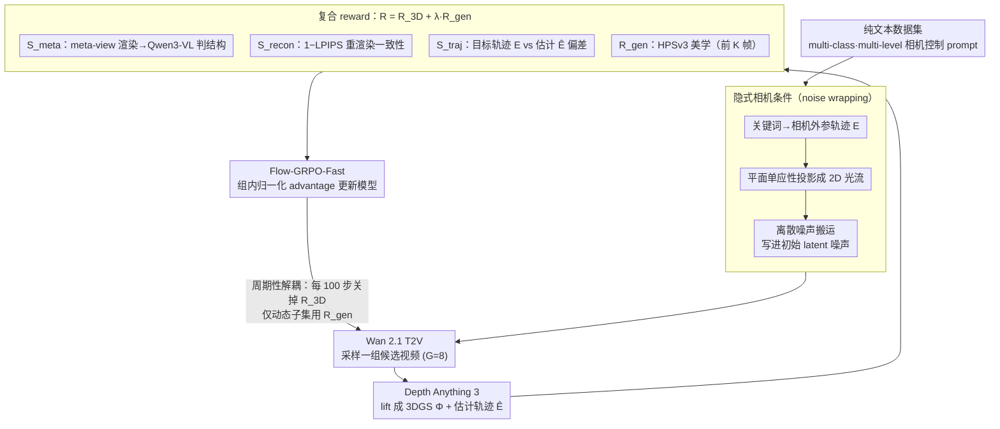

# World-R1: Reinforcing 3D Constraints for Text-to-Video Generation

**会议**: ICML 2026  
**arXiv**: [2604.24764](https://arxiv.org/abs/2604.24764)  
**代码**: 无  
**领域**: 视频生成 / 世界模型  
**关键词**: 文本到视频生成, 3D 一致性, 强化学习, Flow-GRPO, 相机控制  

## 一句话总结
World-R1 把文本到视频模型的 3D 一致性问题转化为强化学习后训练：用隐式相机条件和 3D-aware reward 对 Wan 2.1 等视频基础模型做 Flow-GRPO 对齐，在不改模型架构和推理流程的情况下显著减少几何幻觉，同时保持一般视频生成质量。

## 研究背景与动机
**领域现状**：大规模视频生成模型已经能生成高保真短视频，并逐渐被视作通向 world model 的基础。但它们的训练目标主要在图像/视频空间中匹配视觉分布，缺少显式 3D 几何约束。对于固定镜头或小幅运动，这个问题不明显；一旦提示词要求绕物体、穿过走廊、推近建筑等大相机运动，物体形状、墙面结构和场景布局就容易漂移。

**现有痛点**：已有 3D-aware video generation 往往在推理时加入 3D 模块、点云/3DGS 约束或辅助 camera-control 网络。这类方法可以提高一致性，但会带来架构改动、额外输入、昂贵推理和任务范围限制，很多还偏向 image-to-video 而不是纯 text-to-video。另一方面，直接靠更多视频数据训练，也不保证模型会内化刚性几何规律。

**核心矛盾**：视频基础模型可能已经在预训练中学到一定的隐式 3D 知识，但普通生成目标不会强迫它在大视角变化中使用这些知识。要让模型成为更像 world simulator 的生成器，需要给它几何反馈；但如果反馈太刚性，又可能压制动态物体和视觉多样性。

**本文目标**：作者希望在不引入显式 3D 推理模块、不依赖大规模 3D 监督数据、不改 inference pipeline 的前提下，把 3D 几何约束内化进文本到视频基础模型。目标包括更好的相机轨迹遵循、对象持久性、3D 重建一致性，同时不牺牲 VBench 上的一般视频质量。

**切入角度**：论文采用 analysis-by-synthesis 的奖励设计。生成视频后，先用 3D foundation model 把视频 lift 成 3D Gaussian Splatting 和相机轨迹，再从新视角渲染、比较重建质量、检查轨迹偏差，并用 VLM 评价 meta-view 的结构可靠性。这样模型不是直接看 3D 标注学习，而是通过奖励知道哪些视频在 3D 上站得住。

**核心 idea**：用 Flow-GRPO 把 3DGS 重建、meta-view 语义评估、轨迹对齐和一般视觉质量组合成 reward，对现有 T2V 模型做 RL 对齐，让几何一致性成为模型自身的生成偏好，而不是推理时外接硬约束。

## 方法详解

### 整体框架
World-R1 的基础模型是 Wan 2.1 T2V，训练 prompt 来自作者用 Gemini 合成的纯文本数据集（约 3000 条场景描述，按视觉域和相机控制复杂度分级）。给定一条 prompt，系统先从中识别相机运动词，例如 push in、pan left、orbit left，并生成对应的相机外参轨迹（camera extrinsic trajectory）。随后它把轨迹投影成相邻帧的 2D 光流（optical flow），再用 Go-with-the-Flow 风格的 noise wrapping 把相机运动先验注入初始 latent 噪声。视频基础模型在这个 latent 条件下采样一组候选视频。

候选视频生成后，World-R1 计算复合 reward。3D-aware reward 由 meta-view 结构评估、3DGS 重建保真、相机轨迹对齐三部分组成；general generation reward 则用 HPSv3 评价前若干帧的一般美学和视觉质量。训练时使用 Flow-GRPO-Fast，把视频采样过程视作 stochastic policy rollout，用组内 reward 归一化后的 advantage 更新模型；并每隔 100 步插入一个周期性解耦阶段，临时关闭 3D-aware reward、只在高动态子集上优化，避免几何约束把动态内容压死。

### 关键设计
**1. 纯文本数据集：让几何学习摆脱视觉偏置**

以往 camera-control 研究大多依赖开放域视频数据，分辨率有限、文本-视频对齐有噪声，还把几何规律和某个数据集的视觉分布绑死。World-R1 转而用 Gemini 合成约 3000 条纯文本场景描述，覆盖自然风光、城市建筑到超现实环境，并按相机控制复杂度分级——隐式运动、单方向指令、复杂组合轨迹。纯文本没有固定视觉先验，模型只能从场景与相机动作的组合里学刚性几何规律，而不是记住某段视频的外观；分级则让模型从易到难地学会 physics-compliant 生成。这套数据是后续相机条件、reward 和解耦训练共同的输入来源。

**2. 隐式相机条件：把相机轨迹写进初始噪声**

显式 camera-control 模块要加网络、改架构、加输入，而纯文本提示又很难让基础模型稳定执行复杂相机运动。World-R1 借鉴 Go-with-the-Flow，用一个无参数的隐式条件策略解决：先用关键词检测函数扫描 prompt 里的运动词，递推出相机外参序列 $E=\{E_t\}$（$E_t=E_{t-1}\cdot T_{\text{action}}(t)$）；再用 pinhole 相机模型加 fronto-parallel 平面单应性，把相对相机运动投影成相邻帧光流 $f(u)=u'-u$。由于直接 warp 噪声会在重叠区造成方差塌缩、在遮挡区留空、破坏标准正态分布，方法采用离散噪声搬运：对搬到同一目标像素 $v'$ 的噪声求和、再按入射数量 $\rho(v')$ 开方归一化（$z_{t+1}(v')=\frac{1}{\sqrt{\rho(v')}}\sum_{v\to v'}z_t(v)$），既把相机诱导的空间结构注入初始噪声、又保持单位方差。这相当于给 RL 一个带相机运动 inductive bias 的起点，模型更容易学到轨迹遵循，且推理时不增加任何模块。消融里去掉 noise wrapping，PSNR 从 27.63 掉到 24.46、VBench 从 85.21 掉到 76.39，说明这个先验对收敛和控制都关键。

**3. 复合 reward：用 analysis-by-synthesis 暴露隐藏的 3D 错误**

只在视频帧空间匹配视觉分布，无法暴露“纸片化”“漂浮物”“纹理拉伸”这类隐藏的几何错误。World-R1 用 analysis-by-synthesis 把“看起来像”转成“能否在 3D 里自洽”的可优化反馈：生成视频后用 Depth Anything 3 lift 成 3DGS 表示 $\Phi_{GS}$ 并估计相机轨迹 $\hat{E}$，再算 $R_{3D}=S_{meta}+S_{recon}+S_{traj}$。其中 $S_{meta}$ 从偏移的 meta-view 渲染 3DGS、交 Qwen3-VL 判断文本保真和结构可靠，专抓 canonical 视角看不到的缺陷；$S_{recon}$ 用 $1-\text{LPIPS}$ 衡量原视频与 3DGS 重渲染的一致性；$S_{traj}$ 惩罚目标轨迹 $E$ 与估计 $\hat{E}$ 的偏差，防止模型靠静态视频骗过重建指标。最终再叠加 general reward $R_{gen}$（前 $K$ 帧的 HPSv3 美学）守住视觉质量，总目标 $R(x,c)=R_{3D}(x,E,c)+\lambda_{gen}R_{gen}(x,c)$。每个分项各堵一种投机路径，消融去掉 $R_{3D}$ 后 PSNR 只剩 18.93、几乎退回基座水平。

**4. 周期性解耦训练：防止几何约束压死动态内容**

严格的 3D 一致性会反过来压制非刚性动态（行走的人、流水、火焰），模型可能 reward hacking、生成过于静态僵硬的视频。World-R1 在数据里专门保留约 500 条高动态 prompt，训练时走多阶段循环：主阶段用完整加权 reward 强化 3D 能力，每训练 100 步插入一个 dynamic fine-tuning 阶段，临时关闭 $R_{3D}$、只在动态子集上用 $R_{gen}$ 优化。这一步相当于正则化，让模型在学会世界模拟的同时保住对复杂动态运动的泛化力。消融去掉它后重建分反而更高（PSNR 27.89、SSIM 0.898），但 VBench 从 85.21 掉到 82.64，印证模型确实变得过刚性。

### 损失函数 / 训练策略
World-R1 使用 Flow-GRPO-Fast 进行在线 RL 后训练。Flow matching 的确定性 ODE 采样被改写成带噪声的 reverse-time SDE，从而形成可探索的 policy；每个 prompt 采样一组视频，按组内 reward 均值和标准差归一化 advantage，再用类似 PPO/GRPO 的 clipped objective 加 KL 约束更新模型。实验训练两个版本：World-R1-Small 基于 Wan2.1-T2V-1.3B，用 48 张 H200；World-R1-Large 基于 Wan2.1-T2V-14B，用 96 张 H200。训练分辨率为 832×480，GRPO group size 为 8，并行组数为 48。

## 实验关键数据

### 主实验
主结果分两类：VBench 评估一般视频质量，3DGS 重建评估几何一致性。World-R1 不仅没有牺牲 VBench，反而在美学、成像和主体一致性上超过基座模型。

| 方法 | Aesthetic Quality | Imaging Quality | Motion Smoothness | Subject Consistency | Background Consistency |
|------|-------------------|-----------------|-------------------|---------------------|------------------------|
| CogVideoX-1.5-5B | 62.07 | 65.34 | 98.15 | 96.56 | 96.81 |
| Wan2.1-T2V-1.3B | 62.43 | 66.51 | 97.44 | 96.34 | 97.29 |
| ReCamMaster | 42.70 | 53.97 | 99.28 | 92.05 | 93.83 |
| World-R1-Small | 65.74 | 67.53 | 98.55 | 97.58 | 96.67 |

| 方法 | PSNR | SSIM | LPIPS | 说明 |
|------|------|------|-------|------|
| CogVideoX-1.5-5B | 24.44 | 0.783 | 0.242 | 强视频基线 |
| Wan2.2-T2V-14B | 23.47 | 0.779 | 0.253 | 更大 Wan 系列基线 |
| Wan2.1-T2V-14B | 19.76 | 0.629 | 0.405 | World-R1-Large 的基座 |
| Wan2.1-T2V-1.3B | 17.40 | 0.550 | 0.467 | World-R1-Small 的基座 |
| World-R1-Small | 27.63 | 0.858 | 0.201 | 相对 1.3B 基座 PSNR +10.23 dB |
| World-R1-Large | 27.67 | 0.865 | 0.162 | 相对 14B 基座 PSNR +7.91 dB |

### 消融实验
Reward component 和训练策略消融说明各组件不是冗余项，而是在几何一致性、轨迹控制和视觉质量之间互相制衡。

| Reward 组件消融 | PSNR | SSIM | LPIPS | VBench AVG | 结论 |
|-----------------|------|------|-------|------------|------|
| Full pipeline | 27.63 | 0.858 | 0.201 | 85.21 | 几何和一般视频质量最平衡 |
| w/o meta-view score | 26.91 | 0.841 | 0.218 | 83.67 | 隐藏视角结构缺陷更难惩罚 |
| w/o reconstruction score | 25.14 | 0.798 | 0.271 | 84.35 | 3D 重建一致性明显下降 |
| w/o trajectory score | 26.27 | 0.829 | 0.237 | 84.53 | 相机轨迹遵循变弱 |

| 训练/条件消融 | PSNR | SSIM | LPIPS | VBench AVG | 关键影响 |
|----------------|------|------|-------|------------|----------|
| Full | 27.63 | 0.858 | 0.201 | 85.21 | 综合最稳 |
| w/o noise wrapping | 24.46 | 0.745 | 0.298 | 76.39 | 轨迹 inductive bias 消失，收敛和控制变差 |
| w/o periodic decoupled training | 27.89 | 0.898 | 0.192 | 82.64 | 重建分数更高但视频质量下降，趋向过刚性 |
| w/o 3D-aware reward | 18.93 | 0.502 | 0.496 | 84.96 | 保留一般质量但几何约束失效 |
| w/o general reward | 27.57 | 0.849 | 0.206 | 83.44 | 几何仍强，但感知质量下降 |

| 分析项 | 结果 | 含义 |
|--------|------|------|
| 用户研究几何一致性胜率 | 92% | 人类更偏好 World-R1 的结构稳定性 |
| 用户研究相机控制胜率 | 76% | 复杂轨迹遵循优于 Wan 2.1 |
| 用户研究总体偏好 | 86% | 几何约束没有破坏整体观感 |
| 自动 3D metric 与人类偏好一致率 | 91.17% | 重建指标与主观 3D 判断基本一致 |
| MVCS small backbone | 0.974 → 0.989 | 不依赖 3DGS 的多视角一致性也提升 |
| MVCS large backbone | 0.963 → 0.993 | 大模型同样受益 |
| 121-frame long-video PSNR | 18.32 → 26.32 | 短片训练的几何对齐能泛化到更长视频 |

### 关键发现
- 3D consistency 是最强结果：World-R1-Small 从 Wan2.1-1.3B 的 17.40 PSNR 提升到 27.63，World-R1-Large 从 Wan2.1-14B 的 19.76 提升到 27.67，同时 LPIPS 显著降低。
- 一般视频质量没有被 3D 约束压垮。VBench 中 World-R1-Small 的 Aesthetic、Imaging、Motion Smoothness、Subject Consistency 都优于 Wan2.1-1.3B。
- reward ablation 显示 3D reward 是几何提升的必要条件；去掉它后 PSNR 只有 18.93，几乎退回基座水平。去掉 general reward 则几何仍强但 VBench 下降，说明复合 reward 的平衡必要。
- 周期性解耦训练是防 reward hacking 的关键。没有它时重建指标略高，但 VBench 从 85.21 降到 82.64，说明模型可能变得过于静态或刚性。

## 亮点与洞察
- 论文没有把 3D consistency 做成推理时外接模块，而是通过 RL 把它内化为模型偏好。这样一旦训练完成，推理流程仍然像普通 T2V 模型一样简洁。
- Reward 设计比较完整：meta-view 查隐藏几何问题，reconstruction 查自洽性，trajectory 查控制，general reward 查视觉质量。每个指标都堵住一种可能的投机路径。
- 用纯文本数据做 post-training 很有意思。它让模型从大量场景描述和相机动作组合中学习几何规律，而不依赖昂贵的真实 3D 视频标注。
- 论文正视了 3D 约束会压制动态内容的问题，并用周期性解耦训练处理。这个细节让方法更像真实可用的世界生成器，而不是只会生成静态可重建场景。

## 局限与展望
- 训练成本很高。World-R1-Small 需要 48 张 H200，Large 需要 96 张 H200，并且在线 RL 要反复生成视频和运行 3D/reward 评估，成本高于常规 SFT。
- 方法受基座视频模型能力上限限制。多物体复杂交互、手部细节、长时非刚性运动和极长 horizon 场景仍可能继承 Wan 基座的生成缺陷。
- 3D reward 依赖 Depth Anything 3、3DGS 重建、Qwen3-VL 和 HPSv3 等外部评估器；如果这些评估器在某些场景上有偏差，RL 可能学到对应偏好。
- 当前相机轨迹来自关键词和预设 motion primitives。未来可以支持更自由的轨迹输入、连续控制信号，或与机器人/自动驾驶 simulator 的真实轨迹接口结合。

## 相关工作与启发
- **vs CameraCtrl / ReCamMaster**: 这些方法通过显式 camera-control 模块或条件输入控制轨迹，World-R1 用 latent noise wrapping 和 RL reward 达成控制，不增加推理模块。
- **vs 3D-aware video generation**: 显式 3D 表示或 3D decoder 往往带来架构改造和推理成本；World-R1 用 3D 模型做训练时 critic，把约束蒸馏进视频生成器。
- **vs Flow-GRPO**: Flow-GRPO 提供视觉生成 RL 框架，World-R1 的贡献在于为 3D 一致性设计可用 reward，并解决视频几何约束中的 reward hacking。
- **vs Go-with-the-Flow**: Go-with-the-Flow 用 noise wrapping 提供相机运动先验，World-R1 把它作为 RL 后训练的条件基础，再通过 reward 学几何一致性。
- **启发**: 对生成模型做 world modeling，不一定要先收集大规模 3D 标注；可以把强 3D foundation model 和 VLM 变成训练时判别器，用 RL 或 preference optimization 把物理约束迁移给生成器。

## 评分
- 新颖性: ⭐⭐⭐⭐☆ 把 3D consistency 做成 RL 后训练 reward 很有启发，组合了已有 3D/VLM/RL 工具但目标明确。
- 实验充分度: ⭐⭐⭐⭐⭐ 主实验、用户研究、MVCS、长视频、reward ablation 和组件消融都比较完整。
- 写作质量: ⭐⭐⭐⭐☆ 框架叙述清楚，附录补充充分；主文对部分消融数值依赖附录。
- 价值: ⭐⭐⭐⭐⭐ 对 T2V 向 world model 过渡很有价值，尤其适合需要相机运动和几何稳定的仿真、机器人和自动驾驶视频生成。

<!-- RELATED:START -->

## 相关论文

- [\[CVPR 2026\] ExPose: Reinforcing Video Generation Models for Extreme Pose Estimation](../../CVPR2026/video_generation/expose_reinforcing_video_generation_models_for_extreme_pose_estimation.md)
- [\[CVPR 2026\] Endless World: Real-Time 3D-Aware Long Video Generation](../../CVPR2026/video_generation/endless_world_real-time_3d-aware_long_video_generation.md)
- [\[CVPR 2026\] Yume1.5: A Text-Controlled Interactive World Generation Model](../../CVPR2026/video_generation/yume15_a_text-controlled_interactive_world_generation_model.md)
- [\[AAAI 2026\] 3D4D: An Interactive Editable 4D World Model via 3D Video Generation](../../AAAI2026/video_generation/3d4d_an_interactive_editable_4d_world_model_via_3d_video_generation.md)
- [\[ICML 2026\] OLAF-World: Orienting Latent Actions for Video World Modeling](olaf-world_orienting_latent_actions_for_video_world_modeling.md)

<!-- RELATED:END -->
