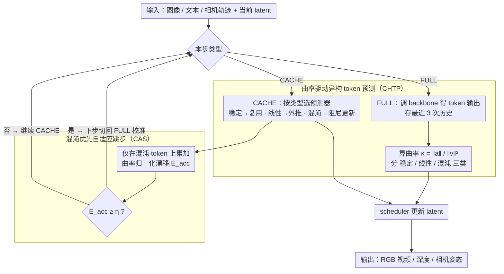

# WorldCache: Accelerating World Models for Free via Heterogeneous Token Caching

**会议**: ICML 2026  
**arXiv**: [2603.06331](https://arxiv.org/abs/2603.06331)  
**代码**: https://github.com/FofGofx/WorldCache  
**领域**: 视频生成 / 世界模型加速  
**关键词**: 扩散世界模型, 特征缓存, 异构 token, 自适应跳步, 推理加速  

## 一句话总结
WorldCache 针对扩散式 world model 中 RGB/深度等多模态 token 演化不均匀的问题，用曲率把 token 分成稳定、线性和混沌三类并自适应触发完整前向，在 HunyuanVoyager、Aether 等模型上最高实现 3.65 倍到 3.7 倍端到端加速，同时基本保持世界生成和 3D 重建质量。

## 研究背景与动机
**领域现状**：生成式 world model 正在从单纯视频生成走向环境动态模拟，常见输入包括图像、文本和相机轨迹，输出则同时包含 RGB 视频、深度或几何信息。许多高质量 world model 基于 diffusion transformer，需要几十到上百个 denoising step，每一步都调用大 backbone，因此交互式使用和长 horizon rollout 的成本很高。

**现有痛点**：训练无关的 feature caching 是扩散模型加速里很有吸引力的方向，因为它不需要重新训练，只是在采样过程中复用或预测中间特征。但多数缓存策略来自单模态图像/视频扩散，默认 token 动态比较同质；直接迁移到 world model 时，RGB 与深度、不同空间区域和运动边界的 token 轨迹差异很大，统一 reuse、统一线性外推或固定跳步都容易积累误差。

**核心矛盾**：world model 的大多数 token 在很多 denoising step 上很平滑，适合激进缓存；但少数关键 token 会出现非线性方向突变，往往决定几何边界、深度 discontinuity 和运动结构是否崩掉。全局保守策略会被少数困难 token 拖慢，全局激进策略又会让这些困难 token 漂移。

**本文目标**：作者希望保留 feature caching 的训练无关优势，同时让缓存策略理解 world model 的 token 异构性和时间非平稳性。具体目标是在单卡上减少 HunyuanVoyager、Aether 等 diffusion world model 的采样延迟，并保持 RGB/深度/相机姿态等多模态 rollout 质量。

**切入角度**：论文把每个 token 的 denoising 输出看成时间轨迹，用最近三次完整前向估计速度、加速度和曲率。曲率越小，说明该 token 的轨迹越接近线性；曲率越大，说明局部方向变化剧烈，需要更谨慎的预测和更及时的 full recomputation。

**核心 idea**：用曲率驱动 token 级异构预测，再只监控混沌 token 的归一化漂移来决定何时重新调用完整 backbone，从而把算力用在真正会引发 rollout 崩坏的少数 token 和困难时间段上。

## 方法详解

### 整体框架
WorldCache 在扩散采样过程中交替执行 FULL 和 CACHE 两类 step。FULL step 正常调用 world model backbone 得到 token 输出，并把最近三次 FULL 输出放入历史缓冲；当历史足够时，方法计算每个 token 的曲率，刷新稳定（stable）、线性（linear）、混沌（chaotic）三类 mask——这部分由**曲率驱动异构 token 预测（CHTP）**负责。CACHE step 不调用 backbone，而是根据 token 类型用不同阶数的预测器生成代理输出（surrogate），再交给原 diffusion scheduler 更新 latent。

与常规固定间隔缓存不同，WorldCache 还由**混沌优先自适应跳步（CAS）**维护一个累积漂移信号 $E_{acc}$：每个 CACHE step 后只在混沌 token 集合上计算曲率归一化的特征漂移，并累加到 $E_{acc}$；当 $E_{acc}$ 超过阈值 $\eta$ 时，下一步切回 FULL，重新校准曲率和历史输出。整套流程是 training-free 的纯推理时缓存，不改模型权重也不改 scheduler。

### 关键设计
1. **曲率驱动异构 token 预测（Curvature-guided Heterogeneous Token Prediction, CHTP）：用轨迹曲率给每个 token 分配预测阶数**

	world model 的 token 动态是长尾的——大部分背景/平滑区域在几十步去噪里几乎线性演化，少数边界、深度突变、运动相关的 token 却会突然改变方向。统一的预测器必然顾此失彼：激进复用会让这些困难 token 漂移、几何边界崩坏，保守重算又把算力浪费在简单 token 上。CHTP 的思路是在每个 FULL step 把每个 token 最近的去噪输出看成一条时间轨迹，用最近三次 FULL 输出估计速度 $v$ 和加速度 $a$，定义曲率 $\kappa_i=\|a_i\|_2/(\|v_i\|_2^2+\epsilon)$ 作为归一化的“局部转向率”——在平滑极限下它正好上界一阶线性预测的二阶误差，因此曲率越小越能被低阶外推安全预测。随后按曲率分位数 $(p_s,p_c)$ 把 token 划成三类并施以不同阶数的预测器：稳定 token（低曲率）零阶复用上次 FULL 输出 $\tilde{y}_{t,i}=y_{t^\star,i}$；线性 token（中曲率）一阶线性外推 $\tilde{y}_{t,i}=y_{t^\star,i}+k\,v_{t^\star,i}$；混沌 token（高曲率）方向最不可靠、单纯沿最新切线外推越久越发散，于是用 Hermite 式阻尼更新，把当前速度和上一次 FULL 的速度按 smoothstep 权重混合 $v_i^{adapt}(k)=(1-\alpha_k)v_{t^\star,i}+\alpha_k v_{t^\star-1,i}$，并随连续缓存步数 $k$ 增大逐渐偏向历史速度、变得更保守，从而压住长缓存 streak 里的方向漂移。这样算力被精准分配——简单 token 近乎零成本，困难 token 拿到更稳的预测。

2. **混沌优先自适应跳步（Chaotic-prioritized Adaptive Skipping, CAS）：只盯困难 token 的归一化漂移来决定何时重算**

	有了异构预测，还需要决定“连续缓存多少步后必须重新调用 backbone 校准”。固定间隔对不同时间段和模态都不鲁棒，而 world model 的特征范数会随模态（RGB vs 深度）和 timestep 大幅变化，原始差分或 norm 阈值很难找到一条跨模态通用的触发线。CAS 构造一个无量纲漂移 $e_i(t)=\kappa_i\|\tilde{y}_{t,i}-\tilde{y}_{t+1,i}\|_2$：乘上曲率恰好抵消全局尺度差异，让阈值跨模态、跨 timestep 通用。关键是它**只在混沌 token 集合上**求平均得到 $E(t)$ 再累加成 $E_{acc}$——因为 rollout 崩坏几乎总是从这少数困难 token 开始，只监控它们能避免大量简单 token 把真正的风险信号稀释掉。当 $E_{acc}\geq\eta$ 时说明瓶颈 token 的不确定性已积累到需要纠偏，下一步立即切回 FULL 重算、刷新历史输出与曲率分组；否则继续缓存。论文在 Aether 上取 $\eta=0.20$ 作为速度与质量的折中。

### 损失函数 / 训练策略
WorldCache 不训练模型，也不改变 diffusion scheduler。它是纯推理时缓存策略：每次 FULL 更新历史输出和曲率分组，每次 CACHE 用逐 token 的代理输出替代 backbone 输出。核心超参数包括稳定/混沌分位数阈值 $(p_s,p_c)$、最大缓存 streak $n_{max}$ 和 CAS 阈值 $\eta$。论文主实验默认使用较稳定的分位数组合，并在 Aether 上用 $\eta=0.20$ 作为速度和质量的折中。

## 实验关键数据

### 主实验
主实验覆盖 HunyuanVoyager-13B 的 image-to-world 生成、Aether-5B 的 image-to-world 生成，以及 Aether 的 3D reconstruction。下表选取最能说明速度-质量权衡的行。

| 模型/任务 | 方法 | WorldScore Static | WorldScore Dynamic | PSNR | SSIM | LPIPS | Latency | Speed | Memory |
|-----------|------|-------------------|--------------------|------|------|-------|---------|-------|--------|
| HunyuanVoyager-13B world generation | 原模型 | 66.28 | 46.40 | ∞ | 1.000 | 0.000 | 1053.7s | 1.00x | 50.44GB |
| HunyuanVoyager-13B world generation | TeaCache | 60.88 | 42.61 | 16.25 | 0.565 | 0.372 | 311.5s | 3.38x | 56.52GB |
| HunyuanVoyager-13B world generation | EasyCache | 64.16 | 44.91 | 21.76 | 0.737 | 0.208 | 294.5s | 3.58x | 50.98GB |
| HunyuanVoyager-13B world generation | WorldCache | 64.89 | 45.43 | 23.49 | 0.770 | 0.176 | 288.6s | 3.65x | 50.58GB |
| Aether-5B world generation | 原模型 | 64.60 | 45.22 | ∞ | 1.000 | 0.000 | 179.7s | 1.00x | 46.58GB |
| Aether-5B world generation | EasyCache | 62.89 | 44.02 | 22.84 | 0.720 | 0.186 | 120.9s | 1.49x | 46.59GB |
| Aether-5B world generation | WorldCache | 63.68 | 44.72 | 31.87 | 0.924 | 0.066 | 107.2s | 1.68x | 46.59GB |

| 3D reconstruction 方法 | Abs Rel | δ<1.25 | δ<1.25² | ATE | RPE trans | RPE rot | Latency | Speed | Memory |
|------------------------|---------|--------|----------|-----|-----------|---------|---------|-------|--------|
| Aether 原模型 | 0.340 | 0.502 | 0.738 | 0.177 | 0.068 | 0.780 | 55.42s | 1.00x | 50.19GB |
| TeaCache | 0.341 | 0.496 | 0.724 | 0.183 | 0.068 | 0.797 | 25.85s | 2.14x | 50.20GB |
| HERO | 0.347 | 0.490 | 0.716 | 0.181 | 0.071 | 0.861 | 27.44s | 1.96x | 61.56GB |
| WorldCache | 0.341 | 0.508 | 0.741 | 0.184 | 0.068 | 0.796 | 21.20s | 2.61x | 50.20GB |

### 消融实验
消融主要验证两件事：token 预测必须按曲率异构化，跳步触发必须关注混沌 token 的归一化漂移。

| Token 预测策略 | PSNR | SSIM | LPIPS | Latency | 说明 |
|----------------|------|------|-------|---------|------|
| Reuse | 22.74 | 0.714 | 0.336 | 86.32s | 便宜但跟不上变化 token |
| Linear | 18.01 | 0.537 | 0.396 | 87.07s | 高曲率区域线性外推失败 |
| Damped | 23.76 | 0.665 | 0.276 | 87.51s | 对 easy token 过于保守 |
| Random Group | 22.59 | 0.710 | 0.314 | 86.98s | 不是操作多样性本身带来收益 |
| CHTP | 25.76 | 0.791 | 0.227 | 86.94s | 曲率分组带来最佳保真 |

| 跳步策略 | PSNR | SSIM | LPIPS | 说明 |
|----------|------|------|-------|------|
| Fixed Interval | 26.18 | 0.830 | 0.216 | 固定间隔无法适应困难时间段 |
| Difference Guided | 26.79 | 0.824 | 0.207 | raw difference 受尺度影响 |
| Norm Guided | 26.02 | 0.809 | 0.217 | norm 阈值跨模态不稳 |
| Curvature Guided | 25.87 | 0.788 | 0.236 | 只看难度会过度重算 |
| CAS | 27.10 | 0.881 | 0.198 | 曲率和实际漂移结合最稳 |

### 关键发现
- 在 HunyuanVoyager 上，WorldCache 比 EasyCache 略快，同时 PSNR 从 21.76 提升到 23.49，WorldScore Dynamic 从 44.91 提升到 45.43，说明它不是靠更激进牺牲质量换速度。
- 在 Aether world generation 上，WorldCache 的 PSNR/SSIM/LPIPS 明显优于其他加速方法，且 memory 基本不增加；这对单卡资源受限场景很关键。
- 3D reconstruction 结果说明缓存策略没有破坏几何能力。WorldCache 的深度准确率 δ<1.25 和 δ<1.25² 甚至略高于原模型测量值，pose 指标也接近无缓存 baseline。
- CHTP 与 CAS 的消融都能单独说明设计必要性：统一预测器会在不同 token 类型上犯相反错误，而只看全局 drift 或只看曲率都不如“困难 token + 实际漂移”的组合。

## 亮点与洞察
- 论文把 diffusion caching 从“跳哪些 step”推进到“哪些 token 在哪些 step 能安全预测”。这个粒度更适合多模态 world model，因为真实困难往往集中在小区域和少数物理结构上。
- 曲率是一个很自然的桥梁：它既能解释 token 预测误差为什么随二阶变化增长，又能用于构造尺度归一的 drift 指标。相比手工调 raw norm threshold，这个设计更有物理含义。
- WorldCache 对模型是 training-free 和 model-level 的，不依赖修改 HunyuanVoyager 或 Aether 的权重。对于大 world model 部署来说，这种“外接式”加速比重新训练更现实。
- 实验没有只报视觉指标，还包括 WorldScore、深度、相机姿态、内存和延迟。world model 加速如果只看单一感知指标，很容易忽略几何漂移；这篇的评测维度更贴近任务本质。

## 局限与展望
- 方法需要最近三次 FULL 输出才能稳定估计曲率，早期 step 仍要完整计算；对极短采样流程或 step 数很少的模型，收益可能有限。
- 曲率和漂移阈值虽然有消融，但仍是手工超参。不同 world model、分辨率、帧数或动作条件下，是否能自动设定 $p_s,p_c,\eta$ 还需要进一步研究。
- 论文主要评估 RGB/深度耦合的 diffusion world model。对于包含交互动作、语言反馈、占用网格或多智能体状态的 world simulator，token 异构性可能更复杂。
- Cache surrogate 仍在 feature space 中近似 backbone 输出，没有直接约束最终物理一致性。未来可以把几何约束、相机轨迹误差或 3D consistency 信号纳入触发策略。

## 相关工作与启发
- **vs TeaCache / EasyCache**: 这些 model-wise caching 方法用全局信号决定跳步，简单且内存低；WorldCache 进一步区分 token 类型，并只监控 chaotic token，因此质量-速度权衡更好。
- **vs DuCa / ToCa / HiCache / TaylorSeer**: layer-wise caching 可能保存更多中间特征，在 world model 上内存开销很高，甚至需要 CPU offloading；WorldCache 是 model-level surrogate，额外内存接近零。
- **vs token-adaptive diffusion caching**: 既有 token 选择方法多面向单模态图像/视频，WorldCache 的新意在于把 token 难度和世界模型的多模态/几何动态联系起来。
- **vs HERO**: HERO 结合缓存和 token merging，可能加速但也可能损伤细节；WorldCache 不合并 token，而是预测 token-space 输出，因此更适合保留边界和深度结构。
- **启发**: 未来多模态生成加速可以更多使用“局部动力学”信号，而不是仅靠注意力或全局特征差。对于视频生成、3D reconstruction、机器人 rollout，曲率/漂移这类状态演化指标都值得尝试。

## 评分
- 新颖性: ⭐⭐⭐⭐☆ 曲率驱动异构缓存和 chaotic-prioritized trigger 很贴合 world model，思路清晰。
- 实验充分度: ⭐⭐⭐⭐⭐ 覆盖两个主 world model、world generation、3D reconstruction、视觉对比、组件消融和更广泛附录评测。
- 写作质量: ⭐⭐⭐⭐☆ 动机和方法解释充分，符号稍多但整体结构顺畅。
- 价值: ⭐⭐⭐⭐⭐ 对 diffusion world model 的实际推理成本很有帮助，尤其适合单卡和长 rollout 场景。

<!-- RELATED:START -->

## 相关论文

- [\[CVPR 2026\] Accelerating Diffusion-based Video Editing via Heterogeneous Caching: Beyond Full Computing at Sampled Denoising Timestep](../../CVPR2026/video_generation/accelerating_diffusion-based_video_editing_via_heterogeneous_caching_beyond_full.md)
- [\[CVPR 2026\] DisCa: Accelerating Video Diffusion Transformers with Distillation-Compatible Learnable Feature Caching](../../CVPR2026/video_generation/disca_accelerating_video_diffusion_transformers_wi.md)
- [\[ICML 2026\] Exploring Data-Free LoRA Transferability for Video Diffusion Models](exploring_data-free_lora_transferability_for_video_diffusion_models.md)
- [\[ICML 2026\] Light Forcing: Accelerating Autoregressive Video Diffusion via Sparse Attention](light_forcing_accelerating_autoregressive_video_diffusion_via_sparse_attention.md)
- [\[ICML 2026\] OLAF-World: Orienting Latent Actions for Video World Modeling](olaf-world_orienting_latent_actions_for_video_world_modeling.md)

<!-- RELATED:END -->
