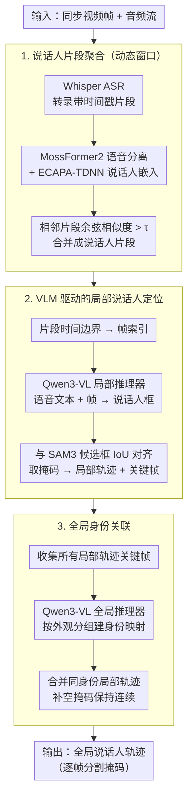

# AVTrack: Audio-Visual Tracking in Human-centric Complex Scenes

**会议**: ICML 2026  
**arXiv**: [2606.02724](https://arxiv.org/abs/2606.02724)  
**代码**: https://github.com/FudanCVL/AVTrack (有)  
**领域**: 视频理解  
**关键词**: 音视频跟踪, 实例分割, 人体中心, 多模态推理, 数据集基准

## 一句话总结

提出 AVTrack 数据集和 AVTracker 基线方法，针对复杂人体中心场景下的音视频实例分割与跟踪（AVIS）任务，通过定义 8 种挑战条件构建高难度评测基准，并设计三阶段局部-全局分治框架（ASR 分段聚合 → 局部说话人定位 → 全局身份关联），在 HOTA 指标上超越现有最优方法约 8 个百分点。

## 研究背景与动机

**领域现状**：音视频说话人跟踪（Audio-Visual Speaker Tracking）旨在利用听觉与视觉线索定位并跟踪活跃说话人。近年来音视频分割（AVS）从像素级分割发展到实例级分割与跟踪（AVIS），代表方法 AVISM 结合 Mask2Former 和 VITA 在窗口注意力下实现了内存高效的实例级音视频分割。

**现有痛点**：现有数据集和基准存在严重局限——早期说话人跟踪数据集（AV16.3、CAV3D）采集于受控实验室环境，场景单一；AVA-ActiveSpeaker 仅提供边界框且缺乏跨帧身份一致性；AVSBench 系列以 5-10 秒短片为主，无法评估长程时序建模；AVISeg 虽将时长延长到约 60 秒，但场景仍然简单，缺少相机运动、遮挡、位置变化等复杂条件，尤其在人体中心场景下表现不足。

**核心矛盾**：现有基准偏向评估静态的音视频共现关系，而非真正考验模型在复杂动态场景中的鲁棒时空建模与跨模态推理能力。简化的评测环境使得方法的真实局限被掩盖。

**本文目标**：（1）构建一个面向复杂人体中心场景的高质量 AVIS 评测基准；（2）提供一个模块化、可扩展的强基线方法，支撑后续研究。

**切入角度**：作者系统定义了 8 种复杂音视频场景条件（遮挡、位置变化、背景切换、相机运动、多实例、多轮发声、音视频不一致、尺度动态），并以此为筛选标准从多种视频来源（电视剧、电影、vlog、动画、综艺、访谈、舞台表演）构建数据集，确保场景多样性和挑战性。

**核心 idea**：通过严格定义复杂场景标准构建高难度 AVIS 基准数据集 AVTrack，并提出三阶段分治基线 AVTracker，将 ASR 驱动的动态窗口聚合、VLM 局部推理和全局身份关联有机结合。

## 方法详解

### 整体框架

AVTracker 采用分治（divide-and-conquer）策略，将人体中心 AVIS 分解为三个阶段。输入为同步的视频帧序列和音频流，输出为每个说话人的全局实例轨迹（含逐帧分割掩码）。整体流程：Stage 1 对音频进行 ASR 转录并按说话人嵌入相似度聚合为语义完整的说话人片段（Speaker Chunks）；Stage 2 在每个片段的局部时间窗口内，利用 VLM 将语音内容与可见人物关联，结合 SAM3 生成逐帧实例掩码，形成局部轨迹片段（Local Tracklets）；Stage 3 通过全局推理器跨片段关联同一说话人的局部轨迹，输出完整的全局说话人轨迹。

### 关键设计

**1. 动态窗口的说话人片段聚合（Speaker Chunks Aggregation）：把 ASR 碎片按说话人语义合并成完整片段，当作后续处理的基本单元**

ASR 输出的是带时间戳的零碎短转录，逐条独立处理既低效又割裂语义。这一步先用 Whisper 把音频转成片段 $\mathcal{C} = \{c_i = (t_i^s, t_i^e, x_i)\}$，对每段可选地用 MossFormer2 做语音分离得到增强信号 $\hat{\mathbf{a}}_i$，再用 ECAPA-TDNN 提取说话人嵌入 $\mathbf{e}_i = \mathcal{E}(\hat{\mathbf{a}}_i)$；当相邻片段的余弦相似度 $\text{sim}(c_i, c_{i+1}) > \tau$ 时就合并成一个 chunk。相比机械的固定时长窗口，按"是不是同一个人在连续说"来切分能保住完整的语义单元和时序连续性，既减少了局部窗口的数量，也让后面的全局关联更省力。

**2. VLM 驱动的局部说话人定位（Local Window Process）：在片段时间范围内把语音内容和画面里的人精确对上，并产出逐帧掩码**

复杂场景里直接拿音频特征去匹配视觉特征很脆弱。AVTracker 改走"以文本为桥"的路子：把片段 $s_k$ 的时间边界换成帧索引 $f_k^s, f_k^e$，用 Qwen3-VL 当局部推理器 $\mathcal{R}^{local}$，以语音文本 $x_k$ 和视频帧为输入预测活跃说话人的框 $\mathbf{b}_{\mathcal{R}}^{(f)}$；同时 SAM3 对每帧生成候选人物框和掩码，再用 IoU 最大化把 VLM 预测对齐到 SAM3 检测 $\mathbf{b}^{(f)} = \arg\max_{\mathbf{b} \in \mathcal{B}_{\text{SAM3}}^{(f)}} \text{IoU}(\mathbf{b}_{\mathcal{R}}^{(f)}, \mathbf{b})$，并挑掩码面积最大的帧当关键帧。让 VLM 的语言-视觉推理来建立"谁在说这句话"的语义桥梁，比传统音频特征匹配在遮挡 / 多人场景下鲁棒得多，而 SAM3 又补上了高质量的实例掩码，两者正好互补。

**3. 全局身份关联（Global Window Process）：把散落在不同时间窗口的局部轨迹按身份缝成连贯全局轨迹**

同一个说话人往往在多个不连续的片段里反复出现，光靠局部处理建不起跨片段的身份一致性。AVTracker 收集所有局部轨迹的关键帧 $\mathcal{F}_{\text{key}} = \{I_{f_k^{\text{key}}}\}_{k=1}^{K}$，交给同样基于 VLM 的全局推理器 $\mathcal{R}^{global}$ 按人物外观把关键帧分组、建立身份映射 $\mathcal{G}: p \mapsto \{k_1, k_2, \ldots\}$，最后把同一身份的所有局部轨迹合并成全局轨迹 $\mathcal{T}_p = \bigcup_{k \in \mathcal{G}(p)} \mathcal{T}_k^{\text{local}}$，无观测帧补空掩码以保持时序连续。这一步补上了局部阶段缺失的长程关联能力，让"分而治之"最终能合回一条完整轨迹。

## 实验关键数据

### 主实验

在 AVTrack 基准上对比 VIS 和 AVIS 方法，所有值为百分比：

| 方法 | 类型 | HOTA ↑ | DetA ↑ | AssA ↑ | IDF1 ↑ | MOTA ↑ |
|------|------|--------|--------|--------|--------|--------|
| VITA | VIS | 9.70 | 10.54 | 9.35 | 12.32 | 1.91 |
| LBVQ | VIS | 10.29 | 11.77 | 9.36 | 12.87 | 1.98 |
| CAVIS | VIS | 11.46 | 12.10 | 10.07 | 12.95 | 1.96 |
| AVISM | AVIS | 20.84 | 23.22 | 19.53 | 26.57 | 3.95 |
| ACVIS | AVIS | 20.60 | 22.59 | 19.66 | 26.23 | 4.23 |
| AVTrackFormer | AVIS | 21.47 | 22.51 | 20.26 | 26.41 | 4.11 |
| **AVTracker** | **AVIS** | **29.08** | **31.18** | **28.47** | **34.55** | **16.20** |

### 消融实验

| 配置 | 说明 | HOTA | DetA | AssA | IDF1 | MOTA |
|------|------|------|------|------|------|------|
| Base | Whisper-large + Qwen3-VL-8B | 28.85 | 31.75 | 27.39 | 34.45 | 16.39 |
| M1 | Whisper-small (语音模型缩小) | 25.19 | 27.33 | 24.25 | 29.92 | 14.88 |
| M2 | Qwen3-VL-4B (VLM 缩小) | 24.47 | 25.85 | 24.37 | 28.86 | 14.48 |
| M3 | 双模型同时缩小 | 24.01 | 25.49 | 23.69 | 28.47 | 13.52 |
| M4 | VLM → 人脸检测替代 | 23.62 | 24.80 | 21.31 | 27.16 | 11.03 |
| S1 | + SepFormer 语音分离 | 28.41 | 30.81 | 27.54 | 33.65 | 15.99 |
| S2 | + MossFormer2 语音分离 | 29.08 | 31.18 | 28.47 | 34.55 | 16.20 |
| C1 | 去除局部片段压缩 | 16.88 | 18.34 | 16.33 | 19.99 | 9.34 |
| C2 | 固定窗口替代动态窗口 | 27.45 | 29.57 | 26.64 | 32.97 | 13.49 |

### 关键发现

- VIS 方法在 AVTrack 上 HOTA 均低于 12，说明纯视觉线索在人体中心复杂场景中完全不足，引入音频后 AVIS 方法性能翻倍但仍不理想（约 20-21）
- AVTracker 相比最强 AVIS 基线提升约 8 个 HOTA 点，核心优势来自 VLM 驱动的跨模态推理和局部-全局分治策略
- 局部片段压缩至关重要：去除后 HOTA 从 24.01 暴跌至 16.88（-7.13），表明紧凑的局部表示是全局关联可扩展性的关键
- 语音分离需要足够高质量才有正收益：MossFormer2 提升 HOTA 0.23，而 SepFormer 反而降低 0.44，低质量分离引入噪声和时序错位
- 模型规模对两个模态都敏感：VLM 从 8B 降至 4B 时 HOTA 降 4.38，语音模型从 large 降至 small 时降 3.66

## 亮点与洞察

- **以文本作为音视频语义桥梁**：不直接匹配音频特征和视觉特征，而是通过 ASR 将音频转为文本，再用 VLM 将文本语义与视觉人物关联，这种间接对齐比端到端音视频特征匹配在复杂场景下更鲁棒。这一思路可迁移到其他跨模态对齐任务中
- **动态窗口 vs 固定窗口**：根据语义完整性（说话人片段边界）划分处理窗口，而非机械的固定时长分割，避免截断语义单元。这种设计理念适用于任何需要时序分段的视频理解任务
- **数据集设计方法论**：系统定义 8 种复杂条件并以此筛选视频，这种"先定义挑战再构建数据"的方法论值得在其他基准构建中借鉴

## 局限与展望

- AVTrack 仅作为测试集发布（871 个视频），不提供训练数据，限制了训练范式方法的公平评估
- AVTracker 依赖多个大型预训练模型（Whisper-large、Qwen3-VL-8B、SAM3），推理成本较高，难以实时部署
- 当前基线以级联方式组合各模块，误差会逐阶段累积（ASR 错误 → 片段聚合错误 → 局部定位错误 → 全局关联错误），端到端可微的统一框架可能进一步提升性能
- 语音重叠场景仍是瓶颈——语音分离质量不够高时反而损害性能，需要更鲁棒的多说话人处理方案
- 未来可探索记忆增强的 Agentic 推理、动态场景图表示等方向处理更复杂的长程音视频理解

## 相关工作与启发

- **AVISM** (CVPR 2025): 结合 Mask2Former + VITA 的 AVIS 方法，使用窗口注意力实现内存高效的实例级音视频分割
- **COMBO** (2024): 显式建模双边音视频关系的跨模态融合方法
- **SAM3** (2025): Segment Anything with Concepts，提供通用的实例分割能力，本文用作掩码采样器
- **Qwen3-VL**: 视觉语言模型，本文核心推理引擎，零样本下即可完成说话人-语音关联
- **OVIS / MOSE**: 遮挡/复杂场景视频实例分割基准，AVTrack 在音视频维度上延伸了类似的挑战定义

<!-- RELATED:START -->

## 相关论文

- [\[AAAI 2026\] R-AVST: Empowering Video-LLMs with Fine-Grained Spatio-Temporal Reasoning in Complex Audio-Visual Scenarios](../../AAAI2026/video_understanding/r-avst_empowering_video-llms_with_fine-grained_spatio-temporal_reasoning_in_comp.md)
- [\[ICML 2026\] Unified Multimodal Visual Tracking with Dual Mixture-of-Experts](unified_multimodal_visual_tracking_with_dual_mixture-of-experts.md)
- [\[ICML 2026\] RELO: Reinforcement Learning to Localize for Visual Object Tracking](relo_reinforcement_learning_to_localize_for_visual_object_tracking.md)
- [\[CVPR 2025\] H-MoRe: Learning Human-centric Motion Representation for Action Analysis](../../CVPR2025/video_understanding/h-more_learning_human-centric_motion_representation_for_action_analysis.md)
- [\[CVPR 2026\] Drift-Resilient Temporal Priors for Visual Tracking](../../CVPR2026/video_understanding/drift-resilient_temporal_priors_for_visual_tracking.md)

<!-- RELATED:END -->
