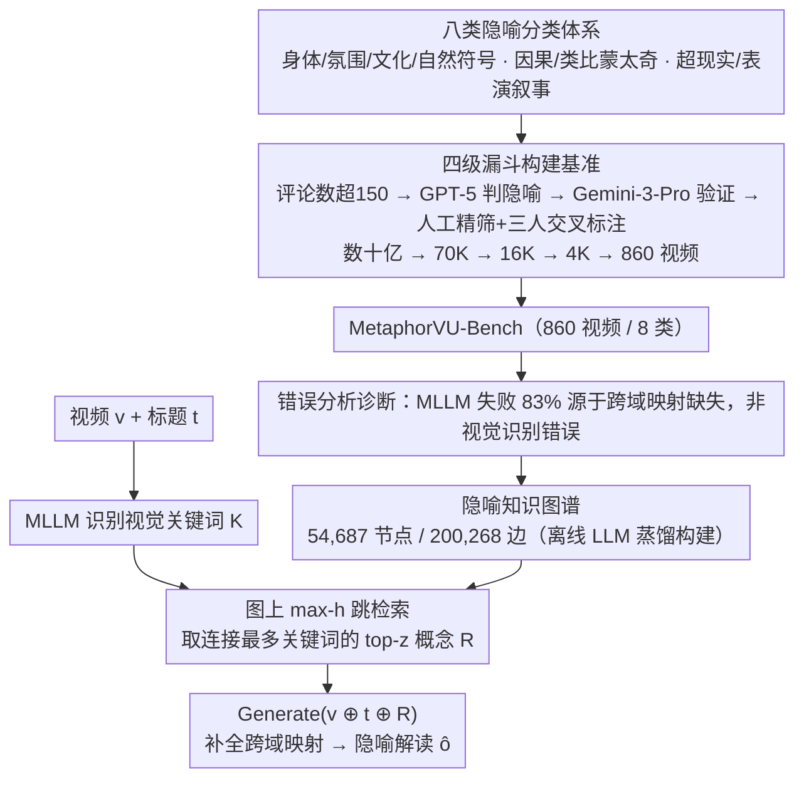

# MetaphorVU: Towards Metaphorical Video Understanding

**会议**: ICML 2026 Spotlight  
**arXiv**: [2605.25461](https://arxiv.org/abs/2605.25461)  
**代码**: 待确认  
**领域**: 视频理解 / 高阶认知  
**关键词**: 隐喻视频理解, 多模态大模型, 跨域映射, 知识图谱增强

## 一句话总结
本文提出首个隐喻视频理解基准 MetaphorVU-Bench（860 视频 + 8 类隐喻分类法）和增强方法 MetaphorBoost——通过 54K 节点 / 200K 边的隐喻知识图谱作为外部认知支架，定量揭示 MLLM 在隐喻视频上的核心瓶颈是"跨域映射缺失"而非视觉识别错误，最优模型相比人类（83.4）仍差 17 个点。

## 研究背景与动机

**领域现状**：隐喻视频广泛存在于社交媒体和公共传播，是传递复杂思想的重要媒介。然而现有 MLLM 研究主要聚焦字面感知任务（物体识别、事件描述），缺对高阶认知能力的系统研究。

**现有痛点**：当前 MLLM 难以准确理解隐喻视频。最先进的 Gemini-3-Pro 仅 63.8 分（人类 83.4），且大量现有推理增强方法（长 CoT、推理时扩展）对隐喻理解几乎无帮助——说明问题不在于"想得不够多"。

**核心矛盾**：通过错误分析发现，大多数 MLLM 失败**并非源于视觉元素识别错误**，而是缺乏将视觉元素链接到潜在概念的**跨域映射能力**——这是理解隐喻的本质。

**本文目标**：（1）构建系统的隐喻视频理解基准；（2）诊断当前模型失败根因；（3）设计针对性方法增强跨域映射。

**切入角度**：与其让 MLLM 盲目完成跨域映射，不如通过外部隐喻知识图谱作为认知支架，引导模型建立视觉元素到隐喻概念的链接——把"想得不到"转成"查得到"。

**核心 idea**：用隐喻知识图谱作为推理时增强的外部认知支架，帮助 MLLM 更有效地执行跨域映射。

## 方法详解

### 整体框架
两个主要贡献：（1）**MetaphorVU-Bench**——首个系统的隐喻视频理解基准；（2）**MetaphorBoost**——基于隐喻知识图谱的推理时增强框架。前者先用八类分类体系定义问题、再用四级漏斗筛出 860 个隐喻视频，并通过错误分析诊断出 MLLM 的瓶颈是"跨域映射缺失"；后者据此离线构建隐喻知识图谱，推理时以"识别关键词 → 多跳检索 → 拼接生成"三步补全跨域映射。

### 关键设计

**1. 八类隐喻视频分类体系：先把"隐喻视频"按认知机制切开，给基准一个理论骨架**

要系统评估 MLLM 的隐喻理解，第一步得回答"隐喻视频到底有几种"。本文基于多模态隐喻理论定义 8 种类型：身体语言（Body Language）、氛围语言（Atmosphere Language）、文化符号（Cultural Symbol）、自然符号（Naturalistic Symbol）、因果蒙太奇（Causal Montage）、类比蒙太奇（Analogical Montage）、超现实叙事（Surreal Narrative）、表演叙事（Performative Narrative）。这套分类不是凑数——不同类型对应的跨域映射难度差别很大（比如蒙太奇类要在镜头之间建立隐含的因果或类比关系，认知负担最重），因此可以细粒度地定位 MLLM 究竟在哪类隐喻上栽跟头。

**2. 四级漏斗的高质量基准构建：从数十亿视频里筛出 860 个真正有隐喻的样本**

隐喻视频在海量 UGC 里占比极低，盲筛成本不可承受。MetaphorVU 用一条逐级收紧的漏斗：先按评论数过滤（> 150 条）把数十亿降到 70K，再让 GPT-5 综合视频信息 + 字幕 + 评论判断是否存在隐喻逻辑筛到 16K，接着用 Gemini-3-Pro 验证候选降到 4K，最后人工精筛得 860 个。标注阶段强制统一格式（明确指出哪些视觉元素传达何种隐喻含义）并三人交叉验证。这样"机器粗筛降成本、人工精筛保质量"的分工，既避开了纯人工的不可扩展，也避免了纯自动筛选的噪声失控。

**3. 隐喻知识图谱 + 推理时增强：把"想不到的跨域映射"换成"查得到的外部支架"**

错误分析发现 MLLM 的失败大多不是没看见视觉元素，而是建不起"视觉元素 → 潜在概念"的跨域链接，且让它多想（长 CoT）也无济于事——说明缺的是知识而非算力。MetaphorBoost 因此构建一个 54,687 节点、200,268 边的隐喻知识图谱当外部认知支架，推理时分三步：先让 MLLM 识别视频关键词 $\mathcal{K} = \{k_1, \ldots, k_m\}$，再以 max-h-hops 在图上检索 $\mathcal{R} = \text{Top-}z(\bigcup_{i=1}^m \mathcal{N}_\mathcal{G}^h(k_i), \deg(\cdot, \mathcal{K}))$（取连接最多关键词的 $z$ 个目标节点），最后把检索到的隐喻概念拼到视频和标题后生成解读 $\hat{\tau}, \hat{o} = \text{Generate}(v \oplus t \oplus \mathcal{R})$。用图而不是平面文本，是因为隐喻链接往往要多跳才能从字面跳到寓意，而知识图谱天然支持多跳查询；用隐喻专用图而不是 ConceptNet，则是因为消融显示通用常识帮不上这种特定映射。

### 训练策略
MetaphorBoost 是 **推理时无训练增强**，无需更新 MLLM 参数；知识图谱构建通过 LLM 蒸馏 + 人工校验离线完成。

## 实验关键数据

### 主实验

| 模型 | Body L. | Atmosp. | Cultural | Natural | Causal M. | Analog M. | Surreal | Perform. | 平均 |
|------|---------|---------|----------|---------|-----------|-----------|---------|----------|------|
| 人类 | 87.8 | 87.5 | 89.1 | 83.8 | 72.0 | 81.5 | 78.1 | 78.0 | **83.4** |
| GPT-5 | 69.9 | 76.3 | 77.4 | 66.6 | 45.0 | 55.4 | 54.9 | 46.1 | 63.7 |
| Gemini-3-Pro | 71.2 | 74.0 | 75.1 | 66.9 | 49.4 | 58.9 | 51.1 | 48.1 | 63.8 |
| Qwen3-VL-8B | 56.0 | 66.1 | 68.8 | 60.8 | 33.2 | 45.0 | 39.3 | 29.2 | 52.0 |
| **MetaphorBoost (Gemini-3-Pro)** | 71.5 | 76.3 | 77.5 | 66.9 | **57.2** | 59.1 | **57.3** | 50.8 | **66.1** |
| **MetaphorBoost (Qwen3-VL-8B)** | **61.8** | **71.0** | **71.8** | 61.3 | 36.7 | 47.1 | **45.7** | 31.5 | **55.9** |

关键观察：（1）所有 MLLM 在因果蒙太奇和类比蒙太奇上特别差（45.0 和 55.4）——这两类需要最多跨域映射，证实增强映射的必要性；（2）MetaphorBoost 在各模型上一致改进，且在需要跨域映射最多的类型上改进最大（因果蒙太奇 +7.8）。

### 消融实验

| 配置 | 平均得分 | 说明 |
|------|---------|------|
| MetaphorBoost 完整 | 55.9 | 完整模型 |
| w/o 外部增强 | 53.4 | 直接问 MLLM 不用 KG，-2.5 |
| w/o 图结构 | 54.3 | 原始文本检索代替 KG，-1.6 |
| w/o 隐喻导向 | 52.5 | 通用常识图 ConceptNet 代替，-3.4 |

三个关键因素都有效——外部知识补偿 MLLM 缺陷（-2.5）、图结构比文本更有效（-1.6）、隐喻特定知识优于通用常识（-3.4）。

### 关键发现
- 跨域映射改进需要细粒度、结构化、隐喻专用的知识——三个特性缺一不可。
- 基础模型越差改进幅度越大（Qwen3-VL-8B +3.8% > Gemini-3-Pro +2.3%）——MetaphorBoost 是补偿型增强。
- 最好的组合（Gemini-3-Pro + MetaphorBoost = 66.1）相对人类（83.4）仍差 17.3 分——表明跨域映射只是部分瓶颈，仍有大改进空间。

## 亮点与洞察
- **系统性 + 完备性的基准**：首个隐喻视频理解基准兼具理论基础（8 种分类）、数据规模（860 视频）和严格质控（多阶段筛选 + 交叉验证）。
- **诊断性的错误分析**：通过量化分解（83% 的失败来自映射缺陷而非识别错误），精准指出 MLLM 隐喻理解症结，为后续改进指明方向。
- **推理时增强的有效性**：无需重训练即可稳定改进任意 MLLM；知识图谱的多跳特性比平面文本更有效。
- **隐喻知识的价值**：消融明确证明隐喻特定知识相比通用常识有 3.4 分优势，启发高阶认知任务使用领域专用知识库。

## 局限与展望
- 知识图谱覆盖性：54K 节点对新颖隐喻可能覆盖不足。
- 关键词识别准确性：MetaphorBoost 第一步依赖 MLLM；识别错误会污染后续查询。
- 模型规模限制：仅评估 $\leq$ 235B MLLM，更大规模模型表现未知。
- 最优组合（66.1）距人类（83.4）仍差 17.3 分，可探索更深层多跳推理或视觉-概念对齐。

## 相关工作与启发
- **vs 广告隐喻工作**（Kalarani 2024、Long 2025）：彼此聚焦特定领域（广告），本文系统分类 + 多源数据覆盖更广范围；提供细粒度错误诊断。
- **vs MMR-V**（Zhu 2026）：MMR-V 评估推理能力广谱（隐喻只是其中一个），本文深度专注隐喻提供更细致分析。

## 评分
- 新颖性: ⭐⭐⭐⭐⭐  首个系统化隐喻视频理解基准 + 诊断性分析 + 知识增强方法，三管齐下解决 MLLM 高阶认知瓶颈。
- 实验充分度: ⭐⭐⭐⭐⭐  11 个 MLLM + 5 种推理增强方法 + 详细错误分析 + 多角度消融，开源闭源大小模型齐全。
- 写作质量: ⭐⭐⭐⭐  逻辑清晰，从问题诊断 → 方案设计 → 对比验证步步深入；消融实验设计精细。
- 价值: ⭐⭐⭐⭐⭐  系统性基准填补研究空白；诊断结果对 MLLM 改进有直接指导意义；知识增强思路可迁移到其他高阶认知任务。

<!-- RELATED:START -->

## 相关论文

- [\[CVPR 2026\] Video Panels for Long Video Understanding](../../CVPR2026/video_understanding/video_panels_for_long_video_understanding.md)
- [\[ICML 2026\] Video-MTR: Reinforced Multi-Turn Reasoning for Long Video Understanding](video-mtr_reinforced_multi-turn_reasoning_for_long_video_understanding.md)
- [\[CVPR 2026\] Towards Sparse Video Understanding and Reasoning](../../CVPR2026/video_understanding/towards_sparse_video_understanding_and_reasoning.md)
- [\[CVPR 2026\] Efficient Frame Selection for Long Video Understanding via Reinforcement Learning](../../CVPR2026/video_understanding/efficient_frame_selection_for_long_video_understanding_via_reinforcement_learnin.md)
- [\[ICML 2026\] VideoTemp-o3: Harmonizing Temporal Grounding and Video Understanding in Agentic Thinking](videotemp-o3_harmonizing_temporal_grounding_and_video_understanding_in_agentic_t.md)

<!-- RELATED:END -->
