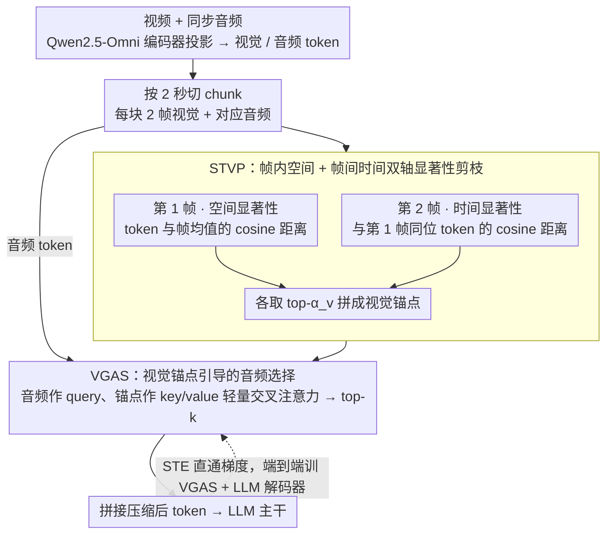

# OmniSIFT: Modality-Asymmetric Token Compression for Efficient Omni-modal Large Language Models

**会议**: ICML 2026  
**arXiv**: [2602.04804](https://arxiv.org/abs/2602.04804)  
**代码**: https://github.com/dingyue772/OmniSIFT  
**领域**: 多模态 VLM / 视频理解 / 模型压缩  
**关键词**: Omni-LLM、Token 压缩、视频-音频理解、时空剪枝、视觉引导

## 一句话总结
本文指出现有 Omni-LLM token 压缩方法对音频和视频"对称"处理是次优的，提出 OmniSIFT——先用时空显著性剪掉视频冗余得到"视觉锚点"，再用这些锚点引导音频选择的两阶段非对称压缩框架，仅引入 4.85M 额外参数就在 Qwen2.5-Omni-7B 上保留 25% token 时一致超过现有压缩基线甚至原模型。

## 研究背景与动机

**领域现状**：Omni-LLM（Qwen2.5-Omni、GPT-4o、Gemini）把视频、音频、文本统一进自回归 LLM 做联合推理。但视频是高密度连续帧、音频要高时间分辨率编码，一个 20 秒的多模态 clip 就能产生 20K+ token，长 token 序列让推理算力代价爆炸。

**现有痛点**：视觉中心 MLLM 已有大量 token 压缩研究（FastV、VidCom2、TimeChat-Online 等），但直接迁移到 Omni-LLM 不可行。现有 Omni 压缩方法可分两派：（1）modality-decoupled——音视频独立压缩，完全忽略跨模态语义依赖；（2）modality-symmetric——OmniZip 用音频注意力分数指导视频剪枝（依赖注意力分数让它和 FlashAttention 不兼容），EchoingPixels 加 4 个 LLM 解码层做全局跨模态上下文化（代价大、压缩延后）。两者都把音视频当成等量级信息源。

**核心矛盾**：人类感知音视频本来就是非对称的——视频冗余可以从视觉流内部估算（帧内空间冗余 + 帧间时间冗余），但音频显著性更依赖上下文，往往需要视觉场景作为语义锚点（可见的说话人、有视觉支撑的事件）。把两个模态对称处理实际上把压缩任务塌缩成"选时间位置"而忽略了模态特有的语义线索。

**本文目标**：（1）让压缩遵循视觉引导的非对称范式；（2）保持轻量级（额外参数 ≪ 主干）；（3）和 FlashAttention 等高效算子兼容（不依赖注意力分数）。

**切入角度**：先用纯结构信号（cosine 距离）剪掉视频冗余，得到一组紧凑的"视觉锚点"，再用这些锚点指导音频 token 的选择。这样视频压缩用模态内部信号，音频压缩用跨模态条件，分工明确。

**核心 idea**：modality-asymmetric, vision-guided 两阶段压缩——STVP（Spatio-Temporal Video Pruning）做帧内空间显著性 + 帧间时间显著性的双轴剪枝，VGAS（Vision-Guided Audio Selector）用剪枝后的视觉锚点做条件来选音频 token。

## 方法详解

### 整体框架
输入：视频 $\mathcal{V}$ 和同步音频 $\mathcal{A}$，经 Qwen2.5-Omni 的编码器-投影器映射成 token 序列 $\mathbf{Z}_v \in \mathbb{R}^{N_v \times D}$ 和 $\mathbf{Z}_a \in \mathbb{R}^{N_a \times D}$。为保持时间对齐，按 2 秒一个 chunk 把音视频 token 分块成 $\mathcal{C}_t = [\mathbf{Z}_v^{(t)}; \mathbf{Z}_a^{(t)}]$，每个 chunk 含 2 帧视觉 + 对应音频。OmniSIFT 在 chunk 级别串行执行两阶段：（1）STVP 剪掉每个 chunk 的视觉冗余得到压缩视觉序列 $\hat{\mathbf{Z}}_v^{(t)}$；（2）VGAS 用 $\hat{\mathbf{Z}}_v^{(t)}$ 作为条件从 $\mathbf{Z}_a^{(t)}$ 中选音频 token。整个框架端到端可导（用 straight-through estimator 处理 top-k 选择），训练时优化 token 选择能尽量保留下游任务性能。

### 关键设计

**1. STVP：帧内空间 + 帧间时间双轴显著性剪枝**

视频 token 里塞着两类冗余：同一帧中与背景相似的 patch（空间冗余），和相邻帧里相对前一帧没变化的 patch（时间冗余）。STVP 把一个 2 秒 chunk 的两帧分开处理。第一帧 $\mathbf{F}_1^{(t)}$ 做空间显著性——先 mean-pool 出帧表征 $\bar{\mathbf{v}}_1^{(t)} = \frac{1}{n_p}\sum_i \mathbf{v}_{1,i}^{(t)}$，每个 token 的得分是它和均值的 cosine 距离 $s_{1,i}^{(t)} = 1 - \frac{\mathbf{v}_{1,i}^{(t)} \cdot \bar{\mathbf{v}}_1^{(t)}}{\|\mathbf{v}_{1,i}^{(t)}\|\|\bar{\mathbf{v}}_1^{(t)}\|}$，分高即"和背景最不同"。第二帧 $\mathbf{F}_2^{(t)}$ 做时间显著性——靠位置编码做一一对应，得分是它和第一帧同位置 token 的 cosine 距离 $s_{2,i}^{(t)} = 1 - \frac{\mathbf{v}_{2,i}^{(t)} \cdot \mathbf{v}_{1,i}^{(t)}}{\|\mathbf{v}_{2,i}^{(t)}\|\|\mathbf{v}_{1,i}^{(t)}\|}$，分高即"动起来的"区域。两帧各按视觉保留比 $\alpha_v = 1 - \rho_v$ 选 top-$\hat{n}_p = \alpha_v n_p$ 后拼成 $\hat{\mathbf{Z}}_v^{(t)} = [\hat{\mathbf{F}}_1^{(t)}; \hat{\mathbf{F}}_2^{(t)}]$。纯用 cosine 距离而非注意力分数，是为了和 FlashAttention 兼容（OmniZip 那条路被注意力依赖锁死）；两帧分别用空间 / 时间标准则是怕双轴混在一帧里互相干扰——第一帧只问"这帧有什么独特内容"，第二帧只问"这一秒发生了什么变化"。

**2. VGAS：视觉锚点引导的音频 token 选择**

这是非对称设计的核心。OmniSIFT 把 STVP 剪枝后保留的视觉 token $\hat{\mathbf{Z}}_v^{(t)}$ 当成"视觉锚点池"，用一个**轻量交叉注意力**层（8 头、隐藏维 512，外接一个 MLP 打分头）算每个音频 token 的显著性：音频 token 作 query $\mathbf{Q}_a$，剪枝后的视觉锚点作 key $\mathbf{K}_v$ 和 value $\mathbf{V}_v$，注意力输出经打分头得到 $s_{a,j}^{(t)}$，再按 $\alpha_a$ 比例选 top-k。也就是说音频显著性完全条件于视觉场景，而不靠音频自身的内部信号（OmniZip 用的是音频注意力）。这么做的依据是感知科学（Koppen 2008, Zhao 2018）：人处理音视频本就不对称，视频内部冗余可估，但音频显著性依赖视觉锚点（说话人可不可见、事件有没有视觉支撑），所以对 Omni-LLM 的有效压缩应当是"视觉引导"而非对称对待两个模态。

**3. STE 端到端微调与轻量参数预算：让 top-k 选择可导，用极小参数把压缩管线训进 LLM**

top-k 在反向是离散不可导的，OmniSIFT 用 straight-through estimator（STE）——前向给每个音频 token 生成 0/1 硬掩码 $m_j$（显著性进 top-k 取 1，否则取 0），只把选中的 token 喂进 LLM；反向用恒等代理梯度 $\partial m_j/\partial s_{a,j}^{(t)}\approx 1$ 让梯度直接流回显著性分数，于是整条 STVP + VGAS 管线能端到端训。这里要分清参数账：STVP 全程只算 cosine 距离、**没有可学参数**；4.85M 额外参数全在 VGAS 那个交叉注意力 + 打分头上（不到 7B 主干的 0.1%）。训练时**微调 LLM 解码器 + VGAS 模块**（学习率 $1\times10^{-5}$、批大小 128），而非冻结主干——为公平对比，基线也都接在同样微调过的 Qwen2.5-Omni 主干上。相比 EchoingPixels 加 4 个 LLM 解码层做全局上下文化，这 4.85M 是真正的"轻量插件"、不会拉长推理路径；又因为剪视频时不算注意力分数，端到端延迟和 training-free 的 OmniZip / DyCoke 持平甚至更低。

### 损失函数 / 训练策略
用标准 next-token prediction 的下游任务损失，借 STE 把不可导的 top-k 选择接进反向传播，**微调 LLM 解码器 + VGAS 模块**（STVP 无可学参数），学习率 $1\times10^{-5}$、批大小 128。压缩率 $\rho_v, \rho_a$ 是超参，论文主要测 35% 和 25% 保留比例两档。

## 实验关键数据

### 主实验
在 5 个音视频基准（WorldSense、OmniVideoBench、VideoMME 三个子集、video-SALMONN-2 testset、DailyOmni）上对比 OmniZip、Random、DyCoke 三个压缩基线和满 token 模型。主干模型 Qwen2.5-Omni-7B / Qwen2.5-Omni-3B。

Qwen2.5-Omni-7B 在 25% 保留比例下的对比：

| 方法 | 保留率 | WorldSense ↑ | OmniVideoBench ↑ | VideoMME Avg ↑ | video-SALMONN-2 Total ↓ |
|------|-------|--------------|-------------------|----------------|-------------------------|
| Full Tokens | 100% | 49.7 | 35.6 | 67.6 | 48.1 |
| OmniZip | 25% | 48.1 | 34.1 | 66.0 | 57.2 |
| Random | 25% | 47.1 | 32.6 | 66.1 | 56.9 |
| DyCoke | 25% | 48.1 | 34.1 | 65.9 | 56.3 |
| **OmniSIFT** | **25%** | **49.9** | **35.4** | **68.2** | **51.2** |

Qwen2.5-Omni-7B 在 35% 保留比例下，OmniSIFT 的 WorldSense (50.0)、OmniVideoBench (35.6)、VideoMME Avg (68.3) 都达到或超过满 token 基线（49.7 / 35.6 / 67.6）。

### 消融实验
论文报告了 Qwen2.5-Omni-3B 的对照（小模型上 OmniSIFT 优势同样保持）：

| 方法 | 保留率 | WorldSense ↑ | OmniVideoBench ↑ | video-SALMONN-2 Total ↓ |
|------|-------|--------------|-------------------|-------------------------|
| Full Tokens | 100% | 45.8 | 33.5 | 53.6 |
| OmniZip | 25% | 43.8 | 32.4 | 62.1 |
| **OmniSIFT** | **25%** | **45.8** | **33.1** | **58.3** |

额外参数与延迟：OmniSIFT 仅引入 4.85M 参数（远低于 EchoingPixels 加 4 个解码层），且推理延迟低于 training-free 的 OmniZip，因为不需要计算注意力分数。

### 关键发现
- **25% 保留比例下超过满 token 模型**：在 WorldSense 和 VideoMME Avg 上甚至超过 Full Tokens 基线（49.9 vs 49.7、68.2 vs 67.6），说明大部分 token 其实是冗余甚至有害的，去掉反而提升信噪比。
- **非对称 > 对称**：和 OmniZip（对称模式的 SOTA）的差距在所有基准上一致存在（25% 保留率下 WorldSense +1.8、video-SALMONN-2 Total -6.0），证实视觉引导音频是更优范式。
- **跨模型尺寸保持**：在 7B 和 3B 主干上压缩收益都保持，说明方法对模型规模不敏感。
- **video-SALMONN-2 的幻觉指标改善明显**：Total（Miss + Hal）从 OmniZip 的 57.2 降到 OmniSIFT 的 51.2，说明保留正确的视觉-音频对齐 token 还能减少模型幻觉。

## 亮点与洞察
- **从感知科学反推压缩范式**：作者从人类视听处理的不对称性出发设计非对称压缩，这种"先理解人是怎么做的再做工程"的思路在 Omni-LLM 这种新兴方向上非常值得借鉴。
- **避开 attention 分数依赖**：纯用 cosine 距离做显著性，让方法和 FlashAttention 兼容——这是工程上很有价值的设计选择，OmniZip 这条路被注意力分数依赖锁死。
- **轻量 4.85M 参数 + 低延迟**：在压缩方法普遍要么加大解码层（EchoingPixels）要么算 attention 开销（OmniZip）的背景下，OmniSIFT 提供了真正的"插件级"方案。
- **"少而精"超过 "多而冗"**：25% token 超过 100% token 这个反直觉结果说明 Omni 输入序列里相当一部分 token 是噪声，未来工作可以更激进探索更高压缩率。
- **空间/时间显著性分两帧处理**：避免在单帧上同时考虑两轴互相干扰，是一个简单但有效的工程技巧。

## 局限与展望
- **2 秒固定 chunk 粒度**：硬绑定 Qwen2.5-Omni 的对齐粒度，对其他 Omni-LLM（不同 chunk size）需要重新调参，可移植性有限。
- **每个 chunk 仅 2 帧的假设**：长视频快速运动场景下，2 帧不足以捕获完整动态；论文没讨论可变帧率或自适应 chunk 切分。
- **query-agnostic 的固定 token 预算**：VGAS 给定的保留比例与下游问题无关（query-agnostic），同一段视频不论问什么都剪成同一套 token；论文也承认任务相关的 query-guided 自适应剪枝（按问题保留关键证据）是更优但尚未探索的方向。
- **音频引导视觉的反向场景**：在"听觉为主，视觉为辅"的场景（如只听音乐看 album cover），单向视觉引导是否依然最优值得研究。
- **训练数据和泛化**：论文没明说在哪些数据上训 OmniSIFT 模块，跨域泛化（新任务、新数据集）的稳定性还需更多实验。

## 相关工作与启发
- **vs OmniZip（modality-symmetric）**：OmniZip 用音频注意力做对称压缩，OmniSIFT 用 cosine 显著性做非对称压缩——所有 5 个基准都更优，且兼容 FlashAttention。
- **vs EchoingPixels（modality-symmetric）**：EP 加 4 层 LLM 解码器做全局上下文化，代价大且压缩延后；OmniSIFT 用 4.85M 参数前置压缩，工程友好得多。
- **vs FASTAV / DyCoke**：这些方法主要在 LLM 推理阶段做音视频剪枝；OmniSIFT 在 LLM 输入前压缩，可以独立部署。
- **vs 视觉中心方法（VidCom2 / TimeChat-Online）**：这些方法只处理视觉流；OmniSIFT 把视觉方法的洞察（空间冗余 + 时间冗余）做了具体实现，并扩展到音频引导。
- **vs 视觉 token 压缩通用研究（FastV、PruMerge 等）**：这些工作奠定了"基于结构信号剪 token"的范式；OmniSIFT 是这条线在 Omni 模型上的自然延伸。

## 评分
- 新颖性: ⭐⭐⭐⭐ 非对称压缩的思路明确反对了之前对称范式，cosine 显著性 + 视觉引导音频的组合在 Omni-LLM 上是新设计。
- 实验充分度: ⭐⭐⭐⭐ 5 个基准 + 2 种模型尺寸 + 多压缩率，参数和延迟对比也清晰；可惜没和 EchoingPixels 直接对比。
- 写作质量: ⭐⭐⭐⭐ 三段式设计原则 → 双阶段架构 → 实验链条非常清楚，公式记号工整。
- 价值: ⭐⭐⭐⭐ 对 Omni-LLM 部署是实用插件——4.85M 参数 + 兼容 FlashAttention + 25% token 不掉点，工业价值高。

<!-- RELATED:START -->

## 相关论文

- [\[CVPR 2026\] Token Reduction via Local and Global Contexts Optimization for Efficient Video Large Language Models](../../CVPR2026/video_understanding/token_reduction_via_local_and_global_contexts_optimization_for_efficient_video_l.md)
- [\[ICLR 2026\] FlashVID: Efficient Video Large Language Models via Training-free Tree-Based Spatiotemporal Token Merging](../../ICLR2026/video_understanding/flashvid_efficient_video_large_language_models_via_training-free_tree-based_spat.md)
- [\[CVPR 2025\] VoCo-LLaMA: Towards Vision Compression with Large Language Models](../../CVPR2025/video_understanding/voco-llama_towards_vision_compression_with_large_language_models.md)
- [\[CVPR 2026\] StreamingTOM: Streaming Token Compression for Efficient Video Understanding](../../CVPR2026/video_understanding/streamingtom_streaming_token_compression_for_efficient_video_understanding.md)
- [\[CVPR 2026\] An Efficient Token Compression Framework for Visual Object Tracking](../../CVPR2026/video_understanding/an_efficient_token_compression_framework_for_visual_object_tracking.md)

<!-- RELATED:END -->
