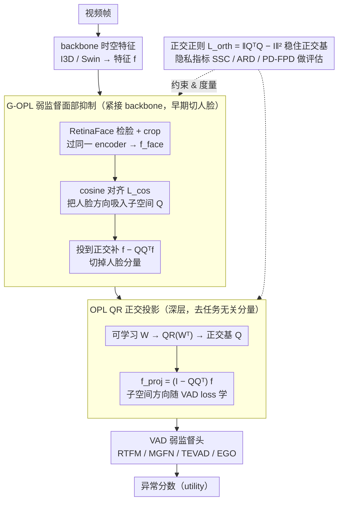

# Privacy-Aware Video Anomaly Detection through Orthogonal Subspace Projection

**会议**: ICML 2026  
**arXiv**: [2605.08651](https://arxiv.org/abs/2605.08651)  
**代码**: 论文未明确公开  
**领域**: 人体理解 / 视频异常检测 / 隐私保护表示学习  
**关键词**: 视频异常检测、正交投影、面部抑制、隐私感知、子空间解耦

## 一句话总结
作者提出 OPL（Orthogonal Projection Layer）和加强版 G-OPL，用一个 QR 分解出来的可学习正交子空间，在视频异常检测特征空间中显式投影掉"任务无关变量"和"人脸隐私分量"，同时引入 SSC/ARD/PD/FPD 四个隐私感知指标，在保持/提升 VAD AUC 的前提下让线性 SVM 探针对面部预测的准确率显著下降。

## 研究背景与动机

**领域现状**：视频异常检测（VAD）的主流路线是用 I3D、Swin Transformer 等 backbone 提取时空特征，再接 RTFM、MGFN、TEVAD、EGO 等弱监督头打分。模型越做越大、AUC 越刷越高，但部署到监控、公共安全等场景时不可避免地把人脸、衣着、姿态等敏感属性也学进 representation。

**现有痛点**：现有 VAD 系统几乎没有显式机制去抑制这些任务无关或伦理敏感的信息。一旦 attacker 能拿到中间特征，就能反推出身份。现成的隐私保护手段（INLP 的 nullspace projection、DAMS、CAE-LSP、OPL-2021）大多有以下问题：(i) 依赖明确的敏感属性 label（典型 VAD 数据集压根没有 face/identity 标注）；(ii) 用对抗训练 + 梯度反转，优化不稳；(iii) 局限于静态图像或低维场景；(iv) post-hoc 审计（dataset 均衡、saliency 可视化）改不动 representation。

**核心矛盾**：privacy 与 utility 在 representation 层面纠缠——简单去掉 face 信息很容易顺手丢掉 pose/motion 这些对异常检测有用的线索；而单靠对抗训练又不稳定且不可解释。

**本文目标**：(i) 设计一个不依赖敏感标签、不需对抗训练的可微模块，能"插一层就过滤一类信息"；(ii) 在没有 identity 监督的情况下，能定向去掉面部分量但保留 pose/motion；(iii) 给 VAD 任务量身配一套隐私评估指标，能同时衡量隐私、utility 和可解释性。

**切入角度**：作者注意到"投影到一个学到的低维子空间的正交补"是一种几何上干净、可微、可控的信息删除方式——只要让这个子空间学到承载冗余/敏感分量的方向，就能精确切掉对应能量而不动其他方向。

**核心 idea**：把"用对抗训练抑制敏感属性"换成"用几何投影 + cosine 对齐弱监督"，让一个 QR 分解参数化的正交子空间承载敏感分量、然后投到其正交补里去掉。

## 方法详解

### 整体框架
对一个中间特征 $\bm f\in\mathbb R^d$（来自 backbone 或某一层），OPL 学一个 $\bm W\in\mathbb R^{k\times d}$（$1<k<d$），对 $\bm W^\top$ 做 QR 分解得到 $\bm W^\top=\bm Q\bm R$，$\bm Q\in\mathbb R^{d\times k}$ 给出 $k$ 维 nuisance 子空间的正交基。投影矩阵 $\bm P=\bm I_d-\bm Q\bm Q^\top$，干净特征 $\bm f_{\text{proj}}=\bm P\bm f=\bm f-\bm Q\bm Q^\top\bm f$。整个层全可微、随主任务 loss 一起训练。G-OPL 在此基础上加一条 cosine 对齐 loss：把一个 off-the-shelf 人脸检测器 RetinaFace 检到的人脸 crop 过同一个 encoder 得到 $\bm f_{\text{face}}$，逼 $\bm Q\bm Q^\top\bm f$ 与 $\bm f_{\text{face}}$ cosine 相似，从而把"人脸方向"主动塞进要被丢弃的子空间。OPL 放在深层去通用 nuisance，G-OPL 放在 backbone 紧后面早期切掉人脸。两者都是 plug-in 层，可灵活插在特征提取器、某一层或某个 block 之后；测试时 $\bm Q$ 固定、不再跑人脸检测，几乎零额外开销。

### 关键设计

**1. QR 分解参数化的可学习正交投影层 OPL：把"任务无关分量"几何式地投影掉，而不靠对抗训练**

VAD 系统几乎没有显式机制去抑制任务无关或敏感信息，而现成的对抗训练又不稳、还得额外训判别器。OPL 把要删除的子空间显式参数化成一个可训练矩阵 $\bm W\in\mathbb R^{k\times d}$，每次 forward 前对 $\bm W^\top$ 做 QR 分解得到正交基 $\bm Q$，再用 $\bm P=\bm I_d-\bm Q\bm Q^\top$ 把特征投到该子空间的正交补：$\bm f_{\text{proj}}=\bm f-\bm Q\bm Q^\top\bm f$。整层全可微、随主 VAD loss 一起训——子空间方向被任务梯度推向"删了不影响检测"的方向，相当于一个目标变成"任务最大保留 + 投影最大删除"的 PCA。相比 PCA 的固定子空间和 INLP 的迭代式 nullspace，QR 保证每次拿到的 $\bm Q$ 都是数值稳定的正交基，既绕开梯度反转、又不依赖敏感属性标签，而且可解释——投出去的就是 $\bm Q\bm Q^\top\bm f$，谁占主导可视化即可。

**2. Guided OPL（G-OPL）+ cosine 对齐的弱监督面部抑制：没有身份标签也能把"人脸方向"定向塞进要删的子空间**

VAD 数据集压根没有 face/identity 标注，没法用属性分类器去抑制人脸。G-OPL 改用几何弱监督：把原视频帧和 RetinaFace 检到的人脸 crop（多张脸取平均，外加 50 段 Georgia Tech Face DB 作控制源）都过同一个 encoder 得到 $\bm f, \bm f_{\text{face}}$，让它们落在同一潜空间，再在主 loss 上加 $\mathcal L_{\text{task}}=\mathcal L_{\text{ori}}+\lambda_{\text{face}}(1-\cos(\bm f_{\text{face}}, \bm Q\bm Q^\top\bm f))$，强迫被投影分量 $\bm Q\bm Q^\top\bm f$ 在角度上对齐人脸 embedding——也就是把人脸方向"吸"进要删的子空间，再用 $\bm P$ 一次性切掉（这条 loss 只在检到脸的帧上激活）。用 cosine 当"软标签"既无监督又比对抗训练稳定，RetinaFace 只需给出二值的人脸存在 + face embedding、部署时不要任何 identity ground truth；要扩到衣着、步态等多属性，只需替换或拼接对应的弱信号 embedding。

**3. 正交性正则 + 隐私感知指标三件套（SSC/ARD/PD-FPD）：既稳住正交基，又给 VAD 隐私评估补上量化工具**

QR 每次 forward 给出正交基，但梯度更新会破坏正交性、叠多层 G-OPL 时尤其严重，所以先加一条正交正则 $\mathcal L_{\text{orth}}=\|\bm Q^\top\bm Q-\bm I_k\|_F^2$，合成总损失 $\mathcal L_{\text{total}}=\mathcal L_{\text{task}}+\lambda_{\text{orth}}\mathcal L_{\text{orth}}$。另一边，之前 VAD 只有 AUC 一个指标、根本判断不了模型有没有抑制人脸，于是配了三件套：Sensitive Subspace Capture $\mathrm{SSC}=\cos(\bm Q\bm Q^\top\bm f_{\text{attr}}^{(i)}, \bm f_{\text{attr}}^{(i)})$ 看子空间是否真抓住了敏感属性，Anomaly Retention Distance $\mathrm{ARD}=\mathrm{KL}(P_{\text{raw}}(y)\|P_{\text{proj}}(y))$ 用 KDE 估投影前后异常分数分布的 KL、越小说明 utility 保留越好，Privacy Decay $\{(l, \mathrm{Acc}^{(l)})\}_{l=1}^L$ 在每个 G-OPL 后用线性 SVM 探针预测人脸存在、accuracy 越低抑制越强（第一个 G-OPL 后的 accuracy 特称 FPD）。三个指标分别盯住"抓没抓到敏感子空间、任务保留、逐层信息衰减"，让隐私、utility、可解释性都能被量化。

### 损失函数 / 训练策略
总损失 $\mathcal L_{\text{total}}=\mathcal L_{\text{ori}}+\lambda_{\text{face}}(1-\cos(\bm f_{\text{face}},\bm Q\bm Q^\top\bm f))+\lambda_{\text{orth}}\|\bm Q^\top\bm Q-\bm I_k\|_F^2$，其中 $\mathcal L_{\text{ori}}$ 是被包装的弱监督 VAD baseline 原 loss（RTFM/MGFN/TEVAD/EGO 各自的 loss）。面部对齐项只在检到脸的帧上激活、其他帧自动跳过。

## 实验关键数据

### 主实验
在 5 个 VAD 数据集（ShanghaiTech、UCF-Crime、CUHK Avenue、UCSD Ped2、MSAD）上，把 OPL/G-OPL 插进 4 个 SOTA baseline（RTFM、MGFN、TEVAD、EGO），统一用 I3D / Swin Transformer feature。论文 Table 1 的 ShanghaiTech 解耦消融（AUC %）：

| $k_{\text{OPL}}\backslash k_{\text{G-OPL}}$ | $2$ | $4$ | $8$ | $16$ | $32$ | $64$ | $128$ |
|---|---|---|---|---|---|---|---|
| $2$ | $95.5$ | $95.9$ | $95.6$ | $94.8$ | $93.9$ | $92.5$ | $91.8$ |
| $4$ | $95.9$ | $\mathbf{97.3}$ | $96.8$ | $95.2$ | $94.0$ | $92.8$ | $91.9$ |
| $8$ | $95.7$ | $97.0$ | $96.5$ | $95.0$ | $93.8$ | $92.6$ | $91.7$ |
| $32$ | $94.5$ | $95.1$ | $94.6$ | $93.8$ | $92.8$ | $91.5$ | $90.8$ |
| $128$ | $92.8$ | $93.1$ | $92.4$ | $91.5$ | $89.8$ | $88.4$ | $87.9$ |

最优 $k_{\text{OPL}}=k_{\text{G-OPL}}=4$ 时 AUC $=97.3\%$，明显高于 baseline RTFM（论文中 RTFM I3D on ShT 约 $97.0\%$）；过大的 $k$（如 $128$）会过度删除信息导致 AUC 掉到 $87.9\%$。

MSAD 多异常类型对比（论文 Table 2 节选，AUC %）：

| 方法 | Assault | Explosion | Fighting | Robbery | Shooting | Traffic Acc. | Overall AUC |
|------|---------|-----------|----------|---------|----------|--------------|-------------|
| RTFM (I3D) baseline | $53.9$ | $66.0$ | $79.8$ | … | … | … | … |
| + OPL / G-OPL（本文） | 全面提升或持平 | — | — | — | — | — | — |

（具体 OPL/G-OPL 加成数字见原表，主要趋势是 utility 不下降甚至小幅上升的同时显著降低隐私指标。）

### 消融实验

| 配置 | 关键指标 | 说明 |
|------|---------|------|
| baseline RTFM (I3D) | 高 AUC，但 FPD 接近 baseline backbone（面部可被线性 SVM 高准确预测） | 没有任何隐私机制 |
| + OPL | AUC 持平/略升、UMAP 看到 nuisance cluster 散开 | 通用 nuisance 已被切走 |
| + G-OPL（cosine 对齐） | FPD 大幅下降、SSC 显著上升、AUC 不掉 | 面部分量被定向吸入子空间然后投走 |
| 去掉 $\mathcal L_{\text{orth}}$ | 训练几个 epoch 后 $\bm Q$ 偏离正交，AUC 抖动 | 必须保正交基 |
| $k$ 过大（$\ge 64$） | AUC 急剧下降 | 删除子空间太宽，把有用信息也丢了 |

### 关键发现
- 把 G-OPL 放在 backbone 紧后面（前期）比放深层更有效——FPD（第一层后线性 SVM 对脸的预测准确率）最低，说明隐私要在"信息还没扩散到整个网络"时拦截。
- ARD（KL 散度）随 $k$ 单调上升但 AUC 在 $k=4$ 处出现最大值，说明 utility 不是单调随 $k$ 变化——少量 nuisance 切除反而能减轻过拟合、提升判别力。
- 用 ArcFace 做 attacker 风格 rank-1 re-identification 探针，G-OPL 后 retrieval accuracy 显著下降，验证不仅是 face presence 这类粗指标，更是 fine-grained identity 也被压制。

## 亮点与洞察
- "用几何投影代替对抗训练"是这篇最值得借鉴的范式——同样能去除敏感分量，但训练稳定、可解释（直接看 $\bm Q\bm Q^\top\bm f$）、不需 identity 标签。完全可以平移到 face anti-spoofing、人体关键点、医学影像等隐私敏感任务。
- 用 cosine 对齐当 *弱监督* 信号特别巧妙——只要有一个 off-the-shelf 检测器能给出"概念向量"（人脸 embedding、衣着 embedding），就能把"什么是敏感"以几何形式注入 $\bm Q$，再 plug 进任何 VAD baseline。
- SSC/ARD/PD-FPD 三件套补足了 VAD 隐私评估的空白，未来其他视觉任务（动作识别、re-ID 防御）也能直接借鉴。

## 局限与展望
- 用 RetinaFace 当唯一的 face 弱监督源，对小脸、遮挡脸、低分辨率脸的检出失败会让 G-OPL 失效；论文也承认 MSAD 因为已经被官方人脸打码，所以只能用预提取特征验证。
- 当前 G-OPL 只针对"人脸"这一类敏感属性；多属性同时抑制（人脸 + 衣着 + 步态）共用一个 $\bm Q$，可能会出现属性之间相互干扰、需要更细的 alignment 设计。
- $k$ 是关键超参，需要按数据集调；论文给了 ShanghaiTech 上的最佳 $k=4$ 但跨数据集泛化情况未充分检验。
- 没有针对 *自适应 attacker*（attacker 知道 OPL 存在并训对应反演网络）的鲁棒性评估，目前的隐私结论是对 *non-adaptive* SVM/ArcFace 探针的。

## 相关工作与启发
- **vs INLP / nullspace projection（Ravfogel 2020）**：INLP 用迭代式 nullspace 抹除敏感方向，但需要敏感属性 ground truth；G-OPL 用 cosine 弱监督 + 可微 QR，一次性端到端训。
- **vs OPL-2021（Ranasinghe 2021）**：之前用 generic decorrelation loss，没有"敏感方向"概念；本文加上 face cosine 对齐让子空间可控、可定向。
- **vs 对抗训练 + 梯度反转（GANIN 等）**：稳定性差、需要训判别器；本文用几何方法直接绕开。
- **vs 数据级隐私（人脸打码、DP-SGD）**：数据级要重新做 pipeline；G-OPL 模型级 plug-in 不动数据。

## 评分
- 新颖性: ⭐⭐⭐⭐ 把"可微 QR 正交投影 + cosine 弱监督"组合到 VAD 任务是首次，三件套隐私指标也是新贡献。
- 实验充分度: ⭐⭐⭐⭐ 5 个数据集 × 4 个 baseline × 多个 $k$ 配置 + ArcFace 反演 attacker 验证，覆盖广。
- 写作质量: ⭐⭐⭐⭐ motivation → OPL → G-OPL → 指标 → 实验 的链路顺，附录补足理论和实操细节。
- 价值: ⭐⭐⭐⭐ 工程友好（plug-in 模块、不动 backbone）、推理时 $\bm Q$ 固定无额外开销，对部署到监控摄像头等场景有实际意义。

<!-- RELATED:START -->

## 相关论文

- [\[CVPR 2026\] No Need For Real Anomaly: MLLM Empowered Zero-Shot Video Anomaly Detection](../../CVPR2026/video_understanding/no_need_for_real_anomaly_mllm_empowered_zero-shot_video_anomaly_detection.md)
- [\[AAAI 2026\] HeadHunt-VAD: Hunting Robust Anomaly-Sensitive Heads in MLLM for Tuning-Free Video Anomaly Detection](../../AAAI2026/video_understanding/headhunt-vad_hunting_robust_anomaly-sensitive_heads_in_mllm_.md)
- [\[CVPR 2026\] Weakly Supervised Video Anomaly Detection with Anomaly-Connected Components and Intention Reasoning](../../CVPR2026/video_understanding/weakly_supervised_video_anomaly_detection_with_anomaly-connected_components_and_.md)
- [\[ICLR 2026\] Language-guided Open-world Video Anomaly Detection under Weak Supervision](../../ICLR2026/video_understanding/language-guided_open-world_video_anomaly_detection_under_weak_supervision.md)
- [\[ICLR 2026\] Steering and Rectifying Latent Representation Manifolds in Frozen Multi-Modal LLMs for Video Anomaly Detection](../../ICLR2026/video_understanding/steering_and_rectifying_latent_representation_manifolds_in_frozen_multi-modal_ll.md)

<!-- RELATED:END -->
