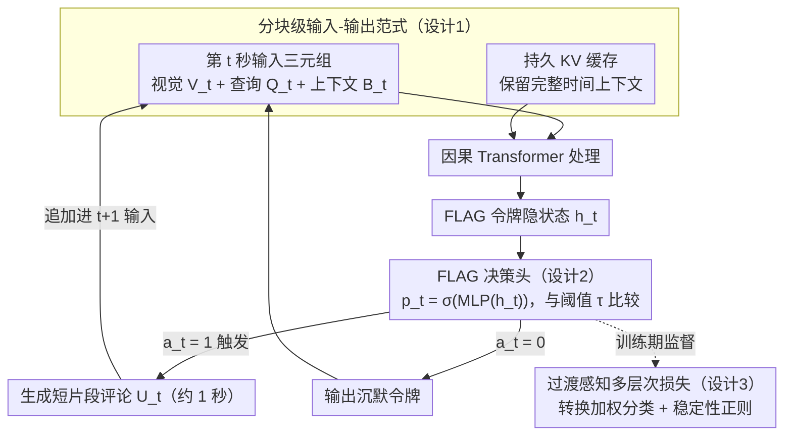

# ProAct-VL: A Proactive VideoLLM for Real-Time AI Companions

**会议**: ICML 2026  
**arXiv**: [2603.03447](https://arxiv.org/abs/2603.03447)  
**代码**: 待确认  
**领域**: 视频理解 / 实时多模态交互  
**关键词**: 视频大语言模型, 流式推理, 主动响应, 实时交互, 游戏解说

## 一句话总结
ProAct-VL 通过分块输入-输出范式 + 轻量级 FLAG 决策头 + 过渡感知损失函数，使视频大语言模型在流式输入下能自主决定**何时响应**并生成短片段评论，同时实现 ~1 秒低延迟与强主动性——在游戏解说任务上响应时机 TimeDiff 仅 1.20 秒、触发 F1 = 63.25%，全面超越 GPT-4o 等离线模型。

## 研究背景与动机

**领域现状**：近年视频大语言模型（VideoLLM）快速发展，支持视频感知和用户实时交互。但大多数工作要么采用"分块-顺序处理"的被动响应方式，要么采用低延迟但缺响应控制的被动流式方式。

**现有痛点**：
- 主动响应模型（proactive）决定何时说话，但一旦触发就生成完整长答案——延迟高、时间粒度粗；
- 低延迟模型（real-time）强调快速生成，但缺对"说话行为"的显式控制，常过度说话；
- 现有方法难以平衡主动性时机与内容质量。

**核心矛盾**：真实的 AI 伙伴（如游戏解说员）需要三层协调——（1）低延迟推理、（2）自主决定何时响应、（3）控制生成内容的质量与数量——这三者构成三角形难以同时优化。

**本文目标**：构建统一框架同时解决"何时说"、"说什么"、"说多快"三个问题。

**切入角度**：游戏评论（commentary）和游戏指导（guidance）这两个场景具有丰富、可自动化评估的交互模式，因此选作具体评估场景；构建大规模标注数据集驱动模型训练。

**核心 idea**：分块级 I/O 范式 + FLAG 令牌决策头 + 过渡感知损失函数统一建模流式视频理解与主动响应。

## 方法详解

### 整体框架
每个时间步 $t$（1 秒分块）：
1. **输入**：三元组 $(V_t, Q_t, B_t)$——当前时间窗口视觉内容、可选用户查询、环境上下文（含前文评论摘要）。
2. **处理**：持久化 KV 缓存 $\mathcal{K}_{t-1}$ 维持完整上下文，因果 Transformer 处理。
3. **决策**：从特殊令牌 `<|FLAG|>` 隐状态 $h_t$ 提取说话概率 $p_t$，与阈值 $\tau$ 比较得二元决策 $a_t$。
4. **输出**：若 $a_t = 1$ 则生成短片段评论 $U_t$（约 1 秒），否则输出沉默令牌。生成的 $U_t$ 自动追加上下文，成为 $t+1$ 的输入。

整套流程围绕「输入三元组 + 持久 KV 缓存 → 因果 Transformer → FLAG 决策 → 评论/沉默 → 回灌下一秒」这一条带回环的逐秒数据流展开，三个核心设计正好对应其中三个贡献环节：分块级 I/O 撑起数据流与缓存，FLAG 决策头管「何时说」，多层次损失在训练期监督决策概率。

### 关键设计

**1. 分块级输入-输出范式：把连续视频流切成 1 秒分块做在线因果处理**

离线模型要等整段视频处理完才回答，根本无法实时陪玩。ProAct-VL 把视频流离散成固定时长（本文 1 秒）的分块：每步 $t$ 模型从当前三元组 $(V_t, Q_t, B_t)$ 和一个持久 KV 缓存 $\mathcal{K}_{t-1}$ 生成 $(U_t, \mathcal{K}_t)$，而生成的评论 $U_t$ 会立即追加进 $t+1$ 的输入，形成连续的对话历史。靠持久缓存而不是每步重读全文，既省掉重复计算又保住完整时间上下文；需要长回答时，它会自然地跨多个后续分块续写，而不是阻塞当前这一秒。

**2. 轻量 FLAG 决策头：把"何时说话"从"说什么"里解耦出来单独学**

主动模型一触发就吐长答案、延迟高，低延迟模型又管不住嘴、过度说话，根子在于把"决定说话"和"生成内容"耦在一起。ProAct-VL 在每条用户消息末尾插入一个特殊令牌 `<|FLAG|>`，从它的隐状态用一个轻量 MLP + sigmoid 算说话概率 $p_t = \sigma(\text{MLP}(h_t))$，再与阈值比较得二元决策 $a_t = \mathbb{I}[p_t \geq \tau]$。决策头极轻、不构成推理瓶颈；而把"何时说"独立成一个可单独优化的策略后，模型能更高效地学到该闭嘴还是该开口，训练和推理两头都更干净。

**3. 过渡感知 + 稳定性的多层次损失：把响应当序列决策而不是逐帧独立二分类来训**

逐帧独立判断"说/不说"会忽略一个事实：状态转换（沉默↔说话）是稀有但最关键的事件，而且概率在状态内部本应平滑。$\mathcal{L}_{\text{resp}}$ 因此由两块组成。过渡感知分类损失 $\mathcal{L}_{\text{cls}}$ 给样本加权 $w_t = \gamma$（当 $y_t \neq y_{t-1}$ 即发生状态转换时）、否则 $w_t = 1$，重点盯住转换时刻这种稀有事件。稳定性正则 $\mathcal{L}_{\text{reg}}$ 含两项：局部时间一致性 $\mathbb{E}[(p_t - p_{t-1})^2 \mid y_t = y_{t-1}]$ 让状态持续期间概率别乱抖，全局说话率约束 $(\mathbb{E}[p_t] - \mathbb{E}[y_t])^2$ 让模型的平均说话时长贴近真人解说员。总损失 $\mathcal{L} = \mathcal{L}_{\text{main}} + \alpha \mathcal{L}_{\text{resp}}$。消融显示去掉 $\mathcal{L}_{\text{reg}}$ 时 F1 暴跌、TimeDiff 飙升，正说明把响应建成"带转换权重 + 平滑约束的序列问题"是稳定主动性的关键。

## 实验关键数据

### 主实验（Live Gaming Benchmark）

| 模型类别 | 模型 | CC ↑ | LiveU ↑ | FinalQ ↑ | TimeDiff ↓ | F1 ↑ |
|---------|------|------|---------|---------|----------|------|
| 离线 | GPT-4o | 39.42 | 4.62 | 4.80 | 3.07 | 54.88 |
| 离线 | Gemini 2.5 Pro | — | 4.70 | 4.82 | 2.59 | 49.23 |
| 主动 | VideoLLM-online | 13.78 | 3.56 | 1.74 | 12.59 | 6.54 |
| 主动 | MMDuet | 20.08 | 2.67 | 2.68 | 26.72 | 0.18 |
| 主动 | Livestar | 8.59 | 3.14 | 2.41 | 27.33 | 0.20 |
| 低延迟 | LiveCC-7B-Base | 38.88 | 3.85 | 3.83 | 11.35 | 36.10 |
| 低延迟 | StreamingVLM | 14.89 | 3.49 | 2.65 | 2.21 | 50.67 |
| **本文** | **ProAct-VL** | **49.23** | **6.52** | **5.03** | **1.20** | **63.25** |

CC = 与 Gemini 2.5 Pro 的赢率；LiveU = 流式片段评论质量；FinalQ = 整体脚本质量；TimeDiff = 响应时间偏差（秒）；F1 = 触发精准度。ProAct-VL 在所有指标上最优，尤其响应时机（1.20s）和触发精准度（63.25%）远超基线。

### 消融实验

| 配置 | CC | TimeDiff | P | R | F1 | 说明 |
|------|-----|---------|------|-----|------|------|
| 仅 $\mathcal{L}_{\text{cls}}$ | 45.54 | 18.50 | 12.13 | 14.00 | 11.03 | 分类损失单独 |
| 仅 $\mathcal{L}_{\text{reg}}$ | 47.53 | 8.28 | 45.20 | 67.02 | 47.39 | 稳定性正则单独 |
| **完整** | **50.91** | **3.41** | **65.72** | **62.41** | **60.08** | 两个损失项结合 |

### 关键发现
- 移除 $\mathcal{L}_{\text{reg}}$ 影响最大——F1 下降 49.05，TimeDiff 增加 15.09，稳定性正则至关重要。
- 移除 $\mathcal{L}_{\text{cls}}$ 也导致性能下降但影响不如正则化大；两个损失项互补。
- 长序列稳定性：Streaming Commentary 从 73.75% 增至 82.03%（10-50 分钟视频），响应质量虽轻微衰减但趋于稳定（F1 从 74.42% 降至 69.23%）；相比 StreamingVLM 长期稳定性显著更优。

## 亮点与洞察
- **主动性与流式实时性的统一**：传统权衡"要么被动快速、要么主动但慢"；本文通过解耦决策与生成，~1 秒延迟下实现强主动性。设计思路可迁移到实时决策的交互任务（客服系统、实时字幕）。
- **过渡感知的加权机制**：把状态转换视为稀有事件并赋予高权重（$\gamma = 5$），核心洞察是"序列决策中转换往往比持续更重要"，对任何时序分类任务都有启发。
- **Live Gaming Dataset 的高质量标注流水线**：WhisperX ASR + Qwen3 情感标注 + DeepSeek 领域纠错三阶段，确保高精度转录；流水线（特别是 LLM 纠错 + 清洗）可复用到其他多模态数据集。

## 局限与展望
- 数据集限于游戏域（虽 12 款热门游戏，但核心是娱乐）；体育解说 / 新闻播报等领域的泛化能力有限。
- CC / LiveU / FinalQ 等指标均由闭源 LLM 计算（GPT-5.1），可重现性受限；跨语言 / 模态的人工验证仍需补充。
- 响应决策机制相对简朴——仅 FLAG 令牌隐状态 + MLP，可能忽略细粒度视觉信号（运动幅度、画面变化）。
- 改进方向：扩展到更多实时交互领域；引入多模态特征（音频情感、手势）增强决策；探索无阈值决策策略（直接回归延迟而非二分类）。

## 相关工作与启发
- **vs VideoLLM-online / MMDuet 等主动模型**：他们在"说话"时生成完整答案，延迟高（> 10s）且触发精准度低（F1 < 10%）；本文强制生成短片段（1s）+ 解耦决策保证主动性同时避免长尾延迟。
- **vs LiveCC / StreamingVLM 等低延迟模型**：优化推理速度但缺"何时说"的控制，常过度生成；ProAct-VL 通过显式响应头添加"沉默"能力，使其像人类一样有节制地交互。
- **vs GPT-4o / Gemini 离线模型**：理解能力强但无法实时；ProAct-VL 在性能接近（CC 49.23 vs GPT-4o 39.42）同时支持真正实时部署。

## 评分
- 新颖性: ⭐⭐⭐⭐  主动性与实时性的统一框架；过渡感知加权损失 + FLAG 决策机制虽单个不复杂但组合工程巧妙。
- 实验充分度: ⭐⭐⭐⭐⭐  覆盖 3 个交互场景 + 2 个测试集（in-domain + out-of-domain） + 长序列稳定性 + 消融 + 推理效率 + 人工验证。
- 写作质量: ⭐⭐⭐⭐  逻辑清晰、图表直观；某些细节（ChatML 格式、RoPE 修正）推至附录。
- 价值: ⭐⭐⭐⭐⭐  解决 AI 伙伴这一明确应用需求的真实问题；提供可部署系统 + 561 小时标注数据集；对直播 / 游戏 / 虚拟助手有直接推动力。

<!-- RELATED:START -->

## 相关论文

- [\[CVPR 2026\] StreamRAG: Enhancing Real-Time Video Understanding with Retrieval Augmentation](../../CVPR2026/video_understanding/streamrag_enhancing_real-time_video_understanding_with_retrieval_augmentation.md)
- [\[AAAI 2026\] Uncovering Zero-Shot Generalization Gaps in Time-Series Foundation Models Using Real-World Videos](../../AAAI2026/video_understanding/uncovering_zero-shot_generalization_gaps_in_time-series_foundation_models_using_.md)
- [\[ACL 2026\] Response-G1: Explicit Scene Graph Modeling for Proactive Streaming Video Understanding](../../ACL2026/video_understanding/response-g1_explicit_scene_graph_modeling_for_proactive_streaming_video_understa.md)
- [\[ECCV 2024\] EgoPoser: Robust Real-Time Egocentric Pose Estimation from Sparse and Intermittent Observations Everywhere](../../ECCV2024/video_understanding/egoposer_robust_real-time_egocentric_pose_estimation_from_sparse_and_intermitten.md)
- [\[CVPR 2026\] Building a Precise Video Language with Human-AI Oversight](../../CVPR2026/video_understanding/building_a_precise_video_language_with_human-ai_oversight.md)

<!-- RELATED:END -->
