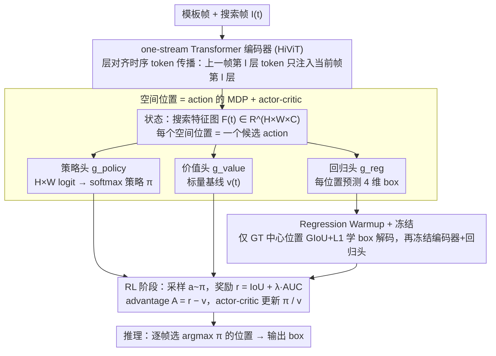

# RELO: Reinforcement Learning to Localize for Visual Object Tracking

**会议**: ICML 2026  
**arXiv**: [2605.07379](https://arxiv.org/abs/2605.07379)  
**代码**: https://github.com/Multimedia-Analytics-Laboratory/RELO (有)  
**领域**: 视频理解 / 视觉目标跟踪 / 强化学习  
**关键词**: 视觉跟踪, RL 定位, MDP, AUC 奖励, 时序 token 传播

## 一句话总结
RELO 把视觉单目标跟踪中"哪里是目标"这件事重构成一个空间特征图上的 MDP,把每个空间位置当作 action,用 actor-critic + IoU/AUC 直接奖励替换掉传统的手工中心热图监督,并配合"先 warmup 回归 + 层对齐时序 token 传播"两个稳定化设计,在 LaSOText 上以 57.5% AUC 拿到 SOTA。

## 研究背景与动机

**领域现状**:现代单目标跟踪几乎全是 one-stream Transformer + 中心热图分类 + 回归分支这套范式 (OSTrack、ODTrack、ARTrack、SUTrack 等);通常用 Gaussian-smoothed center heatmap 或 binary mask 作为分类监督,告诉模型"应该在哪里有高响应",同时回归分支负责输出 box。

**现有痛点**:这种 "prior-driven localization" 有两个深层问题——**(1) 监督信号和评测指标错位**:训练时模型被迫去拟合一个人工设计的中心分布,但评测只关心 IoU 和 AUC,模型没法直接知道"挑这个位置最终 IoU 是多少";**(2) 引入了非本质的人工假设**:Gaussian 的方差、binary mask 的阈值、corner expectation 的边界全是 heuristic,在不同数据集上表现敏感且无法端到端学习。

**核心矛盾**:跟踪的本质目标是"挑一个空间位置 → 它对应的 box 与 GT IoU 最大",但现有 pipeline 强行插入了一个"中心分类"代理任务,而代理任务的最优解和真实任务的最优解并不重合——尤其在 LaSOText 这种 cross-category 长时跟踪场景,中心先验对外观漂移更不可靠。

**本文目标**:不要任何手工空间先验,让模型直接从"跟踪结果好不好"这一终极反馈中学会"该挑哪个位置",并且要稳——RL 训练 from scratch 不稳是众所周知的。

**切入角度**:作者观察到一个 one-stream tracker 的搜索特征图 $\mathbf{F}^{(t)} \in \mathbb{R}^{H\times W \times C}$ 天然就是一个 $H\times W$ 大小的离散 action space,每个位置 $(i,j)$ 都有 regression head 产出的候选 box——这就是一个标准的离散动作 MDP,而 IoU/AUC 是天然不可微但可数值化的奖励信号,正是 policy gradient 的用武之地。

**核心 idea**:把 "where to localize" 用 RL 学,不用任何中心/角点先验;用"warmup 回归再冻结、再学 policy"两阶段保证稳定,用层对齐时序 token 传播提供帧间上下文。

## 方法详解

### 整体框架
给定模板帧 $\mathbf{I}_{\text{temp}}$ 和搜索帧 $\mathbf{I}^{(t)}$,one-stream Transformer encoder (HiViT-T/B/L,Fast-iTPN 预训练) 联合处理两者输出 $\mathbf{F}^{(t)} \in \mathbb{R}^{H\times W\times C}$,作为 state。三个并行 head: regression head $g_{\text{reg}}$ 在每个位置预测 4 维 box 坐标 $\mathbf{B}^{(t)} \in \mathbb{R}^{H\times W\times 4}$,policy head $g_{\text{policy}}$ 输出 $H\times W$ 个 logit 形成 softmax 分布 $\pi(a_{ij}|\mathbf{F}^{(t)})$,value head $g_{\text{value}}$ 给出标量 reward 估计 $v^{(t)}$。训练分两阶段:**warmup** 阶段只在 GT 中心位置用 GIoU+L1 监督 regression head 学会"局部特征→box"映射然后冻结;**RL 阶段**在 $T=8$ 帧视频片段上采 action、算奖励、actor-critic 更新 policy/value。推理时 frame-by-frame 选 argmax policy 位置输出 box,无任何 test-time 适应。

### 关键设计

1. **空间位置 = action 的 MDP 形式化 + actor-critic 学习**:

    - 功能:把"挑哪个位置"这个跟踪核心决策显式建模为 policy,直接用 IoU/AUC 优化,跳过中心热图代理任务。
    - 核心思路:action space $\mathcal{A} = \{(i,j) | i \in \{1,...,H\}, j \in \{1,...,W\}\}$;policy 是 logit 上的 categorical 分布;reward 为 $r^{(t)} = \text{IoU}(\boldsymbol{b}^{(t)}_{a^{(t)}}, \boldsymbol{b}^{(t)}_{\text{gt}}) + \lambda \cdot \text{AUC}(\{\boldsymbol{b}^{(\tau)}_{a^{(\tau)}}, \boldsymbol{b}^{(\tau)}_{\text{gt}}\}_{\tau=1}^T)$,既给即时单帧反馈又给整段轨迹的全局奖励 (默认 $\lambda=1$);value head 给 baseline,advantage $A^{(t)} = r^{(t)} - v^{(t)}$;loss 为 REINFORCE 形式 $\ell_{\text{policy}} = -\frac{1}{T}\sum_t A^{(t)} \log \pi(a^{(t)}|\mathbf{F}^{(t)})$ 加上 value MSE,总 loss $\ell = \ell_{\text{policy}} + \beta \ell_{\text{value}}$ ($\beta=0.5$)。最关键是:reward 不需要可微,可以直接用 IoU、AUC 这种评测指标本身,训练-评测对齐严格成立。
    - 设计动机:中心热图监督的本质问题是"目标函数 ≠ 评测函数",RL 直接对齐评测函数;离散 action 数 $H\times W = 16\times 16 = 256$ 量级不大,REINFORCE + actor-critic 完全够用,不需要 PPO 这种重型套件。

2. **Regression Warmup + 冻结 → RL 阶段稳定训练**:

    - 功能:解决 RL from scratch 在 256 个动作上极易崩溃的问题。
    - 核心思路:作者发现如果直接从随机权重开始联合训 regression + policy,policy 探索到的"动作"对应的 box 都是垃圾,reward 信号完全是噪声,根本学不动。所以先做一个 warmup:只在 GT 中心那一个 spatial location 上用 GIoU + L1 监督 regression head,让模型先学会"已知正确位置时,如何从那个位置的特征解码出准确 box"——本质上是教会 box decoding,不教 localization。warmup 完成后冻结 encoder + regression head,只让 policy head 和 value head 在 RL 阶段更新;此时无论 policy 采到哪个 action,对应的 box 都已有合理质量,reward 信号干净,policy 学习就稳了。
    - 设计动机:RL 的样本效率在大动作空间下很差;把"如何映射"和"该选哪个"解耦,前者用密集监督学(只 1 个 location 但样本量大),后者用 RL 学(256 个 action 但只需学相对偏好),是个非常工程化的稳定化技巧。

3. **层对齐时序 token 传播 (Layer-Aligned Temporal Token Propagation)**:

    - 功能:在帧间提供时序上下文,但避免"深层→浅层"的语义错位。
    - 核心思路:ODTrack 等方法把上一帧的 deep-layer temporal token 注入当前帧的 shallow layer,但这会让"高层语义"和"低层外观特征"被迫交互,产生语义 mismatch。作者改为同层对齐——上一帧第 $l$ 层产出的 temporal token $\mathbf{T}^{(t-1)}_l$ 只传给当前帧的第 $l$ 层。具体地,第 $l$ 层输入 $\mathbf{H}^{(t)}_l = [\mathbf{Z}^{(t)}_l, \mathbf{X}^{(t)}_l, \mathbf{T}^{(t)}_l, \mathbf{T}^{(t-1)}_l]$ (template、search、当前帧 temporal、上一帧同层 temporal),经过 $\mathcal{f}_l$ 后丢掉 $\mathbf{P}^{(t-1)}_{l+1}$ 只保留 $\mathbf{T}^{(t)}_{l+1}$,进入第 $l+1$ 层时再与 $\mathbf{T}^{(t-1)}_{l+1}$ 拼接。这样每层 token 数恒定,不会随层数线性增长,且跨帧信息交换始终在匹配的语义层级。
    - 设计动机:Transformer 不同层学到不同抽象层次,跨层混合会破坏 hierarchical 结构;层对齐是更尊重 encoder 设计的时序传播方式,且计算开销 negligible。

### 损失函数 / 训练策略
- **Warmup**:GIoU + L1,只监督 GT 中心 location,$\sim$几个 epoch 即可。
- **RL**:$\ell = \ell_{\text{policy}} + 0.5 \ell_{\text{value}}$,90 epoch、每 epoch 2500 个序列、序列长度 $T=8$、$\lambda=1$;AdamW lr=$10^{-4}$,72 epoch 后 lr ×0.1。
- **数据**:COCO + LaSOT + GOT-10k + TrackingNet + VastTrack,template 框 ×2 放大、search 框 ×4 放大,水平翻转 + 亮度抖动。
- **推理**:frame-by-frame,选 $\arg\max \pi(\cdot|\mathbf{F}^{(t)})$ 位置的 box,默认不做 template update。

## 实验关键数据

### 主实验

| 方法 | LaSOT AUC | LaSOText AUC | TrackingNet AUC | GOT-10k AO |
|---|---|---|---|---|
| OSTrack-B256 | 69.1 | 47.4 | 83.1 | 71.0 |
| SeqTrack-B256 | 69.9 | 49.5 | 83.3 | 74.7 |
| ARTrack-B256 | 70.4 | 46.4 | 84.2 | 73.5 |
| SUTrack-B224 | 73.2 | 53.1 | 85.7 | 77.9 |
| ARPTrack-B256 | 72.6 | 52.0 | 85.5 | 77.7 |
| **RELO-B256** | **73.3** | **54.2** | **86.4** | **80.5** |
| ODTrack-L384 | 74.0 | 53.9 | 86.1 | 78.2 |
| LoRAT-L224 | 74.2 | 52.8 | 85.0 | 75.7 |
| SUTrack-L224 | 73.5 | 54.0 | 86.5 | 81.0 |
| ARPTrack-L384 | 74.2 | 54.2 | 86.6 | 81.5 |
| **RELO-L256** | **75.1** | **57.5** | **87.3** | **81.8** |

| 方法 | TNL2K | NFS | UAV123 |
|---|---|---|---|
| LoRAT-L224 | 61.1 | 66.6 | 71.9 |
| ARTrack-L384 | 60.3 | 67.9 | 71.2 |
| **RELO-B256** | 60.9 | 70.0 | 70.4 |
| **RELO-L256** | **63.6** | **71.3** | 71.4 |

### 消融实验

| 模型变体 | #Params (M) | FLOPs (G) | RTX4090 FPS | LaSOT AUC |
|---|---|---|---|---|
| RELO-T256 (HiViT-T) | 22 (+2 value) | 8 | 91 | 70.4 |
| RELO-B256 (HiViT-B) | 70 (+2) | 34 | 50 | 73.3 |
| RELO-L256 (HiViT-L) | 247 (+2) | 114 | 32 | 75.1 |

| 效率赛道 (Edge) | LaSOT / LaSOText | TrackingNet | GOT-10k | i9-CPU / Jetson FPS |
|---|---|---|---|---|
| MixFormerV2-S | 60.6 / 43.6 | 75.8 | - | 47 / 70 |
| AsymTrack-B | 64.7 / 44.6 | 80.0 | 67.7 | 38 / 64 |
| SUTrack-T224 | 69.6 / 50.2 | 82.7 | 72.7 | 23 / 34 |
| **RELO-T256** | **70.4 / 51.1** | **83.6** | **75.6** | 21 / 32 |

### 关键发现
- **LaSOText 提升最显著**:从 SUTrack-L 的 54.0 → RELO-L256 57.5,+3.5 AUC 远超 LaSOT 上的 +0.9——长时跟踪 + cross-category 是中心先验最不可靠的场景,这里 RL reward 直接优化的优势体现最清楚。
- **RL 对 T256 小模型同样有效**:RELO-T256 仅 22M 参数、91 FPS 仍超越 SUTrack-T224,说明 reward-driven localization 的收益主要来自"学习目标"改变而非模型容量,这点对边缘部署很有价值。
- **template update 默认关闭**:作者刻意不在 LaSOT/LaSOText 用 template update 以避免"过拟合 benchmark",这种保守策略仍能拿 SOTA,说明 RL 学到的策略本身就足够 robust。
- **value head 仅 +2M 且测试时移除**:训练辅助参数,推理零成本——这是 actor-critic 落地的标准做法,值得注意。

## 亮点与洞察
- **训练-评测对齐是真正的赋能**:中心热图监督那套范式之所以一直没被打破,是因为大家默认"AUC 不可微就没法直接优化";RELO 用 REINFORCE 把这条假设破掉,证明 256 维离散 action 上 RL 完全可控——这思路可迁移到任何"评测指标不可微但可数值化"的视觉任务 (分割 mIoU、检测 AP、HOI 等)。
- **warmup-then-freeze 是 RL 落地视觉感知的关键工程技巧**:作者把"特征解码"和"决策选择"两个能力解耦训练,前者用密集监督快速搞定,后者只在已 stable 的特征空间上做策略搜索——这种"先教手怎么动,再教脑怎么选"的范式值得复用到机器人、强化检测等场景。
- **层对齐时序传播**:虽然只是个工程细节,但点出了 Transformer 时序 tracker 长期一个被忽视的设计原则——跨帧信息流应该尊重 hierarchical 语义层级,而不是简单 deep→shallow 抄送;计算开销几乎为零却带来稳定增益。
- **L256 在分辨率比同档大模型更小的情况下打过 384 输入的 ARTrack-L/ODTrack-L**:说明 RL 把"哪里更准"学得更好,弥补了输入分辨率不足。

## 局限与展望
- 只在单目标 short-term/long-term 上验证,多目标跟踪 (MOT) 的关联问题、目标消失/重现的 detection-by-tracking 范式还需另外研究。
- Reward 设计目前是 IoU + λ·AUC 加权,$\lambda=1$ 是经验值;在不同长度序列上是否需要自适应调度没有讨论。
- 没有提供 reward shaping、policy entropy 退火等 RL 常见技巧的探索,后续可能有空间进一步榨干 RL 的效果。
- warmup 阶段冻结整个 encoder + regression,意味着 encoder 的视觉特征不会再针对"选 action"任务优化;让 encoder 端到端参与 RL 但保持稳定是未来方向。
- 论文没和最新的 LLM-based tracker (用 VLM 做开放词汇跟踪) 比较,跨范式定位还需要做。

## 相关工作与启发
- **vs OSTrack / SUTrack / ODTrack (prior-driven center heatmap)**:他们用 Gaussian-smoothed center map 做分类监督;RELO 完全不用,改用 RL 优化 IoU/AUC——同 backbone (HiViT) 下 RELO 在 LaSOText 提升尤其明显,说明 RL 的收益主要来自学习目标改变。
- **vs SLT (Kim 2022)**:SLT 也用 RL 优化平均 IoU,但 RL 只是在一个已有 prior-driven Siamese 上做 fine-tuning,policy 受 underlying tracker 的 inductive bias 限制;RELO 把 RL 作为定位的根本机制 from scratch (with warmup),不是 post-hoc 修正。
- **vs Yun 2017 / Ren 2018 (early RL trackers)**:这些早期工作把 RL 用于 box 迭代调整 (translation/scale actions),粒度粗、reward sparse;RELO 是 reward 密集 + spatial-grid action,设计更现代化。
- **vs ARTrack / SeqTrack (autoregressive tracking)**:它们把 box 当 token 序列回归,本质仍是监督学习;RELO 是策略学习,概念上更接近 AlphaGo 那一类——用 RL 在评测指标上对齐。

## 评分
- 新颖性: ⭐⭐⭐⭐ 把 RL 真正作为定位主机制 (而非辅助) 在视觉跟踪上跑通,概念清晰
- 实验充分度: ⭐⭐⭐⭐⭐ 7 个 benchmark + T/B/L 三档模型 + edge 部署评测 + 完整消融
- 写作质量: ⭐⭐⭐⭐ 公式严谨、pipeline 图 (Fig.2) 一目了然,reward 与 RL 形式化都很标准
- 价值: ⭐⭐⭐⭐ "训练-评测对齐"的范式 (用 RL 替代手工先验) 对视觉感知社区有启发性,代码开源更易复用

<!-- RELATED:START -->

## 相关论文

- [\[ICML 2026\] Unified Multimodal Visual Tracking with Dual Mixture-of-Experts](unified_multimodal_visual_tracking_with_dual_mixture-of-experts.md)
- [\[CVPR 2026\] Dual-Agent Reinforcement Learning for Adaptive and Cost-Aware Visual-Inertial Odometry](../../CVPR2026/video_understanding/dual-agent_reinforcement_learning_for_adaptive_and_cost-aware_visual-inertial_od.md)
- [\[CVPR 2026\] An Efficient Token Compression Framework for Visual Object Tracking](../../CVPR2026/video_understanding/an_efficient_token_compression_framework_for_visual_object_tracking.md)
- [\[ICML 2026\] AVTrack: Audio-Visual Tracking in Human-centric Complex Scenes](avtrack_audio-visual_tracking_in_human-centric_complex_scenes.md)
- [\[CVPR 2026\] TGTrack: Temporal Generative Learning for Unified Single Object Tracking](../../CVPR2026/video_understanding/tgtrack_temporal_generative_learning_for_unified_single_object_tracking.md)

<!-- RELATED:END -->
