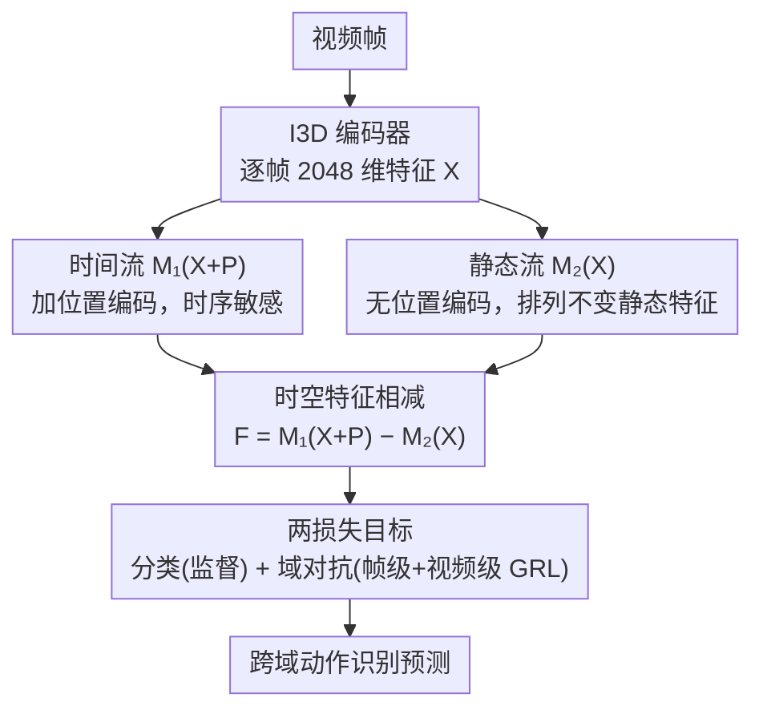

# Return of Frustratingly Easy Unsupervised Video Domain Adaptation

**会议**: ICML 2026  
**arXiv**: [2605.19510](https://arxiv.org/abs/2605.19510)  
**代码**: 待确认  
**领域**: 视频理解 / 无监督域适应  
**关键词**: 无监督视频域适应, 跨域动作识别, 时空特征解耦, 排列不变性

## 一句话总结
本文提出 MetaTrans——一个"令人沮丧地简单"的无监督视频域适应（UVDA）方法，通过双流 Transformer 的时空特征相减来解耦空间和时间域差异，仅用两个基础损失（监督 + 域对抗）即可超过 SOTA 复杂方法，并把超参搜索成本从指数级压到线性级。

## 研究背景与动机

**领域现状**：无监督视频域适应（UVDA）旨在把源域上有标签训练好的视频识别模型迁移到无标签的目标域。早期工作直接复用图像 UDA 方法（DANN 等），忽略了视频帧之间的时间依赖；近期 SOTA 才开始显式处理时间对齐。

**现有痛点**：以 TranSVAE 为代表的最新方法用 VAE 分离 + 7 个损失项 + 5 个子模块同时处理空间和时间差异，效果不错但**复杂度爆表**——损失权重需要数千次组合搜索，调参成本远高于模型本身。

**核心矛盾**：能否在保持"分别处理空间/时间差异"的同时，让损失函数和模块极度简化？

**本文目标**：设计一种"沮丧地简单"的 UVDA 框架，只用两个基础损失就能达到甚至超越 SOTA。

**切入角度**：作者回到 Ben-David 等人 2006 年的经典 UDA 理论——最小化源风险 + 域差异是充要条件。问题的根源不在损失项数量，而在于**用什么样的模型架构来吸收复杂度**。

**核心 idea**：用一个**时空特征相减模块**把"空间域差异"从特征中显式减掉，剩余的时间差异只需一个标准域对抗损失就够了。关键观察：相减操作只有在"静态流"具备**排列不变性**时才能严格解耦空间分量。

## 方法详解

### 整体框架
MetaTrans 由"两损失 + 两流架构"构成：

1. 用 I3D 抽取每帧 2048 维特征 $\mathbf{X} = [x_1, \ldots, x_T]$。
2. 时间流 $\mathcal{M}_1(\mathbf{X} + \mathbf{P})$：加位置编码 $\mathbf{P}$，输出时序敏感特征。
3. 静态流 $\mathcal{M}_2(\mathbf{X})$：无位置编码，输出排列不变的静态特征。
4. 相减得到动态残差：$\mathbf{F} = \mathcal{M}_1(\mathbf{X} + \mathbf{P}) - \mathcal{M}_2(\mathbf{X})$（静态特征沿时间维复制 $T$ 份再相减）。
5. 域对抗损失作用在 $\mathbf{F}$ 上对齐帧级和视频级分布（视频级经帧聚合网络 FAN）；分类器对源标签和目标伪标签做监督。

### 关键设计

**1. 排列不变的静态特征流 $\mathcal{M}_2$：用与帧序无关的结构专门提取"静态语义"**

要把空间域差异从特征里减掉，前提是先有一路只负责静态内容（背景、场景风格、光照）的特征，而静态内容本身和帧的先后顺序无关。$\mathcal{M}_2$ 因此由无位置编码的自注意力、残差、LayerNorm、逐 token 前馈和最终平均池化组成，对输入帧的任意排列都输出相同结果（Theorem 1 给出排列不变性的形式化证明）。用结构本身保证排列不变，比额外加一个正则项去"鼓励"不变性更干净，也不引入新的超参。

**2. 时空特征相减：直接做减法把空间域差异显式去掉，把问题化简成只对齐时间**

以 TranSVAE 为代表的方法要靠 VAE + 7 个损失才能分离空间/时间，复杂度爆表。MetaTrans 的做法是假设每帧特征可加性分解 $z_t = s + u_t$（静态 + 动态），于是 $\mathcal{M}_1(\mathbf{X}+\mathbf{P}) - \mathcal{M}_2(\mathbf{X})$ 在理想情况下只留下动态分量，空间差异被减没了。即便 $\mathcal{M}_2$ 估计不完美，Theorem 3 也给出残差 Wasserstein 距离的上界——误差随 $\mathcal{M}_2$ 变好而单调缩小。相比重型 VAE 解码器，"直接减"是最经济、可微、且有理论保证的解耦手段，等于把复杂度从损失项搬进了架构。

**3. 两损失训练目标：只用监督 + 域对抗就驱动整套模型**

既然空间差异已被架构减掉，剩下的时间差异只需一个标准域对抗就够，不必再堆损失项。总目标 $\mathcal{L} = \mathcal{L}_{cls} + \lambda_1 \mathcal{L}_{adv}$ 中，$\mathcal{L}_{cls}$ 是源标签 + 目标伪标签的交叉熵，$\mathcal{L}_{adv}$ 是帧级 + 视频级的 GRL 域对抗损失，整个框架只剩一个超参 $\lambda_1$。这恰好对应 UDA 经典理论的下界（源风险 + 域差异），把"分离空间与时间"的活全交给架构、而不是靠损失权重去硬调——超参搜索成本因此从指数级降到线性级。

### 训练策略
前 100 epoch 只用源标签训练；之后引入目标伪标签做 self-training。优化器 SGD，学习率 1e-3。$\lambda_1$ 用单一调度（线性 warm-up 到 1.0）。

## 实验关键数据

### 主实验

UCF-HMDB（跨域动作识别）：

| 方法 | 年份 | U→H | H→U | 平均 |
|------|------|-----|-----|------|
| Source-only | — | 80.3 | 88.8 | 84.5 |
| DANN | 2016 | 80.8 | 88.1 | 84.5 |
| TranSVAE（7 损失） | 2023 | 87.8 | 99.0 | 93.4 |
| UNITE | 2024 | 92.5 | 95.0 | 93.8 |
| **MetaTrans（2 损失）** | **2026** | **92.2** | **99.0** | **95.4** |
| Supervised-target（上界） | — | 95.0 | 96.9 | 95.9 |

Epic-Kitchens（6 个跨域子任务平均）：

| 方法 | 平均准确率 | 损失项数 |
|------|----------|---------|
| Source-only | 35.3 | — |
| TranSVAE | 52.6 | 7 |
| **MetaTrans** | 51.0 | **2** |

### 消融实验

| 配置 | U→H | H→U | 平均 | 说明 |
|------|-----|-----|------|------|
| Source-only | 80.3 | 88.8 | 84.5 | 基线 |
| MetaTrans w/o 相减 | 84.5 | 92.8 | 88.7 | 只剩时间对齐 |
| MetaTrans w/o 对抗 | 86.3 | 95.1 | 90.7 | 只剩空间相减 |
| **MetaTrans（完整）** | **92.2** | **99.0** | **95.4** | 协同 +4.7~+10% |

### 关键发现
- 两个模块缺一不可，组合后比单项提升显著（+4.7%～+10%），说明空间相减和时间对齐互补。
- 把 $\mathcal{M}_2$ 换成非排列不变的 BiLSTM-pool（90.2%）或固定窗 fs_pool（89.3%）都掉点，验证排列不变性是关键。
- 作者提出 RGRA（相对提升 / 训练运行成本）指标：MetaTrans 仅需 2 个损失项即达 6.02%（UCF-HMDB）和 10.35%（Epic-Kitchens）的"每次运行提升"，远超 TranSVAE / HCT。

## 亮点与洞察
- **设计哲学**：复杂度应该藏在架构里而不是损失函数堆叠里。这对许多被"复杂方法"打败的简单基线是一种翻案——给基线配一个好架构就够了。
- **排列不变性的形式化**：把"静态语义不依赖帧序"这个直觉变成 Theorem 1 的结构性保证，比 ad-hoc 正则更优雅。
- **理论-实验闭环**：Theorem 2（UDA 充分性）→ Theorem 3（Wasserstein 界）→ Theorem 4（误差收敛率）一气呵成，每一步实验都能对应。
- **可实用性指标 RGRA**：直接把超参搜索成本纳入比较，第一次让"工业部署友好度"成为评价维度。

## 局限与展望
- 只用 RGB 单模态，未尝试光流 / 音频组合。
- Theorem 3/4 依赖加性分解 $z_t = s + u_t$，实际特征空间的分解未必严格线性。
- 排列不变意味着"完全丢弃帧序的静态部分"，对"摔跤"这类强依赖顺序的动作可能过强约束。
- 仅在 UCF-HMDB 与 Epic-Kitchens 验证，对视频分割、跟踪等下游 UVDA 任务未知。
- 目标伪标签从 epoch 100 开始引入，warm-up 阈值在不同数据集上的最优值未充分研究。

## 相关工作与启发
- **vs TranSVAE（Wei et al., 2023）**：同样追求空间/时间解耦，但 TranSVAE 用 VAE + 7 损失，MetaTrans 用架构 + 2 损失；在 UCF-HMDB 上 95.4% > 93.4%，说明"用架构换损失"可以正向放大效果。
- **vs UNITE（Reddy et al., 2024）**：UNITE 用学生-教师自训练达到 93.8%，本文不需要自训练就到 95.4%，说明良好的特征分解可以替代训练 trick。
- **vs HCT（Lin et al., 2024）**：HCT 用 5 损失针对人体动作，MetaTrans 通用化后在 UCF-HMDB 大胜、Epic-Kitchens 略逊，体现"通用 vs 特化"的权衡。
- **启发**：排列不变的"结构性约束"可推广到 3D 点云识别、多视图学习；RGRA 这类把训练成本纳入评价的指标值得在更多领域推广。

## 评分
- 新颖性: ⭐⭐⭐⭐  时空相减 + 排列不变性的组合很优雅，但底层 UDA 框架本身不新；亮点在哲学转向。
- 实验充分度: ⭐⭐⭐⭐⭐  两数据集 + 详尽消融 + 排列不变性对比 + RGRA 新指标 + t-SNE 可视化。
- 写作质量: ⭐⭐⭐⭐  三定理推进清晰，但 Theorem 3 假设条件较形式化，非理论背景读者门槛偏高。
- 价值: ⭐⭐⭐⭐⭐  低超参成本对工业部署友好；排列不变性 + RGRA 思路均可迁移到其他特征解耦任务。

<!-- RELATED:START -->

## 相关论文

- [\[CVPR 2026\] Learnable Motion-Focused Tokenization for Effective and Efficient Video Unsupervised Domain Adaptation](../../CVPR2026/video_understanding/learnable_motion-focused_tokenization_for_effective_and_efficient_video_unsuperv.md)
- [\[ICML 2026\] SkelHCC: A Hyperbolic CLIP-Driven Cache Adaptation Framework for Skeleton-based One-Shot Action Recognition](skelhcc_a_hyperbolic_clip-driven_cache_adaptation_framework_for_skeleton-based_o.md)
- [\[CVPR 2026\] Scene-Centric Unsupervised Video Panoptic Segmentation](../../CVPR2026/video_understanding/scene-centric_unsupervised_video_panoptic_segmentation.md)
- [\[ICML 2026\] Video-MTR: Reinforced Multi-Turn Reasoning for Long Video Understanding](video-mtr_reinforced_multi-turn_reasoning_for_long_video_understanding.md)
- [\[AAAI 2026\] StegaVAR: Privacy-Preserving Video Action Recognition via Steganographic Domain Analysis](../../AAAI2026/video_understanding/stegavar_privacy-preserving_video_action_recognition_via_steganographic_domain_a.md)

<!-- RELATED:END -->
