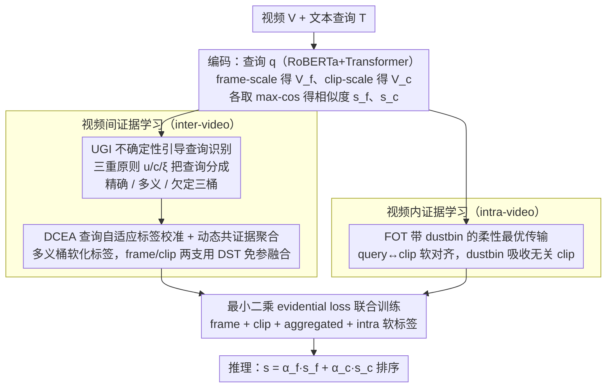

# Revisiting Uncertainty: On Evidential Learning for Partially Relevant Video Retrieval

**会议**: ICML 2026  
**arXiv**: [2605.06083](https://arxiv.org/abs/2605.06083)  
**代码**: https://github.com/ICML26-Holmes (有)  
**领域**: 视频理解 / 跨模态检索 / 不确定性建模  
**关键词**: PRVR、证据学习、Dirichlet 分布、最优传输、查询歧义

## 一句话总结
本文针对 Partially Relevant Video Retrieval (PRVR) 中"短查询 vs 长视频"导致的查询歧义与时间稀疏监督问题，提出基于 Dirichlet 分布的层次证据学习框架 Holmes，在视频间用三重原则区分精确/多义/欠定查询并自适应校准标签，在视频内用带 dustbin 的柔性最优传输获得稠密对齐，在 ActivityNet/Charades/TVR 三个数据集上取得 SOTA。

## 研究背景与动机

**领域现状**：PRVR 任务要求用一句只描述视频局部片段的文本查询去检索未剪辑长视频。主流做法以 MS-SL、GMMFormer 为代表，采用 multi-instance learning (MIL)，把"和查询相似度最高的那一个 clip"当作正样本进行对比学习，得到一个确定性的相似度分数后排序。

**现有痛点**：作者在 Figure 1 中拆出两类失败模式：(1) inter-video 层面，文本短而视频内容富，必然产生"under-determined query"（语义信息不足，对所有候选都给低相似度）和 "polysemous query"（语义含混，对多个候选都给高相似度），这些查询如果统一按精确查询训练就会被错误地"硬推"到单一 ground truth；(2) intra-video 层面，MIL 只监督单一 best clip，正负 clip 极度不平衡，模型很容易被一段全局无关视频中"恰好相似"的局部噪声欺骗，产生 spurious spiky activation。

**核心矛盾**：现有方法把跨模态相似度视为确定性输出，没有量化"这个分数本身有多可信"。ARL 等近期方法虽然意识到歧义存在，但只能粗粒度判断"这对是否歧义"，无法进一步把歧义拆成"信号不足"还是"信号矛盾"，因此校准方向是错的。

**本文目标**：(i) 在视频间显式量化每条查询的不确定性并区分查询类型；(ii) 在视频内打破 MIL 的稀疏监督瓶颈，提供既稠密又对噪声鲁棒的对齐信号。

**切入角度**：把跨模态相似度看作"证据"而非"分数"——这正是 Evidential Deep Learning (EDL) 的视角。EDL 通过 Dirichlet 分布的二阶概率能同时给出认知不确定性 (epistemic) 与偶然不确定性 (aleatoric)，恰好对应"信号不足"与"信号矛盾"两种失败模式。

**核心 idea**：用 Dirichlet 证据学习同时建模 inter-video 查询不确定性和 intra-video 时间监督稀疏性，用三重原则（认知不确定度 + 标签一致性 + 偶然不确定度）把查询分桶并自适应校准标签，再用带 dustbin 的最优传输替代 MIL 的硬 argmax。

## 方法详解

### 整体框架
输入：一段未剪辑视频 $V$ 与文本查询 $T$。查询经 RoBERTa + Transformer 编码为 $\bm{q}\in\mathbb{R}^d$，视频分两个分支：frame-scale 提取 $M_f$ 帧特征 $\bm{V}_f$，clip-scale 提取 $M_c$ 个 clip 特征 $\bm{V}_c$，分别取 max-cos 得到两个尺度的相似度 $s^f$ 和 $s^c$。整体 pipeline 分两层：(1) **Inter-video evidential learning** 把一个 batch 内 $K$ 个候选视频的相似度向量映射为 Dirichlet 参数，按三重原则将查询分到 precise/polysemous/under-determined 三个桶，再对 polysemous 桶做软标签校准；(2) **Intra-video evidential learning** 用带 dustbin 的最优传输代替单点 argmax，把一条查询与多个 clip 形成软对齐当作 intra-video 证据。最后用最小二乘 evidential loss 联合训练，推理时仍用 $s=\alpha_f s^f + \alpha_c s^c$ 排序。

### 关键设计

**1. 基于三重原则的不确定性引导查询识别（UGI）：用三个正交量把查询自动分成精确/多义/欠定三类，避免一刀切硬训**

痛点在于以往把所有"GT 没排到第一"的样本一概当成 noisy correspondence 丢弃或降权，连真正反映歧义的信号也一起扔掉了。UGI 先把相似度转成证据 $e_{ij}=\exp(\tanh(s_{ij}/\tau))$，得到 Dirichlet 参数 $\alpha_{ij}=e_{ij}+1$，再从中读出三个量：认知不确定度 $u_i=K/S_i$（$S_i=\sum_j\alpha_{ij}$，总证据量越少 $u$ 越大）、标签一致性 $c_i=\max(0, \bm{s}_i\cdot\bm{y}_i)$（GT 视频的响应强度）、偶然不确定度 $\xi_i$（Dirichlet 期望熵）。识别规则是：$u_i$ 大就判 under-determined（证据稀薄）；$u_i$ 小且 $c_i$ 大初判 precise；$u_i$ 小但 $c_i$ 小初判 polysemous；最后用 $\xi_i$ 的中位数把"伪 precise"里熵偏高的样本拨回 polysemous。阈值 $\beta_u,\beta_p$ 由当前 batch 内"已经匹配正确"的样本动态决定，不用人工调参。之所以非要凑齐三个量，是因为论文 Theorem 3.2 证明单凭 $u$ 区分不了 precise 和 polysemous——两者证据都充足，区别在于前者指向唯一答案、后者分散到多个候选，必须再借 $c$ 和 $\xi$ 才能在三维空间里把两类干净分开。两个尺度各自给出划分后按"不确定度优先"融合（$\mathcal{S}_p\prec\mathcal{S}_n\prec\mathcal{S}_u$），让更不确定的一方占主导，保守而稳妥。

**2. 查询自适应标签校准 + 动态共证据聚合（DCEA）：对不同类型查询施加松紧不同的监督，再把两尺度意见无参融合**

硬 one-hot 标签会把多义查询的语义相关候选当成负样本、制造监督噪声；但完全软化又会稀释 precise 查询的判别信号。DCEA 于是做差异化处理：precise 与 under-determined 查询保留 one-hot（前者已可信、后者要继续催学习信号），只对 polysemous 查询软化标签 $\hat{\bm{y}}_i=(1-\gamma)\bm{y}_i+\frac{\gamma}{2}(\sigma(s_i^f)+\sigma(s_i^c))$（$\gamma=0.2$），让信念可以分给多个相关候选而不被过度惩罚。两个尺度的 evidential opinion $\mathbb{M}^f,\mathbb{M}^c$ 再用 Dempster–Shafer 组合规则免参数融合：

$$b_k^o=\frac{1}{1-\delta}\left(b_k^f b_k^c+b_k^f u^c+b_k^c u^f\right),\quad \delta=\sum_{i\neq j}b_i^f b_j^c$$

其中 $\delta$ 衡量两支的冲突度。用 DST 而不是简单加权的好处是：当 frame 分支和 clip 分支意见打架时，融合结果会自动表现为更高的总不确定度，而不是把矛盾平均掉。

**3. 带 dustbin 的柔性最优传输（FOT）：给 intra-video 监督一个既稠密又能甩掉噪声 clip 的对齐**

MIL 只监督"最相似的那一个 clip"，监督稀疏、正负 clip 极不平衡，模型很容易被一段无关视频里"恰好相似"的局部噪声骗到（即 Figure 1e 的 spurious spiky activation）。FOT 把一条查询和 $M_c$ 个 clip 当成最优传输的源与汇，但在汇端额外挂一个 dustbin 桶专门吸收无关 clip，解出柔性传输方案 $\bm{\pi}\in\mathbb{R}^{1\times(M_c+1)}$。前 $M_c$ 项作为 query→clip 的软对齐监督，dustbin 项的质量越大说明该查询与视频整体越不相关。标准 OT 会强迫把所有质量摊到 clip 上、噪声没有逃逸出口，而 dustbin 等于给了模型一个显式的"忽略键"，于是稠密监督和抗噪声两个目标被同时满足。

### 损失函数 / 训练策略
推导自 EDL 的最小二乘 Dirichlet 损失：$L_U(\bm{\alpha}_i,\hat{\bm{y}}_i)=\sum_j(\hat y_{ij}-\alpha_{ij}/S_i)^2+\alpha_{ij}(S_i-\alpha_{ij})/(S_i^2(S_i+1))$。总损失把 frame、clip、aggregated 三个 evidential opinion 同时监督：$L_{\text{inter}}=L_U^f+L_U^c+L_U^o$。intra-video 端使用 OT 得到的软标签同样喂入 $L_U$ 形式的目标。$\tau=0.1$，$\gamma=0.2$，$\beta=0.3$；阈值随训练动态变化，无需手工调参。

## 实验关键数据

### 主实验
在 ActivityNet Captions、Charades-STA、TVR 三个标准 PRVR 数据集上比较 R@1/5/10/100 + SumR：

| 数据集 | 指标 | Holmes | 之前最佳 SOTA | 提升 |
|--------|------|--------|---------------|------|
| ActivityNet | SumR | 显著最高（>148.3） | ARL 148.3 | $\approx$ +2 SumR |
| Charades-STA | SumR | 最佳 | MamFusion 76.5 | 进一步提升 |
| TVR | SumR | 最佳 | ARL 185.9 | +1~3 SumR |

Holmes 在三个数据集上的 SumR 都超过包括 ARL、MGAKD、ProtoPRVR、MamFusion 在内的所有 PRVR baseline，同时也胜过 VCMR 类强 baseline（CONQUER, JSG）和 T2VR baseline（CLIP4Clip, Cap4Video）。

### 消融实验

| 配置 | 效果说明 |
|------|---------|
| Full Holmes | 完整模型，三个数据集 SumR 全 SOTA |
| w/o UGI（不分桶） | 退化为统一硬标签训练，polysemous 查询被 over-penalize，SumR 明显下降 |
| w/o 标签校准 | 保留分桶但不软化 polysemous，性能介于 w/o UGI 与 Full 之间 |
| w/o DCEA（去 DST 融合） | 两支意见冲突无法显式建模，不确定度估计偏低 |
| w/o FOT（回退 MIL） | intra-video 监督回到稀疏单点，受 spurious local 响应影响，SumR 掉点最大 |
| w/o dustbin（标准 OT） | 噪声 clip 被强制分配概率，对齐被污染 |

### 关键发现
- 在所有模块中，FOT + dustbin 对 intra-video 的稠密监督贡献最大，单独移除掉点最多——验证了 MIL 稀疏监督确实是 PRVR 的瓶颈而非次要因素。
- 三重原则中 $u$、$c$、$\xi$ 缺一不可：Theorem 3.2 与 Proposition 3.4 已经在理论上证明任意单一指标都不能区分 precise 和 polysemous；消融上去掉 $\xi$ 后 polysemous 桶污染最严重。
- 定性可视化显示 Holmes 能正确把"under-determined / polysemous"查询识别出来，并在 Charades 上明显抑制了对全局无关视频的 spiky activation。

## 亮点与洞察
- **不确定性二维拆解**：把"短查询长视频"这一长期被笼统称作"歧义"的问题，干脆利落地拆成"信号稀薄 (epistemic)" 与"信号多义 (aleatoric)" 两个正交维度，把 EDL 的二阶不确定性精确对应到检索任务的两类失败模式，是该论文最让人"啊哈"的视角。
- **三重原则的可证明必要性**：作者用 Theorem 3.2 / Proposition 3.4 论证了 $u$ 与 $c$ 单独都不够，必须引入 $\xi$，把原本启发式的"加几个判据"做成了有理论支撑的判别规则。
- **dustbin 桶 OT 思路完全可迁移**：任何"对齐监督但又怕噪声配对污染"的任务（如部分检索、弱监督定位、ITM）都可以套用同一招——加一个吸收无关元素的虚拟桶。

## 局限与展望
- 三重原则中的阈值虽自适应，但仍依赖 batch 内"已经匹配正确"的样本统计，冷启动或难数据集上可能给出不稳定的初始划分；可考虑用 EMA 跨 batch 平滑。
- 论文只验证了三个标准 PRVR 数据集，且帧/clip 表征仍依赖 RoBERTa + CNN，没有结合更强的 CLIP 视频编码器；与 CLIP-style 大模型结合后 evidential 校准会更有空间。
- DST 融合假设两支独立，在 frame/clip 高度相关时可能高估 $u^o$；后续可加入相关性建模。
- 推理仍走加权和，并未把 evidential opinion 直接用于排序（如 belief-based scoring），是一个明显的扩展点。

## 相关工作与启发
- **vs ARL (Cho 2025)**：ARL 只做二分类"歧义/不歧义"，Holmes 进一步用三重原则把歧义分成 precise / polysemous / under-determined，并给出对应的差异化标签策略。
- **vs GMMFormer / RAL / MSC-PRVR**：这些方法用 Gaussian attention 或概率嵌入隐式建模歧义，Holmes 用 Dirichlet 显式给出可解释的不确定度。
- **vs MS-SL / ProtoPRVR**：都是 MIL 范式，缺乏 intra-video 稠密监督；Holmes 的 FOT-dustbin 给出了 PRVR 首个真正稠密且抗噪的对齐方案。
- **跨任务启发**：把同样的 EDL+OT 组合搬到 video moment retrieval、grounded VLM 训练、弱监督检测中，对"长 context 短 query"场景都可能直接受益。

## 评分
- 新颖性: ⭐⭐⭐⭐⭐ 第一个把 EDL 的两类不确定性精细映射到 PRVR 的两类失败模式，并配套提出 dustbin OT，整体框架原创性强。
- 实验充分度: ⭐⭐⭐⭐ 三大主流 PRVR 数据集 + 多 baseline + 完整消融，但缺乏 CLIP 大模型基底的对比和真实噪声鲁棒性研究。
- 写作质量: ⭐⭐⭐⭐ 用 Figure 1 把动机讲得很直观，定义/定理推导严谨；缺点是术语缩写密集，初读需要反复翻 Figure 2。
- 价值: ⭐⭐⭐⭐ 在 PRVR 上拿到 SOTA，且不确定性建模、dustbin OT 这两个组件对相关检索/对齐任务有较强可迁移性。

<!-- RELATED:START -->

## 相关论文

- [\[ECCV 2024\] Bayesian Evidential Deep Learning for Online Action Detection](../../ECCV2024/video_understanding/bayesian_evidential_deep_learning_for_online_action_detection.md)
- [\[CVPR 2026\] VirtueBench: Evaluating Trustworthiness under Uncertainty in Long Video Understanding](../../CVPR2026/video_understanding/virtuebench_evaluating_trustworthiness_under_uncertainty_in_long_video_understan.md)
- [\[CVPR 2026\] U2Flow: Uncertainty-Aware Unsupervised Optical Flow Estimation](../../CVPR2026/video_understanding/u2flow_uncertainty_aware_unsupervised_optical_flow_estimation.md)
- [\[CVPR 2025\] Learning Audio-Guided Video Representation with Gated Attention for Video-Text Retrieval](../../CVPR2025/video_understanding/learning_audio-guided_video_representation_with_gated_attention_for_video-text_r.md)
- [\[ACL 2026\] ViLL-E: Video LLM Embeddings for Retrieval](../../ACL2026/video_understanding/vill-e_video_llm_embeddings_for_retrieval.md)

<!-- RELATED:END -->
