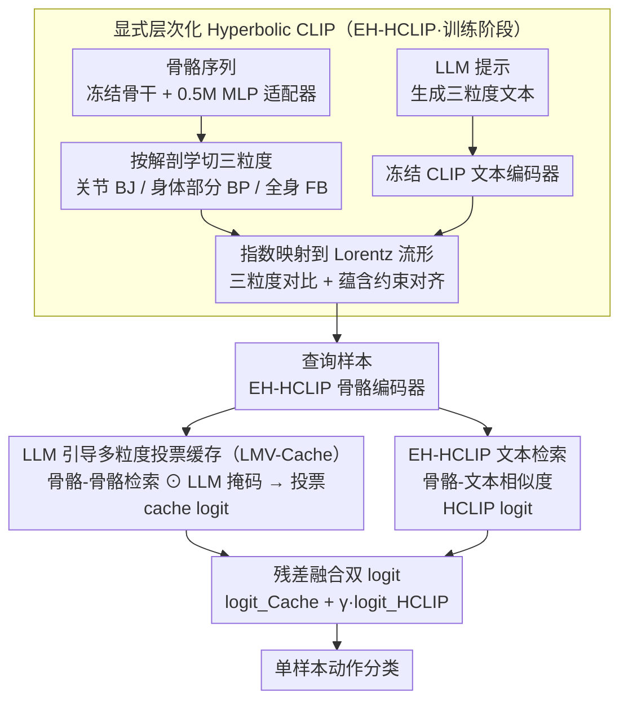

# SkelHCC: A Hyperbolic CLIP-Driven Cache Adaptation Framework for Skeleton-based One-Shot Action Recognition

**会议**: ICML 2026  
**arXiv**: [2606.03610](https://arxiv.org/abs/2606.03610)  
**代码**: 待确认  
**领域**: 视频理解 / 骨骼动作识别 / 单样本学习  
**关键词**: 骨骼动作识别, 单样本学习, Hyperbolic CLIP, LLM 引导, 多粒度缓存

## 一句话总结
SkelHCC 把 CLIP 搬到 Hyperbolic 空间，显式按"关节 → 身体部分 → 全身"三粒度对齐骨骼-语言表示，并用 LLM 生成的身体部位重要性掩码做无训练的多粒度投票缓存推理，在 NTU120 单样本动作识别上比 SOTA 提升 9%，可训参数只有 0.5M。

## 研究背景与动机

**领域现状**：骨骼动作识别从人体关节序列理解动作。单样本骨骼动作识别（OSAR）是个高价值但极困难的设置——每个新类只有 1 个样本，传统监督学习几乎无法泛化。

**现有痛点**：
- **表示对齐困难**：人体骨骼天然是树形结构（关节 → 身体部分 → 全身），但既有方法基本都在欧氏空间建模，难以编码这种层次依赖；骨骼表示与高层语义动作描述对齐不足。
- **适配策略不当**：单样本时仍要更新骨干网络，要么过拟合，要么需要复杂的微调流程；缺少推理时的"上下文感知"机制告诉模型哪些身体部位最关键。

**核心矛盾**：单样本既要鲁棒的跨模态表示，又要快速、低参的推理时适配；常规微调在数据稀缺下不可行。

**本文目标**：用统一框架同时解决（1）显式编码骨骼层次结构的跨模态表示；（2）无需训练的、上下文感知的推理时适配。

**切入角度**：Hyperbolic 几何的负曲率天然适合树形结构（关节图 δ-hyperbolicity 已经被论文 Appendix I 测过）；LLM 知识可以告诉我们"哪些关节对哪个动作重要"，可以以掩码形式直接进入相似度计算。

**核心 idea**：用 Hyperbolic CLIP 学三粒度对齐表示（EH-HCLIP），在推理时再用 LLM 引导的多粒度投票缓存（LMV-Cache）做无训练适配。

## 方法详解

### 整体框架

SkelHCC 想解决的是"单样本下既要好的跨模态骨骼表示、又要无需微调的推理时适配"这对矛盾，它把任务拆成训练和推理两个阶段。训练阶段在基类上学一个层次化的 Hyperbolic CLIP（EH-HCLIP）：CLIP 文本编码器和骨骼骨干全程冻结，只训练一个 0.5M 参数的轻量 MLP 适配器，把骨骼和文本特征投影到 Lorentz 双曲流形上做三粒度对齐。推理阶段则完全不再更新权重——对一个新类的查询样本，一路算它与支撑样本的骨骼-骨骼缓存相似度（cache logit），另一路算它与文本提示的骨骼-文本相似度（HCLIP logit），两路残差融合后给出分类结果。

### 关键设计

**1. 显式层次化的 Hyperbolic CLIP（EH-HCLIP）：让表示空间自己长成人体的树形结构**

人体骨骼天生是"关节 → 身体部分 → 全身"的树，但既有方法都在欧氏空间建模，编码不了这种层次依赖，骨骼与动作语义的对齐也偏弱。EH-HCLIP 的做法是先按解剖学先验把骨骼切成身体关节（BJ）、身体部分（BP）、全身（FB）三个粒度，再用精心设计的 LLM 提示为每个粒度生成对应的文本描述。每个粒度的欧氏特征经指数映射 $\tilde{S} = \exp_M^{O}(S)$ 投到 Lorentz 流形上，用 Lorentzian 距离 $d_{\mathbb{L}, c}(\cdot)$ 过 softmax 得到对比概率，三粒度加权求和构成 EHHC 损失：

$$\mathcal{L}_{EHHC} = \sum_i \frac{\alpha_i}{2} \left( \mathcal{L}_{HCL}(\tilde{S}^{(i)}, \tilde{T}^{(i)}) + \mathcal{L}_{HCL}(\tilde{T}^{(i)}, \tilde{S}^{(i)}) \right)$$

在此之上再叠一个 Hyperbolic Entailment Loss（HEL），用蕴含锥约束强制"关节 ⊂ 身体部分 ⊂ 全身"的偏序关系。之所以选双曲空间，是因为它的体积随半径指数增长，少数维度就能容纳一棵树，恰好契合骨骼图的 δ-hyperbolicity（论文 Appendix I 实测过）；而多粒度对比让模型同时盯住局部关键关节和全身上下文，这正是单样本泛化最需要的。

**2. LLM 引导的多粒度投票缓存（LMV-Cache）：把"哪个部位重要"的先验直接写进推理时的相似度**

单样本时如果还更新骨干，要么过拟合要么流程复杂，因此需要一种无训练的推理时适配，并且最好能告诉模型"这个动作该看哪些部位"。LMV-Cache 把支撑样本的三粒度骨骼特征当 key、标签当 value 存进缓存，再用 GPT-4 离线为每个动作类别生成"哪些关节 / 哪些身体部分最关键"的二值掩码 $\mathcal{M}^{BJ}, \mathcal{M}^{BP}$。推理时，查询与支撑的关节级、身体部分级相似度先和掩码做 Hadamard 积，再在该粒度内对所有节点求平均：

$$\text{Sim}^{BJ} = \alpha_2 \frac{1}{V} \sum_i \left[ \phi(S_q^{BJ}, S_s^{BJ}) \odot \mathcal{M}^{BJ} \right]_i$$

多个粒度的相似度矩阵再投票合并成最终 cache logit。这样做的关键好处在于：LLM 那句"跳跃用腿、鼓掌用手"的语义先验不是只在训练时蒸馏一次（CrossGLG 的做法会让先验在推理时消失），而是以掩码形式持续参与每一次相似度计算；同时多粒度投票把单样本的硬分类软化成跨粒度共识，单样本下更鲁棒。

**3. 残差融合的双 logit 推理：让骨骼检索和语义检索互相补台**

骨骼-骨骼缓存检索对外观变化敏感（同一个动作不同人做形态差很多），骨骼-文本检索则更看重语义，两者各有盲区。SkelHCC 把它们残差相加：

$$\text{logit}_{SkelHCC} = \text{logit}_{Cache} + \gamma \cdot \text{logit}_{HCLIP}$$

其中 $\gamma$ 平衡两类信号——可以把 EH-HCLIP 自身理解成一个特殊的"文本缓存"，于是整个推理统一成"缓存检索 + 文本检索"的加权，两路信号的盲区刚好互补。

### 损失函数 / 训练策略

训练总损失把三粒度对齐、蕴含约束和分类交叉熵叠在一起：$\mathcal{L}_{EH\text{-}HCLIP} = \mathcal{L}_{EHHC} + \lambda \mathcal{L}_{EHHE} + \mathcal{L}_{CE}$，其中 $\lambda = 0.1$。关键超参为 Hyperbolic 曲率 $c = 0.1$、相似度温度 $\beta = 1.0$、粒度权重 $\alpha_1 = \alpha_2 = \alpha_3 = 0.5$（后续做自适应调整）。

## 实验关键数据

### 主实验

NTU RGB+D 120 / 60 与 PKU-MMD II 单样本动作识别（不同基类数量下的准确率）：

| 数据集 | 方法 | 20 基类 | 60 基类 | 100 基类 | 骨干更新 | 适配参数 |
|--------|------|--------|--------|---------|---------|---------|
| NTU120 | CrossGLG (SOTA) | 45.3 | 62.1 | 62.6 | ✓ | 1.7M |
| NTU120 | **SkelHCC** | **52.0** | **67.4** | **71.6** | ✗ | **0.5M** |
| NTU60 | CrossGLG | — | 75.6 | — | ✓ | — |
| NTU60 | **SkelHCC** | — | **84.1** | — | ✗ | **0.5M** |
| P-MMD | SkeletonX | — | 38.3 | — | — | — |
| P-MMD | **SkelHCC** | — | **40.0** | — | — | **0.5M** |

关键观察：NTU120 在 100 基类设置下达到 71.6%，比 CrossGLG 高 9.0%，但参数量只有它的 1/3 还冻结了骨干。

### 消融实验

模块有效性（NTU120, 100 基类）：

| 方法 | 准确率 | 相对基线提升 |
|------|--------|------------|
| CLIP（欧氏）+ Cache | 62.9 | — |
| HCLIP + Cache | 64.8 | +1.9 |
| EH-HCLIP + Cache | 67.6 | +4.7 |
| CLIP + LMV-Cache | 66.2 | +3.3 |
| HCLIP + LMV-Cache | 68.2 | +5.3 |
| **EH-HCLIP + LMV-Cache（完整）** | **71.6** | **+8.7** |

掩码类型对比（NTU120, 100 基类）：

| 掩码 | 准确率 | 变化 |
|------|--------|------|
| 无掩码 | 68.5 | — |
| 随机掩码 | 66.3 | -2.2 |
| 可学习掩码 | 68.6 | +0.1 |
| 自注意力掩码 | 67.1 | -1.4 |
| LLM 掩码 (BP) | 69.9 | +1.4 |
| **LLM 掩码 (BP + BJ)** | **71.6** | **+3.1** |

### 关键发现
- Hyperbolic 比欧氏 CLIP 提升 1.9%，加上"显式层次化"再提 2.8%——结构先验是必要的。
- 移除 BJ + BP 多粒度（只保留 FB）掉 3-4%，多粒度对单样本鲁棒性很关键。
- 随机 / 注意力掩码反而掉点；LLM 生成的语义掩码是唯一能稳定提升的策略，说明 LLM 知识比模型自学的"重要性"更可靠。

## 亮点与洞察
- **Hyperbolic 与骨骼的天然契合**：论文用 δ-hyperbolicity 实测骨骼图，给"为什么用 Hyperbolic"提供了硬性证据，而不是单纯套用 Hyperbolic CLIP。
- **LLM 知识在推理时仍在线**：相比 CrossGLG 这种"训练时蒸馏 LLM"的做法，LMV-Cache 把 LLM 知识直接编码到掩码、推理时仍发挥作用，避免知识"消失"。
- **参数高效的单样本适配**：冻结骨干 + 0.5M MLP 适配器是对单样本数据稀缺性的务实回应，比 CrossGLG 少 3.4×。
- **多粒度软投票**：把单样本硬分类转成软投票，显著提升鲁棒性，思路可迁移到其他单/少样本结构化数据任务。

## 局限与展望
- 限于单样本设置；扩展到 few-shot 时如何融合多个支撑样本（加权平均？原型？）尚未给出。
- 只测了骨骼模态，对 RGB / 深度 / 多视角的扩展仅在 conclusion 里点到。
- LLM 掩码需要对每个新动作类别调用 GPT-4，虽是一次性成本，但超大规模动作库下仍有可扩展性顾虑。
- Hyperbolic 曲率只测了 $c = 0.1$，不同数据集的最优值未系统扫。

## 相关工作与启发
- **vs APSR / uDTW / SL-DML**：传统度量学习方法都在欧氏空间，无法编码骨骼树形结构；本文从表示空间层面改写了这件事。
- **vs GAP / CrossGLG**：都用 LLM 先验，但 GAP 只面向全监督、CrossGLG 推理时 LLM 知识不在线；本文用掩码让 LLM 在推理时仍参与决策。
- **vs HyperbolicCLIP / Hyperbolic 分割**：本文不是简单复用 Hyperbolic CLIP，而是针对骨骼三粒度专门设计，并叠加蕴含损失强制偏序。
- **启发**：几何先验（树→Hyperbolic）+ 高层语义先验（LLM）+ 参数高效适配（MLP）这三件套可推广到关键点检测、树状场景图等任务。

## 评分
- 新颖性: ⭐⭐⭐⭐⭐  Hyperbolic + 显式层次 + LLM 掩码投票的组合在 OSAR 中首创。
- 实验充分度: ⭐⭐⭐⭐⭐  三个权威数据集 + 多组消融 + 掩码类型对比，证据链完整。
- 写作质量: ⭐⭐⭐⭐  逻辑清晰、方法细致；Hyperbolic 基础略冗长。
- 价值: ⭐⭐⭐⭐⭐  康复 / 医疗等数据稀缺场景的现实需求强；参数高效易部署，跨模态先验融合方法可复用。

<!-- RELATED:START -->

## 相关论文

- [\[ECCV 2024\] CrossGLG: LLM Guides One-Shot Skeleton-Based 3D Action Recognition in a Cross-Level Manner](../../ECCV2024/video_understanding/crossglg_llm_guides_one-shot_skeleton-based_3d_action_recognition_in_a_cross-lev.md)
- [\[CVPR 2026\] SkeletonContext: Skeleton-side Context Prompt Learning for Zero-Shot Skeleton-based Action Recognition](../../CVPR2026/video_understanding/skeletoncontext_skeleton-side_context_prompt_learning_for_zero-shot_skeleton-bas.md)
- [\[AAAI 2026\] SUGAR: Learning Skeleton Representation with Visual-Motion Knowledge for Action Recognition](../../AAAI2026/video_understanding/sugar_learning_skeleton_representation_with_visual-motion_knowledge_for_action_r.md)
- [\[CVPR 2026\] SpikeTrack: A Spike-driven Framework for Efficient Visual Tracking](../../CVPR2026/video_understanding/spiketrack_a_spike-driven_framework_for_efficient_visual_tracking.md)
- [\[CVPR 2026\] One-Shot Flow, Any-Time Frame: A Bidirectional Warping Framework for Event-Based Video Frame Interpolation](../../CVPR2026/video_understanding/one-shot_flow_any-time_frame_a_bidirectional_warping_framework_for_event-based_v.md)

<!-- RELATED:END -->
