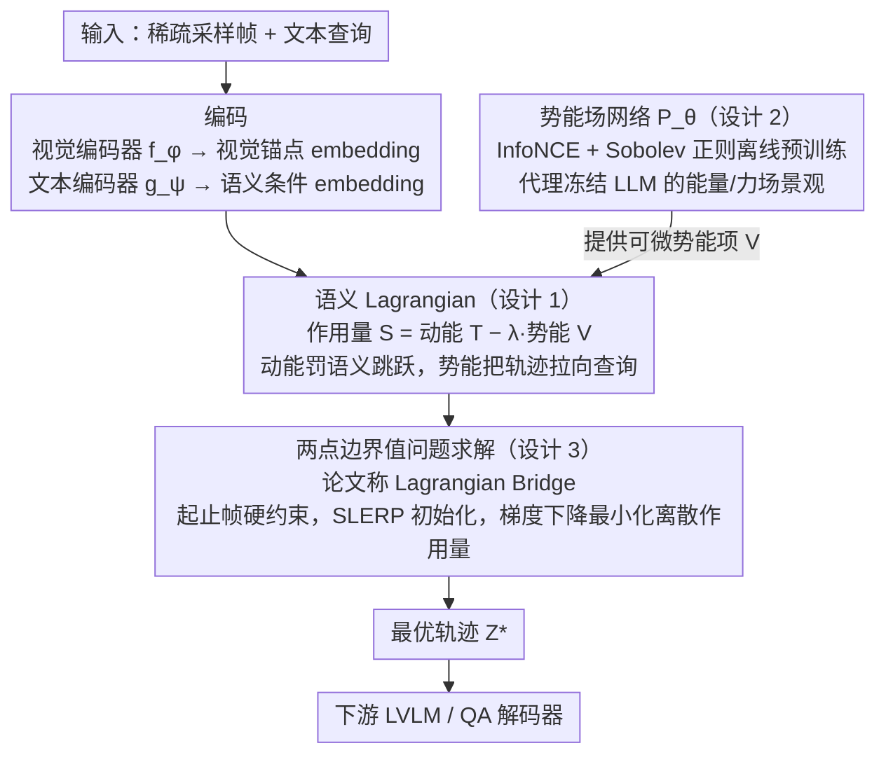

# SLAP: The Semantic Least Action Principle for Variational Video-Language Modeling

**会议**: ICML 2026  
**arXiv**: [2605.30750](https://arxiv.org/abs/2605.30750)  
**代码**: 待确认  
**领域**: 多模态 VLM / 长视频理解  
**关键词**: 视频语言模型, 时间插值, 最小作用量原理, 变分方法, 物体持久性

## 一句话总结
SLAP 把"经典力学的最小作用量原理"搬到视频语义流形上，把稀疏采样视频的缺帧补全建模为 Riemannian 流形上的两点边界值问题——用语义动力学替代概率生成来强制物体持久性，在隧道遮挡测试上准确率 83.9%（超扩散模型 12 个点）且推理加速 177×。

## 研究背景与动机

**领域现状**：当代大型视频语言模型（LVLM）如 Video-LLaMA、LLaVA-Video 在静态场景问答上已很强，但长视频时受自注意力 $O(n^2)$ 复杂度所限，必须做激进的稀疏采样（通常 < 0.5 fps），这给模型留下大量时间"盲区"。

**现有痛点**：盲区导致两种失败模式：
- **隐式池化**（mean-pool / Q-Former）：直接把帧序列压成单 token，时间因果结构荡然无存。
- **生成式幻觉**（Stable Video Diffusion 等扩散补帧）：视觉逼真但靠的是统计纹理先验，违反物体持久性——比如车进入隧道后，因为训练集里"空隧道"更常见，扩散模型可能让车凭空消失。

**核心矛盾**：当前 LVLM "运动学上幼稚"，把视频帧当作独立 token 的词袋，缺少"语义实体守恒"约束，无法自发拒绝物体瞬移 / 消失这种物理不可能的轨迹。

**本文目标**：把"缺帧补全"从概率框架（最大化 $P(x_t \mid x_{t-1})$）切换到物理框架（最小化作用量），用经典力学的优雅约束代替统计学习。

**切入角度**：经典力学的最小作用量原理统御从行星轨道到量子场论一切现象——它天然保证路径平滑和能量最优。把这一原理类比到语义流形上，引入"语义惯性"（kinetic）和"语义力场"（potential）约束 embedding 轨迹。

**核心 idea**：用变分力学替代概率生成；把缺失区间建模为两点边界值问题（BVP），离散 Euler-Lagrange 求解；物体持久性"免费"获得，不需要逐像素渲染。

## 方法详解

### 整体框架
给定起止帧 $t_{\text{start}}, t_{\text{end}}$，求中间缺失 embedding 序列 $\{z_t\}$ 最小化总作用量。三步：

1. **编码**：visual encoder $f_\phi$ 与 text encoder $g_\psi$ 把帧和查询都映到同一 $d$ 维潜在空间，前者给出固定的视觉锚点 embedding、后者给出语义条件 embedding，并诱导出该空间上的 Riemannian 几何（Assumption 3.1: semantic isometry）。
2. **学势能场**：用轻量 MLP $P_\theta$ 拟合"文本查询在潜在空间激发的能量景观"，用噪声对比估计训练（离线完成）。
3. **推理时作用量最小化**：把离散序列代入由语义 Lagrangian 定义的作用量泛函（动能项来自轨迹本身、势能项由 $P_\theta$ 提供），起止帧当硬约束做梯度下降求最优轨迹 $Z^*$，再喂给下游 LVLM/QA 解码器；不需要逐帧自回归预测，避免误差累积。

下面的框架图把这条 pipeline 画出来——编码与解码是脚手架首尾，势能场网络（设计 2）、语义 Lagrangian（设计 1）、两点边界值问题求解（设计 3）三个贡献模块协同完成缺帧补全：

### 关键设计

**1. 语义 Lagrangian（Kinetic + Potential 能量项）：把"物体该不该消失"交给最小作用量来判，而不是概率生成**

扩散补帧靠统计纹理先验，会让车进隧道后凭空消失（因为训练集里空隧道更常见）。SLAP 改用物理框架：定义总作用量 $S[z] = \int (T(z) - \lambda V(z, q)) dt$，其中动能 $T = \frac{1}{2}\|\dot{z}\|^2$ 是语义速度的惯性代价、势能 $V(z, q) = 1 - \text{sim}(z, g_\psi(q))$ 是文本查询的吸引力，离散形式为 $S_{\text{disc}} = \sum_t [\frac{1}{2}\|\frac{z_{t+1} - z_t}{\Delta t}\|^2 - \lambda P_\theta(z_t, q)]$。动能项天然惩罚"语义跳跃"——物体瞬间消失需要无穷大的语义速度，在最小作用量下根本不被允许，于是物体持久性是守恒律"免费"给的、不用逐像素监督；势能项则让查询像重力场一样把轨迹往正确语义方向拉。耦合系数 $\lambda$ 平衡平滑与对齐，实验发现 $\lambda \approx 0.5$ 这个"共鸣点"最优。

**2. 势能场网络 + 噪声对比估计 + Sobolev 正则：用一个轻量 MLP 代理"冻结 LLM 定义的真实语义势能"**

如果每步优化都要回传大型 LLM 算势能，成本是天文数字。SLAP 用一个可微的轻量 MLP $P_\theta$ 来代理，并把问题转成能量基模型的密度比估计，用 InfoNCE 训练

$$\mathcal{L}_{NCE} = -\mathbb{E} \log \frac{\exp(P_\theta(z, q) / \tau)}{\exp(P_\theta(z, q)/\tau) + \sum_j \exp(P_\theta(z_j, q)/\tau)}$$

当 $K \to \infty$ 时最优代理满足 $P_\theta^*(z, q) = \log \frac{p(z\mid q)}{p(z)} + C(q)$，于是最大化代理就等价于最小化真实势能（有理论保证）。再叠 Sobolev 正则 $\mathcal{L}_{\text{reg}} = \mathbb{E}\|\nabla_z P_\theta\|^2$ 和谱归一化保证"语义重力温和"。之所以非要这层平滑约束，是因为后面的 Euler-Lagrange 求解器要求势能梯度平滑、否则离散步会发散，Theorem 3.7 还给出了梯度误差 $\epsilon$ 与轨迹偏差 $\frac{T^2}{\mu}\epsilon$ 的显式上界。

**3. 两点边界值问题求解（论文称 Lagrangian Bridge）：同时优化整个缺失区间，把起止帧当硬约束，避免自回归漂移**

逐帧自回归在长序列里容易上下文漂移（比如忘了车已进隧道，反而幻觉出隧道里的路灯）。SLAP 不做逐帧预测，而是把缺失区间建成两点边界值问题：起止帧固定为硬约束，中间序列用 SLERP 初始化后做梯度下降最小化离散作用量。起止两端像"未来约束"一样把中间轨迹全局拉回正确语义路径，从源头上避免漂移。Theorem 3.6 进一步证明：当 $\lambda \cdot \max \|\nabla^2 P_\theta\| < \frac{2}{\lambda \Delta t^2}$ 时作用量泛函严格凸、全局最优唯一，求解既稳又有保证。

### 训练策略
势能网络 $P_\theta$ 在 WebVid-10M 上预训练，目标 $\mathcal{L}_{\text{total}} = \mathcal{L}_{NCE} + \gamma \mathcal{L}_{\text{reg}}$。Encoder 冻结。

## 实验关键数据

### 主实验：隧道测试（物体持久性）

| 方法 | 准确率 ↑ | 持久性评分 1-5 ↑ | 语义漂移 ↓ |
|------|---------|----------------|----------|
| ZOH（零阶保持） | 24.3 | 1.2 | 0.45 |
| SLERP（线性） | 41.5 | 2.1 | 0.38 |
| Latent ODE | 58.2 | 3.4 | 0.29 |
| Video-LLaMA 3（自回归） | 68.1 | 3.9 | 0.25 |
| Stable Video Diffusion | 71.4 | 3.5 | 0.28 |
| **SLAP（本文）** | **83.9** | **4.7** | **0.14** |

### 消融实验（隧道测试）

| 配置 | 准确率 | 说明 |
|------|--------|------|
| 完整 SLAP | 83.9 | $\lambda \approx 0.5$ |
| $\mu \to 0$（纯势能） | 62.0 | 失去惯性，物体频繁出现/消失 |
| $\mu \to \infty$（纯惯性） | 41.5 | 退化为 SLERP，忽略文本 |
| 静态势能（固定余弦） | 70.5 | 学习的 $P_\theta$ 不可或缺 |

### MSR-VTT 视频问答（鲁棒性 vs 采样率）

| 方法 | 50% 帧 ↑ | 25% 帧 ↑ | 10% 帧 ↑ | 下降 ↓ |
|------|--------|--------|--------|------|
| ZOH | 38.4 | 31.2 | 22.5 | -15.9 |
| 线性 | 40.1 | 35.8 | 30.1 | -10.0 |
| Video-LLaMA 3 | 44.5 | 41.2 | 34.7 | -9.8 |
| SVD | 43.8 | 39.5 | 35.2 | -8.6 |
| **SLAP** | **45.2** | **43.9** | **41.8** | **-3.4** |

### 计算效率

| 方法 | TFLOPs ↓ | 延迟 (s) ↓ | 显存 (GB) ↓ | 加速 |
|------|---------|---------|---------|------|
| Stable Video Diffusion | 185.0 | 14.20 | 22.5 | 1.0× |
| Video-LLaMA 3 | 45.2 | 3.80 | 16.0 | 3.7× |
| Neural ODE | 12.5 | 1.10 | 8.4 | 12.9× |
| **SLAP** | **0.15** | **0.08** | **0.8** | **177.5×** |

### 关键发现
- SLAP 在物体持久性上吊打 SVD（+12.5 点）且语义漂移半减，原因是"删物体换成空隧道"在 kinetic 项下需要巨大语义速度，最小作用量自动拒绝。
- 极端稀疏（10% 帧）时性能下降仅 3.4%，远小于 Video-LLaMA 3 的 9.8%，说明起止帧 + 文本查询定义的语义作用量在 QA 任务中通常已足够。
- 在"动作中心"问题上比 Video-LLaMA 3 高 12 个点，因为最小作用量自然恢复动词空间的测地线（站立→摔倒→躺下）。
- 0.15 TFLOPs/次推理（约 0.5 焦耳）对比 SVD 约 150 焦耳，碳排放降 3 个数量级。
- $\lambda$ 扫描看到清晰"共鸣体制"：弹道 ($\lambda \to 0$, 41.5%) → 弱耦合 ($\lambda = 0.1$, 65.2%) → 共鸣 ($\lambda = 0.5$, 83.9%) → 强耦合 ($\lambda = 1.0$, 79.1%) → 混沌 ($\lambda > 5$, 31%)。

## 亮点与洞察
- **物理直觉的优雅迁移**：把守恒律 / 最小作用量从经典力学搬到语义流形，是哲学层面的创新；提示后续工作可以从"对称性 + 守恒律"出发设计模型架构。
- **边界值问题 vs 自回归**：双端约束把中间轨迹"全局拉回"正确路径，是处理长序列漂移的通用解法，可迁移到长文档、长轨迹预测。
- **轻量代理 + 理论保证**：InfoNCE + Sobolev 正则学势能，给出梯度误差与轨迹偏差的显式上界，可借鉴到 RL reward model、EBM 训练等任务。
- **共鸣体制的发现**：超参 $\lambda$ 扫描中看到弹道—共鸣—混沌的典型物理分相图，深度学习里很少见到这么干净的现象学结果。

## 局限与展望
- 缺失区间过长时，轨迹误差上界 $\frac{T^2}{\mu}\epsilon$ 二次增长，需要多级求解或加密锚点。
- 严重依赖 Assumption 3.1（编码器诱导的 Riemannian 几何与像素距离成比例），换 encoder 可能失效。
- 实验主要在 MSR-VTT / ActivityNet 这类 10–20 秒短视频；分钟级长视频和音视频多模态泛化性未知。
- 势能网络在 WebVid-10M 上预训练，对医疗 / 科学等 domain shift 鲁棒性受限。

## 相关工作与启发
- **vs 隐式池化**：摧毁因果结构；SLAP 通过 kinetic 项保留整条轨迹的连续演化。
- **vs SVD 等扩散补帧**：扩散倾向于生成统计上最可能的像素，遇到罕见场景幻觉物体消失；SLAP 用最小作用量自动倾向"最经济的轨迹"，物体身份天然守恒。
- **vs 自回归 Transformer**：长序列容易上下文漂移；SLAP 的双端约束避免此问题。
- **启发**：处理需要"物理常识"的任务时，从经典物理对偶性 / 守恒律找灵感比纯统计学习更适合。

## 评分
- 新颖性: ⭐⭐⭐⭐⭐  把最小作用量原理类比到视频语义流形，打破生成模型的垄断。
- 实验充分度: ⭐⭐⭐⭐⭐  隧道 + MSR-VTT + ActivityNet 三场景 + 详尽消融 + 计算/能耗对比。
- 写作质量: ⭐⭐⭐⭐  物理类比清晰、数学严谨；对 Assumption 3.1 的讨论可以更深入。
- 价值: ⭐⭐⭐⭐⭐  177× 加速 + 三个数量级碳排放降低；物体持久性问题的直接解药；思路可迁移到多模态长序列、RL 能量模型等多个领域。

<!-- RELATED:START -->

## 相关论文

- [\[ICCV 2025\] Frequency-Semantic Enhanced Variational Autoencoder for Zero-Shot Skeleton-based Action Recognition](../../ICCV2025/video_understanding/frequency-semantic_enhanced_variational_autoencoder_for_zero-shot_skeleton-based.md)
- [\[AAAI 2026\] Explicit Temporal-Semantic Modeling for Dense Video Captioning via Context-Aware Cross-Modal Interaction](../../AAAI2026/video_understanding/explicit_temporal-semantic_modeling_for_dense_video_captioning_via_context-aware.md)
- [\[CVPR 2026\] Beyond Explicit Language: Plug-and-Play Visual-to-Linguistic Modeling Toward General Object Tracking](../../CVPR2026/video_understanding/beyond_explicit_language_plug-and-play_visual-to-linguistic_modeling_toward_gene.md)
- [\[CVPR 2026\] Prototypical Action Reasoning Facilitated by Vision-Language Alignment for Egocentric Action Anticipation](../../CVPR2026/video_understanding/prototypical_action_reasoning_facilitated_by_vision-language_alignment_for_egoce.md)
- [\[CVPR 2026\] Polyphony: Diffusion-based Dual-Hand Action Segmentation with Alternating Vision Transformer and Semantic Conditioning](../../CVPR2026/video_understanding/polyphony_diffusion-based_dual-hand_action_segmentation_with_alternating_vision_.md)

<!-- RELATED:END -->
