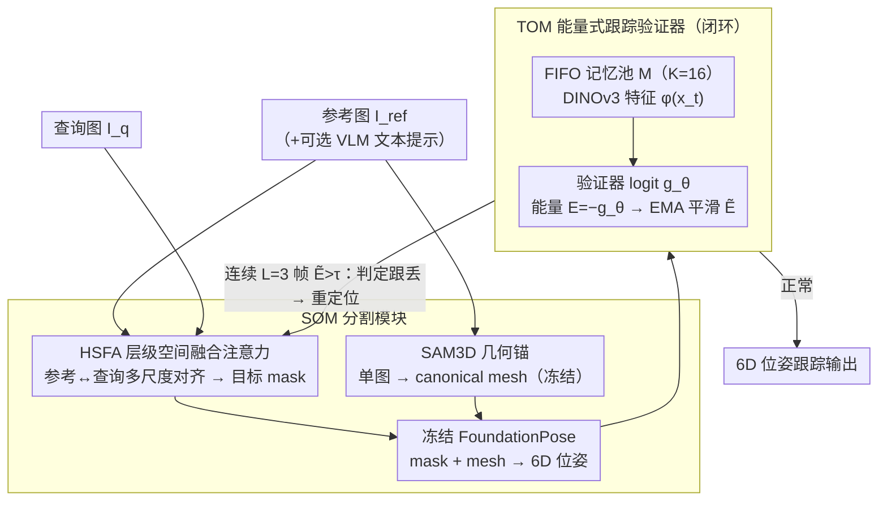

# STORM: Segment, Track, and Object Re-Localization from a Single Image

**会议**: ICML 2026  
**arXiv**: [2511.09771](https://arxiv.org/abs/2511.09771)  
**代码**: https://github.com/YuDeng321/STORM  
**领域**: 视频理解 / 6D 位姿跟踪 / 参考分割 / 具身智能感知  
**关键词**: Reference-conditioned 6D tracking、HSFA、Tracking verifier、Energy-like score、零样本注册

## 一句话总结
STORM 提出"一张参考图就能跑"的 6D 位姿跟踪框架：用层级化空间融合注意力 HSFA 做参考-查询特征对齐（产出分割掩膜 + SAM3D 网格），再训一个 BCE 二分类的 Tracking Verifier，把其 logit 取负当作能量分数 $E=-g_\theta$，连续 $L=3$ 帧超阈值就触发自动重定位，从而在 LM-O / YCB-V 上把无标注 6D 跟踪精度推到接近 ground-truth 掩膜上限。

## 研究背景与动机

**领域现状**：当前 SOTA 6D 位姿估计与跟踪（FoundationPose, SAM-6D, Pos3R 等）大多依赖 CAD 模型、手动 mask 或 per-object 微调，部署时需要繁琐的物体特定准备；通用基础模型（SAM3、DINOv3）虽提供强语义，但缺少 reference-conditioned 机制，无法靠"一张图"指定追哪个特定实例。

**现有痛点**：(1) 参考-查询模板匹配多用浅层 cosine 相似度，遇到遮挡、运动模糊、视角剧变时非线性流形扭曲让度量崩盘；(2) 现有 tracker 是"瞎跟"——一旦目标飘出局部邻域，没有任何内置信号能判定"我现在跟丢了"，导致 silent drift；(3) 即使加入恢复启发式（粒子滤波、直方图匹配）也容易误报，无法形成闭环。

**核心矛盾**：参考图与查询图之间存在**分布偏移**与**遮挡不确定性**的双重 gap，纯几何匹配解决前者不行、纯语义匹配解决后者不够；同时跟踪是一个**自反馈系统**，缺少"自评估信号"就无法做闭环恢复。

**本文目标**：(i) 在不依赖 CAD、无 per-object 训练的前提下完成单参考图 6D 跟踪；(ii) 把"跟踪失败检测"变成可学习模块；(iii) 在严重遮挡和快速视角变化下自动恢复。

**切入角度**：把分割与跟踪从"独立工程模块"重构为"耦合学习模块"——前者通过层级注意力把参考视图压缩成 object-centric 表征，后者把"跟踪是否仍兼容初始记忆"形式化为二分类验证问题，并借鉴 OOD 检测中能量打分（Liu 2020）做平滑阈值化。

**核心 idea**：用一个 BCE 训练的 compatibility verifier 同时承担"实例匹配损失监督"和"跟踪有效性能量评分"两个任务，把不变性、稳健性、闭环恢复统一在同一个 logit 标量里。

## 方法详解

### 整体框架
STORM 由两个耦合模块组成。**SOM (Segmenting Object Module)**：吃一张或多张参考图 $I_{ref}$ + 当前查询图 $I_q$（外加可选 VLM 语义提示），通过 HSFA 输出查询图上的目标 mask，再用 SAM3D 从参考图生成 canonical 3D mesh $\mathcal{P}_{ref}$，与 mask 一起送进冻结的 FoundationPose 拿到 6D 位姿。**TOM (Tracking Object Module)**：维护一个 FIFO 大小 $K=16$ 的成功跟踪 crop 记忆池 $\mathcal{M}$，每帧抽 DINOv3 特征 $\phi(x_t)$ 与 $\mathcal{M}$ 配对算 logit $g_\theta(x_t,\mathcal{M})$，定义能量 $E(x_t,\mathcal{M})\triangleq -g_\theta(x_t,\mathcal{M})$，EMA 平滑后若连续 $L=3$ 帧 $\tilde E_{t-k}>\tau$ 则触发重定位（$\tau$ 用验证集 95 百分位标定）。冻结部件：DINOv3、CLIP/VLM、SAM3D、FoundationPose；可训练部件：SOM (HSFA + 分割头) + TOM (轻量注意力验证器)。

### 关键设计

**1. HSFA 层级空间融合注意力：把"参考图怎么对到查询图"做成可学的多尺度对齐，而不是脆弱的 cosine 模板**

传统模板匹配靠浅层 cosine 相似度，一遇遮挡、运动模糊、视角剧变就因非线性流形扭曲而崩盘；固定的参考拼接方式也处理不了"推理时参考视图数量在变"。HSFA 把对齐学习化、层级化、条件化：先用 self-attention 把任意张数的参考视图聚合成对象中心潜表征 $\mathcal{Z}_{ref}$，再让 query 特征 $\mathcal{Z}_{query}$ 通过 cross-attention 去检索它——浅层针对原始参考特征做全局语义锚定、深层针对精细空间特征做局部几何对齐，整个融合块迭代 $n$ 次逐步精化。当 VLM 给出文字描述 $T$ 时，用零初始化的 AdaLN/FiLM 把其 CLIP 嵌入 $e_t$ 当条件去修正视觉 token 的特征统计

$$\hat F_{i,c}=(1+s_c(e_t))(F_{i,c}-\mu_i)/(\sigma_i+\epsilon)+b_c(e_t)$$

并在 cross-attention 用 sigmoid 门控压低无关参考 channel，最后拿 cross-attention 的 softmax 权重当对齐矩阵 $W$，把参考 objectness 投到 query 得到 mask。全程不显式监督对应关系、只用 mask loss，从而绕开脆弱的 keypoint 对齐。

**2. 能量式跟踪验证器（Energy-like Tracking Verifier, TOM）：给跟踪装一个"我是不是跟丢了"的自评估信号**

现有 tracker 默认目标永远在局部邻域里，一旦物体飘出去就 silent drift，没有任何内置信号能判定失败。TOM 把"当前观测是否还属于初始追踪对象"形式化成二分类：训练时对三元组 $(x_t, \mathcal{M}, y)$ 做 BCE

$$\mathcal{L}_{TOM}=-\mathbb{E}[y\log\sigma(g_\theta)+(1-y)\log(1-\sigma(g_\theta))]$$

正样本来自真实兼容的观测-记忆对，负样本则用 identity confusion（同场景换个物体）+ drift-like 随机裁剪人工合成。推理时借鉴 OOD 检测的能量打分，定义能量 $E=-g_\theta$，做时间 EMA 得 $\tilde E_t$，只有连续 $L=3$ 帧 $\tilde E_{t-k}>\tau$ 才宣告跟踪失败（$\tau$ 取 held-out 集上兼容对分布的 95 百分位）。能量阈值与 logit 阈值数学等价（$E>\tau\Leftrightarrow g_\theta<-\tau$），于是训练享受 BCE 的稳定、推理享受能量平滑和阈值调控的灵活，连续帧门控又把单帧抖动误报挡在门外。

**3. SAM3D 几何锚 + 冻结/训练边界：用单图网格当"结构脚手架"接力刚性配准，并把训练面压到最小**

要在没有 CAD 的前提下拿到 6D 位姿，得先有个 3D 参照。STORM 用 SAM3D 从参考图一次性生成 canonical mesh $\mathcal{P}_{ref}$，但不强行做 texture/geometry 的硬匹配，而是把网格当成 soft latent 几何约束，让冻结的 FoundationPose 接力做精配准。运行时 SAM3D、DINOv3、FoundationPose、CLIP 全部冻结，只训 SOM（HSFA + 分割头）和 TOM（轻量注意力验证器）。这么划边界是因为单视图 mesh 预测质量本就不稳，只要把它当脚手架而非精确几何，下游 pose 注册就能容忍噪声；而冻结基础模型则保证 zero-shot 泛化不被有限训练数据污染，训练成本也随之大幅下降。

### 损失函数 / 训练策略
SOM 用标准分割损失（监督 mask，对应关系隐式涌现，无显式 correspondence loss）；TOM 用 BCE（公式 3）；推理：DINOv3 feature → TOM logit → EMA → 阈值化 → 闭环。记忆池 FIFO 大小 16，重定位后清空、只在高置信帧追加。

## 实验关键数据

### 主实验
LM-O / YCB-V 上无标注 6D 跟踪精度（$\mathrm{ADD}_\mathrm{AUC}$ / $\mathrm{ADD\text{-}S}_\mathrm{AUC}$ / AR）：

| 数据集 | 方法 | $\mathrm{ADD}_\mathrm{AUC}$ | $\mathrm{ADD\text{-}S}_\mathrm{AUC}$ | AR |
|---|---|---|---|---|
| LM-O | FP + CNOS | 57.0 | 68.0 | 41.0 |
| LM-O | **STORM** | **74.0 ± 1.28** | **89.0 ± 1.25** | **53.0 ± 2.02** |
| LM-O | FP + Ground Truth | 78.0 | 93.0 | 56.0 |
| YCB-V | FP + CNOS | 73.0 | 92.0 | 69.0 |
| YCB-V | **STORM** | **77.0 ± 1.25** | **98.0 ± 1.20** | **73.0 ± 1.23** |
| YCB-V | FP + Ground Truth | 78.0 | 99.0 | 74.0 |

BOP instance segmentation（5 数据集 mean AP，annotation-free 段）：

| 方法 | LM-O | T-LESS | TUD-L | HB | YCB-V | Mean ↑ | Time (s) |
|---|---|---|---|---|---|---|---|
| **STORM (SOM)** | **57.8** | **53.0** | **73.3** | **74.1** | **80.3** | **67.7** | **0.046** |
| NOCTIS | 48.9 | 47.9 | 58.3 | 60.7 | 68.4 | 56.8 | 0.990 |
| SAM6D | 46.0 | 45.1 | 56.9 | 59.3 | 60.5 | 53.6 | 2.795 |
| CNOS (FastSAM) | 39.7 | 37.4 | 48.0 | 51.1 | 59.9 | 47.2 | 0.221 |

### 消融实验

| 配置 | 关键变化 | 结论 |
|---|---|---|
| Full STORM | mean AP 67.7 | 完整框架 |
| w/o HSFA 深度迭代 | 大幅退化 | 多尺度跨注意力是分割鲁棒性核心 |
| w/o VLM 语义注入 | 多实例混淆上升 | 文本条件主要救场歧义场景 |
| TOM 用固定 cosine 度量 | tracking-loss 检测 AUC ↓ | 学得 logit 比固定度量更能区分真飘移 |
| 关闭 EMA 平滑 + 连续 $L$ 检查 | 误触发率显著上升 | 连续 3 帧门控明显抑制 false positive |

### 关键发现
- STORM 在 LM-O 上把 annotation-free pipeline 从 57.0 推到 74.0，距 ground-truth mask 上限（78.0）只剩 4 点差距——说明 mask 质量是当前瓶颈，TOM 几乎榨干了 pose head 容量。
- SOM 在 H100 上单次推理仅 0.046s，比 NOCTIS / SAM6D 快 20–60×，源于冻结 DINOv3 + 轻量 HSFA 设计。
- TOM 学到的 verifier 在 Tracking Failure Benchmark 上比固定度量基线更稳定，连续帧门控让重定位决策对单帧噪声免疫。

## 亮点与洞察
- **把"如何分割"和"如何验证"两件事都做成 learned alignment**，避开了 cosine 模板这种业界默认但脆弱的工程选项。
- **能量分数 = logit 取负**这个数学等价让训练用 BCE 的稳定性 + 推理用能量阈值的灵活性兼得，可直接迁移到任何"可学的二分类匹配 + 时序闭环"任务（如 ReID、半监督目标跟踪）。
- **冻结基础模型 + 训练两个小模块** 的最小训练面策略让 STORM 既享受 DINOv3 / FoundationPose 的零样本泛化，又能在新任务上低成本微调，工程友好度很高。
- **VLM 通过零初始化 AdaLN 做条件注入**：把语义视为"恒等保持的特征统计修正"而非硬拼接，避免训练初期文本通道干扰视觉学习，是 Cond-DM 思路在视觉对齐里的优雅迁移。

## 局限与展望
- 作者承认 zero-shot 仅指"无 test-time mask/box/微调"，BOP train/test 物体身份可能重合，并非真正 category-disjoint 新物体泛化。
- SAM3D 单图重建质量决定 pose 上限，对反光、透明、纹理稀缺物体仍可能崩；未来可考虑 multi-view 自适应 mesh refinement。
- TOM 的 $\tau$ 95 百分位标定来自合成 drift 负样本，对真实长尾遮挡分布不一定鲁棒；增加在线自适应阈值或贝叶斯不确定性估计是自然延伸。
- 单参考图只覆盖一个视角，遮挡严重时仍需手动多视图，未来 active learning 何时主动请求新参考图是开放问题。

## 相关工作与启发
- **vs FoundationPose (Wen 2024)**：本文直接复用其 pose head，但补足了 "跟踪有效性自评估" 与"无 CAD 时如何拿到 mask"两个缺口。
- **vs CNOS / PerSAM**：他们用浅层 cosine 模板匹配，STORM 用层级注意力做 learned alignment，遮挡场景明显更稳。
- **vs SAM-6D / Pos3R**：他们做帧级处理 + 显式 2D-3D 关键点匹配，STORM 通过 verifier 引入时序闭环。
- **vs OOD 检测中的 energy score (Liu 2020)**：把能量阈值化思想从 OOD 分类首次系统迁移到 6D 跟踪失败检测。

## 评分
- 新颖性: ⭐⭐⭐⭐ HSFA + Energy-like verifier 的组合在 6D tracking 里是新尝试，两个模块单独看都有 prior
- 实验充分度: ⭐⭐⭐⭐ LM-O / YCB-V + 5 数据集 BOP + 5 个 RQ + 5 seed 误差棒，覆盖全面
- 写作质量: ⭐⭐⭐⭐ 模块边界与冻结/训练边界写得很清晰，能量分数推导利落
- 价值: ⭐⭐⭐⭐ 对 robotics / 具身感知场景实用性强，开源代码 + 接近 GT 上限的精度

<!-- RELATED:START -->

## 相关论文

- [\[CVPR 2026\] STORM: End-to-End Referring Multi-Object Tracking in Videos](../../CVPR2026/video_understanding/storm_referring_multi_object_tracking.md)
- [\[CVPR 2026\] TGTrack: Temporal Generative Learning for Unified Single Object Tracking](../../CVPR2026/video_understanding/tgtrack_temporal_generative_learning_for_unified_single_object_tracking.md)
- [\[CVPR 2026\] Temporally Consistent Long-Term Memory for 3D Single Object Tracking](../../CVPR2026/video_understanding/chronotrack_temporally_consistent_long_term_memory_for_3d_single_object_tracking.md)
- [\[CVPR 2026\] UETrack: A Unified and Efficient Framework for Single Object Tracking](../../CVPR2026/video_understanding/uetrack_a_unified_and_efficient_framework_for_single_object_tracking.md)
- [\[CVPR 2026\] Out of Sight, Out of Track: Adversarial Attacks on Propagation-based Multi-Object Trackers via Query State Manipulation](../../CVPR2026/video_understanding/out_of_sight_out_of_track_adversarial_attacks_on_propagation-based_multi-object_.md)

<!-- RELATED:END -->
