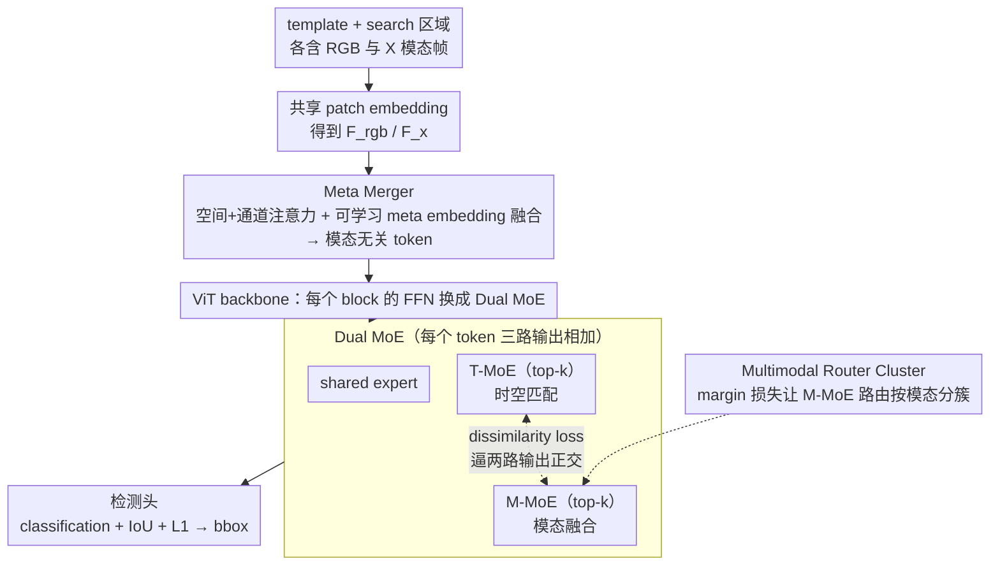

# Unified Multimodal Visual Tracking with Dual Mixture-of-Experts

**会议**: ICML 2026  
**arXiv**: [2605.03716](https://arxiv.org/abs/2605.03716)  
**代码**: 无  
**领域**: 视频理解 / 多模态视觉跟踪 / Mixture-of-Experts  
**关键词**: 视觉跟踪、RGB+X、Mixture-of-Experts、特征解耦、模态缺失鲁棒

## 一句话总结
OneTrackerV2 把 RGB / RGB+D / RGB+T / RGB+E / RGB+N 五种跟踪任务统一在一个网络里端到端训练，靠 Meta Merger 做模态融合、Dual MoE 把"时空匹配"与"模态融合"两类异质特征显式拆到 T-MoE 与 M-MoE，并用 dissimilarity loss + router clustering 保证它们不塌成同一子空间。

## 研究背景与动机
**领域现状**：视觉目标跟踪按输入模态分成 RGB 与 RGB+X（X=Depth/Thermal/Event/Language）。主流路线有三条：(a) 每个 X 任务独立设计架构与训练；(b) OneTracker 这类对预训练 RGB 跟踪器做 fine-tuning 适配；(c) SUTrack 这类初步统一模型，把多模态 token 拼起来用同一 backbone。

**现有痛点**：(1) 多步训练，pretrained → finetune 通常收敛到次优；(2) 缺统一架构，仍要手工设计任务分支；(3) 共享架构里参数仍按任务分组，不是真的"unified params"；(4) 一旦推理时某种模态缺失，性能崩塌；(5) 特征冲突 — 简单 token 拼接迫使同一参数空间同时学时空运动匹配与模态特异 pattern，互相干扰。

**核心矛盾**：跟踪本质同时需要两类截然不同的能力：时空匹配（template ↔ search 跨帧运动）与模态融合（RGB ↔ X 的互补线索）。把它们塞进单一 backbone / 单 MoE 会形成 zero-sum 的参数竞争。

**本文目标**：(1) 单步端到端、共享参数、共享架构；(2) 把模态融合做成模态无关、对缺失鲁棒的"meta embedding"；(3) 用结构解耦解决时空匹配与模态融合的特征冲突；(4) 容量可扩展但推理成本不爆炸。

**切入角度**：用 learnable meta embedding 做模态中央枢纽；引入 Dual MoE，让两组专家分别承担时空与模态任务，通过显式 decoupling loss 强制它们正交。

**核心 idea**：Meta Merger + Dual MoE = 一个网络、一次训练、一套参数处理 5 种跟踪任务，并对模态缺失与模型压缩都保持鲁棒。

## 方法详解

### 整体框架
输入 template 与 search 区域，每个区域包含 RGB 与某个 X 模态帧（RGB-only 任务把 X 帧用 RGB 自身代替）。两路通过共享 patch embedding 得到 $F_{rgb},F_x$，经 Meta Merger 用 learnable meta embedding $F_{meta}$ 做空间 + 通道 attention + 中心化卷积融合，得到模态无关 token 序列。该序列送入 Vision Transformer backbone，其中每个 block 用 Dual MoE 替换 FFN：每个 token 同时通过 shared expert、T-MoE（top-$k$）与 M-MoE（top-$k$）三路计算并相加。最后接 SUTrack 风格的 classification + IoU + L1 检测头输出 bbox。整套架构提供 B224 / B384 / L224 / L384 四个版本，参数 80M–271M、推理 FPS 23.4–72.4。

### 关键设计

**1. Meta Merger：用一个可学习的 meta embedding 当"模态翻译官"，把异质模态压进统一空间**

简单地把 RGB 与 X 模态 token 拼起来（SUTrack 的做法）既要双倍计算，又会在某一模态缺失时直接崩。Meta Merger 先对 $F_{rgb}$ 与 $F_x$ 各自做空间 + 通道注意力增强（$W^{spatial}=\sigma(\mathrm{Conv}(F^{avg})+\mathrm{Conv}(F^{max}))$、$W^{channel}=\sigma(\mathrm{Linear}(F^{avg})+\mathrm{Linear}(F^{max}))$），再引入一个全局可学习变量 $F_{meta}$ 充当跨模态中介：$F_{meta}'=\mathrm{Conv}(\mathrm{Conv}(F_{meta}+F'_{rgb})+\mathrm{Conv}(F_{meta}+F'_x)+F_{meta})$，输出全局对齐的模态无关 token。这样设计的好处是当 X 缺失时，meta embedding 自然退化为只与 RGB 交互，整条融合管道一行都不用改——模态鲁棒性是结构自带的，而不是额外训练出来的。

**2. Dual MoE：把"时空匹配"和"模态融合"两类异质能力拆到两组专家，再用正交损失逼它们分家**

跟踪同时要做 template↔search 的跨帧运动匹配和 RGB↔X 的互补线索融合，这两件事塞进同一参数空间会形成 zero-sum 的竞争。DMoE 对每个 token 输出 $y=E_{shared}(x)+\sum_{i\in S^T_k}\hat g_i^T(x)E_i^T(x)+\sum_{i\in S^M_k}\hat g_i^M(x)E_i^M(x)$，其中 T-MoE 与 M-MoE 各自 top-$k$ 选专家、$\hat g$ 是重归一化的 softmax 权重，每个 expert 走"降到秩 $r$ → 非线性 → 升回 $d$"，容量大但成本可控。再加一个 expert decoupling loss $\mathcal L_{dis}=(\cos(y^T,y^M))^2$ 强制两路输出正交。一旦 T-MoE 被推离 M-MoE 的子空间，它就自然被运动特征吸引、M-MoE 则去吸收模态特异信号——两组专家各司其职，消融里 D-MoE 明显优于单 MoE，正说明这种拆解是必要的。

**3. Multimodal Router Cluster：让 M-MoE 的路由真按模态分簇，而不只是泛泛地正交**

只有 $\mathcal L_{dis}$ 能保证 T/M 两路输出正交，却不保证 M-MoE 内部真的"某些专家专管 Depth、某些专管 Thermal"。Router cluster 因此直接对路由行为下手：用 batch 内路由相似度 $S_{ij}=\langle g^M(x_i),g^M(x_j)\rangle$ 配 margin $\delta$，构造同模态样本要相似的 $\mathcal L_{same}=\frac{1}{|M_{same}|}\sum_{(i,j)\in M_{same}}\max(0,(1/K+\delta)-S_{ij})$ 和跨模态样本要相异的 $\mathcal L_{diff}=\frac{1}{|M_{diff}|}\sum_{(i,j)\in M_{diff}}\max(0,S_{ij}-(\delta-1/K))$，合成 $\mathcal L_{cluster}=\mathcal L_{same}+\mathcal L_{diff}$。它给 M-MoE 提供了模态层级的层次化偏好，让专家选择策略真正落到具体模态上，这也是跨模态泛化能力的来源。

### 损失函数 / 训练策略
总损失 $\mathcal L=\mathcal L_{class}+\lambda_G\mathcal L_{IoU}+\lambda_{L_1}\mathcal L_{L_1}+\mathcal L_{task}+\lambda_{dis}\mathcal L_{dis}+\lambda_{cluster}\mathcal L_{cluster}+\lambda_{balance}\mathcal L_{balance}$，默认 $\lambda_G\!=\!2,\lambda_{L_1}\!=\!5,\lambda_{dis}\!=\!0.1,\lambda_{cluster}\!=\!1$；$\mathcal L_{balance}$ 用于约束 MoE 负载均衡。整网一次端到端训练，无 pretrain → finetune 多阶段。

## 实验关键数据

### 主实验

| 任务 / 基准 | 指标 | OneTrackerV2-L384 | SUTrack-L384 (强 baseline) | 说明 |
|-------------|------|--------------------|----------------------------|------|
| LaSOT | AUC | 76.1 | 75.2 | 长时单目标，统一架构仍领先 |
| LaSOT_ext | AUC | 55.2 | 53.6 | OOD class 上提升明显 |
| TrackingNet | AUC / P | 88.6 / 89.0 | 87.7 / 88.7 | 大规模在线跟踪 |
| GOT-10k | AO | 81.3 | 81.5 | 同档，但用统一参数 |
| UAV123 | AUC | 71.0 | 70.4 | 无人机视角 |
| 模型规格 | Params (M) / FLOPs (G) / FPS | 80.2 / 23.8 / 72.4 (B224) | — | DMoE 几乎不增加成本 |

### 消融实验

| 设计 | 关键观察 | 解读 |
|------|----------|------|
| 完整 OneTrackerV2 | 在 5 任务 12 基准全 SOTA | 单模型即可统一 RGB + RGB+X |
| 去 Dual MoE / 用 single MoE | 显著掉点（Table 4 中 D-MoE 优于 single MoE） | 异质目标必须显式解耦 |
| 去 $\mathcal L_{dis}$ | T-MoE / M-MoE 输出相似度上升、性能下降 | 正交约束是 decoupling 关键 |
| 去 router cluster | M-MoE 退化为通用 FFN，跨模态泛化变差 | 模态特异 expert 选择能力丧失 |
| 缺失模态推理 | 性能仍稳定，远好于 SUTrack | Meta Merger 提供模态鲁棒 |
| 模型压缩 | 压缩后仍保留主要精度 | DMoE 结构性冗余允许稀疏化 |

### 关键发现
- T-MoE 的 expert 选择模式与目标运动强度高度相关（Fig. 5），证明它确实学到 motion-related 特征；M-MoE 不同 expert 对不同 X 模态有明显偏好，证明 router cluster 有效。
- 单 MoE 试图同时承担两种任务时会塌缩成生成性强但区分弱的特征提取器；解耦后两组 expert 各司其职，性能 + 鲁棒性同时上升。
- 在模型压缩与模态缺失这两个工程关键场景，OneTrackerV2 优势显著扩大，说明 unified + decoupled 设计天然具备鲁棒性 budget。

## 亮点与洞察
- 把"特征冲突"显式作为优化目标：用 $\cos^2$ dissimilarity 这一最简单的正交化损失就让 dual MoE 各自专精，是非常 ROI 高的设计。
- Router cluster 提供模态层级的 inductive bias：把"路由相似度"作为可观察变量直接施加 margin 损失，比 expert capacity loss 更精确地约束路由行为。
- Meta embedding 作为"模态中介"对模态缺失天然鲁棒——它是一个广泛适用的设计模式（可迁移到 RGB+X 检测 / 分割 / 多模态推理）。
- 单阶段训练 + 共享参数 + 12 个基准 SOTA，是 multimodal tracking 当前最有"工业落地味"的方案之一。

## 局限与展望
- 仍依赖 ImageNet 风格 ViT backbone；对纯事件 / 雷达 / 点云这类与 RGB 域差距更大的模态是否仍能 plug-and-play 未充分讨论；
- DMoE 把 FFN 替换成多专家，虽然 FLOPs 增加有限，但显存与训练时间显著增加，对小团队不友好；
- 文章用 dissimilarity 与 router cluster 两个手动权重，缺乏自动调度（如根据任务难度动态调权重）；
- 多模态训练数据仍按任务汇总，未充分讨论跨任务正负迁移。

## 相关工作与启发
- **vs SUTrack (Chen et al. 2025)**：SUTrack naive token concat，模态缺失场景崩；OneTrackerV2 用 Meta Merger 中央枢纽 + DMoE 显式解耦，全面超越。
- **vs OneTracker (Hong et al. 2024)**：原作走 pretrain → finetune 路径，仍依任务分组参数；本作真正 unified params + 一次训练。
- **vs MoE 跟踪器 (Tan et al. 2025, Cai et al. 2025)**：他们用 MoE 仅做容量扩展或域适配；本作把 MoE 用作"任务解耦的结构容器"，是 MoE 在跟踪中较新颖的用法。
- **vs OneTracker / SUTrack 的多模态融合**：本作的 Meta Merger 是一个泛用模块，可迁移到任意需要"主模态 + 辅助模态"的检测 / 分割任务。

## 评分
- 新颖性: ⭐⭐⭐⭐ Dual MoE + router cluster 把"特征冲突"问题做成结构解 — 在跟踪里算清新颖。
- 实验充分度: ⭐⭐⭐⭐⭐ 5 任务 12 基准 + 4 个模型规格 + 模型压缩 + 模态缺失 + 多消融，覆盖度极高。
- 写作质量: ⭐⭐⭐⭐ 图示清晰、损失公式整齐，能看清每个设计为何存在。
- 价值: ⭐⭐⭐⭐ 是当下 multimodal tracking 最具实用价值的 unified baseline，结构上的模态枢纽 + dual MoE 模式可外推到其他多模态视觉任务。

<!-- RELATED:START -->

## 相关论文

- [\[ICML 2026\] RELO: Reinforcement Learning to Localize for Visual Object Tracking](relo_reinforcement_learning_to_localize_for_visual_object_tracking.md)
- [\[CVPR 2026\] UTPTrack: Towards Simple and Unified Token Pruning for Visual Tracking](../../CVPR2026/video_understanding/utptrack_towards_simple_and_unified_token_pruning_for_visual_tracking.md)
- [\[ECCV 2024\] Occluded Gait Recognition with Mixture of Experts: An Action Detection Perspective](../../ECCV2024/video_understanding/occluded_gait_recognition_with_mixture_of_experts_an_action_detection_perspectiv.md)
- [\[ICML 2026\] AVTrack: Audio-Visual Tracking in Human-centric Complex Scenes](avtrack_audio-visual_tracking_in_human-centric_complex_scenes.md)
- [\[CVPR 2026\] Joint Learning of General and Diverse Patterns with Mixture of Memory Experts for Weakly-Supervised Video Anomaly Detection](../../CVPR2026/video_understanding/joint_learning_of_general_and_diverse_patterns_with_mixture_of_memory_experts_fo.md)

<!-- RELATED:END -->
