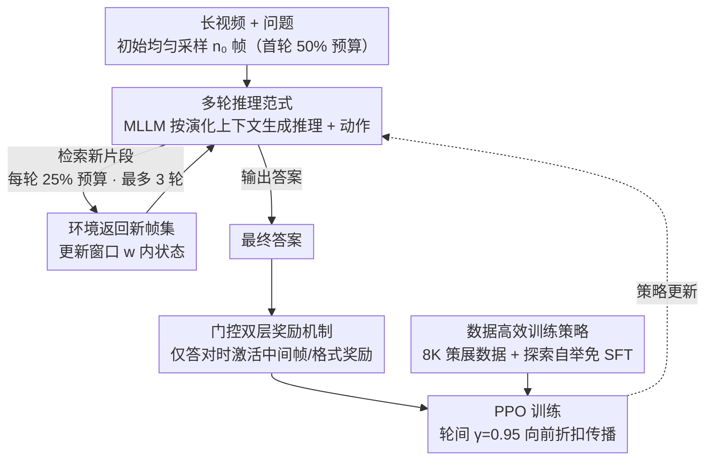

# Video-MTR: Reinforced Multi-Turn Reasoning for Long Video Understanding

**会议**: ICML 2026  
**arXiv**: [2508.20478](https://arxiv.org/abs/2508.20478)  
**代码**: 待确认  
**领域**: 视频理解 / 强化学习 / 多模态推理  
**关键词**: 强化学习, 多轮推理, 长视频理解, 关键帧检索

## 一句话总结
Video-MTR 是一个基于强化学习的**多轮推理**框架——通过**门控双层奖励机制**引导 MLLM 迭代选择关键视频片段，仅用 **8K 数据**实现长视频理解的 SOTA 性能，对标方法需要 257K~440 万样本（数据效率提升两个数量级）。

## 研究背景与动机

**领域现状**：长视频理解已成为 MLLMs 的重要应用，但现有方法主要分两类——（1）指令微调范式，依赖均匀采样和大规模数据；（2）智能体范式，集成外部 VLMs 工具，引入复杂的异质组件。

**现有痛点**：
- 均匀采样策略无法应对长视频中的信息丧失——无法适应性定位关键片段。
- 外部 VLM 依赖导致系统复杂度高、工具利用策略次优、缺乏端到端训练。
- 现有 RL 方法多用单轮推理或基于最终答案的稀疏奖励，难以指导多轮中间行为。

**核心矛盾**：长视频包含多事件和长期时间依赖，但现有方法要么固定采样造成信息丧失，要么依赖外部工具牺牲效率。如何在有限计算预算内实现自适应、多轮的关键片段检索？

**本文目标**：
1. 提出纯 RL 后训练范式，无需大规模有监督微调。
2. 设计细粒度多轮奖励机制，指导中间帧检索行为。
3. 用极少数据（8K vs 257K~440 万）达到 SOTA 性能。

**切入角度**：将长视频理解重新表述为**多轮交互决策过程**——MLLM 作为 agent，视频作为环境，每轮迭代检索关键片段并更新上下文；模拟人类观看长视频的自然过程：先整体理解再针对性回顾细节，最后综合证据。

**核心 idea**：通过**门控双层奖励**（目标奖励层耦合中间帧奖励）+ **探索自举**（无冷启动 SFT），使 MLLM 在纯 RL 中学会多轮证据寻求，同时大幅降低数据需求。

## 方法详解

### 整体框架
将长视频理解重新框架化为 MDP：
- **状态** $s_k = (\mathcal{F}_{k-w}, x_{k-w}, \ldots, \mathcal{F}_k, x_k)$：过去 $w$ 轮交互 + 当前观察帧集。
- **动作** $a_k$：检索新片段（指定时间范围）或输出最终答案。
- **环境响应**：根据检索动作返回新采样帧集 $\mathcal{F}_{k+1}$，基于答案正确性返回奖励。
- **轨迹** $\tau = \{(\mathcal{F}_k, x_k, y_k)\}_{k=0}^K$。

初始化时均匀采样 $n_0$ 帧，后续每轮最多 $K_{\max} = 3$ 次检索。模型生成推理文本 + 可执行动作，解析后决定是继续检索还是输出答案。

### 关键设计

**1. 多轮推理范式：把固定均匀采样换成"逐轮按需检索关键片段"**

长视频里均匀采样必然漏掉关键细节，单轮处理固定帧集也没法适应性定位。Video-MTR 让 MLLM 每轮基于演化的上下文（已处理帧 + 推理进展）主动检索新片段：第一轮花 50% 采样预算做整体浏览，后续每轮各 25%，总量不超上限，于是复杂区域密采、简单区域粗采。这模拟了人看长视频的自然过程——先整体理解再针对性回看细节、最后综合证据；它的收益随任务复杂度和视频长度上升（多细节任务 +8.1%、VideoMME 长视频 +6.3% 远高于短视频的 +1.7%），正说明自适应检索在最难的场景里最值钱。

**2. 门控双层奖励机制：用分层奖励指导每一轮的中间检索行为，同时堵死刷轮数的奖励作弊**

纯终端奖励只看最终答案，根本指导不了中间该检索哪段（消融里 LVBench 掉 4.6%）；但无约束的中间奖励又会让模型为了累积轮数而不是答对题去优化。Video-MTR 把奖励分三层：轨迹层 $R_{\text{acc}}$ 答对为 1 否则 0；轮层 $R_{\text{fms}}^k$ 按检索帧与真值标注的 IoU 改进给奖励（上限 0.5，即 $R_{\text{acc}}$ 的一半）以鼓励边际改进、禁止冗余选择；格式层 $R_{\text{format}}^k=0.1$ 奖励合规输出。关键是门控：所有中间奖励 $\sum_{k=0}^{K-1}(R_{\text{fms}}^k+R_{\text{format}}^k)$ 只在 $R_{\text{acc}}>0$ 时才激活，合成

$$R(\tau)=\mathbb{1}_{\{R_{\text{acc}}>0\}}\cdot\sum_{k=0}^{K-1}(R_{\text{fms}}^k+R_{\text{format}}^k)+R_{\text{acc}}+R_{\text{format}}^K$$

也就是说，帧检索行为只有在最终答对时才被强化——这就把"检索"和"答对"硬绑在一起，模型没法靠多检索几轮来空刷奖励。

**3. 数据高效训练策略：靠精准数据策展 + 探索自举，把 RL 后训练压到 8K 样本、还免掉冷启动 SFT**

大规模 SFT 数据又贵又难拿。Video-MTR 一方面做数据策展，复用现成的时间定位数据集（NExT-GQA 自带 QA + 时间标注，QVHighlights 用 GPT-4o 转成 QA + 标注），专挑关键片段短的样本攒出 8K 紧凑集，押"质 > 量"。另一方面解决冷启动：预训练 MLLM 本来不会主动检索，但它不走 SFT warm-up，而是探索自举——每个 mini-batch 若检索率低于阈值就自动发一点小奖励刺激检索，一旦检索成了常规行为就关掉这个奖励、交回双层细粒度信号驱动学习。这套组合让 RL 不靠大规模监督也能快速收敛到多轮推理策略。

### 训练策略
PPO 算法，多轮轨迹视为单 token 序列，两层折扣因子——轮间 $\gamma_{\text{turn}} = 0.95$（最终答案信号向前折扣传播鼓励早期正确决策），轮内 $\gamma_{\text{token}} = 1.0$。批 32，actor lr $1 \times 10^{-6}$，critic lr $1 \times 10^{-5}$，8 张 A800-80GB GPU。

## 实验关键数据

### 主实验

| 模型 | 参数 | 帧 | VideoMME | MLVU | LongVideoBench | LVBench | EgoSchema |
|------|------|----|--------|------|----------------|---------|-----------|
| GPT-4o | — | 384 | 71.9 | 54.9 | 66.7 | 48.9 | 72.2 |
| Gemini-1.5-Pro | — | 0.5fps | 75.0 | — | 64.0 | 33.1 | 71.1 |
| LongVA-7B | 7B | 256 | 52.6 | 41.1 | 47.8 | 37.9 | — |
| Video-R1-7B | 7B | 32 | 59.3 | 45.4 | — | 35.9 | 48.8 |
| Video-R1-7B | 7B | 64 | 61.4 | 47.6 | — | 38.0 | 51.8 |
| **Video-MTR** | 7B | 32 | 59.0 | 48.4 | 52.3 | 38.2 | 62.4 |
| **Video-MTR** | 7B | 64 | 62.2 | 49.8 | 54.8 | 41.8 | 63.4 |
| **Video-MTR** | 7B | 80 | **62.7** | **50.4** | **57.1** | **42.3** | **68.8** |

同等帧预算下 Video-MTR 全面超越基准 Qwen2.5-VL-7B（32 帧 +5.4 到 +6.3%）；80 帧的 Video-MTR 性能几乎达到 Qwen2.5-VL-7B 用 768 帧的水平；**数据效率突出**——仅 8K 数据 vs VideoChat2 的 2M、Video-XL 的 257K、Video-R1 的 260K。

### 消融实验

| 配置 | VideoMME 短 | 中 | 长 | 总 | LVBench |
|------|-----------|-----|-----|-----|---------|
| **完整模型** | 74.8 | 60.6 | 52.7 | 62.7 | 42.3 |
| 无双层奖励 | 69.4 | 56.2 | 49.4 | 58.3 | 37.7 |
| **掉点** | -5.4 | -4.4 | -3.3 | -4.4 | **-4.6** |
| 单轮基线 | 68.8 | 54.8 | 47.9 | 57.2 | 35.3 |
| **掉点** | -6.0 | -5.8 | -4.8 | -5.5 | **-7.0** |

### 关键发现
- **多轮推理的差异效果**：MLVU 上多轮收益与任务难度呈线性关系——整体 +3.8%、单细节 +7.5%、多细节 +8.1%。
- **视频长度可扩展性**：VideoMME 上 32 帧预算下短视频 +4.6%、中 +5.3%、**长 +6.3%**——多轮推理的优势在长视频场景最突出。
- **奖励破解的防止**：无门控时模型学到"通过增加轮数累积奖励"的虚假策略（轮数增加但 QA 准度无改善）；有门控时模型学会根据实际需要检索。
- **探索自举有效**：无需 SFT warm-up，RL 直接实现多轮能力；在 Qwen2.5-VL-3B（小模型）上同样有效，范式可扩展。

## 亮点与洞察
- **范式创新**：首次将长视频理解表述为多轮 MDP，打破单轮采样瓶颈；相比单轮 RL，多轮在复杂任务上的收益系数明显更大。
- **奖励设计巧妙**：双层奖励 + 门控机制的组合精妙——既防止奖励破解又保留细粒度监督；消融验证两者缺一不可（各掉 4%+）。
- **数据效率突破**：仅 8K 数据对标百万级方法，证明"质优数据 + 精细奖励"可远超"大规模低质"；对 RL 后训练通用性很强。
- **人类认知对齐**：多轮迭代推理符合人类观看长视频的自然过程，增强可解释性（case study 展示 3 轮推理的推理轨迹）。

## 局限与展望
- 受计算资源限制，训练设置限于 80 帧；长期目标扩展至百帧级别。
- 当前主要针对视频 QA，如何扩展到视频字幕生成、事件检测等其他长视频理解任务未探索。
- RL 训练的不稳定性：虽引入双层奖励 + 门控，但 RL 固有方差仍可能影响不同种子间的稳定性。
- 时间定位标注的依赖性：双层奖励需要帧级真实标注，新领域定位标注质量差时转移能力可能下降。
- 改进：探索弱监督帧标注的双层奖励可行性；研究多任务 RL（QA + 字幕 + 检测）；分析轮数上限的边际效应。

## 相关工作与启发
- **vs 均匀采样方法**（VideoChat2 / Video-LLaVA）：固定采样、无自适应能力；Video-MTR 通过多轮检索 + 细粒度奖励实现动态定位，长视频准度 +23pp（39.3% → 57.1%）。
- **vs 外部工具方法**（VideoAgent / VideoMemAgent）：需集成多个外部 VLM（字幕 + 跟踪等），系统复杂、端到端训练不足；Video-MTR 统一模型内推理，消除工具耦合，性能相当但高效数倍。
- **vs RL 方法**（Video-R1）：都用 RL，但 Video-R1 仍需 260K SFT 数据才达成多轮能力；Video-MTR 纯 RL 仅 8K 样本且收益更大，说明多层奖励 + 门控对数据效率的倍增作用。

## 评分
- 新颖性: ⭐⭐⭐⭐⭐  首次将多轮推理与双层奖励 + 门控机制组合应用于长视频理解，范式创新且防破解机制巧妙。
- 实验充分度: ⭐⭐⭐⭐⭐  五大基准全覆盖（VideoMME / MLVU / LongVideoBench / LVBench / EgoSchema）+ 详细消融 + 按任务复杂度和视频长度的分层分析。
- 写作质量: ⭐⭐⭐⭐  逻辑清晰，方法描述精准，图表直观；related work 部分略短。
- 价值: ⭐⭐⭐⭐⭐  8K 数据可直接工业应用；双层奖励 + 门控范式可迁移到其他长序列 RL 任务；数据效率提升两个数量级，降低长视频应用门槛。

<!-- RELATED:START -->

## 相关论文

- [\[CVPR 2026\] Thinking with Drafts: Speculative Temporal Reasoning for Efficient Long Video Understanding](../../CVPR2026/video_understanding/thinking_with_drafts_speculative_temporal_reasoning_for_efficient_long_video_und.md)
- [\[AAAI 2026\] ReaSon: Reinforced Causal Search with Information Bottleneck for Video Understanding](../../AAAI2026/video_understanding/reason_reinforced_causal_search_with_information_bottleneck_for_video_understand.md)
- [\[CVPR 2026\] VideoARM: Agentic Reasoning over Hierarchical Memory for Long-Form Video Understanding](../../CVPR2026/video_understanding/videoarm_agentic_reasoning_over_hierarchical_memory_for_long-form_video_understa.md)
- [\[CVPR 2026\] Towards Sparse Video Understanding and Reasoning](../../CVPR2026/video_understanding/towards_sparse_video_understanding_and_reasoning.md)
- [\[CVPR 2026\] A Multi-Agent Perception-Action Alliance for Efficient Long Video Reasoning](../../CVPR2026/video_understanding/a_multi-agent_perception-action_alliance_for_efficient_long_video_reasoning.md)

<!-- RELATED:END -->
