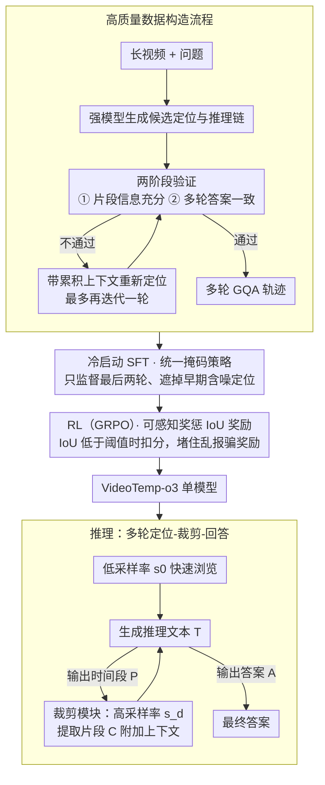

# VideoTemp-o3: Harmonizing Temporal Grounding and Video Understanding in Agentic Thinking

**会议**: ICML 2026  
**arXiv**: [2602.07801](https://arxiv.org/abs/2602.07801)  
**代码**: 待确认  
**领域**: 视频理解 / Agent / 多模态 VLM  
**关键词**: 长视频理解, 时间定位, Agent 思维, 多轮工具调用, 可感知奖惩 RL

## 一句话总结
VideoTemp-o3 是统一的 Agent 视频理解框架——通过**冷启动 SFT 的统一掩码策略** + **可感知奖惩的 IoU 奖励**联合建模视频时间定位与问答，在长视频理解中实现高质量的多轮迭代定位与精准回答，超长视频（> 20 分钟）mIoU 15.6% 超过 Gemini-2.5-Pro 的 14.8%。

## 研究背景与动机

**领域现状**：长视频理解中现有方法通常采用固定帧采样率均匀采样控制计算成本，但导致采样稀疏、容易漏掉问题相关的关键帧。最近出现的 Agent 思维视频范式（thinking-with-videos）借鉴 thinking-with-images 思想，采用"定位-裁剪-回答"流程让模型主动定位相关视频片段。

**现有痛点**：虽然 VideoExplorer / VITAL / REVISOR 等已探索该范式，但有三个关键问题——（1）**工作流复杂度高**：多个专用模型分别处理定位和问答，推理开销大；（2）**定位精度低**：难以精准定位，缺乏定位结果的评估和优化机制；（3）**流程死板**：固定的"一次裁剪后立即回答"模式，无法支持长视频中的迭代定位优化。

**核心矛盾**：最大障碍在于训练策略不足以学习精准定位和多轮迭代行为；现有标注数据质量低且长视频样本稀缺，模型缺乏高质量多轮轨迹来学 Agent 视频理解模式。

**本文目标**：构建统一框架在单模型中同时优化时间定位和视频问答，支持按需裁剪、多轮迭代优化，并设计专门的训练策略与数据构造方案。

**切入角度**：从数据、训练策略和模型设计三个维度——（1）高质量多轮数据的构造流程；（2）冷启动 SFT 的统一掩码策略鼓励探索同时过滤噪声；（3）可感知奖惩的 IoU 奖励防止奖励作弊。

**核心 idea**：用统一的多轮对话框架，通过精心设计的掩码监督和奖励机制，让单个模型学会在长视频中通过迭代工具调用实现精准定位和准确回答。

## 方法详解

### 整体框架
**推理时**是一个多轮交互的"定位-裁剪-回答"闭环。给定视频-问题对 $(V, Q)$，模型先以低采样率 $s_0$ 快速浏览视频。随后迭代——每一轮生成推理文本 $T$，再要么输出时间段 $P$、要么输出最终答案 $A$。如果预测出时间段 $P = [t_s, t_e]$，外部裁剪模块就以更高采样率 $s_d > s_0$ 从原视频提取对应片段 $C = \text{Crop}(V, P, s_d)$ 附加到上下文供下一轮使用；交互在模型输出答案或达最大轮数 $T_{max}$ 时终止。每条轨迹可表示为 $\tau_i = \{(V, Q); ([T_{i,1}, P_{i,1}, C_{i,1}], \ldots, [T_{i,t}, A_i])\}$。

这套"按需裁剪、迭代优化"的推理能力并非现成模型自带，而是 VideoTemp-o3 在单个模型里靠一条**训练流水线**习得的。所以整体上有两条主线：下方是上述推理闭环，上方则是让模型学会这套行为的训练侧——先用专门构造的高质量多轮 GQA 数据做**冷启动 SFT**（配统一掩码策略），再用 **RL** 进一步打磨定位精度（配可感知奖惩的 IoU 奖励）。下面三个关键设计正沿这条训练流水线自上而下展开。

### 关键设计

**1. 高质量数据构造流程：用强模型 + 两阶段验证造出定位与答案高度对齐的多轮 GQA 数据**

现有标注存在时间偏移、质量参差，长视频样本又稀缺，模型根本拿不到足够好的多轮轨迹去学 Agent 行为——这是整条流水线的源头瓶颈。本文分两类造数据：单轮无工具调用的数据用 Qwen3-VL-235B 生成推理链和答案、只留预测与真值一致的样本；多轮工具调用的数据用 Gemini-2.5-Pro 生成候选定位，再过两阶段验证——第一阶段裁出片段、强制模型只看片段作答，答对才说明"片段信息充分"；第二阶段给全上下文（原视频 + 问题 + 定位过程 + 片段）重新作答，答案仍与真值一致才说明"多轮过程自洽"。两阶段任一不过的样本，就带着上一次失败累积的上下文重新定位（仅对 > 3 分钟长视频、最多再迭代一轮），通过后即作为多轮多工具调用数据。靠这套严格的模型辅助标注 + 验证，才把"定位对不对、答案稳不稳"这两件事钉死，为后面的 SFT 和 RL 提供干净燃料。

**2. 统一掩码策略（Unified Masking Strategy）：冷启动 SFT 时只监督最后两轮，把早期的含噪定位标签遮掉**

多轮"定位-裁剪-回答"的轨迹里，早期轮次的定位往往很不准，如果像传统做法那样监督所有轮次，模型就会把一堆错误定位也学进去。统一掩码的做法是：多轮数据中倒数第二轮包含正确时间段、最后一轮输出最终答案，于是训练损失只作用在最后两轮的模型输出上，对早期生成内容和用户输入一律掩掉、不参与梯度。这样选择性地只保留可靠信号，既保住了多轮定位行为的学习，又不让早期粗定位的噪声路径污染训练——消融里把它换成"监督所有轮次"后，VideoMMMU 掉 5.3%、mIoU 掉 10.7%。

**3. 可感知奖惩的 IoU 奖励（Penalty-aware IoU Reward）：RL 阶段既奖励精准定位，又堵住"乱报时间段骗奖励"的口子**

RL 阶段用 GRPO 优化，奖励由"答案正确性 + 格式 + 时间定位"三项组成，其中定位这一项是本文的关键设计。纯 IoU 奖励有个漏洞：模型可能输出任意时间段去碰运气，只要偶尔蹭到一点重叠就拿正奖励，最终学坏（消融观察到工具调用率飙升、定位质量反而下降）。本文在 IoU $R_{\text{IoU}} = \frac{|[t_s, t_e]| \cap |[t_s', t_e']|}{|[t_s, t_e]| \cup |[t_s', t_e']|}$ 之上加一道阈值惩罚：当 $R_{\text{IoU}} < \sigma$ 时扣 $\lambda$，即 $R_{\text{penalty-IoU}} = R_{\text{IoU}} - \lambda$，否则保持 $R_{\text{IoU}}$（取 $\lambda = 0.1, \sigma = 0.1$）。这样定位太离谱会被实打实地罚分，模型必须同时保证定位精度和合理性才能拿到奖励——消融里去掉这个惩罚项后性能直接崩，说明这道防作弊的闸门是必要的。

## 实验关键数据

### 主实验

| 方法 | MLVU | VideoMMMU | VideoMME（无字幕） | LVBench | 平均 |
|------|------|-----------|------------------|---------|------|
| Gemini-1.5-Pro | 49.3 | 53.3 | 59.0 | 33.1 | 48.7 |
| GPT-4o | 55.6 | 62.0 | 66.0 | 30.8 | 53.6 |
| Video-R1-7B | 48.0 | 46.0 | 67.3 | 40.1 | 50.4 |
| Qwen2.5-VL-7B | 45.2 | 36.1 | 57.6 | 39.2 | 44.5 |
| **VideoTemp-o3-7B-SFT** | 49.5 | 46.4 | 60.4 | 39.6 | 49.0 |
| **VideoTemp-o3-7B-RL** | **54.2** | **47.8** | **69.0** | **43.0** | **53.5** |

VideoTemp-o3-RL 在 MLVU / VideoMME / LVBench 上分别超最佳 baseline 6.2% / 1.7% / 2.9%，平均提升 3.1%。

### 消融实验

| ID | 方法变体 | VideoMMMU | VideoMME | LVBench | ReXTime mIoU | ReXTime Acc |
|----|---------|-----------|----------|---------|------------|----|
| (a) | 完整模型 | 53.2 | 64.5 | 43.0 | 29.5 | 74.4 |
| (b) | w/o 定位数据 | 52.5 | 63.0 | 42.0 | **13.0** | 73.3 |
| (c) | w/o 统一掩码 | 47.9 | 61.5 | 41.2 | 18.8 | 70.6 |
| (d) | w/o IoU 奖励 | 51.6 | 63.3 | 41.7 | 26.2 | 73.7 |
| (e) | w/o 可感知惩罚 | 44.2 | 63.7 | 40.7 | 23.8 | 73.6 |

### 长视频不同时长表现（VideoTemp-Bench）

| 方法 | 0-3 分 | 3-10 分 | 10-20 分 | > 20 分 | 平均 |
|------|--------|--------|---------|--------|------|
| Gemini-2.5-Pro | 39.1 | 46.1 | 36.1 | 14.8 | 34.0 |
| VideoChat-R1-7B | 25.2 | 6.7 | 4.7 | 1.8 | 9.6 |
| **VideoTemp-o3-RL** | **35.3** | **32.0** | **24.8** | **15.6** | **27.0** |

mIoU 指标，长视频时间定位基准。

### 关键发现
- 去掉定位数据后 mIoU 从 29.5 大幅跌至 13.0——定位监督对模型内部定位能力至关重要。
- 统一掩码移除导致 VideoMMMU 下跌 5.3%、mIoU 下跌 10.7%——验证选择性监督的有效性。
- 去掉可感知惩罚后模型性能崩溃（mIoU 29.5 → 23.8，VideoMME 64.5 → 63.7）——防止奖励作弊的必要性。
- 在超长视频（> 20 分钟）上 mIoU 15.6%（vs Gemini-2.5-Pro 14.8%）表现最稳定；相比 baseline 在 > 20 分钟上性能崩溃（mIoU < 2%），本框架展现优秀长视频泛化能力。

## 亮点与洞察
- **统一架构的巧妙性**：将时间定位和视频问答统一在同一模型中，通过共享表示空间和一致的多轮对话格式，让模型能同时优化两个任务——比多模块串联设计既降低推理延迟又通过任务间正交性提升性能。
- **选择性监督的有效性**：统一掩码策略只对最后两轮应用损失，对早期噪声定位遮蔽——巧妙平衡多轮轨迹学习的有效性和鲁棒性；处理多轮 Agent 数据的通用技巧可迁移到其他多步骤推理任务。
- **奖励设计的防护**：可感知奖惩 IoU 奖励通过显式惩罚项防止模型盲目猜测，避免 RL 中常见的奖励作弊问题；约束性设计值得在其他长视频任务（时间动作定位、事件检测）借鉴。
- **数据质量第一的实践**：通过严格的多阶段验证流程，确保 GQA 数据中定位与答案高度一致——相比直接使用低质标注，这个投资带来了显著的性能提升。

## 局限与展望
- 框架基于特定的多轮格式设计，对极长视频（> 60 min）的超多轮交互或复杂推理路径的泛化性未充分探索。
- 定位时间精度上限受视频帧率和裁剪阶段的离散性限制，难实现亚秒级定位。
- 数据构造流程依赖于高质量 VL 模型（Gemini-2.5）进行标注，迁移到其他领域或低资源语言时可行性待评估。
- 改进：探索连续化时间定位表示而非离散时间段；引入更灵活的轮次上限策略；设计轻量化数据标注方案降低对高端 VL 模型的依赖。

## 相关工作与启发
- **vs VideoExplorer**：VideoExplorer 采用多 Agent 协作（计划者 / 定位者 / 理解者分离），本文在单模型中统一集成降低推理复杂度；通过统一多轮对话格式和端到端训练获得更灵活的 iterative refinement 能力。
- **vs VITAL / REVISOR**：这些工作也采用 SFT-RL 两阶段训练，但缺对多轮噪声的显式处理和专门的防反演奖励设计；VideoTemp-o3 的统一掩码和可感知奖惩进一步稳定多轮学习。
- **vs LongVT**：LongVT 提出三阶段 SFT-RL-RFT 策略，本文通过更紧凑的 SFT-RL 框架和高质量数据构造达到相近或更优的性能——数据质量和训练策略设计的重要性可能高于单纯增加训练阶段数。

## 评分
- 新颖性: ⭐⭐⭐⭐⭐  统一框架 + 可感知奖惩 + 高质量数据构造流程的组合是首创；防反演奖励设计对 RL 社区有启发意义。
- 实验充分度: ⭐⭐⭐⭐⭐  覆盖长视频理解、时间定位、视频 GQA 三大任务，包括新基准 VideoTemp-Bench，消融详细，不同时长分析深入。
- 写作质量: ⭐⭐⭐⭐  方法清晰，数据构造流程图示直观；某些奖励设计的理论动机可展开更深入。
- 价值: ⭐⭐⭐⭐⭐  为长视频理解中的 Agent 范式建立高效可靠的范本；可感知奖励和统一掩码策略有明确复用价值；新基准为后续评估提供标准。

<!-- RELATED:START -->

## 相关论文

- [\[CVPR 2026\] Thinking with Drafts: Speculative Temporal Reasoning for Efficient Long Video Understanding](../../CVPR2026/video_understanding/thinking_with_drafts_speculative_temporal_reasoning_for_efficient_long_video_und.md)
- [\[ICML 2026\] VideoSEAL: Mitigating Evidence Misalignment in Agentic Long Video Understanding by Decoupling Answer Authority](videoseal_mitigating_evidence_misalignment_in_agentic_long_video_understanding_b.md)
- [\[ICCV 2025\] VTimeCoT: Thinking by Drawing for Video Temporal Grounding and Reasoning](../../ICCV2025/video_understanding/vtimecot_thinking_by_drawing_for_video_temporal_grounding_and_reasoning.md)
- [\[CVPR 2025\] T*: Re-thinking Temporal Search for Long-Form Video Understanding](../../CVPR2025/video_understanding/re-thinking_temporal_search_for_long-form_video_understanding.md)
- [\[CVPR 2026\] VideoARM: Agentic Reasoning over Hierarchical Memory for Long-Form Video Understanding](../../CVPR2026/video_understanding/videoarm_agentic_reasoning_over_hierarchical_memory_for_long-form_video_understa.md)

<!-- RELATED:END -->
