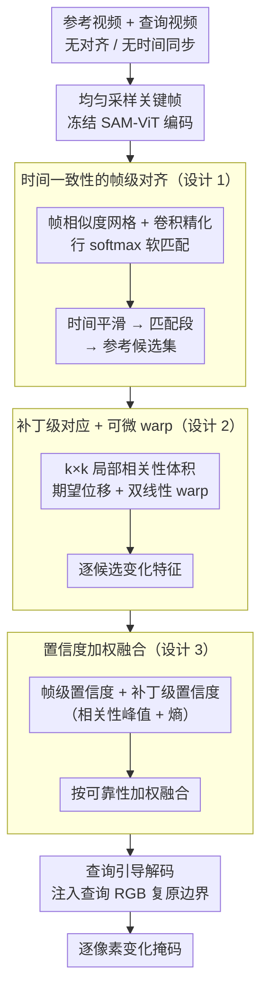

# VSCD：无对齐场景的视频场景变化检测

**会议**: ICML 2026  
**arXiv**: [2605.20821](https://arxiv.org/abs/2605.20821)  
**代码**: https://github.com/AutoCompSysLab/VSCD  
**领域**: 视频理解 / 视频比较  
**关键词**: 场景变化检测, 视频对齐, 多参考匹配, 多视图几何, 长期自主性

## 一句话总结
本文引入 VSCD 任务——通过查询中心的多参考模型，在无约束相机运动和强烈视点失配条件下，利用时间一致性、补丁级对应和置信度加权融合，逐像素检测两段不同时间记录的同一环境视频中的物体级变化。

## 研究背景与动机

**领域现状**：变化检测是 CV 经典问题，现有方法分两类——基于图像（RSCD、SCD）假设视点基本固定；基于视频（AOD）假设参考和查询视频沿相同/相反轨迹运动。

**现有痛点**：这些方法都无法处理现实中三大挑战——（1）无约束相机运动；（2）视点变化剧烈；（3）多个物体同时出现或消失。当移动机器人在长期自主运行中需检测环境变化时，三个问题同时出现。

**核心矛盾**：帧级配准不可行——单独比较任意两帧因视点完全不同会产生大量错误对齐。但视频序列时间结构包含充分规律性。

**本文目标**：定义新 VSCD 任务；构建大规模标注数据集（110 万帧+真实测试集）；提出利用时间结构的方法，无需显式轨迹对齐即可检测变化。

**切入角度**：虽然单帧间失配严重，但**视频序列的时间连贯性和多视图几何约束足以进行可靠推理**。

**核心 idea**：**多参考匹配 + 时间对齐 + 补丁级对应 + 置信度加权**——在不知道相机运动和轨迹对齐的条件下，从视频序列中隐式学习鲁棒变化检测能力。

## 方法详解

### 整体框架
VSCDNet 是查询中心多参考架构，分三阶段——（1）**帧级对齐**：均匀采样关键帧，ViT 编码后计算帧级相似度网格，通过软匹配找候选参考帧组合；（2）**补丁级对应**：对每个参考候选在补丁尺度上计算局部相关性体积，通过可微 warp 进行几何补偿；（3）**置信度加权融合**：结合帧级置信度（来自帧匹配分布）和补丁级置信度（来自局部匹配锐度和熵），对多参考变化特征进行加权融合，最后由查询引导解码器（注入查询 RGB 复原边界）逐帧解出高分辨率变化掩码。

### 关键设计

**1. 时间一致性的帧级对齐：先在帧尺度上找到对应段，给后续补丁匹配一个粗对应**

单帧之间视点完全不同、任意配对会产生大量错误对齐，所以不能直接逐帧硬比。这一步改用视频的时间连贯性：对每个关键帧对 $(t, s)$ 算帧特征余弦相似度 $S_{t,s} = \cos(v_t^q, v_s^r)$，过一个浅层卷积头精化得 $A = S + h_\psi(S)$，再按行 softmax 归一化成 $P_{\text{frame}}(t,s) = \text{softmax}_s(A_{t,s}/\tau_f)$，并借时间平滑先验把帧聚成若干匹配段。好处是全程不需要显式 pose 估计或 SLAM——只靠"相邻帧的对应也应相邻"这一条时间约束，就把混乱的帧-帧匹配收敛成有序的段级对应，为下一步大幅缩小搜索范围。

**2. 补丁级对应 + 可微 warp：在特征空间局部补偿视点变化和遮挡**

帧级对齐只给出粗对应，剧烈视点失配下还得在更细的尺度上对齐。对每个参考候选 $s$，在 $k \times k$ 局部窗口里算查询补丁与参考补丁的点积相关性 $P_{\text{patch},i}^{(t,s)}(x,y) = \text{softmax}(\text{dots})$，用加权平均求期望位移 $\Delta^{(t,s)}(x,y) = \sum_i P_{\text{patch},i}^{(t,s)} \delta_i$，再经双线性采样把参考特征 warp 到查询视角，最后用轻量卷积头融合出变化特征 $F_{t,s} = g_\phi(E_t^q, E_{t,s}^{r(w)})$。局部相关性比全局匹配鲁棒得多，可微 warp 让几何补偿无需显式估计相机位姿，而保留相关性的软分布则把"对得有多准"这一不确定性信息一路带到后面。

**3. 置信度加权融合：让多参考结果按可靠性投票，抑制配准失败的候选**

一个查询帧会对应多个参考候选，直接平均很容易被某个坏配准污染。VSCDNet 给每个候选算两层置信度：帧级 $C_f(t,s) = P_{\text{frame}}(t,s)$ 反映段对应有多强，补丁级 $C_{sp}^{(t,s)}(x,y) = c_p \cdot p_{\max}^{(t,s)} + c \cdot (1 - e^{(t,s)})$ 同时看相关性峰值和归一化熵，最后加权融合 $F_t = \sum_s C_f(t,s) \cdot C_{sp}^{(t,s)} \cdot F_{t,s} / \text{norm}$。把熵纳进来是关键一笔：当一个补丁的偏移概率分布很平（多个位移几乎等概率）时熵高，说明它根本对不准、应被压低权重——单看峰值则发现不了这种"模棱两可"的匹配。

## 实验关键数据

### 主实验

| 方法 | 合成集 F1 | 真实集 F1 | vs SOTA |
|------|-------------|-------------|---------|
| TCF-LMO (AOD) | 19.7% | 10.3% | -44.5% |
| PBCD-MC (AOD) | 26.8% | 16.1% | -28.4% |
| CSCDNet (SCD) | 19.8% | 9.1% | -45.4% |
| DR-TANet (SCD) | 20.6% | 11.6% | -43.1% |
| C-3PO (SCD) | 24.1% | 11.7% | -39.9% |
| GeSCF (SOTA) | 29.5% | 17.3% | baseline |
| **VSCDNet** | **36.6%** | **25.4%** | **+7.1% / +8.1%** |

### 分层评估

| 视频长度 | 低 | 中 | 高 | 图形质量低 | 中 | 高 | 物体变化少 | 中 | 多 |
|---------|-----|-----|-----|----------|-----|-----|----------|-----|-----|
| F1 | 38.1% | 36.9% | 33.9% | 40.7% | 31.7% | 32.1% | 37.7% | 39.0% | 36.6% |

### 关键发现
- 时间一致性帧级对齐通过段提议将混乱帧-帧匹配转化为有序序列对应——是模型性能基石。
- 补丁级对应比全局特征更鲁棒，在高视点变化场景保持 31-40% F1。
- 熵正则化置信度至关重要，归一化熵能额外检测"平坦分布"（多偏移等概率）。
- 真实集泛化能力——合成到真实掉点约 11%，相对其他方法（掉点 50%+）泛化性强。

## 亮点与洞察
- **从帧级到序列级的范式转变**：突破性用视频序列时间结构作为对齐先验，无需 SLAM 或运动估计。
- **隐式几何学习的优雅性**：不显式估计相机位姿，通过补丁级相关性和可微 warp 隐式学习多视图对应。
- **两层置信度机制的巧妙设计**：用峰值+熵组合既检测"确定匹配"又检测"模棱两可匹配"。
- **无约束视频理解的新基准**：110 万帧规模和真实性超越现有变化检测数据集一个数量级。

## 局限与展望
- 方法对视频时间长度有依赖；极长视频的分割和流式处理未探讨。
- 真实集规模仅 8 对视频，环境多样性有限。
- 假设场景内物体状态在单视频记录期间固定。
- 改进：极长视频滑动窗口或分层时间编码；采集更多真实数据；自适应超参调整；优化推理管道。

## 相关工作与启发
- **vs RSCD**：航拍/卫星，假设视点固定；本文针对室内强失配。
- **vs SCD**：处理孤立图像对；本文利用时间连贯性。
- **vs AOD**：假设轨迹相同/相反；本文无约束运动难度更高。
- **vs Video Copy Localization**：本文借鉴帧相似度图思想但用于像素级变化检测。
- **启发**：多参考融合 + 置信度加权可迁移到视频插帧、立体匹配、光流估计。

## 评分
- 新颖性: ⭐⭐⭐⭐⭐  VSCD 任务定义填补关键空白，思维转变 + 隐式几何学习业界首创。
- 实验充分度: ⭐⭐⭐⭐  110 万帧合成 + 8 对真实 + 4 基线对比 + 分层评估。
- 写作质量: ⭐⭐⭐⭐⭐  逻辑清晰，公式规范，图表信息量大。
- 价值: ⭐⭐⭐⭐⭐  长期自主导航前沿需求，提供实用方案 + 高质量数据集 + 开源实现。

<!-- RELATED:START -->

## 相关论文

- [\[ICML 2026\] Video-MTR: Reinforced Multi-Turn Reasoning for Long Video Understanding](video-mtr_reinforced_multi-turn_reasoning_for_long_video_understanding.md)
- [\[ICML 2026\] MetaphorVU: Towards Metaphorical Video Understanding](metaphorvu_towards_metaphorical_video_understanding.md)
- [\[ICML 2026\] Return of Frustratingly Easy Unsupervised Video Domain Adaptation](return_of_frustratingly_easy_unsupervised_video_domain_adaptation.md)
- [\[ICML 2026\] AVTrack: Audio-Visual Tracking in Human-centric Complex Scenes](avtrack_audio-visual_tracking_in_human-centric_complex_scenes.md)
- [\[ICML 2026\] Foresee-to-Ground: From Predictive Temporal Perception to Evidence-Driven Reasoning](foresee-to-ground_from_predictive_temporal_perception_to_evidence-driven_reasoni.md)

<!-- RELATED:END -->
